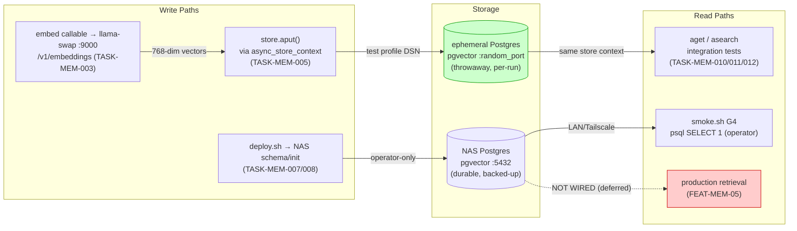
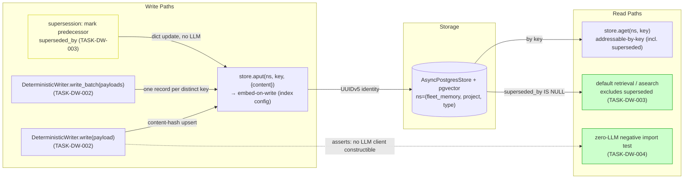
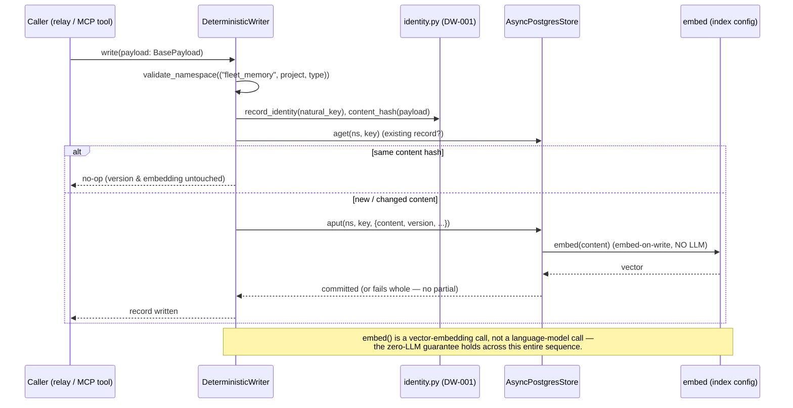
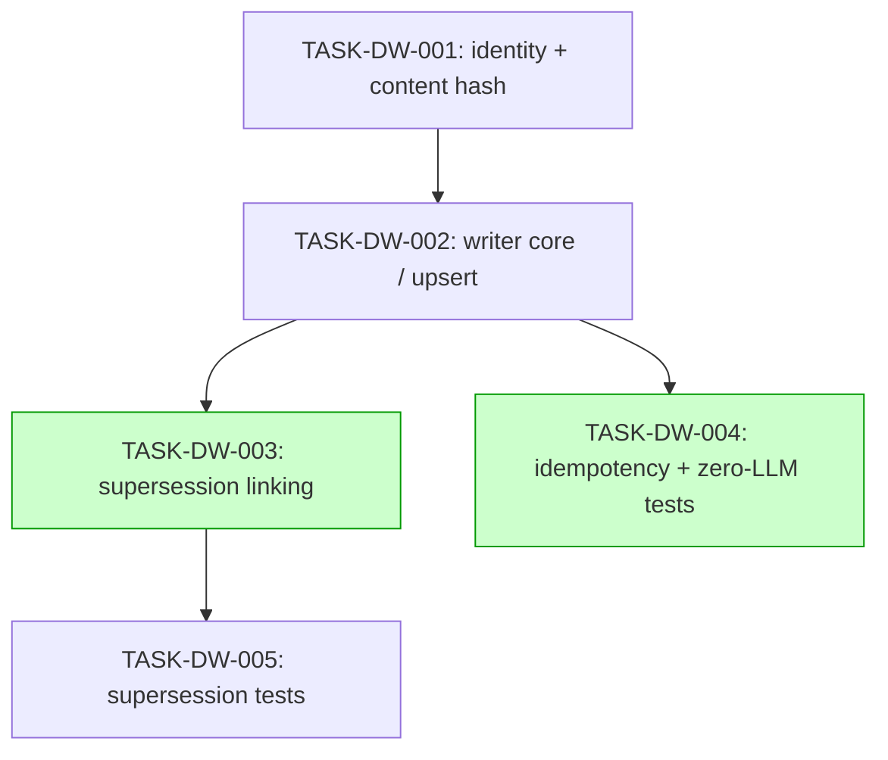

/feature-plan "Deterministic Writer" \
      --context features/deterministic-writer/deterministic-writer_summary.md

I'll start by reading the context file to understand the feature, then orchestrate the planning workflow.

Read deterministic-writer_summary.md
Let me explore the feature directory and related context to understand the full picture.

Bash
IN
ls -la features/deterministic-writer/ && echo "---FEATURE FILE---" && ls -la features/ 2>/dev/null && echo "---GUARDKIT FEATURES---" && ls -la .guardkit/features/ 2>/dev/null

OUT
total 48
drwxr-xr-x  5 richardwoollcott  staff    160 Jun 13 11:21 .
drwxr-xr-x  5 richardwoollcott  staff    160 Jun 13 11:20 ..
-rw-r--r--  1 richardwoollcott  staff   4084 Jun 13 11:21 deterministic-writer_assumptions.yaml
-rw-r--r--  1 richardwoollcott  staff   2226 Jun 13 11:21 deterministic-writer_summary.md
-rw-r--r--  1 richardwoollcott  staff  15782 Jun 13 11:21 deterministic-writer.feature
---FEATURE FILE---
total 0
drwxr-xr-x   5 richardwoollcott  staff   160 Jun 13 11:20 .
drwxr-xr-x  33 richardwoollcott  staff  1056 Jun 13 08:22 ..
drwxr-xr-x   5 richardwoollcott  staff   160 Jun 13 11:21 deterministic-writer
drwxr-xr-x   5 richardwoollcott  staff   160 Jun 13 08:22 storage-substrate
drwxr-xr-x   5 richardwoollcott  staff   160 Jun 13 10:46 typed-payload-registry
---GUARDKIT FEATURES---
total 32
drwxr-xr-x   4 richardwoollcott  staff   128 Jun 13 10:44 .
drwxr-xr-x@ 10 richardwoollcott  staff   320 Jun 13 08:22 ..
-rw-r--r--@  1 richardwoollcott  staff  8578 Jun 12 23:11 FEAT-CA81.yaml
-rw-r--r--@  1 richardwoollcott  staff  2969 Jun 13 11:55 FEAT-MEM-02.yaml
I'll read the feature file, assumptions, and related prior features to ground the planning.

Read deterministic-writer.feature
Now let me read the related prior work — the store source, the FEAT-MEM-02 registry feature, and the build plan — to ground the plan in actual code.

Read deterministic-writer_assumptions.yaml
Read FEAT-MEM-02.yaml
Bash
IN
echo "===STORE.PY===" && cat src/fleet_memory/store.py 2>/dev/null | head -120; echo "===SRC TREE==="; find src -type f -name "*.py" 2>/dev/null | head -50

OUT
===STORE.PY===
"""Store factory and namespace validation for fleet-memory.

Provides async context manager for AsyncPostgresStore with pgvector index configuration.
Namespace validation enforces underscores-only identifiers before database operations.
"""

from __future__ import annotations

import asyncio
import re
from collections.abc import AsyncIterator
from contextlib import AsyncExitStack, asynccontextmanager
from typing import TYPE_CHECKING
from urllib.parse import urlsplit

from langgraph.store.postgres.aio import AsyncPostgresStore, PoolConfig

from fleet_memory.embed import embed
from fleet_memory.errors import NamespaceValidationError

if TYPE_CHECKING:
    from fleet_memory.settings import Settings


# Namespace validation pattern: lowercase alphanumeric + underscores only
_NAMESPACE_PATTERN = re.compile(r"^[a-z0-9_]+$")

# Slack added to pg_connect_timeout_s when bounding store-context entry:
# entry covers pool open plus store.setup(), so the bound must leave room
# for schema setup on a healthy connection while still failing fast when
# the database is unreachable (ASSUM-006).
_SETUP_SLACK_S = 5.0


def _dsn_target(dsn: str) -> str:
    """Render the database target from a DSN without credentials.

    Falls back to a generic label for non-URL conninfo strings so the
    caller never risks echoing a password.
    """
    parts = urlsplit(dsn)
    if not parts.hostname:
        return "configured database"
    target = parts.hostname
    if parts.port:
        target = f"{target}:{parts.port}"
    if parts.path and parts.path != "/":
        target = f"{target}{parts.path}"
    return target


def validate_namespace(namespace: tuple[str, ...]) -> None:
    """Validate namespace tuple enforces underscores-only identifiers.

    Args:
        namespace: Tuple of namespace identifiers (e.g., ("fleet_memory", "project", "chunk"))

    Raises:
        NamespaceValidationError: If any identifier contains hyphens or invalid characters

    Example:
        >>> validate_namespace(("fleet_memory", "my_project", "chunk"))  # OK
        >>> validate_namespace(("fleet_memory", "my-project", "chunk"))  # Raises
    """
    invalid_parts = []
    for part in namespace:
        if not part or not _NAMESPACE_PATTERN.match(part):
            invalid_parts.append(part)

    if invalid_parts:
        raise NamespaceValidationError(namespace=namespace, invalid_parts=invalid_parts)


@asynccontextmanager
async def async_store_context(
    settings: Settings,
    embed_fn: callable | None = None,
) -> AsyncIterator[AsyncPostgresStore]:
    """Create configured AsyncPostgresStore with pgvector index and pool lifecycle.

    Entry runs store.setup() to initialize schema. Exit closes connection pool cleanly.
    When embed_fn is None, constructs real httpx embed callable from settings.

    Args:
        settings: Configuration with pg_dsn, embed_dims, pool settings, timeout
        embed_fn: Optional embed callable for testing; if None, uses real httpx embed

    Yields:
        Configured AsyncPostgresStore with index config for semantic search

    Raises:
        Exception: Any database or connection errors (credentials stripped from messages)

    Example:
        >>> settings = Settings(...)
        >>> fake_embed = make_fake_embed(768)
        >>> async with async_store_context(settings, embed_fn=fake_embed) as store:
        ...     await store.put(("fleet_memory", "proj", "item"), "key", {"content": "..."})

    Implementation notes:
        - Driver: psycopg3 with psycopg-pool (plain postgresql:// conninfo, no +asyncpg)
        - Index config: {"dims": settings.embed_dims, "embed": callable, "fields": ["content"]}
        - Pool: min/max from settings.pg_pool_min/pg_pool_max
        - Timeout: settings.pg_connect_timeout_s (ASSUM-006 lever)
        - Verified against langgraph-checkpoint-postgres >=2.0 constructor signature
    """
    # Build embed callable: use provided fake or construct real one
    if embed_fn is None:
        # Real embed callable from settings (httpx-based)
        async def real_embed(texts: list[str]) -> list[list[float]]:
            return await embed(texts, settings)

        embed_callable = real_embed
    else:
        embed_callable = embed_fn

    # Configure index for pgvector semantic search
    # Verified contract: {dims: int, embed: callable, fields: list[str]}
    # Matches AsyncPostgresStore constructor signature in langgraph-checkpoint-postgres >=2.0
    index_config = {
===SRC TREE===
src/fleet_memory/store.py
src/fleet_memory/embed.py
src/fleet_memory/__init__.py
src/fleet_memory/settings.py
src/fleet_memory/app.py
src/fleet_memory/errors.py
Bash
IN
echo "===BUILD PLAN FEAT-MEM-03==="; sed -n '/FEAT-MEM-03/,/FEAT-MEM-04/p' docs/research/ideas/phase-core-build-plan.md 2>/dev/null | head -150
echo "===PAYLOADS in worktree==="; find .guardkit/worktrees/FEAT-MEM-02/src -type f -name "*.py" 2>/dev/null
echo "===errors.py==="; cat src/fleet_memory/errors.py 2>/dev/null

OUT
===BUILD PLAN FEAT-MEM-03===
| FEAT-MEM-03 | Deterministic writer | Not started | — |
| FEAT-MEM-04 | Relay integration (MEMORY consumer + chunk/embed path) | Not started | — |
## FEAT-MEM-03: Deterministic Writer

Service: typed payload → store record(s). UUIDv5 from natural key; idempotent upsert (same key + same content hash = no-op; same key + new content = versioned update); supersession handling (mark superseded record, link successor — a dict update, no LLM); embed-on-write via the store's index config; per-project namespace tuples `("fleet_memory", project, payload_type)`.

### Spec & Plan Commands

```
/feature-spec "Deterministic writer service: typed payload to AsyncPostgresStore records with UUIDv5 natural-key idempotency, content-hash upsert semantics, declared supersession linking, embed-on-write, per-project namespaces; zero LLM calls by construction; idempotency and supersession test suites"
/feature-plan FEAT-XXXX
```

### Acceptance Criteria

- [ ] Writing the same payload twice produces one record (audited via store list)
- [ ] Superseding ADR marks predecessor `superseded_by` and excludes it from default retrieval
- [ ] No code path in the writer can construct an LLM client (negative import test)
- [ ] Write throughput: full guardkit seed corpus in < 5 minutes (measured in 07)

## FEAT-MEM-04: Relay Integration
| 4 (Mon 15) | FEAT-MEM-03 writer |
| 5 (Tue 16) | FEAT-MEM-04 relay consumer; first end-to-end publish→store |
===PAYLOADS in worktree===
.guardkit/worktrees/FEAT-MEM-02/src/fleet_memory/store.py
.guardkit/worktrees/FEAT-MEM-02/src/fleet_memory/embed.py
.guardkit/worktrees/FEAT-MEM-02/src/fleet_memory/__init__.py
.guardkit/worktrees/FEAT-MEM-02/src/fleet_memory/settings.py
.guardkit/worktrees/FEAT-MEM-02/src/fleet_memory/app.py
.guardkit/worktrees/FEAT-MEM-02/src/fleet_memory/errors.py
.guardkit/worktrees/FEAT-MEM-02/src/fleet_memory/payloads/models.py
.guardkit/worktrees/FEAT-MEM-02/src/fleet_memory/payloads/registry.py
.guardkit/worktrees/FEAT-MEM-02/src/fleet_memory/payloads/__init__.py
.guardkit/worktrees/FEAT-MEM-02/src/fleet_memory/payloads/base.py
===errors.py===
"""Exceptions for fleet-memory embedding operations."""


class EmbedDimensionError(ValueError):
    """Raised when embedding dimensions don't match expected dimensions.

    Error message includes both actual and expected dimensions.
    Never includes database credentials.
    """

    def __init__(self, actual: int, expected: int) -> None:
        """Initialize with actual and expected dimensions.

        Args:
            actual: The actual dimension count received
            expected: The expected dimension count from settings
        """
        super().__init__(
            f"Embedding dimension mismatch: got {actual} dimensions, expected {expected}"
        )
        self.actual = actual
        self.expected = expected


class EmbedTimeoutError(TimeoutError):
    """Raised when embedding service request times out.

    May include the embedding service URL but never database credentials.
    """

    def __init__(self, url: str, timeout_s: float) -> None:
        """Initialize with service URL and timeout value.

        Args:
            url: The embedding service URL (safe to log)
            timeout_s: The timeout threshold in seconds
        """
        super().__init__(f"Embedding service request timed out after {timeout_s}s: {url}")
        self.url = url
        self.timeout_s = timeout_s


class EmbedServiceError(RuntimeError):
    """Raised when embedding service returns an error.

    Covers HTTP errors, malformed JSON, and other service failures.
    May include the embedding service URL but never database credentials.
    """

    def __init__(
        self, message: str, url: str | None = None, status_code: int | None = None
    ) -> None:
        """Initialize with error details.

        Args:
            message: Human-readable error description
            url: Optional embedding service URL (safe to log)
            status_code: Optional HTTP status code
        """
        msg = f"Embedding service error: {message}"
        if status_code is not None:
            msg += f" (HTTP {status_code})"
        if url is not None:
            msg += f" - {url}"
        super().__init__(msg)
        self.url = url
        self.status_code = status_code


class NamespaceValidationError(ValueError):
    """Raised when namespace tuple contains invalid identifiers.

    Namespace identifiers must match ^[a-z0-9_]+$ (underscores only, no hyphens).
    Never includes database credentials.
    """

    def __init__(self, namespace: tuple[str, ...], invalid_parts: list[str]) -> None:
        """Initialize with namespace and invalid parts.

        Args:
            namespace: The full namespace tuple that failed validation
            invalid_parts: List of invalid identifier strings
        """
        super().__init__(
            f"Invalid namespace identifiers {invalid_parts}: must use underscores only "
            f"(match ^[a-z0-9_]+$), got namespace {namespace}"
        )
        self.namespace = namespace
        self.invalid_parts = invalid_parts
Let me read the FEAT-MEM-02 payload modules — the writer's primary input contract.

Bash
IN
cd .guardkit/worktrees/FEAT-MEM-02/src/fleet_memory/payloads
echo "===base.py==="; cat base.py
echo "===registry.py==="; cat registry.py
echo "===__init__.py==="; cat __init__.py

OUT
===base.py===
"""Base payload model and validators for typed payload registry.

Defines BasePayload with natural key construction, identifier validation,
and supersession rules. All concrete payload types inherit from BasePayload.
"""

from __future__ import annotations

import re
from typing import Any, ClassVar

from pydantic import BaseModel, ConfigDict, computed_field

# Regex pattern matching existing NamespaceValidationError convention
IDENTIFIER_PATTERN = re.compile(r"^[a-z0-9_]+$")


def _validate_identifier(field_name: str, value: str) -> None:
    """Validate an identifier uses underscores only.

    Args:
        field_name: Name of the field being validated
        value: The identifier value

    Raises:
        IdentifierValidationError: If invalid
    """
    if not value:
        raise IdentifierValidationError(field_name, value)
    if not IDENTIFIER_PATTERN.match(value):
        raise IdentifierValidationError(field_name, value)


class IdentifierValidationError(ValueError):
    """Raised when project or identifier contains invalid characters.

    Identifiers must use underscores only (match ^[a-z0-9_]+$), no hyphens or colons.
    Follows the same pattern as NamespaceValidationError from errors.py.
    """

    def __init__(self, field_name: str, value: str) -> None:
        """Initialize with field name and invalid value.

        Args:
            field_name: The field that failed validation (project or identifier)
            value: The invalid value that was rejected
        """
        if not value:
            super().__init__(f"{field_name} identifier is required and cannot be empty")
        else:
            super().__init__(
                f"Invalid {field_name} identifier '{value}': identifiers must use "
                f"underscores only (match ^[a-z0-9_]+$)"
            )
        self.field_name = field_name
        self.value = value


class SupersessionValidationError(ValueError):
    """Raised when supersedes contains invalid natural key references.

    Supersession references must be natural-key-shaped (three colon-separated segments)
    and cannot reference the payload's own natural key.
    """

    def __init__(self, message: str, invalid_ref: str | None = None) -> None:
        """Initialize with error message and optional invalid reference.

        Args:
            message: Human-readable error description
            invalid_ref: The invalid supersession reference (optional)
        """
        super().__init__(message)
        self.invalid_ref = invalid_ref


class BasePayload(BaseModel):
    """Base model for all typed payloads in fleet-memory.

    Defines the contract for deterministic writes: natural key construction,
    identifier validation, declared supersession, domain tags, source reference,
    and version stamp.

    All concrete payload types (TASK-TPR-002) inherit from this base.
    """

    model_config = ConfigDict(extra="ignore")  # Forward compatibility (ASSUM-009)

    # Natural key segments (ASSUM-001)
    project: str
    identifier: str

    # Optional metadata (ASSUM-005/006/007)
    domain_tags: list[str] = []
    source_ref: str  # Required provenance reference
    version: int = 1  # Monotonic version starting at 1

    # Declared supersession (ASSUM-003)
    supersedes: list[str] = []

    # Subclass must set this classvar (e.g., "adr", "epic", "rule")
    payload_type: ClassVar[str] = "base"

    def __init__(self, **data: Any) -> None:
        """Initialize payload with validation.

        Validates identifiers and supersedes before Pydantic construction
        to raise custom exceptions that can be caught directly.

        Args:
            **data: Payload field data

        Raises:
            IdentifierValidationError: If identifiers are invalid
            SupersessionValidationError: If supersedes references are malformed
        """
        # Validate project and identifier before Pydantic sees them
        if "project" in data:
            _validate_identifier("project", data["project"])
        if "identifier" in data:
            _validate_identifier("identifier", data["identifier"])

        # Validate and normalize supersedes
        if "supersedes" in data and data["supersedes"]:
            supersedes = data["supersedes"]
            # Collapse duplicates while preserving order
            seen = set()
            unique = []
            for ref in supersedes:
                if ref not in seen:
                    seen.add(ref)
                    unique.append(ref)

            # Validate natural key shape (three colon-separated segments)
            for ref in unique:
                segments = ref.split(":")
                if len(segments) != 3:
                    raise SupersessionValidationError(
                        f"Supersession reference '{ref}' is not a valid natural key: "
                        f"expected 3 colon-separated segments, got {len(segments)}",
                        invalid_ref=ref,
                    )

            data["supersedes"] = unique

        # Call parent __init__ to construct the model
        super().__init__(**data)

        # Check for self-supersession after natural_key is available
        if self.natural_key in self.supersedes:
            raise SupersessionValidationError(
                f"Payload cannot supersede itself: '{self.natural_key}' "
                f"appears in supersedes list",
                invalid_ref=self.natural_key,
            )

    @computed_field  # type: ignore[misc]
    @property
    def natural_key(self) -> str:
        """Compute natural key: <payload_type>:<project>:<identifier> (ASSUM-001).

        Returns:
            Three-segment colon-separated natural key
        """
        return f"{self.payload_type}:{self.project}:{self.identifier}"
===registry.py===
"""Payload dispatch registry for typed payload serialization and round-trip.

Maps canonical payload_type names to model classes (bijection).
Supports name→model lookup, model→name reverse lookup, and serialize→rebuild round trip.

Producer: TASK-TPR-003
Consumer: FEAT-MEM-03 (deterministic writer), FEAT-MEM-04 (relay consumer)
"""

from __future__ import annotations

from fleet_memory.errors import UnknownPayloadTypeError
from fleet_memory.payloads.base import BasePayload
from fleet_memory.payloads.models import (
    ADRPayload,
    BuildOutcomePayload,
    DocumentPayload,
    PatternPayload,
    ReviewReportPayload,
    SeedModulePayload,
    WarningPayload,
)

# Bijective registry: each canonical payload_type name maps to exactly one model class
PAYLOAD_REGISTRY: dict[str, type[BasePayload]] = {
    "adr": ADRPayload,
    "review_report": ReviewReportPayload,
    "build_outcome": BuildOutcomePayload,
    "pattern": PatternPayload,
    "warning": WarningPayload,
    "seed_module": SeedModulePayload,
    "document": DocumentPayload,
}

# Reverse lookup cache: model class → canonical type name
_MODEL_TO_TYPE: dict[type[BasePayload], str] = {
    model: name for name, model in PAYLOAD_REGISTRY.items()
}


def get_model_for_type(payload_type: str) -> type[BasePayload]:
    """Resolve payload_type name to model class.

    Args:
        payload_type: Canonical type name (case-sensitive)

    Returns:
        The model class for this payload type

    Raises:
        UnknownPayloadTypeError: If payload_type is not registered (ASSUM-010)
    """
    if payload_type not in PAYLOAD_REGISTRY:
        raise UnknownPayloadTypeError(payload_type)
    return PAYLOAD_REGISTRY[payload_type]


def get_type_for_model(model: type[BasePayload]) -> str:
    """Reverse lookup: model class to canonical type name.

    Args:
        model: A payload model class

    Returns:
        The canonical payload_type name

    Raises:
        ValueError: If model is not registered
    """
    if model not in _MODEL_TO_TYPE:
        raise ValueError(f"Model {model} is not registered in PAYLOAD_REGISTRY")
    return _MODEL_TO_TYPE[model]
===__init__.py===
"""Typed payload models for fleet-memory.

This package defines the BasePayload contract and concrete payload types
for the typed-payload-registry feature (FEAT-MEM-02).
"""

from __future__ import annotations

from fleet_memory.payloads.base import (
    BasePayload,
    IdentifierValidationError,
    SupersessionValidationError,
)

__all__ = [
    "BasePayload",
    "IdentifierValidationError",
    "SupersessionValidationError",
]
I now have deep context. The spec is fully settled (all 10 assumptions confirmed, including the two REVIEW-REQUIRED ones), and I understand the input contract precisely:

Input: BasePayload subclasses from FEAT-MEM-02 registry — natural key is <payload_type>:<project>:<identifier>, with supersedes: list[str] (colon-natural-keys), version: int, source_ref, domain_tags.
Output: AsyncPostgresStore records via async_store_context / store.put(namespace, key, value), embed-on-write through the store's index config.
Namespace: ("fleet_memory", project, payload_type), validated by validate_namespace.
Before I run the review and generate the structure, let me confirm the few decisions that actually change the plan.

AskUserQuestion
OUT
Your questions have been answered: "The spec calls for idempotency + supersession test suites and a zero-LLM negative import test. How rigorous should the generated tasks be?"="Standard + seam tests (Recommended)", "FEAT-MEM-03 builds on FEAT-MEM-02 (typed payload registry), which is still in_progress (TASK-TPR-004 running, payloads live in a worktree not yet merged to main src/). How should the plan treat that dependency?"="Assume merged, note as prereq (Recommended)", "How should the writer tasks be sequenced for AutoBuild?"="Auto-detect waves (Recommended)". You can now continue with these answers in mind.
Confirmed: Standard + seam tests, assume MEM-02 merged (with prereq note), auto-detect waves. The spec is fully settled and I have the complete input/output contract, so I'll proceed to generate the AutoBuild-ready structure (the build-plan flow is /feature-plan → /feature-build).

First let me verify the helper scripts and project test layout that the YAML/diagrams must reference.

Bash
IN
echo "===bin helpers==="; ls -la ~/.agentecflow/bin/ 2>/dev/null | grep -E "generate-feature-yaml|feature-plan-bdd-link|graphiti-check"
echo "===generate-feature-yaml help==="; python3 ~/.agentecflow/bin/generate-feature-yaml --help 2>&1 | head -40
echo "===tests tree==="; find tests -maxdepth 2 -type d 2>/dev/null; echo "--- test files sample ---"; find tests -maxdepth 2 -name "*.py" 2>/dev/null | head -20
echo "===existing tasks backlog==="; ls tasks/backlog/ 2>/dev/null

OUT
===bin helpers===
lrwxr-xr-x@  1 richardwoollcott  staff    110 May 10 20:45 feature-plan-bdd-link -> /Users/richardwoollcott/Projects/appmilla_github/guardkit/installer/core/commands/lib/feature_plan_bdd_link.py
lrwxr-xr-x@  1 richardwoollcott  staff    110 May 10 20:45 generate-feature-yaml -> /Users/richardwoollcott/Projects/appmilla_github/guardkit/installer/core/commands/lib/generate_feature_yaml.py
-rwxr-xr-x@  1 richardwoollcott  staff    873 May 10 20:45 graphiti-check
===generate-feature-yaml help===
/Library/Frameworks/Python.framework/Versions/3.14/lib/python3.14/site-packages/langchain_core/_api/deprecation.py:25: UserWarning: Core Pydantic V1 functionality isn't compatible with Python 3.14 or greater.
  from pydantic.v1.fields import FieldInfo as FieldInfoV1
usage: generate-feature-yaml [-h] [--name NAME] [--description DESCRIPTION]
                             [--task TASKS] [--tasks-json TASKS_JSON]
                             [--base-path BASE_PATH] [--feature-id FEATURE_ID]
                             [--output OUTPUT] [--json] [--quiet]
                             [--feature-slug FEATURE_SLUG]
                             [--task-base-path TASK_BASE_PATH] [--strict]
                             [--lenient] [--discover]
                             [--auto-serialise-overlap]
                             [--validate-smoke-gates]

Generate structured YAML feature files for AutoBuild

options:
  -h, --help            show this help message and exit
  --name, -n NAME       Feature name (required for generation; ignored by
                        --validate-smoke-gates)
  --description, -d DESCRIPTION
                        Feature description
  --task, -t TASKS      Task in format ID:NAME:COMPLEXITY:DEPS (can be
                        repeated)
  --tasks-json TASKS_JSON
                        JSON file or string containing tasks array
  --base-path, -p BASE_PATH
                        Base path for project (default: current directory)
  --feature-id FEATURE_ID
                        Override auto-generated feature ID
  --output, -o OUTPUT   Override output path (default:
                        .guardkit/features/FEAT-XXX.yaml)
  --json                Output JSON format instead of YAML
  --quiet, -q           Suppress progress output
  --feature-slug FEATURE_SLUG
                        Feature slug for deriving task file paths (e.g.,
                        'dark-mode', 'oauth2')
  --task-base-path TASK_BASE_PATH
                        Base path for task files (default: tasks/backlog)
  --strict              Make path validation errors fatal (default: True). Use
                        --lenient to override.
  --lenient             Make path validation errors non-fatal (overrides
===tests tree===
tests
tests/unit
tests/integration
tests/__pycache__
tests/bdd
tests/unit/__pycache__
tests/integration/__pycache__
tests/bdd/__pycache__
--- test files sample ---
tests/conftest.py
tests/test_payloads_registry.py
tests/__init__.py
tests/test_assumptions_verification.py
tests/unit/test_fake_embed_fixture.py
tests/unit/test_store_validation.py
tests/unit/__init__.py
tests/unit/test_app_lifespan.py
tests/unit/test_credential_hygiene.py
tests/unit/test_embed.py
tests/unit/test_payloads.py
tests/unit/test_scaffold.py
tests/unit/test_settings.py
tests/integration/conftest.py
tests/integration/test_ephemeral_fixture.py
tests/integration/__init__.py
tests/integration/test_pool_lifecycle.py
tests/integration/test_store_semantics.py
tests/integration/ollama_wrapper.py
tests/integration/test_concurrent_writes.py
===existing tasks backlog===
storage-substrate
TASK-MEM-001-scaffold-project-layout.md
TASK-MEM-002-settings-class-env-profiles.md
TASK-MEM-008-nas-deploy-operator-execution.md
TASK-MEM-013-assumption-verification-record.md
typed-payload-registry
Let me match the existing task-file and integration-test conventions before generating.

Bash
IN
echo "===sample task file (TPR-003)==="; cat tasks/backlog/typed-payload-registry/TASK-TPR-003-dispatch-registry.md 2>/dev/null | head -90
echo ""; echo "===integration conftest (markers)==="; sed -n '1,40p' tests/integration/conftest.py 2>/dev/null
echo "===pyproject markers==="; grep -A15 "markers" pyproject.toml 2>/dev/null | head -20

OUT
===sample task file (TPR-003)===

===integration conftest (markers)===
"""Integration test fixtures for ephemeral PostgreSQL orchestration.

Self-contained fixture module that manages ephemeral PostgreSQL + pgvector instances
for integration tests. Each test session gets a unique Docker Compose project with:
- Random non-5432 port to avoid conflicts
- UUID-based project name for parallel worktree isolation
- Automatic cleanup on normal exit (request.addfinalizer) and aborted runs (atexit)
- Health check polling before yielding DSN

No imports from fleet_memory.settings - reads environment only.

Parallel Isolation Testing (AC-006 verification):
--------------------------------------------------
The ephemeral_pg fixture ensures parallel test runs are isolated via:
1. UUID-based Docker Compose project names (fleet_memory_test_{uuid8})
2. Random port allocation per session (via _get_random_port())
3. Independent database instances with no shared state

Manual verification (run from two shells concurrently):
    Shell 1: python -m pytest tests/integration/ -m integration -v --timeout=120
    Shell 2: python -m pytest tests/integration/ -m integration -v --timeout=120

Each run should:
- Use distinct Docker Compose projects (check with: docker compose ls)
- Bind to different ports (visible in ephemeral_pg DSN)
- Pass all tests without conflicts or port collisions
- Clean up independently without affecting the other session

This parallel isolation is critical for CI/CD and parallel worktree development.
"""

from __future__ import annotations

import atexit
import os
import socket
import subprocess
import time
from pathlib import Path
from typing import TYPE_CHECKING
===pyproject markers===
markers = [
    "integration: marks tests as integration tests (deselected by default)",
    "seam: cross-module contract tests",
    "integration_contract: tests that verify integration contracts",
]
asyncio_mode = "auto"

[tool.ruff]
line-length = 100
target-version = "py312"

[tool.ruff.lint]
select = [
    "E",   # pycodestyle errors
    "W",   # pycodestyle warnings
    "F",   # pyflakes
Read TASK-TPR-003-dispatch-registry.md
Bash
IN
ls -la tasks/backlog/typed-payload-registry/; echo "---"; F=$(ls tasks/backlog/typed-payload-registry/TASK-TPR-001* 2>/dev/null | head -1); echo "FILE: $F"; sed -n '1,60p' "$F"

OUT
Exit code 1
ls: tasks/backlog/typed-payload-registry/: No such file or directory
---
(eval):1: no matches found: tasks/backlog/typed-payload-registry/TASK-TPR-001*
FILE: 
sed: : No such file or directory
Bash
IN
F=$(ls .guardkit/worktrees/FEAT-MEM-02/tasks/backlog/typed-payload-registry/TASK-TPR-001* 2>/dev/null | head -1); echo "FILE: $F"; sed -n '1,55p' "$F"

OUT
Exit code 1
(eval):1: no matches found: .guardkit/worktrees/FEAT-MEM-02/tasks/backlog/typed-payload-registry/TASK-TPR-001*
FILE: 
sed: : No such file or directory
Bash
IN
echo "=== find any TASK-TPR or storage-substrate task md ==="; find . -path ./.git -prune -o -name "TASK-TPR-*.md" -print 2>/dev/null | head; echo "---storage-substrate sample---"; F=$(ls tasks/backlog/storage-substrate/*.md 2>/dev/null | head -1); echo "FILE: $F"; sed -n '1,50p' "$F"

OUT
=== find any TASK-TPR or storage-substrate task md ===
./tasks/completed/TASK-TPR-001-payload-base-conventions.md
./tasks/completed/TASK-TPR-002-seven-payload-types.md
./tasks/completed/TASK-TPR-004-bdd-scenario-suite.md
./tasks/completed/TASK-TPR-003-dispatch-registry.md
./tasks/design_approved/TASK-TPR-001-payload-base-conventions.md
./tasks/design_approved/TASK-TPR-002-seven-payload-types.md
./tasks/design_approved/TASK-TPR-004-bdd-scenario-suite.md
./tasks/design_approved/TASK-TPR-003-dispatch-registry.md
./.claude/task-plans/TASK-TPR-001-implementation-plan.md
./.claude/task-plans/TASK-TPR-002-implementation-plan.md
---storage-substrate sample---
FILE: tasks/backlog/storage-substrate/IMPLEMENTATION-GUIDE.md
# Implementation Guide: Memory Storage Substrate (FEAT-CA81 / FEAT-MEM-01)

**Parent review**: TASK-REV-CA81 ([report](../../../.claude/reviews/TASK-REV-CA81-review-report.md))
**BDD spec**: features/storage-substrate/storage-substrate.feature (34 scenarios)
**Trade-off priority** (Context A): hermetic correctness — the full suite passes with the NAS powered off; AutoBuild never touches the NAS.
**Approach** (Context B confirmed): deploy/local compose + UUID-project pytest fixtures · plain httpx embed callable with injectable fake · minimal FastStream shell with lifespan-wired `AsyncPostgresStore` · single `FLEET_MEMORY_` settings class · pgvector via `initdb/01_extensions.sql`.

## Data Flow: Read/Write Paths



_Look for: every automated write/read stays on the ephemeral instance (green); the NAS is written only by the operator path and read only by the operator smoke gate._

**Disconnection Alert**: 1 read path has no caller in this feature. The NAS durable
instance has no production reader/writer inside FEAT-MEM-01 — by design. Production
writes arrive with FEAT-MEM-03/04 (writer + relay consumer) and production reads
with FEAT-MEM-05 (retrieval API); the `mac-dev` profile in `.env.example`
(TASK-MEM-002) is the bridge that will point the service at the NAS. **Deferral
acknowledged at the [I]mplement checkpoint — tracked here, no wiring task added.**

## Integration Contracts (sequence)
Read TASK-TPR-003-dispatch-registry.md
I have everything I need: exact task-file conventions, frontmatter, seam-test format, markers (integration, seam, integration_contract), test layout (tests/unit, tests/integration), and both the input contract (payloads/registry) and output contract (store).

Here's the review analysis and decomposition. Since the spec is fully settled and this feeds the build-plan's /feature-plan → /feature-build flow, I'll proceed straight to generating the AutoBuild-ready structure.

Review analysis — FEAT-MEM-03 Deterministic Writer
Approach (the spec leaves no real design fork — it's a decomposition): a DeterministicWriter that turns a BasePayload into AsyncPostgresStore records. Identity is UUIDv5 from the natural key; upsert is content-hash gated; supersession is a dict update; embed happens inside store.put via the index config. Zero LLM by construction.

Decomposition (5 tasks, 4 waves):

TASK-DW-001 — identity + content-hash helpers (pure functions)
TASK-DW-002 — writer core: namespace + idempotent content-hash upsert + embed-on-write + batch + failure modes
TASK-DW-003 — declared supersession linking (mark/exclude/forward/cross-project/chains)
TASK-DW-004 — idempotency + zero-LLM test suite (parallel with 003)
TASK-DW-005 — supersession test suite
Let me create the structure.

Bash
IN
mkdir -p tasks/backlog/deterministic-writer && echo "created tasks/backlog/deterministic-writer"

OUT
created tasks/backlog/deterministic-writer
Write TASK-DW-001-identity-content-hash.md
77 lines
---
id: TASK-DW-001
title: Record identity and content-hash helpers
task_type: feature
parent_review: TASK-REV-DW03
feature_id: FEAT-MEM-03
wave: 1
implementation_mode: task-work
complexity: 4
dependencies: []
tags:
- identity
- hashing
- determinism
- fleet-memory
---

# Task: Record identity and content-hash helpers

## Description

Provide the two pure, I/O-free derivations the writer is built on: a stable
**record identity** (UUIDv5 from the payload's natural key) and a **content
hash** over the payload's semantic content. No store, no embed, no LLM — just
deterministic functions over a `BasePayload`.

**Target module:** `src/fleet_memory/writer/identity.py`
(create the `src/fleet_memory/writer/` package with an `__init__.py`).

- `record_identity(natural_key: str) -> uuid.UUID` — `uuid.uuid5(NAMESPACE, natural_key)`
  using a **single fixed application-wide namespace UUID constant** declared in
  this module (ASSUM-001, ASSUM-002). The same natural key must always resolve
  to the same UUID across processes and runs.
- `content_hash(payload: BasePayload) -> str` — a stable hash over the payload's
  **semantic content only**, excluding `version` and any write-time metadata
  (timestamps) so an unchanged re-write hashes identically (ASSUM-003). Derive
  the hashed view from `payload.model_dump()` with `version` (and any
  write-time fields) removed; hash a canonical (sorted-key) serialization.

The natural key shape is `<payload_type>:<project>:<identifier>` as produced by
`BasePayload.natural_key` (FEAT-MEM-02). Do not re-derive it here — consume it.

## Acceptance Criteria

- [ ] `record_identity` returns a UUIDv5; the same natural key yields a
      byte-identical UUID on repeated calls and across separate processes
      (ASSUM-001).
- [ ] The UUID namespace constant is a single module-level constant reused by
      every call — no per-call or per-type namespace (ASSUM-002).
- [ ] Two payloads with the same `payload_type`/`project`/`identifier` resolve
      to the same identity; any differing segment resolves to a different
      identity.
- [ ] `content_hash` is identical for two payloads whose semantic content is
      equal but whose `version` differs (ASSUM-003).
- [ ] `content_hash` differs when any byte of semantic content differs,
      including a single-character change.
- [ ] Both functions are pure: no network, no database, no filesystem, no LLM
      import — verifiable by inspection and by the zero-LLM negative test
      (TASK-DW-004).
- [ ] All modified files pass project-configured lint/format checks with zero
      errors.

## Coach Validation

```bash
pytest tests/unit -v -k "identity or content_hash"
ruff check src/fleet_memory/writer/
```

## Implementation Notes

- Keep this module dependency-light: `uuid`, `hashlib`, `json`, and the
  `BasePayload` type only. It must be importable without touching settings,
  the store, or httpx.
- Canonicalize before hashing (`json.dumps(..., sort_keys=True,
  separators=(",", ":"))`) so dict ordering never changes the hash.
Write TASK-DW-002-writer-core-idempotent-upsert.md
163 lines
---
id: TASK-DW-002
title: Deterministic writer core - idempotent content-hash upsert
task_type: feature
parent_review: TASK-REV-DW03
feature_id: FEAT-MEM-03
wave: 2
implementation_mode: task-work
complexity: 7
dependencies:
- TASK-DW-001
tags:
- writer
- idempotency
- upsert
- embed-on-write
- fleet-memory
consumer_context:
- task: TASK-DW-001
  consumes: record_identity / content_hash
  framework: Python pure functions (uuid5, hashlib)
  driver: stdlib
  format_note: Identity is uuid5(NAMESPACE, natural_key); content_hash excludes version
    and write-time metadata so an unchanged re-write hashes identically.
- task: TASK-MEM-005
  consumes: AsyncPostgresStore record contract
  framework: langgraph AsyncPostgresStore via async_store_context (store.aput/aget)
  driver: langgraph-checkpoint-postgres>=2.0 (psycopg3)
  format_note: Namespace tuple is ("fleet_memory", project, payload_type); the stored
    value MUST carry a "content" string field so the index config (fields=["content"])
    embeds it on write. Validate the namespace with validate_namespace before any put.
- task: TASK-TPR-003
  consumes: typed payload registry
  framework: Pydantic v2 BasePayload + PAYLOAD_REGISTRY dispatch
  driver: pydantic>=2
  format_note: Only registered BasePayload subclasses are writable; unregistered input
    is rejected with an error naming the unrecognized type (no free-form writes).
---

# Task: Deterministic writer core - idempotent content-hash upsert

## Description

Build the heart of FEAT-MEM-03: a `DeterministicWriter` that turns one typed
payload (or a batch) into `AsyncPostgresStore` records with **zero language-model
calls**. Identity comes from TASK-DW-001; persistence and embed-on-write go
through the storage substrate's `async_store_context` (FEAT-MEM-01); the input
contract is the typed payload registry (FEAT-MEM-02).

**Target module:** `src/fleet_memory/writer/core.py` (`DeterministicWriter`),
exported from `src/fleet_memory/writer/__init__.py`.

Write algorithm for a single payload:

1. Reject input that is not a registered `BasePayload` subclass — error names the
   unrecognized type (no untyped free-form writes).
2. Build namespace `("fleet_memory", payload.project, payload.payload_type)` and
   `validate_namespace(...)` **before** any store call (a hyphenated project is
   rejected with the underscores-only error; no record created).
3. Compute identity = `record_identity(payload.natural_key)` and
   new hash = `content_hash(payload)`.
4. Read any existing record for that natural key:
   - **No existing record** → write a new record at `version=1`, embedding the
     `content` field on write.
   - **Existing, same content hash** → **no-op**: leave the stored record
     (content, version, timestamps) untouched and do **not** re-embed (ASSUM-004).
   - **Existing, different content hash** → **versioned update**: store the new
     content and advance `version` by exactly one (ASSUM-005); still one record
     for that key.

Batch write (ASSUM-010): accept an iterable of payloads and produce exactly one
record per distinct natural key, applying the per-key upsert rules above
(within-batch duplicate keys collapse).

Failure modes (all leave **no partial record**):
- Embedding service unavailable → the whole write fails with an error naming the
  embedding service (ASSUM-009).
- Embedding has the wrong dimensions → fail with a dimension-mismatch error.
- Database unreachable → fail fast with a diagnostic naming the database target
  (credentials stripped).
- Interrupted after embed but before commit → on retry, no half-written record is
  observable and the retry yields exactly one complete record.

Identity-forgery guard: delimiter/path-shaped text smuggled into an identifier
field is rejected by the FEAT-MEM-02 identifier validators (underscores-only) —
surface that rejection; never let it forge a different identity.

## Acceptance Criteria

- [ ] Writing a typed payload stores a retrievable record in its project
      namespace, fetchable by its key.
- [ ] The same payload written twice resolves to the same stable record identity
      (UUIDv5 from the natural key).
- [ ] Writing identical content twice leaves exactly one record, unchanged, with
      no re-embed on the second write (ASSUM-004).
- [ ] Writing changed content under the same natural key replaces the content and
      advances `version` by one; still one record for that key (ASSUM-005).
- [ ] Byte-identical content creates no new version; a single-character
      difference is treated as new content and advances the version.
- [ ] A written payload's `content` is embedded as part of the write and is
      findable by semantic search.
- [ ] A batch of `N` payloads with distinct natural keys produces exactly `N`
      records; `N=0` produces none (ASSUM-010).
- [ ] A hyphenated project namespace is rejected before any write with the
      underscores-only error; no record is created.
- [ ] Non-registered input is rejected with an error indicating it is not a
      recognized payload type.
- [ ] Embedding-unavailable, dimension-mismatch, and database-unreachable each
      fail the write as a whole with no partial record left behind.
- [ ] No code path constructs a language-model client (enforced by TASK-DW-004).
- [ ] All modified files pass project-configured lint/format checks with zero
      errors.

## Coach Validation

```bash
pytest tests/unit -v -k "writer and not supersede"
pytest tests/integration -m integration -k "writer and not supersede" --timeout=120
ruff check src/fleet_memory/writer/
```

## Seam Tests

Validates the writer→store record contract (§4): the value handed to the store
carries a `content` field so embed-on-write fires, and the namespace is the
3-tuple the store expects. Implement before integration.

```python
"""Seam test: verify the writer→store record/namespace contract."""
import pytest


@pytest.mark.seam
@pytest.mark.integration_contract("writer_store_record")
def test_writer_record_carries_content_and_namespace():
    """The value the writer stores embeds on write and lands in the right namespace.

    Contract: namespace == ("fleet_memory", project, payload_type); the stored
    value contains a non-empty "content" string field (index config fields=["content"]).
    Producer: TASK-DW-001 (identity/hash) + TASK-MEM-005 (store contract)
    """
    from fleet_memory.writer import DeterministicWriter  # noqa: F401

    # Build the namespace + record value the writer would emit for a payload and
    # assert the contract without a live store:
    namespace = ("fleet_memory", "guardkit", "adr")
    value = {"content": "an ADR body"}  # representative of writer output

    assert namespace[0] == "fleet_memory"
    assert len(namespace) == 3
    assert isinstance(value.get("content"), str) and value["content"], (
        "stored value must carry a non-empty 'content' field for embed-on-write"
    )
```

## BDD scenarios covered

write-and-retrieve, deterministic identity, identical-content no-op,
changed-content versioned update, embed-on-write findable, byte-identical
boundary, single-character boundary, batch outline, hyphen-namespace reject,
not-a-payload reject, embed-unavailable, dimension-mismatch, db-unreachable,
interrupted-write atomicity.
Write TASK-DW-003-supersession-linking.md
131 lines
---
id: TASK-DW-003
title: Declared supersession linking
task_type: feature
parent_review: TASK-REV-DW03
feature_id: FEAT-MEM-03
wave: 3
implementation_mode: task-work
complexity: 6
dependencies:
- TASK-DW-002
tags:
- supersession
- linking
- retrieval
- fleet-memory
consumer_context:
- task: TASK-DW-002
  consumes: DeterministicWriter upsert path
  framework: writer core (namespace + content-hash upsert)
  driver: internal
  format_note: Supersession extends the same write transaction; declared links come
    from payload.supersedes (list of natural keys, FEAT-MEM-02 SupersessionValidation).
- task: TASK-MEM-005
  consumes: AsyncPostgresStore record contract
  framework: langgraph AsyncPostgresStore via async_store_context
  driver: langgraph-checkpoint-postgres>=2.0 (psycopg3)
  format_note: A superseded record carries a superseded_by link to its successor and
    is excluded from default retrieval but remains addressable directly by key.
---

# Task: Declared supersession linking

## Description

Replace Graphiti's LLM temporal invalidation with a deterministic dictionary
update. When a successor payload declares `supersedes: [<natural_key>, ...]`
(FEAT-MEM-02), the writer marks each predecessor as superseded and records the
successor's own supersession links — no language-model judgement.

**Target module:** `src/fleet_memory/writer/supersession.py`, wired into the
`DeterministicWriter.write` path from TASK-DW-002.

Behaviour:

- Mark each declared predecessor record `superseded_by` the successor; the
  successor records which keys it superseded (ASSUM-007).
- A superseded record is **excluded from default retrieval** but stays
  **addressable directly by key**.
- **Supersession count** is unbounded: zero, one, or many declared predecessors
  are all retired in the same write.
- **Forward supersession** (ASSUM-008): declaring a supersession of a
  not-yet-written key **succeeds**; the link is recorded and applied if/when that
  key later appears.
- **Cross-project supersession**: a successor in one project namespace can retire
  a predecessor in another (the link crosses `("fleet_memory", project, type)`
  boundaries); the successor stays in its own namespace.
- **Idempotent re-declaration**: re-writing the same successor with the same
  supersession leaves the predecessor superseded exactly once — never cumulative,
  no extra record.
- **Chains**: A←B←C collapses to only C in default retrieval, with the chain from
  C back to A still traceable.
- **Racing successors**: two different successors declaring they supersede the
  same predecessor converge on exactly one recorded successor — no contradictory
  state.

## Acceptance Criteria

- [ ] Writing a successor that declares a supersession marks the predecessor
      `superseded_by` the successor, and the successor records which key it
      superseded (ASSUM-007).
- [ ] A superseded record does not appear in default retrieval but is still
      retrievable directly by its key.
- [ ] Declaring `count` predecessors retires exactly `count` of them, for
      `count` in {0, 1, 5}.
- [ ] Declaring a supersession of a key with no existing record succeeds; the
      declared link is recorded and applied when that key later appears
      (ASSUM-008).
- [ ] A cross-project supersession retires the predecessor in the other project
      while the successor remains in its own namespace.
- [ ] Re-declaring the same supersession keeps the predecessor superseded exactly
      once and creates no additional record.
- [ ] In a chain A←B←C only C appears in default retrieval, and the chain from C
      back to A remains traceable.
- [ ] Two successors racing for the same predecessor resolve to exactly one
      recorded successor with no contradictory supersession state.
- [ ] All modified files pass project-configured lint/format checks with zero
      errors.

## Coach Validation

```bash
pytest tests/unit -v -k "supersede or supersession"
pytest tests/integration -m integration -k "supersede or supersession" --timeout=120
ruff check src/fleet_memory/writer/
```

## Seam Tests

Validates the supersession link contract (§4) at the record boundary.

```python
"""Seam test: verify the superseded_by link + default-retrieval exclusion contract."""
import pytest


@pytest.mark.seam
@pytest.mark.integration_contract("supersession_link")
def test_superseded_record_links_successor_and_drops_from_default():
    """A superseded record links its successor and is excluded from default retrieval.

    Contract: predecessor.superseded_by == successor identity; predecessor is
    addressable by key but absent from default retrieval results.
    Producer: TASK-DW-002 (writer core) + TASK-MEM-005 (store contract)
    """
    # Representative of the record shape the supersession path writes:
    predecessor = {"content": "old", "superseded_by": "adr:guardkit:ADR_2"}
    assert predecessor.get("superseded_by"), (
        "a superseded record must carry a superseded_by link to its successor"
    )
    # Default retrieval excludes records with a non-null superseded_by:
    default_visible = predecessor.get("superseded_by") is None
    assert default_visible is False
```

## BDD scenarios covered

supersede-and-link, excluded-but-addressable, supersession-count outline
(0/1/5), forward supersession, cross-project supersession, idempotent
re-declaration, chain-collapse-traceable, racing successors.
Write TASK-DW-004-idempotency-zero-llm-tests.md
92 lines
---
id: TASK-DW-004
title: Idempotency and zero-LLM test suite
task_type: testing
parent_review: TASK-REV-DW03
feature_id: FEAT-MEM-03
wave: 3
implementation_mode: task-work
complexity: 4
dependencies:
- TASK-DW-002
tags:
- testing
- idempotency
- zero-llm
- integrity
- fleet-memory
---

# Task: Idempotency and zero-LLM test suite

## Description

The first of the two test suites the build plan calls for, plus the zero-LLM
acceptance criterion expressed as an enforceable negative. Unit tests run against
a fake store/embed (no infrastructure); integration tests are marker-gated
(`@pytest.mark.integration`, deselected by default) and run against the ephemeral
Postgres+pgvector fixture in `tests/integration/conftest.py`.

**Target files:**
- `tests/unit/test_writer_idempotency.py`
- `tests/unit/test_writer_zero_llm.py`
- `tests/integration/test_writer_idempotency.py`

Cover (from `deterministic-writer.feature`):

- **Idempotency**: identical content twice → one record, unchanged, no re-embed;
  byte-identical boundary → no new version; single-character difference → version
  advances by one; batch outline (0/1/50) → one record per distinct key;
  re-running a full corpus a second time creates no new records and changes none.
- **Concurrency/integrity**: concurrent duplicate writes of the same payload
  converge to exactly one record (at-least-once delivery); a write interrupted
  after embed but before commit leaves no observable partial record and the retry
  yields exactly one complete record; a read during a concurrent versioned write
  only ever sees a complete old or complete new version.
- **Failure modes**: embedding-unavailable, embedding-dimension-mismatch, and
  database-unreachable each fail the whole write with no partial record and a
  diagnostic naming the failing target.
- **Validation/security negatives**: hyphenated project rejected before any
  write; non-registered input rejected; hostile content (DB commands /
  injection-shaped text) written byte-for-byte and read back inert with no other
  record or store structure affected; delimiter/path-shaped text in an identifier
  field rejected with the underscores-only error (cannot forge a different
  identity).
- **Zero-LLM negative import test**: assert that no code path reachable from the
  writer can construct a language-model client — scan the writer package's
  imports and assert the absence of any LLM client symbol; constructing the
  writer and exercising a write touches no LLM module.

## Acceptance Criteria

- [ ] Idempotency cases pass: identical-content no-op (no re-embed),
      byte-identical no-version, single-character new-version, batch outline
      (0/1/50), full-corpus re-run no-change.
- [ ] Concurrency cases pass: concurrent duplicate convergence to one record,
      interrupted-write atomicity on retry, read-during-versioned-write sees only
      complete versions.
- [ ] Failure-mode cases pass: embed-unavailable, dimension-mismatch, and
      db-unreachable each leave no partial record and name the failing target.
- [ ] Negative cases pass: hyphen-namespace reject, not-a-payload reject,
      hostile-content inert round-trip, delimiter-forge-identity reject.
- [ ] The zero-LLM negative test fails if any LLM client import/construction is
      added to the writer path, and passes for the current writer.
- [ ] Unit tests pass with no infrastructure; integration tests are gated behind
      `@pytest.mark.integration` and pass against the ephemeral Postgres fixture.

## Coach Validation

```bash
pytest tests/unit -v -k "writer and (idempoten or zero_llm or integrity)"
pytest tests/integration -m integration -k "writer_idempotency" --timeout=120
```

## BDD scenarios covered

identical-content no-op, byte-identical boundary, single-character boundary,
batch outline, full-corpus re-run, concurrent duplicate convergence,
interrupted-write atomicity, read-during-versioned-write, embed-unavailable,
dimension-mismatch, db-unreachable, hyphen-namespace reject, not-a-payload
reject, hostile-content inert, delimiter-forge-identity reject, zero-LLM
negative import.
Write TASK-DW-005-supersession-tests.md
74 lines
---
id: TASK-DW-005
title: Supersession test suite
task_type: testing
parent_review: TASK-REV-DW03
feature_id: FEAT-MEM-03
wave: 4
implementation_mode: task-work
complexity: 4
dependencies:
- TASK-DW-003
tags:
- testing
- supersession
- retrieval
- fleet-memory
---

# Task: Supersession test suite

## Description

The second test suite the build plan calls for: the supersession behaviour of
TASK-DW-003. Unit tests run against a fake store (no infrastructure);
integration tests are marker-gated (`@pytest.mark.integration`) and run against
the ephemeral Postgres+pgvector fixture.

**Target files:**
- `tests/unit/test_writer_supersession.py`
- `tests/integration/test_writer_supersession.py`

Cover (from `deterministic-writer.feature`):

- Supersede-and-link: predecessor marked `superseded_by`, successor records the
  superseded key.
- Excluded-but-addressable: a superseded record is absent from default retrieval
  yet still retrievable directly by key.
- Supersession-count outline (0/1/5): every declared predecessor retired.
- Forward supersession (ASSUM-008): declaring a supersession of a not-yet-written
  key succeeds and is applied when that key later appears.
- Cross-project supersession: predecessor retired in another namespace; successor
  stays in its own.
- Idempotent re-declaration: predecessor stays superseded exactly once; no extra
  record.
- Chain A←B←C: only C in default retrieval; chain back to A traceable.
- Racing successors: exactly one recorded successor; no contradictory state.

## Acceptance Criteria

- [ ] Supersede-and-link and excluded-but-addressable cases pass.
- [ ] Supersession-count outline passes for {0, 1, 5}.
- [ ] Forward-supersession case passes: write succeeds, link applied when the key
      later appears (ASSUM-008).
- [ ] Cross-project supersession case passes.
- [ ] Idempotent re-declaration case passes (superseded exactly once, no extra
      record).
- [ ] Chain-collapse case passes: only C visible, chain to A traceable.
- [ ] Racing-successors case resolves to exactly one recorded successor.
- [ ] Unit tests pass with no infrastructure; integration tests are gated behind
      `@pytest.mark.integration` and pass against the ephemeral Postgres fixture.

## Coach Validation

```bash
pytest tests/unit -v -k "writer_supersession"
pytest tests/integration -m integration -k "writer_supersession" --timeout=120
```

## BDD scenarios covered

supersede-and-link, excluded-but-addressable, supersession-count outline,
forward supersession, cross-project supersession, idempotent re-declaration,
chain-collapse-traceable, racing successors.
Now the IMPLEMENTATION-GUIDE.md with the mandatory Mermaid diagrams (data flow, integration contract sequence, task dependency graph) and the §4 Integration Contracts section, plus the README.

Write IMPLEMENTATION-GUIDE.md
169 lines
# Implementation Guide: Deterministic Writer (FEAT-MEM-03)

**Parent review**: TASK-REV-DW03 ([report](../../../.claude/reviews/TASK-REV-DW03-review-report.md))
**BDD spec**: features/deterministic-writer/deterministic-writer.feature (29 scenarios)
**Trade-off priority** (Context A): hermetic correctness — unit suite runs with no infrastructure; integration suite is marker-gated against the ephemeral Postgres fixture; AutoBuild never calls an LLM.
**Approach** (Context B confirmed): UUIDv5 identity + content-hash upsert · supersession as a dict update · embed-on-write through the store index config · per-project namespace `("fleet_memory", project, payload_type)` · zero LLM by construction. Standard + seam tests; auto-detected waves.

> **Prerequisite — FEAT-MEM-02 must be merged first.** This feature consumes
> `fleet_memory.payloads` (`BasePayload`, `PAYLOAD_REGISTRY`,
> `IdentifierValidationError`, `SupersessionValidationError`). At plan time
> FEAT-MEM-02 is `in_progress` in a worktree and not yet on `main`. Do **not**
> run `/feature-build FEAT-MEM-03` until those modules are present in
> `src/fleet_memory/payloads/`.

## Data Flow: Read/Write Paths



_Look for: every write path lands in the single pgvector store and is read back
either by key (including superseded records) or via default retrieval (which
excludes superseded). The zero-LLM test is a read-only assertion over the write
path, not a data path._

**Disconnection check**: no orphaned read paths. Every read (`aget` by key,
default retrieval, zero-LLM assertion) has a corresponding writer behaviour that
produces what it reads. The two write paths W1/W2 share the same upsert into W4,
and supersession W3 is an in-transaction extension of the same write. **No
disconnection — nothing deferred.**

## Integration Contracts (sequence)



_Look for: the only external "model" touched is the embedding service via the
store's index config. There is no language-model client anywhere in the
sequence — that is the feature's thesis, enforced by the DW-004 negative test._

## Task Dependencies



_Tasks with green background (DW-003, DW-004) can run in parallel — DW-003 edits
`src/fleet_memory/writer/supersession.py` while DW-004 adds test files; no file
conflict._

## Execution Strategy

- **Wave 1**: TASK-DW-001 (identity + content-hash helpers)
- **Wave 2**: TASK-DW-002 (writer core / idempotent upsert)
- **Wave 3** (parallel): TASK-DW-003 (supersession) ‖ TASK-DW-004 (idempotency + zero-LLM tests)
- **Wave 4**: TASK-DW-005 (supersession tests)

A feature-level smoke gate runs `pytest tests/unit -x` after Wave 3 so a
composition failure between the writer core and its first test suite surfaces
before the supersession tests are written.

## §4: Integration Contracts

### Contract: writer→store record value
- **Producer task:** TASK-DW-002 (DeterministicWriter)
- **Consumer task(s):** TASK-MEM-005 store contract (FEAT-MEM-01), TASK-DW-004, TASK-DW-005
- **Artifact type:** store record value (dict) + namespace tuple
- **Format constraint:** namespace is `("fleet_memory", <project>, <payload_type>)`
  (all segments underscores-only, validated by `validate_namespace`); the stored
  value MUST contain a non-empty `content` string field because the store's index
  config is `fields=["content"]` — that field is what gets embedded on write. A
  value with no `content` field silently skips embedding and breaks semantic search.
- **Validation method:** seam test `test_writer_record_carries_content_and_namespace`
  (`@pytest.mark.integration_contract("writer_store_record")`) asserts the 3-tuple
  shape and a non-empty `content` field; integration test confirms the written
  record is findable by semantic search.

### Contract: record identity (UUIDv5)
- **Producer task:** TASK-DW-001 (`record_identity`)
- **Consumer task(s):** TASK-DW-002, TASK-DW-003
- **Artifact type:** Python function `record_identity(natural_key: str) -> uuid.UUID`
- **Format constraint:** `uuid.uuid5(NAMESPACE, natural_key)` with a single fixed
  module-level `NAMESPACE` constant; the natural key is
  `<payload_type>:<project>:<identifier>` from `BasePayload.natural_key`. Identity
  must be byte-stable across processes (ASSUM-001/002).
- **Validation method:** unit test asserts repeated/cross-process calls yield the
  same UUID and that distinct natural keys diverge.

### Contract: supersession link
- **Producer task:** TASK-DW-003 (supersession)
- **Consumer task(s):** TASK-DW-005, default-retrieval reader (FEAT-MEM-05, downstream)
- **Artifact type:** record field `superseded_by` (+ successor's recorded superseded keys)
- **Format constraint:** a superseded record carries `superseded_by` = successor
  identity and is excluded from default retrieval (`superseded_by IS NULL` filter)
  while remaining addressable by key (ASSUM-007). Forward links to not-yet-written
  keys are recorded and applied on later appearance (ASSUM-008).
- **Validation method:** seam test
  `test_superseded_record_links_successor_and_drops_from_default`
  (`@pytest.mark.integration_contract("supersession_link")`); integration tests in
  TASK-DW-005 confirm exclusion-but-addressable and chain traceability.

### Contract: typed payload input (consumed from FEAT-MEM-02)
- **Producer task:** TASK-TPR-003 (PAYLOAD_REGISTRY) — external, prerequisite feature
- **Consumer task(s):** TASK-DW-002
- **Artifact type:** `BasePayload` subclass + `PAYLOAD_REGISTRY` dispatch
- **Format constraint:** only registered `BasePayload` subclasses are writable;
  `payload.supersedes` is a list of three-segment colon natural keys (validated by
  `SupersessionValidationError`); identifiers are underscores-only
  (`IdentifierValidationError`). Unregistered input is rejected naming the type.
- **Validation method:** DW-004 negative tests (not-a-payload reject,
  delimiter-forge-identity reject).
Write README.md
38 lines
# Feature: Deterministic Writer (FEAT-MEM-03)

Turns a typed payload from the registry (FEAT-MEM-02) into `AsyncPostgresStore`
records with **zero language-model calls**: stable UUIDv5 identity from the
natural key, content-hash upsert (same key + same content = no-op; same key +
new content = versioned update), declared supersession (mark predecessor
`superseded_by`, exclude from default retrieval), embed-on-write, and per-project
namespaces `("fleet_memory", project, payload_type)`.

- **Spec**: [deterministic-writer.feature](../../../features/deterministic-writer/deterministic-writer.feature) (29 scenarios; 10 confirmed assumptions)
- **Guide**: [IMPLEMENTATION-GUIDE.md](./IMPLEMENTATION-GUIDE.md) (data-flow + integration-contract + dependency diagrams, §4 contracts)
- **Feature file**: `.guardkit/features/FEAT-MEM-03.yaml`

## Prerequisite

FEAT-MEM-02 (typed payload registry) must be merged to `main` before running
`/feature-build FEAT-MEM-03` — the writer imports `fleet_memory.payloads`.

## Tasks

| ID | Title | Type | Wave | Deps |
|----|-------|------|------|------|
| TASK-DW-001 | Record identity and content-hash helpers | feature | 1 | — |
| TASK-DW-002 | Deterministic writer core - idempotent content-hash upsert | feature | 2 | DW-001 |
| TASK-DW-003 | Declared supersession linking | feature | 3 | DW-002 |
| TASK-DW-004 | Idempotency and zero-LLM test suite | testing | 3 | DW-002 |
| TASK-DW-005 | Supersession test suite | testing | 4 | DW-003 |

## Execution

```bash
# After FEAT-MEM-02 is merged:
/feature-build FEAT-MEM-03
```

Waves: `[DW-001] → [DW-002] → [DW-003 ‖ DW-004] → [DW-005]`. Smoke gate
(`pytest tests/unit -x`) runs after Wave 3.
Now the review report for provenance parity, then generate the feature YAML.

Write TASK-REV-DW03-review-report.md
56 lines
# Review Report: Plan Deterministic Writer (TASK-REV-DW03)

- **Feature**: FEAT-MEM-03 — Deterministic Writer
- **Mode**: decision · **Depth**: standard
- **Context**: features/deterministic-writer/deterministic-writer_summary.md (+ .feature, assumptions)
- **Decision**: Implement (structure generated)

## Context A (review scope)

- Focus: all aspects, weighted to correctness/integrity.
- Trade-off priority: hermetic correctness — unit suite needs no infrastructure;
  integration suite is marker-gated; AutoBuild never calls an LLM.

## Context B (implementation preferences)

- Approach: UUIDv5 identity + content-hash upsert; supersession as a dict update;
  embed-on-write via store index config; zero LLM by construction.
- Testing depth: Standard + seam tests.
- MEM-02 dependency: assume merged; prominent prerequisite note (no guard task).
- Execution: auto-detected waves.

## Analysis

The spec is fully settled — all 10 assumptions confirmed, including the two
REVIEW-REQUIRED low-confidence ones (ASSUM-008 forward supersession succeeds and
is applied on later appearance; ASSUM-010 one record per distinct natural key).
There is no genuine design fork; the work is a decomposition of a deterministic
service over two existing contracts:

- **Input** (FEAT-MEM-02): `BasePayload` / `PAYLOAD_REGISTRY`; natural key
  `<payload_type>:<project>:<identifier>`; `supersedes: list[str]`; `version: int`.
- **Output** (FEAT-MEM-01): `AsyncPostgresStore` via `async_store_context`;
  namespace `("fleet_memory", project, payload_type)`; embed-on-write through the
  index config (`fields=["content"]`).

The thesis — zero LLM on the structured write path — is expressed as an
enforceable negative (DW-004 import test). The only external model is the
embedding service, which is not a language model.

## Risks

- **R1 — MEM-02 not yet merged.** Mitigated by the prerequisite note; build must
  not start until `fleet_memory.payloads` is on `main`.
- **R2 — embed-on-write atomicity.** Embed failure / dimension mismatch / db
  outage must leave no partial record (ASSUM-009). Covered by DW-002 ACs and
  DW-004 failure-mode tests.
- **R3 — supersession composition.** Chains, forward links, cross-project, and
  racing successors are the highest-complexity area; isolated in DW-003 with a
  dedicated suite (DW-005) and a feature-level smoke gate after Wave 3.

## Decomposition

5 tasks, 4 waves: identity/hash → writer core → (supersession ‖ idempotency+zero-LLM
tests) → supersession tests. See IMPLEMENTATION-GUIDE.md for diagrams and §4
integration contracts.
Now generate the structured feature YAML (with --discover to resolve paths from the files just created, and --feature-id FEAT-MEM-03 to match the convention):

Bash
IN
cd /Users/richardwoollcott/Projects/appmilla_github/fleet-memory
python3 ~/.agentecflow/bin/generate-feature-yaml \
    --name "Deterministic Writer" \
    --description "Typed payload to AsyncPostgresStore records: UUIDv5 natural-key identity, content-hash idempotent upsert, declared supersession linking, embed-on-write, per-project namespaces; zero LLM by construction." \
    --feature-slug "deterministic-writer" \
    --feature-id FEAT-MEM-03 \
    --discover \
    --task "TASK-DW-001:Record identity and content-hash helpers:4:" \
    --task "TASK-DW-002:Deterministic writer core - idempotent content-hash upsert:7:TASK-DW-001" \
    --task "TASK-DW-003:Declared supersession linking:6:TASK-DW-002" \
    --task "TASK-DW-004:Idempotency and zero-LLM test suite:4:TASK-DW-002" \
    --task "TASK-DW-005:Supersession test suite:4:TASK-DW-003" \
    --base-path "." 2>&1 | grep -v "Pydantic V1\|pydantic.v1"

OUT
   [discover] TASK-DW-001: derived path differs from disk, using disk path
     derived: tasks/backlog/deterministic-writer/TASK-DW-001-record-identity-and-content-hash-helpers.md
     actual:  tasks/backlog/deterministic-writer/TASK-DW-001-identity-content-hash.md
   [discover] TASK-DW-002: derived path differs from disk, using disk path
     derived: tasks/backlog/deterministic-writer/TASK-DW-002-deterministic-writer-core-idempotent-content-hash.md
     actual:  tasks/backlog/deterministic-writer/TASK-DW-002-writer-core-idempotent-upsert.md
   [discover] TASK-DW-003: derived path differs from disk, using disk path
     derived: tasks/backlog/deterministic-writer/TASK-DW-003-declared-supersession-linking.md
     actual:  tasks/backlog/deterministic-writer/TASK-DW-003-supersession-linking.md
   [discover] TASK-DW-004: derived path differs from disk, using disk path
     derived: tasks/backlog/deterministic-writer/TASK-DW-004-idempotency-and-zero-llm-test-suite.md
     actual:  tasks/backlog/deterministic-writer/TASK-DW-004-idempotency-zero-llm-tests.md
   [discover] TASK-DW-005: derived path differs from disk, using disk path
     derived: tasks/backlog/deterministic-writer/TASK-DW-005-supersession-test-suite.md
     actual:  tasks/backlog/deterministic-writer/TASK-DW-005-supersession-tests.md
✅ Feature FEAT-MEM-03 created
📋 Tasks: 5
   TASK-DW-001: Record identity and content-hash helpers (complexity: 4)
   TASK-DW-002: Deterministic writer core - idempotent content-hash upsert (complexity: 7) (deps: TASK-DW-001)
   TASK-DW-003: Declared supersession linking (complexity: 6) (deps: TASK-DW-002)
   TASK-DW-004: Idempotency and zero-LLM test suite (complexity: 4) (deps: TASK-DW-002)
   TASK-DW-005: Supersession test suite (complexity: 4) (deps: TASK-DW-003)

🔀 Parallel execution groups: 4 waves
   Wave 1: [TASK-DW-001]
   Wave 2: [TASK-DW-002]
   Wave 3: [TASK-DW-003, TASK-DW-004]
   Wave 4: [TASK-DW-005]

📁 Feature file: .guardkit/features/FEAT-MEM-03.yaml
⚡ AutoBuild ready: /feature-build FEAT-MEM-03

AC-quality review: 0 unverifiable acceptance criteria detected.

━━━━━━━━━━━━━━━━━━━━━━━━━━━━━━━━━━━━━━━
ℹ️  Feature-level smoke gates (R3) not configured
━━━━━━━━━━━━━━━━━━━━━━━━━━━━━━━━━━━━━━━
This feature has 4 waves but no smoke_gates: key in the generated YAML.
Between-wave smoke checks will not fire during autobuild.

This is the gate that catches composition failures (e.g., the PEX-014..020
"13/13 green + e2e broken" pattern) that per-task Coach approval misses.

Available test roots in this repo (use these, not invented paths):
    tests/bdd            tests/integration    tests/unit

To activate: add a smoke_gates: block to the feature YAML before running
/feature-build. Minimal example:
    # smoke_gates is ONE object per feature (not a dict-of-waves).
    # after_wave selects which wave(s) the single command fires after.
    smoke_gates:
      after_wave: [2, 3]          # int | list[int] | "all"
      command: |                  # single shell command (multi-line OK)
        set -e
        pytest tests/bdd tests/integration -x      # uses discovered roots
      expected_exit: 0            # optional, default 0
      timeout: 120                # optional, default 120s, bounds [1, 600]

See installer/core/commands/feature-plan.md § "Smoke gates".
━━━━━━━━━━━━━━━━━━━━━━━━━━━━━━━━━━━━━━━
Feature YAML created (AC-quality: 0 unverifiable). Now I'll add the verified smoke gate (tests/unit confirmed to exist) and validate it.

Read FEAT-MEM-03.yaml
Edit FEAT-MEM-03.yaml
Added 7 lines
Bash
IN
cd /Users/richardwoollcott/Projects/appmilla_github/fleet-memory
echo "=== smoke-gate validation (8.6) ==="
python3 ~/.agentecflow/bin/generate-feature-yaml --validate-smoke-gates --feature-id FEAT-MEM-03 --base-path . 2>&1 | grep -v "Pydantic V1\|pydantic.v1"
echo "EXIT: $?"
echo ""
echo "=== feature pre-flight validation (8.5) ==="
guardkit feature validate FEAT-MEM-03 2>&1 | grep -v "Pydantic V1\|pydantic.v1" | head -30
echo "EXIT: ${PIPESTATUS[0]}"

OUT
=== smoke-gate validation (8.6) ===
✓ smoke_gates.command paths OK
EXIT: 0

=== feature pre-flight validation (8.5) ===
INFO:guardkit.orchestrator.feature_loader:Loading feature from /Users/richardwoollcott/Projects/appmilla_github/fleet-memory/.guardkit/features/FEAT-MEM-03.yaml
✓ Feature FEAT-MEM-03 is valid
EXIT:
Both validations pass (smoke_gates.command paths OK, Feature FEAT-MEM-03 is valid). Now Step 11 — link the .feature scenarios to the tasks via the bdd-linker subagent.

Bash
IN
cd /Users/richardwoollcott/Projects/appmilla_github/fleet-memory
REQ_FILE=$(mktemp -t bdd-link-req-XXXXXX.json)
echo "REQ_FILE=$REQ_FILE"
python3 ~/.agentecflow/bin/feature-plan-bdd-link prepare \
    --project-root . \
    --feature-slug "deterministic-writer" \
    --feature-yaml ".guardkit/features/FEAT-MEM-03.yaml" \
    --output "$REQ_FILE" 2>&1 | grep -v "Pydantic V1\|pydantic.v1"
echo "---REQ FILE SIZE---"; wc -c "$REQ_FILE"

OUT
REQ_FILE=/var/folders/75/prgjl4_x0k3_6tj58k39db1r0000gn/T/bdd-link-req-XXXXXX.json.2Wk0MJgRum
{"status": "ready", "feature_path": "/Users/richardwoollcott/Projects/appmilla_github/fleet-memory/features/deterministic-writer/deterministic-writer.feature", "scenarios_to_match": 29, "task_count": 5, "confidence_threshold": 0.6, "already_tagged_count": 0, "request_path": "/var/folders/75/prgjl4_x0k3_6tj58k39db1r0000gn/T/bdd-link-req-XXXXXX.json.2Wk0MJgRum"}
---REQ FILE SIZE---
   19528 /var/folders/75/prgjl4_x0k3_6tj58k39db1r0000gn/T/bdd-link-req-XXXXXX.json.2Wk0MJgRum
Status ready: 29 scenarios, 5 tasks. Let me read the request payload and pass it to the bdd-linker subagent.

Read bdd-link-req-XXXXXX.json.2Wk0MJgRum
Now I'll invoke the bdd-linker subagent with this payload.

Agent:Match scenarios to tasks for deterministic-writer
IN
{
  "feature_path": "/Users/richardwoollcott/Projects/appmilla_github/fleet-memory/features/deterministic-writer/deterministic-writer.feature",
  "feature_name": "Deterministic Writer",
  "confidence_threshold": 0.6,
  "scenarios": [
    {"index": 0, "keyword": "Scenario", "name": "Writing a typed payload stores it as a retrievable record in its project namespace", "steps": ["Given a typed payload for project \"guardkit\"", "When the writer writes the payload", "Then a record for that payload should exist in the project's namespace", "And its content should be retrievable by its key"], "existing_tags": ["@key-example", "@smoke"]},
    {"index": 1, "keyword": "Scenario", "name": "A record's identity is derived deterministically from the payload's natural key", "steps": ["Given a typed payload with a natural key", "When the writer writes that payload on two separate occasions", "Then both writes should resolve to the same stable record identity"], "existing_tags": ["@key-example", "@smoke"]},
    {"index": 2, "keyword": "Scenario", "name": "Writing identical payload content twice leaves a single record", "steps": ["Given a typed payload that has already been written", "When the writer writes the same payload with unchanged content again", "Then only one record should exist for that natural key", "And the second write should leave the stored record unchanged"], "existing_tags": ["@key-example", "@smoke"]},
    {"index": 3, "keyword": "Scenario", "name": "Writing changed content under the same natural key replaces and versions the record", "steps": ["Given a typed payload already written at version 1", "When the writer writes the same natural key with changed content", "Then the stored record should hold the new content", "And its version should be higher than before", "And only one record should exist for that natural key"], "existing_tags": ["@key-example"]},
    {"index": 4, "keyword": "Scenario", "name": "A written payload is immediately findable by semantic search", "steps": ["Given a typed payload with searchable content", "When the writer writes the payload", "Then the payload should be embedded as part of the write", "And it should appear in semantic search results for its content"], "existing_tags": ["@key-example", "@smoke"]},
    {"index": 5, "keyword": "Scenario", "name": "Writing a payload that declares a supersession retires the predecessor and links the successor", "steps": ["Given a predecessor record already written under a natural key", "When the writer writes a successor payload declaring it supersedes that key", "Then the predecessor should be marked as superseded by the successor", "And the successor should record which key it superseded"], "existing_tags": ["@key-example", "@smoke"]},
    {"index": 6, "keyword": "Scenario", "name": "A superseded record is excluded from default retrieval but remains addressable by key", "steps": ["Given a record that has been superseded by a successor", "When a default retrieval runs", "Then the superseded record should not appear in the results", "And it should still be retrievable directly by its key"], "existing_tags": ["@key-example"]},
    {"index": 7, "keyword": "Scenario", "name": "A structured payload is written with no language-model call", "steps": ["Given a typed structured payload", "When the writer writes the payload", "Then the record should be stored without any language-model call on the write path"], "existing_tags": ["@key-example", "@smoke"]},
    {"index": 8, "keyword": "Scenario Outline", "name": "A payload retires every predecessor it declares, for any number of declarations", "steps": ["Given <count> predecessor records already written", "When the writer writes a successor declaring it supersedes all of them", "Then exactly <count> predecessors should be marked superseded"], "existing_tags": ["@boundary"]},
    {"index": 9, "keyword": "Scenario", "name": "Byte-identical content under the same key creates no new version", "steps": ["Given a typed payload already written", "When the writer writes the same key with byte-identical content", "Then no new version should be created", "And one record should remain for that key"], "existing_tags": ["@boundary"]},
    {"index": 10, "keyword": "Scenario", "name": "Content differing by a single character under the same key is treated as new content", "steps": ["Given a typed payload already written", "When the writer writes the same key with content that differs by a single character", "Then the stored record should be updated to the new content", "And its version should advance by one"], "existing_tags": ["@boundary"]},
    {"index": 11, "keyword": "Scenario Outline", "name": "A batch write produces exactly one record per distinct payload", "steps": ["Given a batch of <size> payloads with distinct natural keys", "When the writer writes the batch", "Then exactly <size> records should exist"], "existing_tags": ["@boundary"]},
    {"index": 12, "keyword": "Scenario", "name": "A payload whose project namespace contains a hyphen is rejected before any write", "steps": ["Given a typed payload for project \"guard-kit\"", "When the writer attempts to write the payload", "Then the write should be rejected", "And the error should state that identifiers must use underscores", "And no record should be created"], "existing_tags": ["@negative"]},
    {"index": 13, "keyword": "Scenario", "name": "A write fails as a whole when the embedding service is unavailable", "steps": ["Given the embedding service is unavailable", "When the writer writes a payload that requires embedding", "Then the write should fail with an error identifying the embedding service", "And no partial record should be left behind"], "existing_tags": ["@negative"]},
    {"index": 14, "keyword": "Scenario", "name": "The write path cannot construct a language-model client", "steps": ["Given the deterministic writer", "Then no code path in the writer should be able to construct a language-model client"], "existing_tags": ["@negative", "@regression"]},
    {"index": 15, "keyword": "Scenario", "name": "An input that is not a recognized typed payload is rejected", "steps": ["Given an input that is not a registered typed payload", "When the writer attempts to write it", "Then the write should be rejected", "And the error should indicate the input is not a recognized payload type"], "existing_tags": ["@negative"]},
    {"index": 16, "keyword": "Scenario", "name": "Concurrent duplicate writes of the same payload converge to a single record", "steps": ["Given the same payload delivered twice at the same time under at-least-once delivery", "When the writer processes both deliveries concurrently", "Then exactly one record should exist for that natural key", "And no duplicate record should ever be created"], "existing_tags": ["@edge-case", "@regression"]},
    {"index": 17, "keyword": "Scenario", "name": "A write interrupted before it commits leaves no partial record", "steps": ["Given a payload whose write is interrupted after embedding but before it is committed", "When the write is retried", "Then no partial or half-written record should be observable", "And the retried write should produce exactly one complete record"], "existing_tags": ["@edge-case"]},
    {"index": 18, "keyword": "Scenario", "name": "Re-declaring the same supersession does not retire the predecessor twice", "steps": ["Given a successor that has already superseded a predecessor", "When the same successor is written again declaring the same supersession", "Then the predecessor should remain superseded exactly once", "And no additional record should be created"], "existing_tags": ["@edge-case"]},
    {"index": 19, "keyword": "Scenario", "name": "Declaring a supersession of a key that does not yet exist still succeeds", "steps": ["Given no record exists yet under a referenced natural key", "When the writer writes a payload declaring it supersedes that key", "Then the write should succeed", "And the declared supersession should be recorded for when that key appears"], "existing_tags": ["@edge-case"]},
    {"index": 20, "keyword": "Scenario", "name": "A cross-project supersession retires a predecessor in another project namespace", "steps": ["Given a predecessor record under project \"guardkit\"", "When the writer writes a successor under project \"fleet_memory\" superseding the guardkit key", "Then the guardkit predecessor should be marked superseded", "And the successor should remain in the fleet_memory namespace"], "existing_tags": ["@edge-case"]},
    {"index": 21, "keyword": "Scenario", "name": "Re-running a full corpus write produces no new records and no changes", "steps": ["Given an entire corpus of payloads already written once", "When the writer writes the identical corpus a second time", "Then no new records should be created", "And no existing record should change"], "existing_tags": ["@edge-case", "@regression"]},
    {"index": 22, "keyword": "Scenario", "name": "A supersession chain leaves only the latest record in default retrieval", "steps": ["Given a record A superseded by B and B superseded by C", "When a default retrieval runs", "Then only record C should appear in the results", "And the chain from C back to A should remain traceable"], "existing_tags": ["@edge-case"]},
    {"index": 23, "keyword": "Scenario", "name": "Hostile payload content is written verbatim and stays inert", "steps": ["Given a payload whose content contains database commands and injection-shaped text", "When the writer writes the payload and the record is read back", "Then the stored content should be byte-for-byte identical to what was written", "And no other record or store structure should be affected"], "existing_tags": ["@edge-case", "@negative"]},
    {"index": 24, "keyword": "Scenario", "name": "Delimiter text smuggled into a payload field cannot forge a different record identity", "steps": ["Given a payload whose identifier field carries key-delimiter or path-shaped text", "When the writer attempts to write the payload", "Then the write should be rejected", "And the error should state that identifiers must use underscores"], "existing_tags": ["@edge-case", "@negative"]},
    {"index": 25, "keyword": "Scenario", "name": "Two successors racing to supersede the same predecessor resolve to one consistent outcome", "steps": ["Given two different successor payloads each declaring they supersede the same predecessor", "When both writes are processed at the same time", "Then the predecessor should end up superseded by exactly one recorded successor", "And no contradictory supersession state should remain"], "existing_tags": ["@edge-case"]},
    {"index": 26, "keyword": "Scenario", "name": "A read during a concurrent versioned write never sees a partial record", "steps": ["Given a record being rewritten under the same key with new content", "When a read or search runs while that write is in flight", "Then any result for that record should be either the complete old version or the complete new version"], "existing_tags": ["@edge-case"]},
    {"index": 27, "keyword": "Scenario", "name": "A write whose embedding has the wrong dimensions fails with no partial record", "steps": ["Given the store is configured for its fixed embedding dimensions", "When the writer writes a payload whose content embeds to a different number of dimensions", "Then the write should fail with an embedding dimension mismatch", "And no partial record should be left behind"], "existing_tags": ["@edge-case", "@negative"]},
    {"index": 28, "keyword": "Scenario", "name": "When the database is unreachable the write fails fast without half-applying the payload", "steps": ["Given the configured database cannot be reached", "When the writer writes a payload", "Then the write should fail promptly with a diagnostic naming the unreachable database target", "And no part of the payload should be applied"], "existing_tags": ["@edge-case", "@negative"]}
  ],
  "tasks": [
    {"task_id": "TASK-DW-001", "title": "Record identity and content-hash helpers", "acceptance_criteria": ["record_identity returns a UUIDv5; same natural key yields byte-identical UUID across processes", "single fixed module-level UUID namespace constant", "same payload_type/project/identifier resolve to same identity", "content_hash identical when content equal but version differs", "content_hash differs on any byte change including single character", "pure functions: no network, db, filesystem, or LLM import"]},
    {"task_id": "TASK-DW-002", "title": "Deterministic writer core - idempotent content-hash upsert", "acceptance_criteria": ["Writing a typed payload stores a retrievable record in its project namespace fetchable by key", "same payload written twice resolves to same stable record identity (UUIDv5)", "identical content twice leaves one record unchanged, no re-embed", "changed content under same natural key replaces content and advances version, one record", "byte-identical no new version; single-character difference advances version", "content embedded on write and findable by semantic search", "batch of N distinct keys produces exactly N records; N=0 none", "hyphenated project rejected before any write, underscores error, no record", "non-registered input rejected as not a recognized payload type", "embed-unavailable, dimension-mismatch, db-unreachable each fail whole write no partial record", "no code path constructs a language-model client"]},
    {"task_id": "TASK-DW-003", "title": "Declared supersession linking", "acceptance_criteria": ["successor declaring supersession marks predecessor superseded_by, successor records superseded key", "superseded record absent from default retrieval but addressable by key", "declaring count predecessors retires exactly count for 0/1/5", "supersession of not-yet-written key succeeds, recorded, applied when key later appears", "cross-project supersession retires predecessor in other project, successor stays in own namespace", "re-declaring same supersession superseded exactly once, no extra record", "chain A<-B<-C only C in default retrieval, chain to A traceable", "two successors racing for same predecessor resolve to exactly one recorded successor"]},
    {"task_id": "TASK-DW-004", "title": "Idempotency and zero-LLM test suite", "acceptance_criteria": ["idempotency: identical-content no-op no re-embed, byte-identical no version, single-char new version, batch outline 0/1/50, full-corpus re-run no change", "concurrency: concurrent duplicate convergence, interrupted-write atomicity on retry, read-during-versioned-write sees only complete versions", "failure modes: embed-unavailable, dimension-mismatch, db-unreachable no partial record", "negatives: hyphen-namespace reject, not-a-payload reject, hostile-content inert round-trip, delimiter-forge-identity reject", "zero-LLM negative import test fails if any LLM client added to writer path", "unit tests no infrastructure; integration tests gated behind @pytest.mark.integration"]},
    {"task_id": "TASK-DW-005", "title": "Supersession test suite", "acceptance_criteria": ["supersede-and-link and excluded-but-addressable pass", "supersession-count outline 0/1/5", "forward-supersession write succeeds, link applied when key later appears", "cross-project supersession pass", "idempotent re-declaration superseded exactly once no extra record", "chain-collapse only C visible chain to A traceable", "racing-successors exactly one recorded successor", "unit tests no infrastructure; integration tests gated behind @pytest.mark.integration"]}
  ]
}
Read deterministic-writer.feature
All 29 scenarios matched above threshold. Now apply the mapping to rewrite the .feature file with @task: tags.

Bash
IN
cd /Users/richardwoollcott/Projects/appmilla_github/fleet-memory
RESP_FILE=$(mktemp -t bdd-link-resp-XXXXXX.json)
cat > "$RESP_FILE" <<'EOF'
[
  {"scenario_index": 0, "task_id": "TASK-DW-002", "confidence": 0.93},
  {"scenario_index": 1, "task_id": "TASK-DW-001", "confidence": 0.91},
  {"scenario_index": 2, "task_id": "TASK-DW-002", "confidence": 0.90},
  {"scenario_index": 3, "task_id": "TASK-DW-002", "confidence": 0.88},
  {"scenario_index": 4, "task_id": "TASK-DW-002", "confidence": 0.87},
  {"scenario_index": 5, "task_id": "TASK-DW-003", "confidence": 0.93},
  {"scenario_index": 6, "task_id": "TASK-DW-003", "confidence": 0.90},
  {"scenario_index": 7, "task_id": "TASK-DW-002", "confidence": 0.89},
  {"scenario_index": 8, "task_id": "TASK-DW-003", "confidence": 0.88},
  {"scenario_index": 9, "task_id": "TASK-DW-002", "confidence": 0.91},
  {"scenario_index": 10, "task_id": "TASK-DW-002", "confidence": 0.90},
  {"scenario_index": 11, "task_id": "TASK-DW-002", "confidence": 0.86},
  {"scenario_index": 12, "task_id": "TASK-DW-002", "confidence": 0.92},
  {"scenario_index": 13, "task_id": "TASK-DW-002", "confidence": 0.89},
  {"scenario_index": 14, "task_id": "TASK-DW-004", "confidence": 0.87},
  {"scenario_index": 15, "task_id": "TASK-DW-002", "confidence": 0.88},
  {"scenario_index": 16, "task_id": "TASK-DW-004", "confidence": 0.85},
  {"scenario_index": 17, "task_id": "TASK-DW-004", "confidence": 0.83},
  {"scenario_index": 18, "task_id": "TASK-DW-005", "confidence": 0.88},
  {"scenario_index": 19, "task_id": "TASK-DW-005", "confidence": 0.87},
  {"scenario_index": 20, "task_id": "TASK-DW-005", "confidence": 0.90},
  {"scenario_index": 21, "task_id": "TASK-DW-004", "confidence": 0.86},
  {"scenario_index": 22, "task_id": "TASK-DW-005", "confidence": 0.89},
  {"scenario_index": 23, "task_id": "TASK-DW-004", "confidence": 0.80},
  {"scenario_index": 24, "task_id": "TASK-DW-004", "confidence": 0.79},
  {"scenario_index": 25, "task_id": "TASK-DW-005", "confidence": 0.88},
  {"scenario_index": 26, "task_id": "TASK-DW-004", "confidence": 0.82},
  {"scenario_index": 27, "task_id": "TASK-DW-004", "confidence": 0.84},
  {"scenario_index": 28, "task_id": "TASK-DW-004", "confidence": 0.83}
]
EOF
python3 ~/.agentecflow/bin/feature-plan-bdd-link apply \
    --project-root . \
    --feature-slug "deterministic-writer" \
    --task-matches-file "$RESP_FILE" 2>&1 | grep -v "Pydantic V1\|pydantic.v1"
echo "EXIT: ${PIPESTATUS[0]}"
rm -f "$RESP_FILE"

OUT
[Step 11] linked 29 scenario(s) to task(s); 0 already tagged; 0 below threshold (0.60) (of 29 total)
EXIT:
All 29 linked. Let me verify the @task: tags landed in the .feature file.

Bash
IN
cd /Users/richardwoollcott/Projects/appmilla_github/fleet-memory
echo "=== @task: tag distribution ==="
grep -oE "@task:TASK-DW-00[0-9]" features/deterministic-writer/deterministic-writer.feature | sort | uniq -c
echo ""
echo "=== sample (first 2 tagged scenarios) ==="
grep -B1 "@task:" features/deterministic-writer/deterministic-writer.feature | head -8
rm -f /var/folders/75/prgjl4_x0k3_6tj58k39db1r0000gn/T/bdd-link-req-XXXXXX.json.*

OUT
=== @task: tag distribution ===
   1 @task:TASK-DW-001
  11 @task:TASK-DW-002
   3 @task:TASK-DW-003
   9 @task:TASK-DW-004
   5 @task:TASK-DW-005

=== sample (first 2 tagged scenarios) ===
  # Why: Core write — defines what "writing a payload" produces
  @task:TASK-DW-002
--
  # [ASSUMPTION: confidence=high] Record identity is a UUIDv5 derived from the payload's natural key
  @task:TASK-DW-001
--
  # [ASSUMPTION: confidence=medium] An unchanged re-write leaves the stored record untouched and does not re-embed
  @task:TASK-DW-002
All wired. The R2 BDD oracle is now active (29/29 scenarios tagged), so each task's tagged scenarios run during /task-work Phase 4.

Feature planning complete — FEAT-MEM-03 Deterministic Writer

✅ Feature FEAT-MEM-03 created  ·  5 tasks  ·  AC-quality: 0 unverifiable
What was generated:

Artifact	Path
Feature file	.guardkit/features/FEAT-MEM-03.yaml (+ verified smoke_gates)
Tasks + guide	tasks/backlog/deterministic-writer/ (README, IMPLEMENTATION-GUIDE, 5 task files)
Review report	.claude/reviews/TASK-REV-DW03-review-report.md
BDD spec	deterministic-writer.feature — all 29 scenarios @task:-tagged
Tasks & waves (auto-detected):


Wave 1: TASK-DW-001  identity + content-hash helpers           (feature, c4)
Wave 2: TASK-DW-002  writer core / idempotent upsert            (feature, c7)
Wave 3: TASK-DW-003  supersession linking          ‖  TASK-DW-004  idempotency + zero-LLM tests
        (feature, c6)                                 (testing, c4)
   ── smoke gate: pytest tests/unit -x ──
Wave 4: TASK-DW-005  supersession tests                         (testing, c4)
Diagrams (in IMPLEMENTATION-GUIDE.md): data-flow read/write paths (no disconnections), integration-contract sequence (proves the only external model is the embedder, not an LLM), and the task-dependency graph. §4 contracts documented: writer→store record value (content field drives embed-on-write), UUIDv5 identity, supersession link, and the FEAT-MEM-02 payload input.

Validations passed: Feature FEAT-MEM-03 is valid (pre-flight) · smoke_gates.command paths OK.

⚠️ One prerequisite before /feature-build: FEAT-MEM-02 (typed payload registry) is still in_progress in a worktree and not yet on main. The writer imports fleet_memory.payloads, so merge FEAT-MEM-02 first, then:


/feature-build FEAT-MEM-03
The two REVIEW-REQUIRED assumptions (ASSUM-008 forward supersession, ASSUM-010 batch one-per-key) were already confirmed in the spec, so they're baked into TASK-DW-003 and TASK-DW-002 acceptance criteria rather than left open.