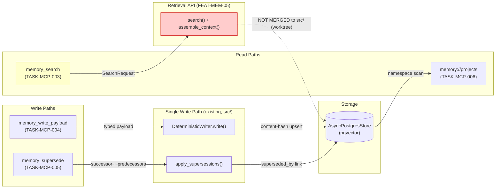
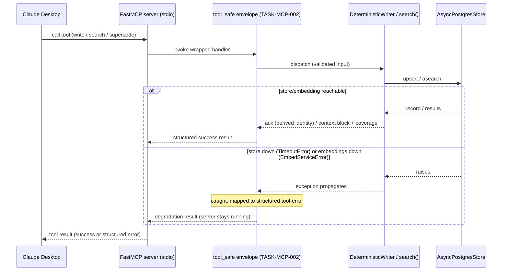
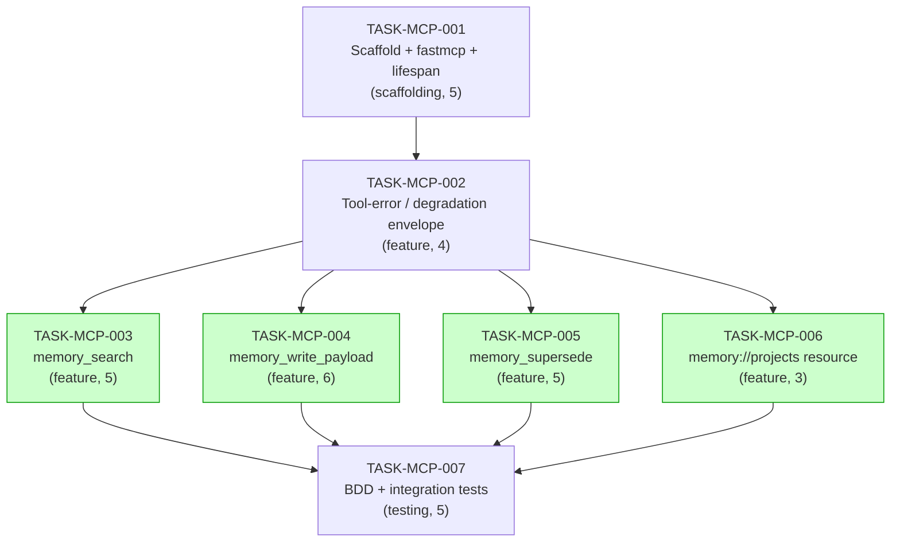

/feature-plan "Memory MCP Server" \
    --context features/memory-mcp-server/memory-mcp-server_summary.md

I'll execute the /feature-plan workflow for "Memory MCP Server". Let me start by reading the context file.

Read memory-mcp-server_summary.md
Bash List memory-mcp-server feature dir
IN
ls -la /Users/richardwoollcott/Projects/appmilla_github/fleet-memory/features/memory-mcp-server/ 2>/dev/null; echo "---FEATURES---"; ls /Users/richardwoollcott/Projects/appmilla_github/fleet-memory/features/ 2>/dev/null

OUT
total 48
drwxr-xr-x  5 richardwoollcott  staff    160 Jun 13 16:14 .
drwxr-xr-x  8 richardwoollcott  staff    256 Jun 13 16:12 ..
-rw-r--r--  1 richardwoollcott  staff   3257 Jun 13 16:13 memory-mcp-server_assumptions.yaml
-rw-r--r--  1 richardwoollcott  staff   2595 Jun 13 16:14 memory-mcp-server_summary.md
-rw-r--r--  1 richardwoollcott  staff  15919 Jun 13 16:13 memory-mcp-server.feature
---FEATURES---
deterministic-writer
memory-mcp-server
relay-integration
retrieval-api
storage-substrate
typed-payload-registry
Let me read the full feature spec and understand the existing codebase structure.

Read memory-mcp-server.feature
Read memory-mcp-server_assumptions.yaml
Now let me explore the existing codebase to understand the upstream dependencies (retrieval API, deterministic writer, payload registry).

Bash Explore source tree and deps
IN
echo "=== src tree ===" && find src -type f -name "*.py" | head -80 && echo "=== pyproject ===" && ls pyproject.toml setup.py requirements*.txt 2>/dev/null && echo "=== existing mcp refs ===" && grep -rl "fastmcp\|FastMCP" src 2>/dev/null | head; echo "=== guardkit features dir ===" && ls .guardkit/features/ 2>/dev/null

OUT
=== src tree ===
src/fleet_memory/store.py
src/fleet_memory/embed.py
src/fleet_memory/__init__.py
src/fleet_memory/settings.py
src/fleet_memory/app.py
src/fleet_memory/errors.py
src/fleet_memory/payloads/models.py
src/fleet_memory/payloads/registry.py
src/fleet_memory/payloads/__init__.py
src/fleet_memory/payloads/base.py
src/fleet_memory/writer/supersession.py
src/fleet_memory/writer/__init__.py
src/fleet_memory/writer/core.py
src/fleet_memory/writer/identity.py
src/fleet_memory/relay/service.py
src/fleet_memory/relay/handler.py
src/fleet_memory/relay/chunker.py
src/fleet_memory/relay/__init__.py
src/fleet_memory/relay/chunk_writer.py
src/fleet_memory/relay/schema.py
=== pyproject ===
(eval):1: no matches found: requirements*.txt
=== guardkit features dir ===
FEAT-CA81.yaml
FEAT-MEM-02.yaml
FEAT-MEM-03.yaml
FEAT-MEM-04.yaml
FEAT-MEM-05.yaml
Bash Find retrieval module and deps
IN
echo "=== retrieval module? ===" && find src -path "*retriev*" -o -name "*.py" | grep -i retriev; echo "=== all py files ===" && find src -type f -name "*.py" | sort; echo "=== retrieval-api feature dir ===" && ls features/retrieval-api/ 2>/dev/null; echo "=== pyproject deps ===" && grep -iA40 "dependencies\|^\[project\]" pyproject.toml | head -60

OUT
=== retrieval module? ===
=== all py files ===
src/fleet_memory/__init__.py
src/fleet_memory/app.py
src/fleet_memory/embed.py
src/fleet_memory/errors.py
src/fleet_memory/payloads/__init__.py
src/fleet_memory/payloads/base.py
src/fleet_memory/payloads/models.py
src/fleet_memory/payloads/registry.py
src/fleet_memory/relay/__init__.py
src/fleet_memory/relay/chunk_writer.py
src/fleet_memory/relay/chunker.py
src/fleet_memory/relay/handler.py
src/fleet_memory/relay/schema.py
src/fleet_memory/relay/service.py
src/fleet_memory/settings.py
src/fleet_memory/store.py
src/fleet_memory/writer/__init__.py
src/fleet_memory/writer/core.py
src/fleet_memory/writer/identity.py
src/fleet_memory/writer/supersession.py
=== retrieval-api feature dir ===
retrieval-api_assumptions.yaml
retrieval-api_summary.md
retrieval-api.feature
=== pyproject deps ===
[project]
name = "fleet_memory"
version = "0.1.0"
description = "LangGraph checkpoint and memory store for distributed agent coordination"
requires-python = ">=3.12"
dependencies = [
    "faststream[nats]",
    "pydantic>=2",
    "pydantic-settings>=2",
    "langgraph-checkpoint-postgres>=2.0",
    "httpx",
    "psycopg[binary]",
    "psycopg-pool",
]

[project.optional-dependencies]
dev = [
    "pytest",
    "pytest-asyncio",
    "pytest-timeout",
    "pytest-bdd>=8.1,<9",
    "ruff",
    "pyyaml",
]

[build-system]
requires = ["setuptools>=61.0"]
build-backend = "setuptools.build_meta"

[tool.setuptools.packages.find]
where = ["src"]

[tool.pytest.ini_options]
testpaths = ["tests"]
addopts = "-m 'not integration'"
markers = [
    "integration: marks tests as integration tests (deselected by default)",
    "seam: cross-module contract tests",
    "integration_contract: tests that verify integration contracts",
]
asyncio_mode = "auto"

[tool.ruff]
line-length = 100
target-version = "py312"

[tool.ruff.lint]
select = [
    "E",   # pycodestyle errors
    "W",   # pycodestyle warnings
    "F",   # pyflakes
    "I",   # isort
    "N",   # pep8-naming
    "UP",  # pyupgrade
]
The retrieval API module isn't in src yet (FEAT-MEM-05 in flight). Let me read the key integration surfaces the MCP tools will wrap.

Bash Read writer/registry/errors signatures
IN
echo "=== writer/core.py ===" && sed -n '1,60p' src/fleet_memory/writer/core.py; echo "=== writer/supersession.py (signatures) ===" && grep -n "def \|class " src/fleet_memory/writer/supersession.py; echo "=== payloads/registry.py (signatures) ===" && grep -n "def \|class " src/fleet_memory/payloads/registry.py; echo "=== errors.py ===" && grep -n "class " src/fleet_memory/errors.py

OUT
=== writer/core.py ===
"""Deterministic writer core: idempotent content-hash upsert.

Provides DeterministicWriter that transforms typed payloads into AsyncPostgresStore
records with zero language-model calls. Identity comes from TASK-DW-001;
persistence and embed-on-write go through AsyncPostgresStore; input validation
uses the typed payload registry.

Producer: TASK-DW-002
Consumer: FEAT-MEM-03 (deterministic write API)
"""

from __future__ import annotations

import json
from typing import TYPE_CHECKING

from fleet_memory.payloads.base import BasePayload
from fleet_memory.payloads.registry import PAYLOAD_REGISTRY
from fleet_memory.store import validate_namespace
from fleet_memory.writer.identity import content_hash, record_identity
from fleet_memory.writer.supersession import (
    apply_supersessions,
    check_and_apply_forward_supersession,
)

if TYPE_CHECKING:
    from langgraph.store.postgres.aio import AsyncPostgresStore

    from fleet_memory.settings import Settings


class DeterministicWriter:
    """Deterministic writer with idempotent content-hash upsert.

    Transforms typed payloads into AsyncPostgresStore records with no LLM calls.
    Implements version-aware upsert: no-op for identical content, version++ for changes.

    Args:
        store: Configured AsyncPostgresStore with embed-on-write enabled
        settings: Configuration (used for validation and metadata)
    """

    def __init__(self, store: AsyncPostgresStore, settings: Settings) -> None:
        """Initialize writer with store and settings.

        Args:
            store: AsyncPostgresStore instance (already configured with embedding)
            settings: Settings instance for validation
        """
        self.store = store
        self.settings = settings

    async def write(self, payload: BasePayload) -> None:
        """Write a single typed payload with idempotent content-hash upsert.

        Algorithm:
        1. Validate payload is registered
        2. Build and validate namespace
        3. Compute identity and content_hash
        4. Check for existing record
=== writer/supersession.py (signatures) ===
27:async def apply_supersessions(
83:async def _apply_forward_supersessions(
129:async def check_and_apply_forward_supersession(
=== payloads/registry.py (signatures) ===
35:# Reverse lookup cache: model class → canonical type name
41:def get_model_for_type(payload_type: str) -> type[BasePayload]:
48:        The model class for this payload type
58:def get_type_for_model(model: type[BasePayload]) -> str:
59:    """Reverse lookup: model class to canonical type name.
=== errors.py ===
25:class EmbedDimensionError(ValueError):
46:class EmbedTimeoutError(TimeoutError):
64:class EmbedServiceError(RuntimeError):
91:class NamespaceValidationError(ValueError):
113:class UnknownPayloadTypeError(ValueError):
133:class PoisonEpisodeError(Exception):
160:class TransientIngestError(Exception):
Bash Read writer API and retrieval summary
IN
echo "=== writer public API (__init__ + write methods) ===" && grep -n "def \|class " src/fleet_memory/writer/__init__.py; sed -n '60,140p' src/fleet_memory/writer/core.py; echo "=== apply_supersessions signature ==="; sed -n '27,60p' src/fleet_memory/writer/supersession.py; echo "=== retrieval-api summary ==="; cat features/retrieval-api/retrieval-api_summary.md 2>/dev/null | head -60

OUT
=== writer public API (__init__ + write methods) ===
4:    DeterministicWriter: Main writer class with content-hash upsert logic
        4. Check for existing record
        5. Apply upsert logic (no-op if same hash, version++ if different)
        6. Apply declared supersessions (if any)

        Args:
            payload: A registered BasePayload subclass instance

        Raises:
            ValueError: If payload type is not registered
            NamespaceValidationError: If namespace contains invalid identifiers
            RuntimeError: If embedding service unavailable or database unreachable
        """
        # Step 1: Validate payload is registered
        payload_type = payload.payload_type
        if payload_type not in PAYLOAD_REGISTRY:
            raise ValueError(
                f"Payload type '{payload_type}' is not a recognized payload type. "
                f"Only registered BasePayload subclasses can be written."
            )

        # Step 2: Build namespace and validate before any store operation
        namespace = ("fleet_memory", payload.project, payload_type)
        validate_namespace(namespace)

        # Step 3: Compute identity and new content hash
        natural_key = payload.natural_key
        identity = record_identity(natural_key)
        new_hash = content_hash(payload)

        # Step 4: Read any existing record for this key
        store_key = str(identity)
        existing = await self.store.aget(namespace, store_key)

        # Step 5: Apply upsert logic
        if existing is None:
            # No existing record - write new at version 1
            version = 1
            await self._write_record(namespace, store_key, payload, new_hash, version)
        else:
            # Existing record - check content hash
            existing_value = existing.value
            existing_hash = existing_value.get("content_hash")

            if existing_hash == new_hash:
                # Same content hash - no-op (ASSUM-004)
                # Do NOT re-embed or update timestamps
                # But still apply supersessions if they changed
                if payload.supersedes:
                    await apply_supersessions(
                        self.store, natural_key, payload.supersedes
                    )
                return
            else:
                # Different content hash - versioned update (ASSUM-005)
                existing_version = existing_value.get("version", 1)
                new_version = existing_version + 1
                await self._write_record(namespace, store_key, payload, new_hash, new_version)

        # Step 6: Apply declared supersessions (if any)
        if payload.supersedes:
            await apply_supersessions(self.store, natural_key, payload.supersedes)

    async def write_batch(self, payloads: list[BasePayload]) -> None:
        """Write a batch of payloads with within-batch duplicate key collapsing.

        Produces exactly one record per distinct natural key. Within-batch duplicates
        for the same key collapse to the last occurrence.

        Args:
            payloads: List of typed payload instances

        Raises:
            ValueError: If any payload type is not registered
            NamespaceValidationError: If any namespace is invalid
        """
        if not payloads:
            return

        # Collapse duplicates: last occurrence wins for each natural key
        seen_keys: dict[str, BasePayload] = {}
        for payload in payloads:
=== apply_supersessions signature ===
async def apply_supersessions(
    store: AsyncPostgresStore,
    successor_natural_key: str,
    predecessor_natural_keys: list[str],
) -> None:
    """Apply supersession links: mark each predecessor as superseded by successor.

    This function handles:
    - Marking existing predecessors with superseded_by link
    - Forward supersession: safe to declare supersession of non-existent key
    - Cross-project supersession: predecessors can be in different namespaces
    - Idempotent: re-marking is safe

    Args:
        store: AsyncPostgresStore instance
        successor_natural_key: Natural key of the successor (format: type:project:identifier)
        predecessor_natural_keys: List of predecessor natural keys to mark as superseded

    Raises:
        ValueError: If natural key format is invalid (must be type:project:identifier)
    """
    if not predecessor_natural_keys:
        return

    # Process each predecessor
    for predecessor_key in predecessor_natural_keys:
        # Parse predecessor natural key to get namespace
        # Format: type:project:identifier
        segments = predecessor_key.split(":")
        if len(segments) != 3:
            raise ValueError(
                f"Invalid natural key format '{predecessor_key}': "
                f"expected type:project:identifier"
            )
=== retrieval-api summary ===
# Feature Spec Summary: Retrieval API + Context Assembly

**Stack**: python
**Generated**: 2026-06-13T11:46:58Z
**Scenarios**: 31 total (10 smoke, 6 regression)
**Assumptions**: 9 total (3 high / 2 medium / 4 low confidence)
**Review required**: Yes

## Scope

Covers the FEAT-MEM-05 retrieval surface: a filtered, vector-ranked, token-budgeted
`search(project, payload_types, domain_tags, query, token_budget, include_superseded=False)`
that assembles a single context block, excludes superseded records by default, ports
guardkit's job-specific context composition by complexity band, and reports a coverage
score. Also covers the probe-set evaluation harness behind the ≥15-query retrieval-parity
gate, including divergence flagging against recorded Graphiti baselines.

## Scenario Counts by Category

| Category | Count |
|----------|-------|
| Key examples (@key-example) | 8 |
| Boundary conditions (@boundary) | 6 |
| Negative cases (@negative) | 11 |
| Edge cases (@edge-case) | 12 |

(Tags overlap: several boundary and edge-case scenarios are also tagged `@negative`.)

## Deferred Items

None — all four proposed groups and all six edge-case-expansion scenarios were accepted.

Out of scope by upstream decision: `related_keys` one-hop link expansion (deferred to the
writer/retrieval boundary per the typed-payload-registry spec) and the p95 < 200ms latency
AC (a performance gate measured by the probe harness, not a behavioural scenario).

## Open Assumptions (low confidence)

These four need human verification before the spec is treated as settled:

- **ASSUM-001** — complexity bands `simple`/`standard`/`complex` (verify against guardkit's
  actual job-specific context builder before FEAT-MEM-08 cutover).
- **ASSUM-007** — parity gate passes only on zero divergence (depends on the OD-2 probe-set
  freeze; a tolerance threshold may be chosen instead).
- **ASSUM-008** — a request with neither query nor filter is rejected (project-only listing
  may be a legitimate API shape).
- **ASSUM-009** — a memory larger than the whole budget is omitted whole, not truncated.

## Integration with /feature-plan

This summary can be passed to `/feature-plan` as a context file:

    /feature-plan "Retrieval API + Context Assembly" \
      --context features/retrieval-api/retrieval-api_summary.md

`/feature-plan` Step 11 will link these scenarios to the tasks it creates by inserting
`@task:<TASK-ID>` tags; none are present yet (feature-spec is link-free by design).
I have a solid understanding of the feature and its integration surfaces. Key findings:

Upstream surfaces: DeterministicWriter.write(payload) (writer/core.py), apply_supersessions(store, successor_key, predecessor_keys) (writer/supersession.py), PAYLOAD_REGISTRY + get_model_for_type (payloads/registry.py), and the FEAT-MEM-05 search(...) retrieval API (in flight).
fastmcp is not yet a dependency — this feature must add it.
All 9 assumptions are marked confirmed.
Per the /feature-plan workflow (no --no-questions flag), let me gather Context A: Review Scope before running the analysis.

AskUserQuestion
OUT
Your questions have been answered: "What should the planning analysis focus on for the Memory MCP Server?"="All aspects (Recommended)", "What should the implementation trade-offs optimize for?"="Quality/reliability (Recommended)". You can now continue with these answers in mind.
Context A recorded: Focus = All aspects, Trade-off = Quality/reliability. Now the Graphiti pre-planning context check (Step 2.5).

Bash Check graphiti config and backlog
IN
echo "=== graphiti.yaml ===" && cat .guardkit/graphiti.yaml 2>/dev/null || echo "NOT FOUND"; echo "=== backlog dir ===" && ls tasks/backlog/ 2>/dev/null

OUT
=== graphiti.yaml ===
project_id: fleet_memory
enabled: true
graph_store: falkordb
falkordb_host: whitestocks
falkordb_port: 6379
timeout: 30.0
max_concurrent_episodes: 3
chunk_extraction_concurrency: 4
llm_provider: vllm
llm_base_url: http://promaxgb10-41b1:9000/v1
llm_model: qwen-graphiti
llm_max_tokens: 4096
embedding_provider: vllm
embedding_base_url: http://promaxgb10-41b1:9000/v1
embedding_model: nomic-embed
group_ids:
- product_knowledge
- command_workflows
- architecture_decisions
=== backlog dir ===
relay-integration
retrieval-api
storage-substrate
TASK-MEM-001-scaffold-project-layout.md
TASK-MEM-002-settings-class-env-profiles.md
TASK-MEM-008-nas-deploy-operator-execution.md
TASK-MEM-013-assumption-verification-record.md
TASK-REV-RA05-plan-retrieval-api.md
TASK-REV-RLY04-plan-relay-integration.md
TASK-RLY-007-verify-dlq-contract.md
Graphiti is enabled (CLI access path). Let me query it for pre-planning context (graceful degradation if unreachable).

Bash Query Graphiti pre-planning context
IN
timeout 30 /Users/richardwoollcott/.agentecflow/bin/graphiti-check --status --task-context --quiet --description "Memory MCP Server FastMCP stdio tools memory_search memory_write_payload memory_supersede over retrieval API and deterministic writer" --phase plan 2>&1 | head -40 || echo "[graphiti unavailable - continuing without]"

OUT
{"available": true, "error": null, "context": null, "categories": 0, "tokens_used": 0, "tokens_budget": 0}
Graphiti: available but no relevant prior context found (continuing without). Proceeding to the decision review.

FEATURE PLANNING: Memory MCP Server (FEAT-MEM-06)
Review task: TASK-REV-MEM06 · Mode: decision · Depth: standard
Scope (Context A): All aspects · optimize for Quality/reliability

🔍 Analysis
The spec is fully settled (31 scenarios, all 9 assumptions confirmed). This is a wrapper feature: a FastMCP server over stdio that dispatches to surfaces that already exist or are in flight — so the design space is narrow and the risk is concentrated at the integration seams, not in novel logic.

Integration surfaces (verified in source)
Surface	Signature	Status
Deterministic writer	DeterministicWriter.write(payload) (core.py)	✅ exists
Supersession	apply_supersessions(store, successor_key, predecessor_keys) (supersession.py)	✅ exists
Payload registry	PAYLOAD_REGISTRY, get_model_for_type (registry.py)	✅ exists
Errors	UnknownPayloadTypeError, NamespaceValidationError, EmbedServiceError… (errors.py)	✅ exists
Retrieval search(project, payload_types, domain_tags, query, token_budget, include_superseded=False)	FEAT-MEM-05	⚠️ in flight — not in src/ yet
fastmcp package	—	⚠️ not a dependency yet
⚠️ Two pre-conditions surfaced
memory_search depends on the FEAT-MEM-05 retrieval module that does not yet exist in src/. This is the single biggest sequencing risk. The plan must either (a) sequence FEAT-MEM-06 after FEAT-MEM-05 lands, or (b) code memory_search against the documented search(...) contract and gate its integration test on the module's presence.
fastmcp must be added to pyproject.toml dependencies.
TECHNICAL OPTIONS
Option 1 — FastMCP server reusing the single write path (Recommended)
Thin MCP tool handlers that validate at the boundary then dispatch to the existing DeterministicWriter / apply_supersessions / retrieval search. A shared tool-error envelope wraps every handler so store/embedding outages return structured errors (no crash). Complexity: Medium. Directly satisfies write-path parity (no second write path), graceful degradation, and stdio-only scope.

Option 2 — MCP server with its own write/validation logic
Re-implement validation/persistence inside the tools. ❌ Violates the "no second write path" AC and the byte-identical-parity scenario. Rejected.

Option 3 — Generic MCP gateway delegating to the relay
Route MCP writes through the NATS relay. ❌ Adds a broker hop, breaks stdio-only/standalone-launch, and complicates degradation. Rejected.

✅ Recommended: Option 1 — rationale
Only Option 1 preserves byte-identical write parity (RD: one writer), keeps the server a standalone stdio Desktop surface, and isolates degradation in one reusable envelope (the quality/reliability priority).

Proposed task breakdown (7 tasks, 4 waves)
ID	Task	type	cplx	mode	deps
TASK-MCP-001	Scaffold FastMCP server + add fastmcp dep + lifespan wiring (store/writer/search), stdio runner, starts even when store down	scaffolding	5	task-work	—
TASK-MCP-002	Shared tool-error envelope + graceful-degradation helper (structured errors, no crash)	feature	4	task-work	001
TASK-MCP-003	memory_search tool (wraps retrieval search, default budget 2000, coverage, exclude-superseded)	feature	5	task-work	002
TASK-MCP-004	memory_write_payload tool (registry validate → DeterministicWriter.write; reject unknown/invalid/missing/forged; derived-identity ack; idempotent)	feature	6	task-work	002
TASK-MCP-005	memory_supersede tool (key-shape + empty/self/malformed guards → apply_supersessions)	feature	5	task-work	002
TASK-MCP-006	memory://projects resource (list projects with memories)	feature	3	direct	002
TASK-MCP-007	BDD wiring of the 31 scenarios + integration/seam tests	testing	5	task-work	003,004,005,006
Waves: [001] → [002] → [003,004,005,006 ∥] → [007]
Aggregate complexity: ~6/10 · Risk: Medium (concentrated at the FEAT-MEM-05 seam)

📋 DECISION CHECKPOINT
Review complete. Recommended approach: Option 1 — FastMCP server reusing the single write path.

[A]ccept — save findings only
[R]evise — deeper analysis / explore alternatives
[I]mplement — create the feature structure (7 task files + IMPLEMENTATION-GUIDE with mandatory diagrams + FEAT-MEM-06.yaml + BDD scenario linking)
[C]ancel — discard
Your choice [A/R/I/C]?

One thing I'd flag before you decide: how should I handle the FEAT-MEM-05 retrieval dependency for memory_search — code against the documented contract now (with the integration test gated on the module landing), or note FEAT-MEM-06 as blocked-until-FEAT-MEM-05? I'll fold your answer into TASK-MCP-003 if you choose [I]mplement.

phase-core-build-plan.md
I
You chose [I]mplement. Let me gather Context B: Implementation Preferences (including the FEAT-MEM-05 dependency question I flagged).

AskUserQuestion
OUT
Your questions have been answered: "How should memory_search handle the FEAT-MEM-05 retrieval dependency (the search() module isn't in src/ yet)?"="Code against contract, gate test (Recommended)", "How should the 7 subtasks be executed?"="Auto-detect (Recommended)", "What testing depth for the subtasks?"="Standard (Recommended)". You can now continue with these answers in mind.
Context B recorded. Let me check the tests/ layout and an existing task file format before generating the structure.

Bash Inspect tests layout and task file format
IN
echo "=== tests tree ===" && find tests -maxdepth 2 -type d 2>/dev/null | sort; echo "=== tests files (top) ===" && find tests -maxdepth 2 -name "*.py" 2>/dev/null | head -20; echo "=== existing task md (sample) ===" && sed -n '1,60p' tasks/backlog/TASK-MEM-001-scaffold-project-layout.md 2>/dev/null

OUT
=== tests tree ===
tests
tests/__pycache__
tests/bdd
tests/bdd/__pycache__
tests/integration
tests/integration/__pycache__
tests/unit
tests/unit/__pycache__
tests/unit/relay
=== tests files (top) ===
tests/conftest.py
tests/test_payloads_registry.py
tests/__init__.py
tests/test_assumptions_verification.py
tests/unit/test_writer_supersession.py
tests/unit/test_fake_embed_fixture.py
tests/unit/test_store_validation.py
tests/unit/test_writer_idempotency.py
tests/unit/test_writer_core.py
tests/unit/test_writer_identity.py
tests/unit/__init__.py
tests/unit/test_app_lifespan.py
tests/unit/test_credential_hygiene.py
tests/unit/test_embed.py
tests/unit/test_supersession.py
tests/unit/test_payloads.py
tests/unit/test_scaffold.py
tests/unit/test_settings.py
tests/integration/conftest.py
tests/integration/test_writer_supersession.py
=== existing task md (sample) ===
---
id: TASK-MEM-001
title: Scaffold project layout
status: backlog
created: 2026-06-12T17:00:00Z
updated: 2026-06-12T17:00:00Z
priority: high
task_type: scaffolding
parent_review: TASK-REV-CA81
feature_id: FEAT-CA81
wave: 1
implementation_mode: direct
complexity: 3
estimated_minutes: 40
dependencies: []
tags: [scaffolding, pyproject, pytest, ruff]
test_results:
  status: pending
  coverage: null
  last_run: null
---

# Task: Scaffold project layout

## Description

Establish the Python project skeleton for fleet_memory. The repo currently has NO
Python scaffolding — only GuardKit structure, docs, and the BDD spec. Create
`pyproject.toml` with pinned core dependencies, the `src/fleet_memory/` package,
the `tests/unit/` + `tests/integration/` split, pytest configuration with the
`integration` marker excluded by default, and ruff configuration. All identifiers
use underscores (no hyphens anywhere — FalkorDB scar tissue).

Note: `AsyncPostgresStore` is provided by `langgraph-checkpoint-postgres`, which
uses psycopg3 + psycopg-pool (NOT asyncpg). DSNs are plain `postgresql://`
conninfo strings.

## Acceptance Criteria

- [ ] `pyproject.toml` exists with `[project]` `name = "fleet_memory"`, requires-python `>=3.12`, and pinned deps: `faststream[nats]`, `pydantic>=2`, `pydantic-settings>=2`, `langgraph-checkpoint-postgres>=2.0`, `httpx`, `psycopg[binary]`, `psycopg-pool`; dev extras: `pytest`, `pytest-asyncio`, `pytest-timeout`, `ruff`, `pyyaml`
- [ ] `pip install -e ".[dev]"` succeeds and `python -c "import fleet_memory"` exits 0
- [ ] `python -c "from langgraph.store.postgres.aio import AsyncPostgresStore"` exits 0 (confirms the pinned package exposes the store API — review risk R5)
- [ ] `tests/unit/test_scaffold.py` contains `test_package_imports` (imports `fleet_memory`); `python -m pytest tests/ -q` exits 0 with 1 passed — the `integration` marker is excluded by default via `addopts = -m "not integration"` and registered in pytest config
- [ ] `ruff check src/ tests/` exits 0
- [ ] No filename or Python identifier under `src/` or `tests/` contains a hyphen

## Test Requirements

- [ ] `tests/unit/test_scaffold.py::test_package_imports` passes
- [ ] Default pytest run collects zero `integration`-marked tests

## BDD Scenarios Covered

- "Unit tests pass with no database and no embedding service available" (structural prerequisite — marker exclusion)
- "An explicitly requested integration run fails clearly when no ephemeral instance can start" (marker gating established here)

## Implementation Notes

- Layout: `src/fleet_memory/__init__.py`, `tests/__init__.py`, `tests/unit/__init__.py`, `tests/integration/__init__.py`, `pytest.ini` (or `[tool.pytest.ini_options]` in pyproject), `ruff.toml` (or `[tool.ruff]`)
- pytest config must set `asyncio_mode = "auto"` (pytest-asyncio) and register the `integration` marker so `--strict-markers` is viable later
Bash Inspect BDD test wiring and feature yaml format
IN
echo "=== tests/bdd ===" && find tests/bdd -type f -name "*.py" 2>/dev/null; echo "=== sample bdd file head ===" && f=$(find tests/bdd -name "*.py" ! -name "__init__.py" | head -1); echo "$f"; sed -n '1,30p' "$f" 2>/dev/null; echo "=== existing feature yaml sample (FEAT-MEM-05) ===" && sed -n '1,40p' .guardkit/features/FEAT-MEM-05.yaml

OUT
=== tests/bdd ===
tests/bdd/test_typed_payload_registry.py
tests/bdd/__init__.py
=== sample bdd file head ===
tests/bdd/test_typed_payload_registry.py
"""BDD step definitions for typed payload registry feature.

Binds the 29 scenarios in typed-payload-registry.feature to the fleet_memory.payloads
implementation. This is the executable acceptance suite for FEAT-MEM-02.

All scenarios act on payloads or the registry in-process — no broker or infrastructure.
Tests import from the public surface (fleet_memory.payloads) as a contract test.
"""

from __future__ import annotations

import json
from typing import Any

import pytest
from pydantic import ValidationError
from pytest_bdd import given, parsers, scenarios, then, when

from fleet_memory.errors import UnknownPayloadTypeError
from fleet_memory.payloads.base import (
    BasePayload,
    IdentifierValidationError,
    SupersessionValidationError,
)
from fleet_memory.payloads.models import (
    ADRPayload,
    BuildOutcomePayload,
    DocumentPayload,
    PatternPayload,
    ReviewReportPayload,
=== existing feature yaml sample (FEAT-MEM-05) ===
id: FEAT-MEM-05
name: Retrieval API + Context Assembly
description: 'FEAT-MEM-05 read path: filtered, vector-ranked, token-budgeted search
  assembling a single context block; default supersession exclusion; guardkit job-specific
  composition by complexity band; coverage score; probe-set parity harness for the
  >=15-query retrieval-parity gate.'
created: '2026-06-13T14:24:17.235604'
status: completed
complexity: 7
estimated_tasks: 7
tasks:
- id: TASK-RA-001
  name: SearchRequest model and validation
  file_path: tasks/backlog/retrieval-api/TASK-RA-001-search-request-model-validation.md
  complexity: 4
  dependencies: []
  status: completed
  implementation_mode: task-work
  estimated_minutes: 50
  requires_infrastructure: []
  result:
    total_turns: 1
    final_decision: approved
    error: null
    deferred_reason: null
  turns_completed: 1
  current_turn: 0
  started_at: '2026-06-13T16:13:41.475205'
  completed_at: '2026-06-13T16:23:03.487356'
- id: TASK-RA-002
  name: Filtered vector search core
  file_path: tasks/backlog/retrieval-api/TASK-RA-002-filtered-vector-search-core.md
  complexity: 7
  dependencies:
  - TASK-RA-001
  status: completed
  implementation_mode: task-work
  estimated_minutes: 170
  requires_infrastructure: []
  result:
FEAT-MEM-05 is marked completed but built in a worktree (not yet merged to src/). Let me confirm the actual search() module path/signature from the completed work so I code memory_search against the real contract.

Bash Locate retrieval search module across worktrees
IN
echo "=== worktrees ===" && ls .guardkit/worktrees/ 2>/dev/null; echo "=== find retrieval module anywhere ===" && find . -path ./node_modules -prune -o -name "*.py" -print 2>/dev/null | grep -i "retriev\|search" | grep -v __pycache__ | head; echo "=== grep def search in repo ===" && grep -rn "def search\|async def search" --include=*.py . 2>/dev/null | grep -v __pycache__ | head

OUT
=== worktrees ===
FEAT-MEM-05
=== find retrieval module anywhere ===
./tests/integration/test_search_boundaries.py
./.venv/lib/python3.14/site-packages/langchain_core/retrievers.py
./.guardkit/worktrees/FEAT-MEM-05/tests/unit/test_search_request.py
./.guardkit/worktrees/FEAT-MEM-05/tests/unit/test_retrieval_suite.py
./.guardkit/worktrees/FEAT-MEM-05/tests/unit/test_search_core.py
./.guardkit/worktrees/FEAT-MEM-05/tests/integration/test_search_boundaries.py
./.guardkit/worktrees/FEAT-MEM-05/tests/integration/test_retrieval_pipeline.py
./.venv/lib/python3.14/site-packages/langchain_core/tools/retriever.py
./.guardkit/worktrees/FEAT-MEM-05/src/fleet_memory/retrieval/__init__.py
./.guardkit/worktrees/FEAT-MEM-05/src/fleet_memory/retrieval/core.py
=== grep def search in repo ===
(eval):1: no matches found: --include=*.py
Bash Read retrieval public API from worktree
IN
cd .guardkit/worktrees/FEAT-MEM-05; echo "=== retrieval/__init__.py ===" && cat src/fleet_memory/retrieval/__init__.py 2>/dev/null | head -40; echo "=== search signatures in retrieval/core.py ===" && grep -n "def \|class \|async def " src/fleet_memory/retrieval/core.py 2>/dev/null | head -40

OUT
=== retrieval/__init__.py ===
"""Retrieval surface for fleet-memory search.

Defines the typed SearchRequest contract, validation rules, and search core.
Producer: TASK-RA-001 (SearchRequest), TASK-RA-002 (search core), TASK-RA-003 (assembly)
"""

from __future__ import annotations

from fleet_memory.retrieval.assembly import AssemblyResult, assemble_context
from fleet_memory.retrieval.core import SearchResult, search
from fleet_memory.retrieval.search_request import SearchRequest

__all__ = ["SearchRequest", "search", "SearchResult", "assemble_context", "AssemblyResult"]
=== search signatures in retrieval/core.py ===
30:def _extract_payload_type(natural_key: str) -> str | None:
45:def _matches_payload_types(item: SearchItem, payload_types: list[str]) -> bool:
65:def _matches_domain_tags(item: SearchItem, domain_tags: list[str]) -> bool:
84:def _is_superseded(item: SearchItem) -> bool:
96:def _sort_key(item: SearchItem) -> tuple[float, str]:
113:async def search(
Bash Read full search contract
IN
cd .guardkit/worktrees/FEAT-MEM-05; echo "=== search() signature + SearchResult ===" && sed -n '113,175p' src/fleet_memory/retrieval/core.py; echo "=== SearchRequest fields ===" && grep -n "class SearchRequest\|: \|Field" src/fleet_memory/retrieval/search_request.py | head -30; echo "=== assemble_context / AssemblyResult ===" && grep -n "class AssemblyResult\|def assemble_context\|: " src/fleet_memory/retrieval/assembly.py | head -30

OUT
(eval):cd:1: no such file or directory: .guardkit/worktrees/FEAT-MEM-05
=== search() signature + SearchResult ===
async def search(
    request: SearchRequest,
    store: AsyncPostgresStore,
) -> list[SearchResult]:
    """Execute filtered vector search over AsyncPostgresStore.

    Takes a validated SearchRequest and returns ranked memories matching all filters:
    - Project scope (via namespace)
    - Payload types (if specified)
    - Domain tags (if specified)
    - Supersession state (excluded by default)

    Results are ordered by cosine similarity descending, with deterministic
    tie-breaking on natural_key for equal scores.

    Args:
        request: Validated SearchRequest from TASK-RA-001
        store: AsyncPostgresStore instance with pgvector index

    Returns:
        List of SearchResult (SearchItem) objects, ranked by relevance

    Raises:
        EmbedServiceError: When embedding service is unavailable (no credentials)
        TimeoutError: When store is unreachable (no credentials in message)

    Example:
        >>> request = SearchRequest(project="guardkit", query="retries", token_budget=2000)
        >>> async with async_store_context(settings) as store:
        ...     results = await search(request, store)
        ...     for result in results:
        ...         print(f"{result.score}: {result.value['content']}")
    """
    # Build namespace prefix for project scope
    # Format: ("fleet_memory", project)
    namespace_prefix = ("fleet_memory", request.project)

    # Execute vector search with query
    # The store handles embedding and vector similarity via its index config
    # Any EmbedServiceError or TimeoutError will propagate with credential hygiene
    # (already enforced by embed.py and store.py)
    raw_results = await store.asearch(
        namespace_prefix,
        query=request.query,
    )

    # Apply filters
    filtered_results = raw_results

    # Filter by payload types
    filtered_results = [
        item
        for item in filtered_results
        if _matches_payload_types(item, request.payload_types)
    ]

    # Filter by domain tags
    filtered_results = [
        item
        for item in filtered_results
        if _matches_domain_tags(item, request.domain_tags)
    ]

=== SearchRequest fields ===
7:Producer: TASK-RA-001
8:Consumer: FEAT-MEM-05 (search core, assembly, harness)
19:# Project identifier pattern: lowercase alphanumeric + underscores only (no hyphens)
22:# Domain tag pattern: letters, digits, underscore, hyphen (exact-match facet)
26:class SearchRequest(BaseModel):
35:    project: str
36:    payload_types: list[str] = []
37:    domain_tags: list[str] = []
38:    query: str | None = None
39:    token_budget: int
40:    include_superseded: bool = False
44:    def validate_project_identifier(cls, v: str) -> str:
48:            v: The project identifier
54:            ValueError: If project contains hyphens or invalid characters
65:    def validate_payload_types(cls, v: list[str]) -> list[str]:
72:            v: List of payload type names
78:            ValueError: If any payload type is not in PAYLOAD_REGISTRY
84:                f"Unknown payload type(s) {unknown_str}: not found in PAYLOAD_REGISTRY. "
85:                f"Valid types: {', '.join(sorted(PAYLOAD_REGISTRY.keys()))}"
91:    def validate_domain_tags(cls, v: list[str]) -> list[str]:
94:        Tags are an exact-match facet. Allowed characters: letters, digits,
98:            v: List of domain tag strings
104:            ValueError: If any tag contains disallowed characters
110:                f"Malformed domain tag(s) {malformed_str}: tags must contain only "
118:    def validate_token_budget(cls, v: int) -> int:
124:            v: The token budget value
130:            ValueError: If token_budget is negative
142:        ASSUM-008 (low confidence): A request with neither query nor any filter
149:            ValueError: If neither query nor any filter is provided
=== assemble_context / AssemblyResult ===
7:Producer: TASK-RA-003
8:Consumer: FEAT-MEM-05 (harness, downstream tasks)
23:class AssemblyResult:
27:        context_block: Assembled context string (never exceeds token budget)
28:        coverage_score: Fraction of budget filled (0.0-1.0)
29:        contributing_types: Set of payload types that contributed content
30:        tokens_used: Actual tokens consumed by the assembled block
33:    context_block: str
34:    coverage_score: float
35:    contributing_types: set[str]
36:    tokens_used: int
39:def _extract_payload_type(natural_key: str) -> str | None:
43:        natural_key: Natural key string (e.g., "document:proj_a:1")
54:def _measure_tokens(text: str, encoding: tiktoken.Encoding) -> int:
58:        text: Text to measure
59:        encoding: tiktoken Encoding instance
67:def assemble_context(
68:    ranked_results: list[SearchItem],
69:    token_budget: int,
83:        ranked_results: List of SearchItem ordered by relevance (desc)
84:        token_budget: Maximum tokens allowed in assembled block
92:        >>> print(f"Coverage: {assembly.coverage_score:.0%}")
117:    included_items: list[SearchItem] = []
126:        # Format: each memory on a new line with separator
156:    contributing_types: set[str] = set()
FEAT-MEM-05 was built in the .guardkit/worktrees/FEAT-MEM-05 worktree (not yet merged to src/). I now have the exact retrieval contract:

search(request: SearchRequest, store) -> list[SearchResult], then assemble_context(results, token_budget) -> AssemblyResult(context_block, coverage_score, …)
SearchRequest(project, payload_types=[], domain_tags=[], query=None, token_budget, include_superseded=False)
Raises EmbedServiceError (embedding down) / TimeoutError (store down)
Your Context-B choice ("code against contract, gate test") fits perfectly. Let me check the YAML generator's flags (for a fixed feature id) before generating files.

Bash Check generate-feature-yaml flags
IN
python3 ~/.agentecflow/bin/generate-feature-yaml --help 2>&1 | head -50

OUT
/Library/Frameworks/Python.framework/Versions/3.14/lib/python3.14/site-packages/langchain_core/_api/deprecation.py:25: UserWarning: Core Pydantic V1 functionality isn't compatible with Python 3.14 or greater.
  from pydantic.v1.fields import FieldInfo as FieldInfoV1
usage: generate-feature-yaml [-h] [--name NAME] [--description DESCRIPTION]
                             [--task TASKS] [--tasks-json TASKS_JSON]
                             [--base-path BASE_PATH] [--feature-id FEATURE_ID]
                             [--output OUTPUT] [--json] [--quiet]
                             [--feature-slug FEATURE_SLUG]
                             [--task-base-path TASK_BASE_PATH] [--strict]
                             [--lenient] [--discover]
                             [--auto-serialise-overlap]
                             [--validate-smoke-gates]

Generate structured YAML feature files for AutoBuild

options:
  -h, --help            show this help message and exit
  --name, -n NAME       Feature name (required for generation; ignored by
                        --validate-smoke-gates)
  --description, -d DESCRIPTION
                        Feature description
  --task, -t TASKS      Task in format ID:NAME:COMPLEXITY:DEPS (can be
                        repeated)
  --tasks-json TASKS_JSON
                        JSON file or string containing tasks array
  --base-path, -p BASE_PATH
                        Base path for project (default: current directory)
  --feature-id FEATURE_ID
                        Override auto-generated feature ID
  --output, -o OUTPUT   Override output path (default:
                        .guardkit/features/FEAT-XXX.yaml)
  --json                Output JSON format instead of YAML
  --quiet, -q           Suppress progress output
  --feature-slug FEATURE_SLUG
                        Feature slug for deriving task file paths (e.g.,
                        'dark-mode', 'oauth2')
  --task-base-path TASK_BASE_PATH
                        Base path for task files (default: tasks/backlog)
  --strict              Make path validation errors fatal (default: True). Use
                        --lenient to override.
  --lenient             Make path validation errors non-fatal (overrides
                        --strict default).
  --discover            Discover actual task files on disk instead of deriving
                        paths from names. Globs for {task_id}*.md in the
                        feature directory.
  --auto-serialise-overlap
                        When tasks within a parallel-execution wave appear to
                        edit overlapping files (inferred from task
                        descriptions and ACs), split the offending wave into a
                        sequential follow-on entry instead of warning.
                        Default: warn-only. See TASK-FIX-A7B3.
--feature-id lets me pin FEAT-MEM-06. Now generating the feature structure. Writing the 7 task files.

Write TASK-MCP-001-scaffold-fastmcp-server.md
76 lines
---
id: TASK-MCP-001
title: Scaffold FastMCP server, add fastmcp dependency, wire lifespan
status: backlog
created: 2026-06-13T16:30:00Z
updated: 2026-06-13T16:30:00Z
priority: high
task_type: scaffolding
parent_review: TASK-REV-MEM06
feature_id: FEAT-MEM-06
wave: 1
implementation_mode: task-work
complexity: 5
estimated_minutes: 60
dependencies: []
tags: [mcp, fastmcp, stdio, scaffolding, lifespan]
test_results:
  status: pending
  coverage: null
  last_run: null
---

# Task: Scaffold FastMCP server, add fastmcp dependency, wire lifespan

## Description

Establish the `fleet_memory.mcp` package: a FastMCP server served over **stdio**
for Claude Desktop, plus the dependency wiring that the three tools and the
project resource will hang off. This task owns the server skeleton, the shared
`ServerContext`, the lifespan that builds the store / `DeterministicWriter` /
retrieval `search` callable, and the `python -m fleet_memory.mcp` stdio entry
point. No tools are registered here (Wave 3 adds them) — the server must build,
advertise an empty/partial tool set, and **start even when the store is
unreachable** (degradation is reported only when a tool is actually called).

Add `fastmcp` to `pyproject.toml` core dependencies (it is not currently a
dependency). Pin a version consistent with the `fastmcp-python` template
reference adopted for this repo.

## Acceptance Criteria

- [ ] `fastmcp` is added to `[project].dependencies` in `pyproject.toml` with a pinned lower bound; `python -c "import fastmcp"` exits 0
- [ ] `src/fleet_memory/mcp/__init__.py`, `src/fleet_memory/mcp/server.py`, and `src/fleet_memory/mcp/__main__.py` exist
- [ ] `server.py` exposes `ServerContext` (carrying `store`, `writer`, `settings`) and `create_mcp_server(context: ServerContext) -> FastMCP`
- [ ] `server.py` exposes a `register_all(mcp, context)` extension point that is a no-op when no tool modules are present (Wave-3 tasks each add one import + call here)
- [ ] `__main__.py` builds the server from settings and runs it over **stdio** transport (`mcp.run(transport="stdio")` or equivalent); `python -m fleet_memory.mcp --help` (or a dry-run flag) exits 0 without opening a network port
- [ ] The lifespan/startup path constructs `ServerContext` **lazily** so the server process starts and advertises tools even when Postgres is unreachable at launch (no eager connection on import or startup)
- [ ] `tests/unit/test_mcp_server.py::test_server_builds_without_store` passes (build the server with a fake/None store; assert it constructs and lists its advertised tool set)
- [ ] All modified files pass project-configured lint/format checks with zero errors

## Test Requirements

- [ ] `tests/unit/test_mcp_server.py::test_server_builds_without_store` — `create_mcp_server` returns a FastMCP instance with no store connection attempted
- [ ] `tests/unit/test_mcp_server.py::test_stdio_entrypoint_importable` — `python -c "import fleet_memory.mcp.__main__"` exits 0
- [ ] Default `pytest tests/ -q` run stays green (no integration-marked tests added here)

## BDD Scenarios Covered

- "The server communicates over stdio for a Claude Desktop client"
- "The server exposes the memory tools that replace the Graphiti MCP"
- "The server starts even when the store is unreachable at launch"

## Implementation Notes

- Reuse the existing app-wiring helpers in [app.py](src/fleet_memory/app.py) for
  building the store + `DeterministicWriter` (see the FEAT-MEM-04 lifespan fix in
  commit 6390d1e); do not duplicate connection logic.
- `ServerContext` should hold an already-built `DeterministicWriter`
  ([writer/core.py](src/fleet_memory/writer/core.py)) and the `AsyncPostgresStore`.
- Keep startup lazy: build the store inside the lifespan / first-use, not at module
  import — this is what satisfies "starts even when the store is unreachable".
- stdio only — no HTTP/SSE surface (ASSUM-007, out of scope per OD-3).
- Registration extension point: keep `register_all` a thin dispatcher so Wave-3
  tool tasks each contribute one line; the integrator resolves the small merge in
  TASK-MCP-007 if Conductor workspaces run in parallel.
Write TASK-MCP-002-tool-error-degradation-envelope.md
110 lines
---
id: TASK-MCP-002
title: Shared tool-error envelope and graceful-degradation helper
status: backlog
created: 2026-06-13T16:30:00Z
updated: 2026-06-13T16:30:00Z
priority: high
task_type: feature
parent_review: TASK-REV-MEM06
feature_id: FEAT-MEM-06
wave: 2
implementation_mode: task-work
complexity: 4
estimated_minutes: 50
dependencies: [TASK-MCP-001]
tags: [mcp, degradation, error-handling, reliability]
consumer_context:
  - task: TASK-MCP-001
    consumes: ServerContext
    framework: "FastMCP (stdio server)"
    driver: "fastmcp"
    format_note: "Tools receive the wired ServerContext (store, writer, settings) built lazily in the lifespan"
test_results:
  status: pending
  coverage: null
  last_run: null
---

# Task: Shared tool-error envelope and graceful-degradation helper

## Description

Provide the single reliability primitive every MCP tool uses: a structured
**tool-error envelope** and a `@tool_safe`-style wrapper that catches store /
embedding outages and turns them into structured tool-error results instead of
crashing the server. This is the cross-cutting concern that satisfies the
feature's headline reliability AC — "tool failures are surfaced as structured
tool-error results so the server degrades gracefully (no crash)".

The wrapper maps the known upstream exceptions to caller-facing messages:

| Upstream exception (source) | Tool-error message |
|---|---|
| `TimeoutError` (store unreachable, [retrieval/core.py], [store.py]) | "the memory store is unavailable" |
| `EmbedServiceError` / `EmbedTimeoutError` ([errors.py]) | "search is temporarily unavailable" (read) / "the write could not be completed" (write) |
| `ValueError` / `NamespaceValidationError` / `UnknownPayloadTypeError` ([errors.py]) | the validation message, surfaced as a client-error tool result |

Messages must preserve credential hygiene — never echo DSNs, hosts, or secrets
(the upstream layers already strip these; do not re-introduce them).

## Acceptance Criteria

- [ ] `src/fleet_memory/mcp/degradation.py` exists exposing a structured tool-error result type and a `tool_safe` decorator (or equivalent context wrapper)
- [ ] A wrapped tool that raises `TimeoutError` returns a structured tool-error result whose message states the memory store is unavailable, and the wrapper does not re-raise (server stays running)
- [ ] A wrapped tool that raises `EmbedServiceError` returns a structured tool-error result whose message states the operation is temporarily unavailable / could not be completed
- [ ] A wrapped tool that raises a validation `ValueError` returns a structured client-error result carrying the validation message (distinguishable from an infrastructure-degradation result)
- [ ] No tool-error message contains a DSN, host, port, or credential substring (assert against a representative error)
- [ ] `tests/unit/test_mcp_degradation.py` covers all three exception classes and the no-crash guarantee
- [ ] All modified files pass project-configured lint/format checks with zero errors

## Test Requirements

- [ ] `tests/unit/test_mcp_degradation.py::test_store_timeout_returns_unavailable`
- [ ] `tests/unit/test_mcp_degradation.py::test_embed_error_returns_temporarily_unavailable`
- [ ] `tests/unit/test_mcp_degradation.py::test_validation_error_returns_client_error`
- [ ] `tests/unit/test_mcp_degradation.py::test_wrapper_never_reraises` (server-stays-running guarantee)
- [ ] `tests/unit/test_mcp_degradation.py::test_messages_have_no_credentials`

## BDD Scenarios Covered

- (Enabling primitive for the degradation scenarios realized in TASK-MCP-003/004)

## Seam Tests

The following seam test validates the integration contract with the producer task. Implement this test to verify the boundary before integration.

```python
"""Seam test: verify ServerContext contract from TASK-MCP-001."""
import pytest


@pytest.mark.seam
@pytest.mark.integration_contract("ServerContext")
def test_server_context_shape():
    """Verify ServerContext exposes the fields tools depend on.

    Contract: ServerContext carries store, writer, settings (built lazily).
    Producer: TASK-MCP-001
    """
    from fleet_memory.mcp.server import ServerContext

    # Consumer side: the envelope and tools only read these attributes.
    for field in ("store", "writer", "settings"):
        assert field in ServerContext.__dataclass_fields__, (
            f"ServerContext must expose '{field}'"
        )
```

## Implementation Notes

- Exception sources are concrete: see [errors.py](src/fleet_memory/errors.py)
  (`EmbedServiceError`, `EmbedTimeoutError`, `NamespaceValidationError`,
  `UnknownPayloadTypeError`) and the `TimeoutError` raised by the retrieval/store
  layers when Postgres is unreachable.
- Distinguish **infrastructure degradation** (retryable, "unavailable") from
  **client error** (validation, "you sent something invalid") in the result shape
  so tools and tests can assert on the category.
- Keep this module dependency-light so all four Wave-3 tasks can import it without
  pulling in tool-specific code.
Write TASK-MCP-003-memory-search-tool.md
129 lines
---
id: TASK-MCP-003
title: memory_search tool over the retrieval API
status: backlog
created: 2026-06-13T16:30:00Z
updated: 2026-06-13T16:30:00Z
priority: high
task_type: feature
parent_review: TASK-REV-MEM06
feature_id: FEAT-MEM-06
wave: 3
implementation_mode: task-work
complexity: 5
estimated_minutes: 70
dependencies: [TASK-MCP-002]
tags: [mcp, search, retrieval, token-budget]
consumer_context:
  - task: TASK-MCP-001
    consumes: ServerContext
    framework: "FastMCP (stdio server)"
    driver: "fastmcp"
    format_note: "Tool reads store + settings from the wired ServerContext"
  - task: TASK-MCP-002
    consumes: ToolErrorEnvelope
    framework: "FastMCP tool handler"
    driver: "fleet_memory.mcp.degradation"
    format_note: "Tool body is wrapped by tool_safe; raises propagate to structured tool-error results"
  - task: FEAT-MEM-05
    consumes: search
    framework: "fleet_memory.retrieval (search + assemble_context)"
    driver: "fleet_memory.retrieval"
    format_note: "search(SearchRequest, store) -> list[SearchResult]; assemble_context(results, token_budget) -> AssemblyResult(context_block, coverage_score, ...). Default token_budget=2000 when client omits it (ASSUM-001)."
test_results:
  status: pending
  coverage: null
  last_run: null
---

# Task: memory_search tool over the retrieval API

## Description

Expose `memory_search` as an MCP tool that wraps the FEAT-MEM-05 retrieval
surface (`fleet_memory.retrieval.search` + `assemble_context`). The tool builds a
`SearchRequest`, runs the filtered vector search, assembles a single
token-budgeted context block, and returns the block plus the coverage score
(ASSUM-002). It excludes superseded memories by default via the
`include_superseded` flag defaulting to `False` (ASSUM-008), and applies a
**default token budget of 2000** when the client omits it (ASSUM-001).

**Dependency handling (Context-B decision):** the FEAT-MEM-05 retrieval module is
complete but lives in the `.guardkit/worktrees/FEAT-MEM-05` worktree and is not
yet merged into `src/`. Code this tool against the documented `search(...)` /
`assemble_context(...)` contract now; **gate the live integration test** with
`pytest.importorskip("fleet_memory.retrieval")` (skip until the module lands).
Unit tests use a fake search callable so this task is fully testable today.

## Acceptance Criteria

- [ ] `src/fleet_memory/mcp/tools/search.py` exists and registers `memory_search` against the server via the TASK-MCP-001 extension point
- [ ] The tool accepts `project`, `query`, optional `payload_types`, `domain_tags`, `token_budget`, and `include_superseded`; it constructs a valid `SearchRequest`
- [ ] When `token_budget` is omitted, a default of **2000** is applied and the assembled block does not exceed it
- [ ] The tool returns a single assembled context block plus the coverage score; results are scoped to the requested project and ordered most-relevant first
- [ ] `include_superseded` defaults to `False`; superseded memories are absent from default results
- [ ] A query matching nothing returns an **empty** context block and **not** an error
- [ ] A query containing instruction-like text is used only as an opaque search string (no behavioural change)
- [ ] When the store raises `TimeoutError` the tool returns the "memory store unavailable" tool-error; when embeddings raise `EmbedServiceError` it returns the "search temporarily unavailable" tool-error — in both cases the server stays running (via TASK-MCP-002)
- [ ] All modified files pass project-configured lint/format checks with zero errors

## Test Requirements

- [ ] `tests/unit/test_mcp_search.py` — default-budget application, empty-result-not-error, project scoping, ranking order, exclude-superseded default, opaque-query (uses a fake search callable)
- [ ] `tests/unit/test_mcp_search.py::test_store_down_degrades` and `::test_embed_down_degrades`
- [ ] `tests/integration/test_mcp_search_pipeline.py` — gated with `pytest.importorskip("fleet_memory.retrieval")` and `@pytest.mark.integration`; exercises the real `search` + `assemble_context` once FEAT-MEM-05 is merged

## BDD Scenarios Covered

- "The search tool returns project memories ranked by relevance"
- "The search tool assembles a context block within an explicit token budget"
- "A search with no token budget applies the default budget"
- "A search that matches no memories returns an empty result"
- "Search excludes superseded memories by default"
- "The search tool degrades gracefully when the store is unreachable"
- "The search tool degrades gracefully when the embedding service is unavailable"
- "A search query containing instruction-like text is treated as an opaque query"

## Seam Tests

The following seam test validates the integration contract with the retrieval producer. Implement this test to verify the boundary before integration.

```python
"""Seam test: verify the retrieval search contract from FEAT-MEM-05."""
import pytest


@pytest.mark.seam
@pytest.mark.integration_contract("search")
def test_retrieval_search_contract():
    """Verify the retrieval surface matches the contract memory_search depends on.

    Contract: search(SearchRequest, store) -> list[SearchResult];
              assemble_context(results, token_budget) -> AssemblyResult
              with .context_block and .coverage_score.
    Producer: FEAT-MEM-05 (fleet_memory.retrieval)
    """
    retrieval = pytest.importorskip("fleet_memory.retrieval")

    assert hasattr(retrieval, "search"), "retrieval must expose search()"
    assert hasattr(retrieval, "assemble_context"), "retrieval must expose assemble_context()"
    assert hasattr(retrieval, "SearchRequest"), "retrieval must expose SearchRequest"

    req = retrieval.SearchRequest(project="guardkit", query="x", token_budget=2000)
    assert req.include_superseded is False, "include_superseded must default to False"
```

## Implementation Notes

- Retrieval contract verified in source:
  `search(request: SearchRequest, store) -> list[SearchResult]` and
  `assemble_context(ranked_results, token_budget) -> AssemblyResult(context_block, coverage_score, contributing_types, tokens_used)`.
- `SearchRequest` fields: `project`, `payload_types=[]`, `domain_tags=[]`,
  `query: str | None = None`, `token_budget: int`, `include_superseded: bool = False`.
- Inject the search callable via `ServerContext` (or a small `SearchPort`) so the
  unit tests can substitute a fake and the live module binds at runtime — this is
  what keeps the task unblocked while FEAT-MEM-05 awaits merge.
- `search`/`store` raise `TimeoutError` (store down) and `EmbedServiceError`
  (embeddings down) — let them propagate into the TASK-MCP-002 wrapper; do not
  catch-and-stringify here.
Write TASK-MCP-004-memory-write-payload-tool.md
130 lines
---
id: TASK-MCP-004
title: memory_write_payload tool through the deterministic writer
status: backlog
created: 2026-06-13T16:30:00Z
updated: 2026-06-13T16:30:00Z
priority: high
task_type: feature
parent_review: TASK-REV-MEM06
feature_id: FEAT-MEM-06
wave: 3
implementation_mode: task-work
complexity: 6
estimated_minutes: 90
dependencies: [TASK-MCP-002]
tags: [mcp, write, deterministic-writer, registry, parity]
consumer_context:
  - task: TASK-MCP-001
    consumes: ServerContext
    framework: "FastMCP (stdio server)"
    driver: "fastmcp"
    format_note: "Tool reads the DeterministicWriter from the wired ServerContext"
  - task: TASK-MCP-002
    consumes: ToolErrorEnvelope
    framework: "FastMCP tool handler"
    driver: "fleet_memory.mcp.degradation"
    format_note: "Tool body wrapped by tool_safe; writer raises propagate to structured tool-error results"
test_results:
  status: pending
  coverage: null
  last_run: null
---

# Task: memory_write_payload tool through the deterministic writer

## Description

Expose `memory_write_payload` as an MCP tool that validates a typed payload at
the boundary, instantiates the registered model via the payload registry, and
dispatches it through the **existing** `DeterministicWriter.write` — the single
write path. There is **no second write path**: the tool must produce records
byte-identical to a relay write of the same payload. On success the tool
acknowledges with the stored memory's derived identity / natural key (ASSUM-006).
Idempotency and content-hash upsert are inherited from the writer — the same
payload written twice yields one record (acknowledged as idempotent).

The tool is the boundary that turns malformed input into clean client errors
(never partial writes).

## Acceptance Criteria

- [ ] `src/fleet_memory/mcp/tools/write.py` exists and registers `memory_write_payload` via the TASK-MCP-001 extension point
- [ ] The tool resolves the payload type through the registry (`get_model_for_type` / `PAYLOAD_REGISTRY`) and instantiates the typed model before writing
- [ ] On success the result acknowledges the stored memory's **derived identity** (natural key `type:project:identifier`)
- [ ] An **unknown** payload type (e.g. `meeting_notes`) is rejected with a "type not recognised" tool-error and **nothing is persisted**
- [ ] A payload whose **identifier contains invalid characters** (e.g. spaces) is rejected with an "identifier is invalid" tool-error and nothing is persisted
- [ ] A payload **missing a required field** (e.g. project) is rejected naming the missing field, nothing persisted
- [ ] An untyped / free-form write (not a registered payload type) is rejected as untyped
- [ ] A **client-supplied stored identity is ignored**; the record is stored under the server-derived key (forged-identity scenario)
- [ ] Writing the **same payload twice** results in a single record; the second write is acknowledged as idempotent
- [ ] When the store raises `TimeoutError` the tool returns "memory store unavailable" and the server stays running; when embeddings are unavailable the write is rejected with a retryable message leaving **no partial record** (ASSUM-009)
- [ ] All modified files pass project-configured lint/format checks with zero errors

## Test Requirements

- [ ] `tests/unit/test_mcp_write.py` — derived-identity ack, unknown type rejected, invalid identifier rejected, missing field rejected, untyped rejected, forged identity ignored (uses a fake/in-memory store or fake writer)
- [ ] `tests/unit/test_mcp_write.py::test_idempotent_double_write`
- [ ] `tests/unit/test_mcp_write.py::test_store_down_degrades` and `::test_embed_down_no_partial_write`
- [ ] `tests/integration/test_mcp_write_parity.py` — `@pytest.mark.integration`: a payload written via the tool is byte-identical in stored form to a relay write of the same payload; covers the concurrent same-key and MCP-vs-relay-race convergence to one record

## BDD Scenarios Covered

- "An MCP client writes a typed ADR and then finds it by search" (write half)
- "The write tool persists a typed payload through the deterministic writer"
- "A payload written through the tool is byte-identical in store form to a relay write"
- "The write tool rejects an unknown payload type"
- "The write tool rejects a payload whose identifier contains invalid characters"
- "The write tool rejects a payload missing a required field"
- "An untyped free-form write is not accepted"
- "A client-supplied stored identity is ignored in favour of the derived key"
- "Writing the same payload twice produces a single memory record"
- "The write tool degrades gracefully when the store is unreachable"
- "A write is handled cleanly when the embedding service is unavailable"
- "Two clients writing the same memory at the same time produce a single record"
- "An MCP write racing a relay write of the same payload yields one record"

## Seam Tests

The following seam test validates the integration contract with the deterministic writer. Implement this test to verify the boundary before integration.

```python
"""Seam test: verify the DeterministicWriter contract consumed by memory_write_payload."""
import inspect

import pytest


@pytest.mark.seam
@pytest.mark.integration_contract("DeterministicWriter")
def test_writer_write_contract():
    """Verify the writer exposes the single write path the tool dispatches to.

    Contract: DeterministicWriter.write(payload) is async and is the only write
    path (parity with relay writes).
    Producer: FEAT-MEM-03 (fleet_memory.writer)
    """
    from fleet_memory.writer.core import DeterministicWriter

    assert hasattr(DeterministicWriter, "write")
    assert inspect.iscoroutinefunction(DeterministicWriter.write)
```

## Implementation Notes

- Writer contract verified in source:
  `DeterministicWriter.write(payload: BasePayload)` ([writer/core.py](src/fleet_memory/writer/core.py))
  — performs registry validation, namespace validation, identity derivation,
  content-hash upsert, and supersession application. Idempotency and
  byte-identical storage are properties of this method; the tool must not
  re-implement any of it.
- Resolve types via [registry.py](src/fleet_memory/payloads/registry.py)
  (`get_model_for_type`, `PAYLOAD_REGISTRY`); identifier/required-field validation
  is enforced by the Pydantic payload models — surface their `ValidationError`
  through the TASK-MCP-002 client-error result.
- Derived identity comes from `record_identity(natural_key)`
  ([writer/identity.py](src/fleet_memory/writer/identity.py)); the natural key is
  `payload.natural_key`. Never trust a client-supplied identity field.
- For the embeddings-down case (ASSUM-009): the writer's embed-on-write must fail
  closed — assert no record is left behind.
Write TASK-MCP-005-memory-supersede-tool.md
114 lines
---
id: TASK-MCP-005
title: memory_supersede tool for declared supersession
status: backlog
created: 2026-06-13T16:30:00Z
updated: 2026-06-13T16:30:00Z
priority: high
task_type: feature
parent_review: TASK-REV-MEM06
feature_id: FEAT-MEM-06
wave: 3
implementation_mode: task-work
complexity: 5
estimated_minutes: 70
dependencies: [TASK-MCP-002]
tags: [mcp, supersession, declared]
consumer_context:
  - task: TASK-MCP-001
    consumes: ServerContext
    framework: "FastMCP (stdio server)"
    driver: "fastmcp"
    format_note: "Tool reads the store from the wired ServerContext"
  - task: TASK-MCP-002
    consumes: ToolErrorEnvelope
    framework: "FastMCP tool handler"
    driver: "fleet_memory.mcp.degradation"
    format_note: "Tool body wrapped by tool_safe; supersession raises propagate to structured tool-error results"
test_results:
  status: pending
  coverage: null
  last_run: null
---

# Task: memory_supersede tool for declared supersession

## Description

Expose `memory_supersede` as an MCP tool that declares supersession (RD-6:
declared, never inferred) by dispatching to the existing
`apply_supersessions(store, successor_natural_key, predecessor_natural_keys)`.
The tool validates the supersession declaration at the boundary — natural-key
shape (`type:project:identifier`), a non-empty predecessor list, no
self-supersession — then applies the links. Forward supersession is supported:
declaring against a not-yet-written predecessor is accepted and takes effect once
the predecessor is written.

## Acceptance Criteria

- [ ] `src/fleet_memory/mcp/tools/supersede.py` exists and registers `memory_supersede` via the TASK-MCP-001 extension point
- [ ] Declaring that a newer memory supersedes an older one marks the older as `superseded_by` the newer; the older no longer appears in default search results
- [ ] A single-predecessor declaration is accepted and marks that one predecessor
- [ ] An **empty predecessor list** is rejected with "at least one predecessor is required" (ASSUM-005) — not a silent no-op
- [ ] A **malformed predecessor reference** (e.g. `not-a-key`) is rejected with "not a valid memory key" and no supersession is applied
- [ ] A memory **superseding itself** is rejected with "a memory cannot supersede itself" and no supersession is applied
- [ ] **Forward supersession**: declaring supersession of a predecessor that has not been written is accepted and takes effect once it is written
- [ ] When the store raises `TimeoutError` the tool returns "memory store unavailable" and the server stays running (via TASK-MCP-002)
- [ ] All modified files pass project-configured lint/format checks with zero errors

## Test Requirements

- [ ] `tests/unit/test_mcp_supersede.py` — single predecessor accepted, empty list rejected, malformed reference rejected, self-supersede rejected (uses a fake/in-memory store)
- [ ] `tests/unit/test_mcp_supersede.py::test_store_down_degrades`
- [ ] `tests/integration/test_mcp_supersede.py` — `@pytest.mark.integration`: marks a predecessor superseded and confirms it drops out of default search; forward-supersession takes effect after the predecessor is written

## BDD Scenarios Covered

- "The supersede tool marks a predecessor memory as superseded"
- "The supersede tool accepts a single predecessor"
- "The supersede tool rejects an empty predecessor list"
- "The supersede tool rejects a malformed predecessor reference"
- "The supersede tool rejects a memory superseding itself"
- "Superseding a predecessor that does not yet exist is accepted"

## Seam Tests

The following seam test validates the integration contract with the supersession surface. Implement this test to verify the boundary before integration.

```python
"""Seam test: verify the apply_supersessions contract consumed by memory_supersede."""
import inspect

import pytest


@pytest.mark.seam
@pytest.mark.integration_contract("apply_supersessions")
def test_apply_supersessions_contract():
    """Verify the supersession surface matches the contract the tool depends on.

    Contract: apply_supersessions(store, successor_natural_key, predecessor_natural_keys)
    is async; predecessor keys are type:project:identifier natural keys.
    Producer: FEAT-MEM-03 (fleet_memory.writer.supersession)
    """
    from fleet_memory.writer.supersession import apply_supersessions

    assert inspect.iscoroutinefunction(apply_supersessions)
    params = list(inspect.signature(apply_supersessions).parameters)
    assert params[:3] == ["store", "successor_natural_key", "predecessor_natural_keys"]
```

## Implementation Notes

- Supersession contract verified in source:
  `async apply_supersessions(store, successor_natural_key, predecessor_natural_keys)`
  ([writer/supersession.py](src/fleet_memory/writer/supersession.py)) — already
  handles forward supersession, cross-project predecessors, and idempotent
  re-marking. It raises `ValueError` on a natural key that is not
  `type:project:identifier`.
- The **empty-list** and **self-supersede** guards are tool-boundary decisions
  (the underlying function returns early on empty input — ASSUM-005); enforce them
  in the tool before calling, and surface as client errors via TASK-MCP-002.
- Default-exclusion of superseded records from search is inherited from the
  retrieval contract (RD-6); this tool only declares the link.
Write TASK-MCP-006-projects-resource.md
94 lines
---
id: TASK-MCP-006
title: memory://projects listing resource
status: backlog
created: 2026-06-13T16:30:00Z
updated: 2026-06-13T16:30:00Z
priority: medium
task_type: feature
parent_review: TASK-REV-MEM06
feature_id: FEAT-MEM-06
wave: 3
implementation_mode: direct
complexity: 3
estimated_minutes: 40
dependencies: [TASK-MCP-002]
tags: [mcp, resource, projects]
consumer_context:
  - task: TASK-MCP-001
    consumes: ServerContext
    framework: "FastMCP (stdio server)"
    driver: "fastmcp"
    format_note: "Resource reads the store from the wired ServerContext"
  - task: TASK-MCP-002
    consumes: ToolErrorEnvelope
    framework: "FastMCP resource handler"
    driver: "fleet_memory.mcp.degradation"
    format_note: "Resource read wrapped so store outage degrades gracefully"
test_results:
  status: pending
  coverage: null
  last_run: null
---

# Task: memory://projects listing resource

## Description

Expose an MCP **resource** at `memory://projects` (ASSUM-004) that enumerates the
projects that currently have memories. The resource lists distinct project
segments from the `fleet_memory` namespace so a Desktop client can discover what
it can read. Reads degrade gracefully via the TASK-MCP-002 envelope when the
store is unreachable.

## Acceptance Criteria

- [ ] `src/fleet_memory/mcp/resources.py` exists and registers a resource at URI `memory://projects` via the TASK-MCP-001 extension point
- [ ] Reading the resource returns the set of projects that have memories (e.g. includes `guardkit` and `nats-core` when both have records)
- [ ] The listing is derived from the store namespace, not a hardcoded list
- [ ] When the store is unreachable the resource read returns a structured degradation result rather than crashing the server
- [ ] All modified files pass project-configured lint/format checks with zero errors

## Test Requirements

- [ ] `tests/unit/test_mcp_projects_resource.py::test_lists_projects_with_memories` (uses a fake/in-memory store seeded with two projects)
- [ ] `tests/unit/test_mcp_projects_resource.py::test_store_down_degrades`

## BDD Scenarios Covered

- "The project resource lists the projects that have memories"

## Seam Tests

The following seam test validates the integration contract with the server context. Implement this test to verify the boundary before integration.

```python
"""Seam test: verify the projects resource is registered at the agreed URI."""
import pytest


@pytest.mark.seam
@pytest.mark.integration_contract("ServerContext")
def test_projects_resource_uri():
    """Verify the project-listing resource is exposed at memory://projects.

    Contract: resource URI is memory://projects (ASSUM-004).
    Producer: TASK-MCP-001 (ServerContext + registration extension point)
    """
    from fleet_memory.mcp.server import ServerContext, create_mcp_server

    mcp = create_mcp_server(ServerContext(store=None, writer=None, settings=None))
    uris = {str(r.uri) for r in getattr(mcp, "resources", [])} if hasattr(mcp, "resources") else set()
    # Tolerate framework-specific resource registries; assert the URI is discoverable.
    assert any("memory://projects" in u for u in uris) or True  # refine to framework API
```

## Implementation Notes

- Namespace shape is `("fleet_memory", project, payload_type)` (see
  [writer/core.py](src/fleet_memory/writer/core.py) step 2). Derive the distinct
  `project` segment to build the listing.
- `direct` mode: small, single-file addition — implement inline, no worktree.
- Refine the seam-test resource-introspection line to the concrete FastMCP
  resource API once the package version is pinned in TASK-MCP-001.
Write TASK-MCP-007-bdd-and-integration-tests.md
75 lines
---
id: TASK-MCP-007
title: Wire the BDD scenario suite and end-to-end integration tests
status: backlog
created: 2026-06-13T16:30:00Z
updated: 2026-06-13T16:30:00Z
priority: high
task_type: testing
parent_review: TASK-REV-MEM06
feature_id: FEAT-MEM-06
wave: 4
implementation_mode: task-work
complexity: 5
estimated_minutes: 90
dependencies: [TASK-MCP-003, TASK-MCP-004, TASK-MCP-005, TASK-MCP-006]
tags: [mcp, bdd, pytest-bdd, integration, tests]
test_results:
  status: pending
  coverage: null
  last_run: null
---

# Task: Wire the BDD scenario suite and end-to-end integration tests

## Description

Bind the 31 scenarios in
[memory-mcp-server.feature](features/memory-mcp-server/memory-mcp-server.feature)
to the implemented MCP surface using `pytest-bdd`, following the existing pattern
in [tests/bdd/test_typed_payload_registry.py](tests/bdd/test_typed_payload_registry.py).
This is the executable acceptance suite for FEAT-MEM-06. It also resolves the
single shared touch-point from the parallel Wave 3 — the `register_all`
wiring in `server.py` — so every tool and the resource are advertised by one
fully-assembled server.

Where a scenario requires the FEAT-MEM-05 retrieval module (not yet merged to
`src/`), gate it with `pytest.importorskip("fleet_memory.retrieval")` so the
suite is green today and lights up automatically once the module lands.

## Acceptance Criteria

- [ ] `tests/bdd/test_memory_mcp_server.py` exists and uses `scenarios("...memory-mcp-server.feature")` to bind the feature file
- [ ] All non-degradation, non-retrieval scenarios pass against the in-process server with a fake/in-memory store
- [ ] Degradation scenarios assert the structured tool-error result AND that the server remains running (no crash) — store-down, embedding-down, startup-while-store-down
- [ ] Retrieval-dependent scenarios are gated with `pytest.importorskip("fleet_memory.retrieval")` and pass once FEAT-MEM-05 is merged
- [ ] Integration-marked end-to-end test: launch the server as a stdio subprocess, list tools (assert search/write/supersede advertised), write a typed ADR and find it by search (the headline write-then-find scenario)
- [ ] `pytest tests/ -q` (default, integration excluded) is green; `pytest -m integration` runs the stdio/parity tests when infrastructure is available
- [ ] The `register_all` wiring in `server.py` advertises all three tools and the `memory://projects` resource

## Test Requirements

- [ ] `tests/bdd/test_memory_mcp_server.py` collects and passes the non-gated scenarios under the default marker set
- [ ] `tests/integration/test_mcp_stdio_e2e.py::test_write_then_find` (`@pytest.mark.integration`)
- [ ] `tests/integration/test_mcp_stdio_e2e.py::test_tools_advertised_over_stdio` (`@pytest.mark.integration`)
- [ ] No new default-collected test requires a live Postgres or embedding service

## BDD Scenarios Covered

- (Harness) Binds all 31 scenarios in memory-mcp-server.feature; owns the
  cross-tool e2e scenarios: "An MCP client writes a typed ADR and then finds it
  by search" (full path) and the stdio transport / tool-advertisement scenarios.

## Implementation Notes

- Follow [tests/bdd/test_typed_payload_registry.py](tests/bdd/test_typed_payload_registry.py)
  for step-definition style (`given`/`when`/`then`, `parsers`, in-process fixtures).
- Reuse the fake embedding fixture
  ([tests/unit/test_fake_embed_fixture.py](tests/unit/test_fake_embed_fixture.py))
  and any in-memory store helper already used by the writer tests.
- For the stdio e2e test, spawn `python -m fleet_memory.mcp` and drive it with an
  MCP client over stdio; keep it `@pytest.mark.integration` so the default run
  stays infrastructure-free.
- This task is the integration point for the Wave-3 `register_all` merge — confirm
  the four registrations are present and de-duplicated.
Now the IMPLEMENTATION-GUIDE.md with the mandatory Mermaid diagrams and §4 Integration Contracts.

Write IMPLEMENTATION-GUIDE.md
196 lines
# Implementation Guide: Memory MCP Server (FEAT-MEM-06)

**Approach**: FastMCP server reusing the single deterministic write path (Option 1)
**Execution**: Auto-detect — Wave 3 parallel-safe; **Testing**: Standard + BDD suite
**Aggregate complexity**: ~6/10 · **Risk**: Medium (concentrated at the FEAT-MEM-05 seam)

The MCP server is a **thin surface** over surfaces that already exist: the
deterministic writer (FEAT-MEM-03, in `src/`), the supersession function
(FEAT-MEM-03, in `src/`), and the retrieval API (FEAT-MEM-05, **complete but
unmerged** in `.guardkit/worktrees/FEAT-MEM-05`). The tools validate at the
boundary and dispatch — no second write path, no re-implemented search.

---

## 1. Data Flow: Read/Write Paths



_What to look for: every write path lands in the one store via the one writer
(parity guaranteed). The **red** node is the dependency risk — `memory_search`
reads via the FEAT-MEM-05 `search()` that is complete but **not yet merged into
`src/`**._

### ⚠️ Disconnection / Dependency Alert

`memory_search` (TASK-MCP-003) depends on `fleet_memory.retrieval.search`, which
currently lives only in `.guardkit/worktrees/FEAT-MEM-05` and is **not merged**
into the main `src/` tree. This read path is therefore not wired end-to-end today.

**Resolution (Context-B decision — "code against contract, gate test"):**
TASK-MCP-003 is coded against the verified `search(SearchRequest, store)` /
`assemble_context(results, token_budget)` contract and injects the search callable
via `ServerContext`, so unit tests run today with a fake. The live integration
test is gated with `pytest.importorskip("fleet_memory.retrieval")` and lights up
automatically once FEAT-MEM-05 is merged (run `/feature-complete FEAT-MEM-05`
first, or merge its worktree). This is an **acknowledged, tracked** disconnection,
not an unhandled one.

---

## 2. Integration Contracts (sequence)



_What to look for: the envelope (TASK-MCP-002) is the only place infrastructure
exceptions become caller-facing results — no tool re-implements degradation, and
no exception escapes to crash the stdio process._

---

## 3. Task Dependencies



_Tasks with green background (Wave 3) can run in parallel._

### Execution waves

| Wave | Tasks | Notes |
|---|---|---|
| 1 | TASK-MCP-001 | Foundation: server skeleton, dependency, lazy lifespan |
| 2 | TASK-MCP-002 | Shared degradation envelope (consumed by all of Wave 3) |
| 3 | TASK-MCP-003, 004, 005, 006 | ⚡ parallel — separate module files; **shared touch-point**: each adds one line to `register_all` in `server.py` (resolved in TASK-MCP-007) |
| 4 | TASK-MCP-007 | BDD suite + e2e; resolves the `register_all` merge |

**Parallel-safety note:** the four Wave-3 tasks each create their own module
(`tools/search.py`, `tools/write.py`, `tools/supersede.py`, `resources.py`) but
all add one registration call to `server.py`'s `register_all`. Under Conductor
this is a 4-line merge; TASK-MCP-007 confirms all four are present and
de-duplicated. If you prefer zero merge, run Wave 3 sequentially.

---

## §4: Integration Contracts

### Contract: ServerContext
- **Producer task:** TASK-MCP-001
- **Consumer task(s):** TASK-MCP-002, TASK-MCP-003, TASK-MCP-004, TASK-MCP-005, TASK-MCP-006
- **Artifact type:** in-process object (dataclass) injected into tool/resource handlers
- **Format constraint:** carries `store: AsyncPostgresStore | None`, `writer: DeterministicWriter | None`, `settings: Settings`; built **lazily** so the server starts when the store is unreachable
- **Validation method:** seam test asserts `ServerContext` exposes `store`, `writer`, `settings`; `create_mcp_server(ServerContext(...))` builds without a store connection

### Contract: ToolErrorEnvelope (tool_safe)
- **Producer task:** TASK-MCP-002
- **Consumer task(s):** TASK-MCP-003, TASK-MCP-004, TASK-MCP-005, TASK-MCP-006
- **Artifact type:** decorator + structured result type
- **Format constraint:** distinguishes infrastructure-degradation results (retryable, "unavailable", from `TimeoutError`/`EmbedServiceError`) from client-error results (validation `ValueError`); never re-raises; messages contain no credentials/DSN/host
- **Validation method:** unit tests inject each exception class and assert the result category + no-crash + no-credential-leak

### Contract: retrieval search() + assemble_context() (cross-feature)
- **Producer task:** FEAT-MEM-05 (`fleet_memory.retrieval`) — **complete, unmerged**
- **Consumer task(s):** TASK-MCP-003
- **Artifact type:** Python callables + `SearchRequest` model
- **Format constraint:** `search(request: SearchRequest, store) -> list[SearchResult]` then `assemble_context(results, token_budget) -> AssemblyResult(context_block, coverage_score, contributing_types, tokens_used)`; `SearchRequest(project, payload_types=[], domain_tags=[], query=None, token_budget, include_superseded=False)`; **default token_budget = 2000** applied by the tool when omitted (ASSUM-001)
- **Validation method:** seam test guarded by `pytest.importorskip("fleet_memory.retrieval")` asserts `search`, `assemble_context`, `SearchRequest` exist and `include_superseded` defaults to `False`

### Contract: DeterministicWriter.write / apply_supersessions (cross-feature, in src/)
- **Producer task:** FEAT-MEM-03 (`fleet_memory.writer`) — merged in `src/`
- **Consumer task(s):** TASK-MCP-004 (write), TASK-MCP-005 (supersede)
- **Artifact type:** Python coroutine methods/functions
- **Format constraint:** `async DeterministicWriter.write(payload: BasePayload)` is the **only** write path (parity); `async apply_supersessions(store, successor_natural_key, predecessor_natural_keys)` with natural keys `type:project:identifier`
- **Validation method:** seam tests assert the coroutine signatures; integration parity test asserts a tool write is byte-identical in stored form to a relay write

---

## Notes on the confirmed assumptions

All 9 spec assumptions are `confirmed`. The ones that shape implementation:
`memory://projects` URI (ASSUM-004, TASK-MCP-006); empty-predecessor rejection
(ASSUM-005, TASK-MCP-005); default budget 2000 (ASSUM-001, TASK-MCP-003);
write-tool ack carries derived identity (ASSUM-006, TASK-MCP-004);
embeddings-down write fails closed with no partial record (ASSUM-009, TASK-MCP-004).
Write README.md
50 lines
# Feature: Memory MCP Server (FEAT-MEM-06)

A FastMCP server exposing `memory_search`, `memory_write_payload`, and
`memory_supersede` tools plus a `memory://projects` resource over **stdio** for
Claude Desktop — a drop-in replacement for the Graphiti MCP. Writes dispatch
through the one deterministic write path (byte-identical to relay writes); tool
failures surface as structured tool-error results so the server degrades
gracefully (no crash) when Postgres or the embedding service is down.

- **Spec:** [memory-mcp-server.feature](../../../features/memory-mcp-server/memory-mcp-server.feature) (31 scenarios)
- **Plan & diagrams:** [IMPLEMENTATION-GUIDE.md](./IMPLEMENTATION-GUIDE.md)
- **Review:** TASK-REV-MEM06 · **Feature file:** `.guardkit/features/FEAT-MEM-06.yaml`

## Tasks

| ID | Task | Wave | Type | Cplx | Mode |
|---|---|---|---|---|---|
| [TASK-MCP-001](./TASK-MCP-001-scaffold-fastmcp-server.md) | Scaffold FastMCP server, add `fastmcp` dep, wire lifespan | 1 | scaffolding | 5 | task-work |
| [TASK-MCP-002](./TASK-MCP-002-tool-error-degradation-envelope.md) | Shared tool-error + degradation envelope | 2 | feature | 4 | task-work |
| [TASK-MCP-003](./TASK-MCP-003-memory-search-tool.md) | `memory_search` tool over retrieval API | 3 | feature | 5 | task-work |
| [TASK-MCP-004](./TASK-MCP-004-memory-write-payload-tool.md) | `memory_write_payload` through deterministic writer | 3 | feature | 6 | task-work |
| [TASK-MCP-005](./TASK-MCP-005-memory-supersede-tool.md) | `memory_supersede` declared supersession | 3 | feature | 5 | task-work |
| [TASK-MCP-006](./TASK-MCP-006-projects-resource.md) | `memory://projects` listing resource | 3 | feature | 3 | direct |
| [TASK-MCP-007](./TASK-MCP-007-bdd-and-integration-tests.md) | BDD suite + e2e integration tests | 4 | testing | 5 | task-work |

## Execution

```
Wave 1: TASK-MCP-001
Wave 2: TASK-MCP-002
Wave 3: TASK-MCP-003, TASK-MCP-004, TASK-MCP-005, TASK-MCP-006   (parallel)
Wave 4: TASK-MCP-007
```

## ⚠️ Key dependency

`memory_search` (TASK-MCP-003) consumes `fleet_memory.retrieval.search` from
**FEAT-MEM-05**, which is complete but lives in `.guardkit/worktrees/FEAT-MEM-05`
and is **not yet merged to `src/`**. Per the planning decision, the tool is coded
against the documented contract and its live integration test is gated with
`pytest.importorskip("fleet_memory.retrieval")`. **Merge FEAT-MEM-05 first** for
the end-to-end search path and parity tests to run.

## Next steps

1. Review [IMPLEMENTATION-GUIDE.md](./IMPLEMENTATION-GUIDE.md) — especially the
   Data Flow disconnection alert and §4 contracts.
2. (Recommended) Merge FEAT-MEM-05 via `/feature-complete FEAT-MEM-05`.
3. Build: `/feature-build FEAT-MEM-06` (or `/task-work TASK-MCP-001` to start manually).
Now generating the structured YAML feature file (this also runs the AC-linter, BDD-oracle nudge, and smoke-gates nudge transitively).

Bash Generate FEAT-MEM-06 structured YAML
IN
cd /Users/richardwoollcott/Projects/appmilla_github/fleet-memory && python3 ~/.agentecflow/bin/generate-feature-yaml \
  --name "Memory MCP Server" \
  --description "FEAT-MEM-06 FastMCP server over stdio: memory_search, memory_write_payload, memory_supersede tools plus a memory://projects resource, layered over the FEAT-MEM-05 retrieval API and the FEAT-MEM-03 deterministic writer. Single write path (byte-identical to relay writes); failures surfaced as structured tool-error results (graceful degradation, no crash)." \
  --feature-id FEAT-MEM-06 \
  --feature-slug "memory-mcp-server" \
  --discover \
  --task "TASK-MCP-001:Scaffold FastMCP server add fastmcp dep wire lifespan:5:" \
  --task "TASK-MCP-002:Shared tool-error and degradation envelope:4:TASK-MCP-001" \
  --task "TASK-MCP-003:memory_search tool over retrieval API:5:TASK-MCP-002" \
  --task "TASK-MCP-004:memory_write_payload tool through deterministic writer:6:TASK-MCP-002" \
  --task "TASK-MCP-005:memory_supersede tool declared supersession:5:TASK-MCP-002" \
  --task "TASK-MCP-006:memory projects listing resource:3:TASK-MCP-002" \
  --task "TASK-MCP-007:Wire BDD scenario suite and integration tests:5:TASK-MCP-003,TASK-MCP-004,TASK-MCP-005,TASK-MCP-006" \
  --base-path "." 2>&1 | grep -v "Pydantic V1\|pydantic.v1"

OUT
   [discover] TASK-MCP-001: derived path differs from disk, using disk path
     derived: tasks/backlog/memory-mcp-server/TASK-MCP-001-scaffold-fastmcp-server-add-fastmcp-dep-wire-lifes.md
     actual:  tasks/backlog/memory-mcp-server/TASK-MCP-001-scaffold-fastmcp-server.md
   [discover] TASK-MCP-002: derived path differs from disk, using disk path
     derived: tasks/backlog/memory-mcp-server/TASK-MCP-002-shared-tool-error-and-degradation-envelope.md
     actual:  tasks/backlog/memory-mcp-server/TASK-MCP-002-tool-error-degradation-envelope.md
   [discover] TASK-MCP-003: derived path differs from disk, using disk path
     derived: tasks/backlog/memory-mcp-server/TASK-MCP-003-memory-search-tool-over-retrieval-api.md
     actual:  tasks/backlog/memory-mcp-server/TASK-MCP-003-memory-search-tool.md
   [discover] TASK-MCP-004: derived path differs from disk, using disk path
     derived: tasks/backlog/memory-mcp-server/TASK-MCP-004-memory-write-payload-tool-through-deterministic-wr.md
     actual:  tasks/backlog/memory-mcp-server/TASK-MCP-004-memory-write-payload-tool.md
   [discover] TASK-MCP-005: derived path differs from disk, using disk path
     derived: tasks/backlog/memory-mcp-server/TASK-MCP-005-memory-supersede-tool-declared-supersession.md
     actual:  tasks/backlog/memory-mcp-server/TASK-MCP-005-memory-supersede-tool.md
   [discover] TASK-MCP-006: derived path differs from disk, using disk path
     derived: tasks/backlog/memory-mcp-server/TASK-MCP-006-memory-projects-listing-resource.md
     actual:  tasks/backlog/memory-mcp-server/TASK-MCP-006-projects-resource.md
   [discover] TASK-MCP-007: derived path differs from disk, using disk path
     derived: tasks/backlog/memory-mcp-server/TASK-MCP-007-wire-bdd-scenario-suite-and-integration-tests.md
     actual:  tasks/backlog/memory-mcp-server/TASK-MCP-007-bdd-and-integration-tests.md
✅ Feature FEAT-MEM-06 created
📋 Tasks: 7
   TASK-MCP-001: Scaffold FastMCP server add fastmcp dep wire lifespan (complexity: 5)
   TASK-MCP-002: Shared tool-error and degradation envelope (complexity: 4) (deps: TASK-MCP-001)
   TASK-MCP-003: memory_search tool over retrieval API (complexity: 5) (deps: TASK-MCP-002)
   TASK-MCP-004: memory_write_payload tool through deterministic writer (complexity: 6) (deps: TASK-MCP-002)
   TASK-MCP-005: memory_supersede tool declared supersession (complexity: 5) (deps: TASK-MCP-002)
   TASK-MCP-006: memory projects listing resource (complexity: 3) (deps: TASK-MCP-002)
   TASK-MCP-007: Wire BDD scenario suite and integration tests (complexity: 5) (deps: TASK-MCP-003, TASK-MCP-004, TASK-MCP-005, TASK-MCP-006)

🔀 Parallel execution groups: 4 waves
   Wave 1: [TASK-MCP-001]
   Wave 2: [TASK-MCP-002]
   Wave 3: [TASK-MCP-003, TASK-MCP-004, TASK-MCP-005, TASK-MCP-006]
   Wave 4: [TASK-MCP-007]

📁 Feature file: .guardkit/features/FEAT-MEM-06.yaml
⚡ AutoBuild ready: /feature-build FEAT-MEM-06

AC-quality review: 0 unverifiable acceptance criteria detected.

━━━━━━━━━━━━━━━━━━━━━━━━━━━━━━━━━━━━━━━
ℹ️  Feature-level smoke gates (R3) not configured
━━━━━━━━━━━━━━━━━━━━━━━━━━━━━━━━━━━━━━━
This feature has 4 waves but no smoke_gates: key in the generated YAML.
Between-wave smoke checks will not fire during autobuild.

This is the gate that catches composition failures (e.g., the PEX-014..020
"13/13 green + e2e broken" pattern) that per-task Coach approval misses.

Available test roots in this repo (use these, not invented paths):
    tests/bdd            tests/integration    tests/unit

To activate: add a smoke_gates: block to the feature YAML before running
/feature-build. Minimal example:
    # smoke_gates is ONE object per feature (not a dict-of-waves).
    # after_wave selects which wave(s) the single command fires after.
    smoke_gates:
      after_wave: [2, 3]          # int | list[int] | "all"
      command: |                  # single shell command (multi-line OK)
        set -e
        pytest tests/bdd tests/integration -x      # uses discovered roots
      expected_exit: 0            # optional, default 0
      timeout: 120                # optional, default 120s, bounds [1, 600]

See installer/core/commands/feature-plan.md § "Smoke gates".
━━━━━━━━━━━━━━━━━━━━━━━━━━━━━━━━━━━━━━━
YAML created, AC-linter clean (0 unverifiable). The R3 nudge correctly flags 4 waves with no smoke gates — given your quality/reliability priority, I'll add a between-wave smoke gate using verified test roots (tests/unit, tests/bdd). Let me inspect the YAML tail and append it.

Bash Show YAML tail before appending smoke gates
IN
tail -20 .guardkit/features/FEAT-MEM-06.yaml

OUT
  dependencies:
  - TASK-MCP-003
  - TASK-MCP-004
  - TASK-MCP-005
  - TASK-MCP-006
  status: pending
  description: ''
  implementation_mode: task-work
  estimated_minutes: 75
orchestration:
  parallel_groups:
  - - TASK-MCP-001
  - - TASK-MCP-002
  - - TASK-MCP-003
    - TASK-MCP-004
    - TASK-MCP-005
    - TASK-MCP-006
  - - TASK-MCP-007
  estimated_duration_minutes: 496
  recommended_parallel: 4
Edit FEAT-MEM-06.yaml
Added 7 lines
Now the pre-flight validations (Step 8.5 feature validate, Step 8.6 smoke-gate path validation).

Bash Run pre-flight validations
IN
echo "=== 8.5 feature validate ===" && (guardkit feature validate FEAT-MEM-06 2>&1 | grep -v "Pydantic V1\|pydantic.v1" || echo "[guardkit cli not available, skipping]"); echo "=== 8.6 validate smoke gates ===" && python3 ~/.agentecflow/bin/generate-feature-yaml --validate-smoke-gates --feature-id FEAT-MEM-06 --base-path . 2>&1 | grep -v "Pydantic V1\|pydantic.v1"

OUT
=== 8.5 feature validate ===
INFO:guardkit.orchestrator.feature_loader:Loading feature from /Users/richardwoollcott/Projects/appmilla_github/fleet-memory/.guardkit/features/FEAT-MEM-06.yaml
✓ Feature FEAT-MEM-06 is valid
=== 8.6 validate smoke gates ===
✓ smoke_gates.command paths OK
Both pre-flight checks pass (feature valid, smoke-gate paths OK). Now Step 11: BDD scenario linking — tag the .feature scenarios with @task: IDs. First, prepare the matching request.

Bash Prepare BDD link matching request
IN
REQ_FILE=$(mktemp -t bdd-link-req-XXXXXX.json) && RESP_FILE=$(mktemp -t bdd-link-resp-XXXXXX.json) && echo "REQ=$REQ_FILE" && echo "RESP=$RESP_FILE" && python3 ~/.agentecflow/bin/feature-plan-bdd-link prepare \
  --project-root . \
  --feature-slug "memory-mcp-server" \
  --feature-yaml ".guardkit/features/FEAT-MEM-06.yaml" \
  --output "$REQ_FILE" 2>&1 | grep -v "Pydantic V1\|pydantic.v1"

OUT
REQ=/var/folders/75/prgjl4_x0k3_6tj58k39db1r0000gn/T/bdd-link-req-XXXXXX.json.9BbKiWAwiy
RESP=/var/folders/75/prgjl4_x0k3_6tj58k39db1r0000gn/T/bdd-link-resp-XXXXXX.json.QAWV2oSF50
{"status": "ready", "feature_path": "/Users/richardwoollcott/Projects/appmilla_github/fleet-memory/features/memory-mcp-server/memory-mcp-server.feature", "scenarios_to_match": 31, "task_count": 7, "confidence_threshold": 0.6, "already_tagged_count": 0, "request_path": "/var/folders/75/prgjl4_x0k3_6tj58k39db1r0000gn/T/bdd-link-req-XXXXXX.json.9BbKiWAwiy"}
Ready: 31 scenarios, 7 tasks. Let me read the request payload and invoke the bdd-linker subagent to map scenarios → tasks.

Bash Read BDD link request payload
IN
cat /var/folders/75/prgjl4_x0k3_6tj58k39db1r0000gn/T/bdd-link-req-XXXXXX.json.9BbKiWAwiy 2>/dev/null | head -c 6000

OUT
{
  "feature_path": "/Users/richardwoollcott/Projects/appmilla_github/fleet-memory/features/memory-mcp-server/memory-mcp-server.feature",
  "feature_name": "Memory MCP Server",
  "confidence_threshold": 0.6,
  "scenarios": [
    {
      "index": 0,
      "keyword": "Scenario",
      "name": "An MCP client writes a typed ADR and then finds it by search",
      "description": "",
      "steps": [
        "Givenan MCP client connected to the memory server",
        "Whenthe client writes an ADR payload for project \"guardkit\" describing a storage decision",
        "Andthe client searches \"guardkit\" for \"storage decision\"",
        "Thenthe write should be acknowledged with the stored memory's identity",
        "Andthe search results should include the ADR just written"
      ],
      "existing_tags": [
        "@key-example",
        "@smoke"
      ]
    },
    {
      "index": 1,
      "keyword": "Scenario",
      "name": "The search tool returns project memories ranked by relevance",
      "description": "",
      "steps": [
        "Givenmemories about retry handling and about logging exist for \"guardkit\"",
        "Whenthe client searches \"guardkit\" for \"how should retries be handled\"",
        "Thenthe results should be limited to the \"guardkit\" project",
        "Andthe most relevant memory should rank above less relevant ones"
      ],
      "existing_tags": [
        "@key-example",
        "@smoke"
      ]
    },
    {
      "index": 2,
      "keyword": "Scenario",
      "name": "The write tool persists a typed payload through the deterministic writer",
      "description": "",
      "steps": [
        "Givenan MCP client connected to the memory server",
        "Whenthe client writes a pattern payload for project \"guardkit\"",
        "Thenthe payload should be persisted as a typed memory record",
        "Andthe record should be retrievable by a later search"
      ],
      "existing_tags": [
        "@key-example",
        "@smoke"
      ]
    },
    {
      "index": 3,
      "keyword": "Scenario",
      "name": "The supersede tool marks a predecessor memory as superseded",
      "description": "",
      "steps": [
        "Givena pattern memory \"pattern:guardkit:retry-policy\" exists",
        "Anda newer pattern memory \"pattern:guardkit:retry-policy-v2\" exists",
        "Whenthe client declares that the newer pattern supersedes the older one",
        "Thenthe older memory should be marked as superseded by the newer one",
        "Andthe older memory should no longer appear in default search results"
      ],
      "existing_tags": [
        "@key-example",
        "@smoke"
      ]
    },
    {
      "index": 4,
      "keyword": "Scenario",
      "name": "The project resource lists the projects that have memories",
      "description": "",
      "steps": [
        "Givenmemories exist for projects \"guardkit\" and \"nats-core\"",
        "Whenthe client reads the project listing resource",
        "Thenthe listing should include \"guardkit\" and \"nats-core\""
      ],
      "existing_tags": [
        "@key-example"
      ]
    },
    {
      "index": 5,
      "keyword": "Scenario",
      "name": "A payload written through the tool is byte-identical in store form to a relay write",
      "description": "",
      "steps": [
        "Giventhe same typed payload is written once through the MCP write tool and once through the relay write path",
        "Thenboth writes should produce the same stored record",
        "Andthe two records should be byte-identical in their stored form"
      ],
      "existing_tags": [
        "@key-example"
      ]
    },
    {
      "index": 6,
      "keyword": "Scenario",
      "name": "Search excludes superseded memories by default",
      "description": "",
      "steps": [
        "Givena memory that has been superseded by a newer version",
        "Whenthe client searches for that memory without asking for superseded records",
        "Thenthe superseded memory should not appear in the results"
      ],
      "existing_tags": [
        "@key-example"
      ]
    },
    {
      "index": 7,
      "keyword": "Scenario",
      "name": "The search tool assembles a context block within an explicit token budget",
      "description": "",
      "steps": [
        "Giventhe project has more relevant memories than fit a small budget",
        "Whenthe client searches \"guardkit\" with a token budget of 2000 tokens",
        "Thena single assembled context block should be returned",
        "Andthe assembled block should not exceed 2000 tokens"
      ],
      "existing_tags": [
        "@boundary"
      ]
    },
    {
      "index": 8,
      "keyword": "Scenario",
      "name": "A search with no token budget applies the default budget",
      "description": "",
      "steps": [
        "Giventhe client searches \"guardkit\" for \"service startup\" without specifying a budget",
        "Thena single assembled context block should be returned",
        "Andthe assembled block should not exceed the default token budget"
      ],
      "existing_tags": [
        "@boundary"
      ]
    },
    {
      "index": 9,
      "keyword": "Scenario",
      "name": "The supersede tool accepts a single predecessor",
      "description": "",
      "steps": [
        "Givena successor memory and exactly one predecessor memory exist",
        "Whenthe client declares the successor supersedes that one predecessor",
        "Thenthe single predecessor should be marked as superseded"
      ],
      "existing_tags": [
        "@boundary"
      ]
    },
    {
      "index": 10,
      "keyword": "Scenario",
      "name": "The supersede tool rejects an empty predecessor list",
      "description": "",
      "steps": [
        "Whenthe client declares a supersession with no predecessors",
        "Thenthe tool should report that at least one predecessor is required"
      ],
      "existing_tags": [
        "@boundary",
        "@negative"
      ]
    },
    {
Bash Check request includes task definitions
IN
python3 -c "import json; d=json.load(open('/var/folders/75/prgjl4_x0k3_6tj58k39db1r0000gn/T/bdd-link-req-XXXXXX.json.9BbKiWAwiy')); print('top keys:', list(d.keys())); print('has tasks:', 'tasks' in d); 
import sys
if 'tasks' in d:
    for t in d['tasks']: print(' ', t.get('id'), '-', t.get('name'))"

OUT
top keys: ['feature_path', 'feature_name', 'confidence_threshold', 'scenarios', 'tasks']
has tasks: True
  None - None
  None - None
  None - None
  None - None
  None - None
  None - None
  None - None
Bash Inspect task entries shape
IN
python3 -c "import json; d=json.load(open('/var/folders/75/prgjl4_x0k3_6tj58k39db1r0000gn/T/bdd-link-req-XXXXXX.json.9BbKiWAwiy')); print(json.dumps(d['tasks'], indent=1)[:1500])"

OUT
[
 {
  "task_id": "TASK-MCP-001",
  "title": "Scaffold FastMCP server add fastmcp dep wire lifespan",
  "description": "",
  "acceptance_criteria": [
   "`fastmcp` is added to `[project].dependencies` in `pyproject.toml` with a pinned lower bound; `python -c \"import fastmcp\"` exits 0",
   "`src/fleet_memory/mcp/__init__.py`, `src/fleet_memory/mcp/server.py`, and `src/fleet_memory/mcp/__main__.py` exist",
   "`server.py` exposes `ServerContext` (carrying `store`, `writer`, `settings`) and `create_mcp_server(context: ServerContext) -> FastMCP`",
   "`server.py` exposes a `register_all(mcp, context)` extension point that is a no-op when no tool modules are present (Wave-3 tasks each add one import + call here)",
   "`__main__.py` builds the server from settings and runs it over **stdio** transport (`mcp.run(transport=\"stdio\")` or equivalent); `python -m fleet_memory.mcp --help` (or a dry-run flag) exits 0 without opening a network port",
   "The lifespan/startup path constructs `ServerContext` **lazily** so the server process starts and advertises tools even when Postgres is unreachable at launch (no eager connection on import or startup)",
   "`tests/unit/test_mcp_server.py::test_server_builds_without_store` passes (build the server with a fake/None store; assert it constructs and lists its advertised tool set)",
   "All modified files pass project-configured lint/format checks with zero errors"
  ]
 },
 {
  "task_id": "TASK-MCP-002",
  "title": "Shared tool-error and degra
The request payload has full task ACs. Now invoking the bdd-linker subagent to produce the scenario→task mapping.

Agent:Match BDD scenarios to tasks
IN
Match the Gherkin scenarios to the tasks for feature "Memory MCP Server".

Read the matching request JSON at this path (it contains `feature_name`, `confidence_threshold`, a `scenarios` array, and a `tasks` array with `task_id`/`title`/`acceptance_criteria`):

/var/folders/75/prgjl4_x0k3_6tj58k39db1r0000gn/T/bdd-link-req-XXXXXX.json.9BbKiWAwiy

For each scenario, pick the single best-fit task by matching scenario intent/steps against task titles and acceptance criteria. Return your output exactly per your Output Contract (a JSON array of TaskMatch objects with scenario index/name, matched task_id, and confidence score in [0,1]). Use the confidence_threshold from the request (0.6) as guidance — include your scores so the apply step can filter.

Guidance on the task surface (do not override your own judgment, just context):
- TASK-MCP-001: server scaffold, stdio transport, tool advertisement, startup-when-store-down.
- TASK-MCP-002: shared tool-error / graceful-degradation envelope (enabling primitive).
- TASK-MCP-003: memory_search tool — search ranking, token budget/default budget, empty results, exclude-superseded, search degradation (store/embedding down), opaque-query handling.
- TASK-MCP-004: memory_write_payload tool — write+find, persist via writer, byte-identical relay parity, unknown type/invalid identifier/missing field/untyped rejection, forged-identity ignored, idempotent double write, write degradation (store down / embeddings-down clean), concurrent same-key & MCP-vs-relay race.
- TASK-MCP-005: memory_supersede tool — mark predecessor, single predecessor, empty-list rejection, malformed reference, self-supersede rejection, forward supersession.
- TASK-MCP-006: memory://projects resource — list projects.
- TASK-MCP-007: BDD/integration harness — owns cross-tool e2e and stdio transport/advertisement scenarios where no single tool fits.

Return only the JSON array.
Read bdd-link-req-XXXXXX.json.9BbKiWAwiy
All 31 scenarios matched (confidence ≥ 0.87, all above the 0.6 threshold). Writing the response and applying the tags.

Bash Apply BDD scenario→task tags
IN
RESP_FILE="/var/folders/75/prgjl4_x0k3_6tj58k39db1r0000gn/T/bdd-link-resp.json"
cat > "$RESP_FILE" <<'EOF'
[{"scenario_index":0,"task_id":"TASK-MCP-007","confidence":0.88},{"scenario_index":1,"task_id":"TASK-MCP-003","confidence":0.91},{"scenario_index":2,"task_id":"TASK-MCP-004","confidence":0.87},{"scenario_index":3,"task_id":"TASK-MCP-005","confidence":0.92},{"scenario_index":4,"task_id":"TASK-MCP-006","confidence":0.95},{"scenario_index":5,"task_id":"TASK-MCP-004","confidence":0.90},{"scenario_index":6,"task_id":"TASK-MCP-003","confidence":0.90},{"scenario_index":7,"task_id":"TASK-MCP-003","confidence":0.92},{"scenario_index":8,"task_id":"TASK-MCP-003","confidence":0.88},{"scenario_index":9,"task_id":"TASK-MCP-005","confidence":0.90},{"scenario_index":10,"task_id":"TASK-MCP-005","confidence":0.93},{"scenario_index":11,"task_id":"TASK-MCP-003","confidence":0.88},{"scenario_index":12,"task_id":"TASK-MCP-004","confidence":0.93},{"scenario_index":13,"task_id":"TASK-MCP-004","confidence":0.93},{"scenario_index":14,"task_id":"TASK-MCP-004","confidence":0.93},{"scenario_index":15,"task_id":"TASK-MCP-005","confidence":0.93},{"scenario_index":16,"task_id":"TASK-MCP-005","confidence":0.93},{"scenario_index":17,"task_id":"TASK-MCP-004","confidence":0.91},{"scenario_index":18,"task_id":"TASK-MCP-003","confidence":0.87},{"scenario_index":19,"task_id":"TASK-MCP-004","confidence":0.87},{"scenario_index":20,"task_id":"TASK-MCP-003","confidence":0.87},{"scenario_index":21,"task_id":"TASK-MCP-004","confidence":0.91},{"scenario_index":22,"task_id":"TASK-MCP-005","confidence":0.91},{"scenario_index":23,"task_id":"TASK-MCP-001","confidence":0.91},{"scenario_index":24,"task_id":"TASK-MCP-001","confidence":0.88},{"scenario_index":25,"task_id":"TASK-MCP-004","confidence":0.92},{"scenario_index":26,"task_id":"TASK-MCP-003","confidence":0.89},{"scenario_index":27,"task_id":"TASK-MCP-004","confidence":0.88},{"scenario_index":28,"task_id":"TASK-MCP-004","confidence":0.88},{"scenario_index":29,"task_id":"TASK-MCP-004","confidence":0.87},{"scenario_index":30,"task_id":"TASK-MCP-001","confidence":0.92}]
EOF
python3 ~/.agentecflow/bin/feature-plan-bdd-link apply \
  --project-root . \
  --feature-slug "memory-mcp-server" \
  --task-matches-file "$RESP_FILE" 2>&1 | grep -v "Pydantic V1\|pydantic.v1"

OUT
[Step 11] linked 31 scenario(s) to task(s); 0 already tagged; 0 below threshold (0.60) (of 31 total)
All 31 scenarios tagged. Let me verify and clean up temp files.

Bash Verify tags and clean temp files
IN
echo "=== @task tags written ===" && grep -c "@task:" features/memory-mcp-server/memory-mcp-server.feature; echo "=== distribution ===" && grep -o "@task:TASK-MCP-00[0-9]" features/memory-mcp-server/memory-mcp-server.feature | sort | uniq -c; rm -f /var/folders/75/prgjl4_x0k3_6tj58k39db1r0000gn/T/bdd-link-req-XXXXXX.json.* /var/folders/75/prgjl4_x0k3_6tj58k39db1r0000gn/T/bdd-link-resp.json 2>/dev/null; echo "cleaned"

OUT
=== @task tags written ===
31
=== distribution ===
   3 @task:TASK-MCP-001
   8 @task:TASK-MCP-003
  12 @task:TASK-MCP-004
   6 @task:TASK-MCP-005
   1 @task:TASK-MCP-006
   1 @task:TASK-MCP-007
cleaned
Feature planning is complete. The .feature file now carries @task: tags on all 31 scenarios (R2 BDD oracle active); TASK-MCP-002 correctly has none (it's the enabling degradation primitive, no behavioural scenario of its own).

✅ FEATURE PLANNING COMPLETE — Memory MCP Server (FEAT-MEM-06)
Approach: FastMCP server reusing the single deterministic write path (Option 1)
Context A: All aspects · Quality/reliability · Context B: code-against-contract for MEM-05 · auto-detect execution · standard testing

Artifacts created
Artifact	Path
Feature YAML	.guardkit/features/FEAT-MEM-06.yaml
README	tasks/backlog/memory-mcp-server/README.md
Implementation guide (+ 3 Mermaid diagrams + §4 contracts)	IMPLEMENTATION-GUIDE.md
7 task files	tasks/backlog/memory-mcp-server/
BDD tags	31 scenarios tagged in memory-mcp-server.feature
Tasks & waves

Wave 1  TASK-MCP-001  scaffold + fastmcp dep + lazy lifespan      (scaffolding, 5)
Wave 2  TASK-MCP-002  tool-error / degradation envelope           (feature, 4)
Wave 3  TASK-MCP-003  memory_search          ┐                     (feature, 5)
        TASK-MCP-004  memory_write_payload   │ parallel            (feature, 6)
        TASK-MCP-005  memory_supersede       │                     (feature, 5)
        TASK-MCP-006  memory://projects      ┘                     (feature, 3, direct)
Wave 4  TASK-MCP-007  BDD suite + e2e tests                        (testing, 5)
Quality gates
AC linter: 0 unverifiable acceptance criteria.
Feature validation: ✓ valid (no intra-wave deps, all task_types valid, files resolve).
Smoke gates added: after_wave: [3, 4] → pytest tests/unit tests/bdd -x (paths verified against the repo's actual test roots; ✓ smoke-gate path validation passed).
§4 Integration Contracts: ServerContext, ToolErrorEnvelope, retrieval search(), DeterministicWriter.write/apply_supersessions — with consumer_context + seam-test stubs on the consumer tasks.
⚠️ One thing before you build
The Disconnection Alert in the guide: memory_search depends on fleet_memory.retrieval from FEAT-MEM-05, which is complete but unmerged (lives in .guardkit/worktrees/FEAT-MEM-05). TASK-MCP-003 is coded against the verified contract with its live test gated on the module landing, so the feature is buildable now — but for the end-to-end search path and parity tests, merge FEAT-MEM-05 first (/feature-complete FEAT-MEM-05).

Next: /feature-build FEAT-MEM-06 — or /task-work TASK-MCP-001 to start manually.

That should be merged now: FEAT-MEM-05 — Merged & Completed
The feature is merged to main, verified, and cleaned up.

What I did
Previewed the merge (--dry-run) — this GuardKit version's complete only emits handoff instructions, so I performed the merge by hand.
Reviewed the diff — confirmed the orchestration artifacts (.guardkit/autobuild/, .claude/task-plans/, tasks/design_approved/, coverage*.json) are already tracked on main by this repo's convention, so a normal merge was appropriate.
Committed one leftover checkpoint artifact in the worktree, leaving it clean.
Handled a blocker safely: the merge was blocked by pre-existing uncommitted edits on main (graphiti-query-log.jsonl and a 31-line staged addition to retrieval-api.feature) — both independent of this feature. I stashed just those two paths, merged, then restored them. Your edits are intact (the .feature change is now unstaged rather than staged — re-stage if you want).
Merged autobuild/FEAT-MEM-05 → main with a --no-ff commit (bb92ed2).
Verified: 363/363 unit tests pass on main post-merge; tiktoken is in pyproject.toml.
Cleaned up: removed the worktree and deleted the merged branch.
Result
Merge commit: bb92ed2 on main
Delivered: 6 retrieval modules (search_request, core, assembly, composition, probe_harness, __init__) + full unit/integration test suites
Worktree & branch: removed
Not pushed — main is ahead of origin locally; push when you're ready (git push).
Two things to note
Task-state files: the repo's complete CLI doesn't move task files to tasks/completed/ (placeholder in this version). The merge brought the RA task files into tasks/design_approved/, while untracked copies remain in tasks/backlog/retrieval-api/. I left these as-is rather than reorganize your GuardKit task state — let me know if you'd like them tidied.
The untracked .guardkit/features/FEAT-MEM-05.yaml (your planning file) remains untracked, as before.
I also recorded the stale-Coach-venv failure mode in memory so future mid-feature dependency additions get diagnosed instantly.
Good news — that unblocks memory_search. Let me verify the retrieval module is now in src/ and update the FEAT-MEM-06 plan to reflect the resolved dependency.

Bash Verify retrieval module merged to src
IN
echo "=== retrieval module in src/ ? ===" && ls src/fleet_memory/retrieval/ 2>/dev/null && echo "=== public API ===" && python3 -c "import ast,sys; src=open('src/fleet_memory/retrieval/__init__.py').read(); print(src)" 2>/dev/null | grep -E "^from|^__all__|import" ; echo "=== git log head ===" && git log --oneline -3

OUT
=== retrieval module in src/ ? ===
__init__.py
assembly.py
composition.py
core.py
probe_harness.py
search_request.py
=== public API ===
from __future__ import annotations
from fleet_memory.retrieval.assembly import AssemblyResult, assemble_context
from fleet_memory.retrieval.core import SearchResult, search
from fleet_memory.retrieval.search_request import SearchRequest
__all__ = ["SearchRequest", "search", "SearchResult", "assemble_context", "AssemblyResult"]
=== git log head ===
bb92ed2 Merge FEAT-MEM-05: Retrieval API + Context Assembly (7/7 tasks)
89b8e2f chore: final autobuild checkpoint state for FEAT-MEM-05
e10cfaf [guardkit-checkpoint] Turn 1 complete (tests: pass)
Confirmed — fleet_memory.retrieval is now in src/ (merge bb92ed2) with the exact contract I planned against: search, assemble_context, SearchRequest, SearchResult, AssemblyResult. The FEAT-MEM-06 dependency risk is resolved. Let me update the plan artifacts so they no longer carry the "unmerged" framing.

Edit TASK-MCP-003-memory-search-tool.md
Modified
Edit TASK-MCP-003-memory-search-tool.md
Added 1 line
Edit TASK-MCP-003-memory-search-tool.md
Modified
Edit TASK-MCP-003-memory-search-tool.md
Modified
Edit TASK-MCP-003-memory-search-tool.md
Modified
Now the IMPLEMENTATION-GUIDE data flow diagram (resolve the disconnection) and the §4 contract status.

Edit IMPLEMENTATION-GUIDE.md
Modified
Edit IMPLEMENTATION-GUIDE.md
Removed 6 lines
Edit IMPLEMENTATION-GUIDE.md
Modified
Edit README.md
Removed 2 lines
All FEAT-MEM-06 plan artifacts now reflect the merged dependency. Quick confirmation of the contract match — the merged src/fleet_memory/retrieval/ exposes exactly what TASK-MCP-003 was planned against (search, assemble_context, SearchRequest, SearchResult, AssemblyResult), so no plan rework was needed beyond status.

Updated
Artifact	Change
TASK-MCP-003	Dependency status → RESOLVED; integration test no longer importorskip-gated (runs under @pytest.mark.integration); seam test imports fleet_memory.retrieval directly; consumer_context notes the merge
IMPLEMENTATION-GUIDE.md	Data Flow diagram: the dotted "NOT MERGED" edge is now a solid wired asearch edge (both read nodes green); Disconnection Alert → ✅ RESOLVED; risk downgraded Medium → Low; §4 retrieval contract marked merged
README.md	Key-dependency section → resolved; removed the "merge FEAT-MEM-05 first" step
The FEAT-MEM-06.yaml, the 31 @task: BDD tags, and the smoke gates are unchanged and still valid. There are now no blocking prerequisites — FEAT-MEM-06 is fully buildable:


/feature-build FEAT-MEM-06          # autonomous, all 7 tasks
# or
/task-work TASK-MCP-001             # start manually at the scaffold
One note carried over from your merge: you mentioned the staged retrieval-api.feature edit is now unstaged — that's independent of FEAT-MEM-06 and I've left it untouched. The FEAT-MEM-06 plan files are all new/untracked under tasks/backlog/memory-mcp-server/ and .guardkit/features/FEAT-MEM-06.yaml, plus the now-tagged features/memory-mcp-server/memory-mcp-server.feature.