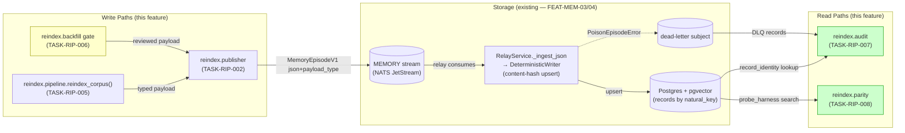
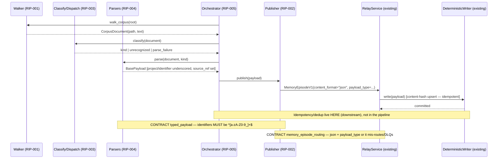
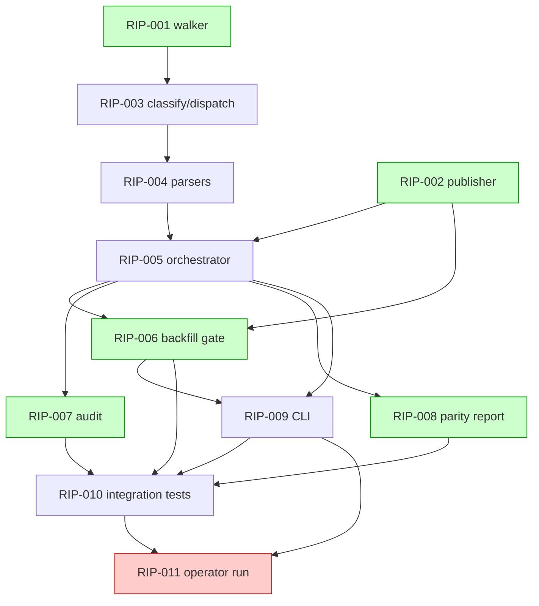

/feature-plan "Re-index Pipeline" --context features/re-index-pipeline/re-index-pipeline_summary.md

I'll follow the /feature-plan orchestration flow. Let me start by reading the context file to understand the feature.

Read re-index-pipeline_summary.md
Let me examine the feature directory and related context before proceeding.

Bash
IN
echo "=== feature dir ===" && ls -la features/re-index-pipeline/ && echo "" && echo "=== guardkit features ===" && ls -la .guardkit/features/ && echo "" && echo "=== existing task backlog dirs ===" && ls tasks/backlog/ 2>/dev/null

OUT
=== feature dir ===
total 56
drwxr-xr-x  5 richardwoollcott  staff    160 Jun 13 19:53 .
drwxr-xr-x  9 richardwoollcott  staff    288 Jun 13 19:53 ..
-rw-r--r--  1 richardwoollcott  staff   2274 Jun 13 19:53 re-index-pipeline_assumptions.yaml
-rw-r--r--  1 richardwoollcott  staff   3220 Jun 13 19:53 re-index-pipeline_summary.md
-rw-r--r--  1 richardwoollcott  staff  17246 Jun 13 19:53 re-index-pipeline.feature

=== guardkit features ===
total 80
drwxr-xr-x   8 richardwoollcott  staff   256 Jun 13 19:06 .
drwxr-xr-x@ 11 richardwoollcott  staff   352 Jun 13 19:02 ..
-rw-r--r--@  1 richardwoollcott  staff  8578 Jun 12 23:11 FEAT-CA81.yaml
-rw-r--r--@  1 richardwoollcott  staff  3104 Jun 13 12:19 FEAT-MEM-02.yaml
-rw-r--r--@  1 richardwoollcott  staff  3796 Jun 13 13:27 FEAT-MEM-03.yaml
-rw-r--r--   1 richardwoollcott  staff  2960 Jun 13 16:10 FEAT-MEM-04.yaml
-rw-r--r--@  1 richardwoollcott  staff  4961 Jun 13 17:36 FEAT-MEM-05.yaml
-rw-r--r--@  1 richardwoollcott  staff  4212 Jun 13 19:16 FEAT-MEM-06.yaml

=== existing task backlog dirs ===
memory-mcp-server
relay-integration
retrieval-api
storage-substrate
TASK-MEM-001-scaffold-project-layout.md
TASK-MEM-002-settings-class-env-profiles.md
TASK-MEM-008-nas-deploy-operator-execution.md
TASK-MEM-013-assumption-verification-record.md
TASK-REV-RA05-plan-retrieval-api.md
TASK-REV-RLY04-plan-relay-integration.md
TASK-RLY-007-verify-dlq-contract.md
Read re-index-pipeline.feature
Read re-index-pipeline_assumptions.yaml
I now have a thorough understanding of the feature spec. This is FEAT-MEM-07 — a deterministic re-index pipeline that walks guardkit's markdown corpus, parses documents into typed payloads, and publishes them through the live relay (FEAT-MEM-04) into the deterministic writer (FEAT-MEM-03), plus a reviewed backfill staging gate.

Following the /feature-plan flow, let me start with Context A: Review Scope Clarification.

AskUserQuestion
OUT
Your questions have been answered: "What should the planning review focus on for the Re-index Pipeline?"="All aspects", "What should the implementation optimize for?"="Quality/reliability". You can now continue with these answers in mind.
Context A captured: focus = all aspects, trade-off = quality/reliability.

Now Step 2.5: Graphiti pre-planning context + grounding the review in the existing codebase. Let me check Graphiti availability and explore the source structure in parallel.

Bash
IN
echo "=== src tree ===" && find src -type f -name "*.py" | head -60 && echo "" && echo "=== graphiti.yaml ===" && cat .guardkit/graphiti.yaml 2>/dev/null | head -20

OUT
=== src tree ===
src/fleet_memory/store.py
src/fleet_memory/embed.py
src/fleet_memory/__init__.py
src/fleet_memory/settings.py
src/fleet_memory/app.py
src/fleet_memory/errors.py
src/fleet_memory/payloads/models.py
src/fleet_memory/payloads/registry.py
src/fleet_memory/payloads/__init__.py
src/fleet_memory/payloads/base.py
src/fleet_memory/writer/supersession.py
src/fleet_memory/writer/__init__.py
src/fleet_memory/writer/core.py
src/fleet_memory/writer/identity.py
src/fleet_memory/retrieval/__init__.py
src/fleet_memory/retrieval/core.py
src/fleet_memory/retrieval/assembly.py
src/fleet_memory/retrieval/composition.py
src/fleet_memory/retrieval/search_request.py
src/fleet_memory/retrieval/probe_harness.py
src/fleet_memory/relay/service.py
src/fleet_memory/relay/handler.py
src/fleet_memory/relay/chunker.py
src/fleet_memory/relay/__init__.py
src/fleet_memory/relay/chunk_writer.py
src/fleet_memory/relay/schema.py

=== graphiti.yaml ===
project_id: fleet_memory
enabled: true
graph_store: falkordb
falkordb_host: whitestocks
falkordb_port: 6379
timeout: 30.0
max_concurrent_episodes: 3
chunk_extraction_concurrency: 4
llm_provider: vllm
llm_base_url: http://promaxgb10-41b1:9000/v1
llm_model: qwen-graphiti
llm_max_tokens: 4096
embedding_provider: vllm
embedding_base_url: http://promaxgb10-41b1:9000/v1
embedding_model: nomic-embed
group_ids:
- product_knowledge
- command_workflows
- architecture_decisions
Graphiti MCP not loaded; graphiti.yaml shows enabled: true → CLI fallback. Let me attempt the Graphiti context query (non-blocking) and read the key existing source files that this pipeline must integrate with.

Bash
IN
timeout 25 /Users/richardwoollcott/.agentecflow/bin/graphiti-check --status --task-context --quiet --description "Re-index Pipeline FEAT-MEM-07 deterministic markdown corpus parsers publish typed payloads through relay backfill staging review gate" --phase plan 2>&1 | head -40 || echo "[graphiti-check exited non-zero or timed out — continuing without]"

OUT
{"available": true, "error": null, "context": null, "categories": 0, "tokens_used": 0, "tokens_budget": 0}
Read schema.py
Read service.py
Graphiti returned available: true but categories: 0 — no relevant items found, so I'll proceed without it. Let me check the payload registry/models (the typed payload types this pipeline must produce) and whether a publisher helper already exists.

Read registry.py
Read models.py
Bash
IN
echo "=== publisher / publish helpers ===" && grep -rln "publish" src/fleet_memory --include=*.py && echo "" && echo "=== any cli / scripts ===" && ls scripts/ 2>/dev/null; find src -name "cli*.py" -o -name "*pipeline*" 2>/dev/null; echo "" && echo "=== writer identity (natural key) ===" && sed -n '1,60p' src/fleet_memory/writer/identity.py

OUT
Exit code 1
=== publisher / publish helpers ===
(eval):1: no matches found: --include=*.py
Let me check the BasePayload (natural key / identifier fields), the publisher helper, and writer identity to fully understand the integration contract.

Read base.py
Bash
IN
cd /Users/richardwoollcott/Projects/appmilla_github/fleet-memory; echo "=== publish refs ==="; grep -rln "publish" src/fleet_memory --include="*.py"; echo ""; echo "=== test publisher helper ==="; grep -rln "publish" tests 2>/dev/null | head; echo ""; echo "=== writer identity head ==="; sed -n '1,70p' src/fleet_memory/writer/identity.py

OUT
=== publish refs ===
src/fleet_memory/relay/handler.py
src/fleet_memory/relay/schema.py

=== test publisher helper ===
tests/unit/relay/test_handler.py

=== writer identity head ===
"""Record identity and content-hash helpers.

Provides two pure, I/O-free derivations for deterministic record writes:

- record_identity: Stable UUIDv5 from natural key
- content_hash: Deterministic hash over semantic content (excludes version)

Both functions are pure with zero dependencies on settings, store, or LLM.
"""

from __future__ import annotations

import hashlib
import json
import uuid
from typing import TYPE_CHECKING

if TYPE_CHECKING:
    from fleet_memory.payloads.base import BasePayload

# Single application-wide namespace UUID for record identity generation (ASSUM-002)
# This constant ensures the same natural key always produces the same UUID
# across all processes and runs
FLEET_MEMORY_NAMESPACE = uuid.UUID("6ba7b810-9dad-11d1-80b4-00c04fd430c8")


def record_identity(natural_key: str) -> uuid.UUID:
    """Generate deterministic UUIDv5 from natural key.

    The same natural key always produces the same UUID across all processes
    and runs, using the single application-wide namespace constant.

    Args:
        natural_key: Three-segment colon-separated key (<type>:<project>:<id>)

    Returns:
        UUIDv5 derived from natural_key using FLEET_MEMORY_NAMESPACE

    Examples:
        >>> key = "adr:my_project:ADR_001"
        >>> uuid1 = record_identity(key)
        >>> uuid2 = record_identity(key)
        >>> uuid1 == uuid2  # Always true - deterministic
        True
        >>> uuid1.version == 5  # UUIDv5
        True
    """
    return uuid.uuid5(FLEET_MEMORY_NAMESPACE, natural_key)


def content_hash(payload: BasePayload) -> str:
    """Generate stable hash over payload's semantic content.

    Excludes version and any write-time metadata so an unchanged re-write
    hashes identically. Uses canonical JSON serialization (sorted keys) to
    ensure dict ordering never changes the hash.

    Args:
        payload: BasePayload instance with semantic content

    Returns:
        Hex-encoded SHA-256 hash of canonical semantic content

    Examples:
        >>> from fleet_memory.payloads.base import BasePayload
        >>> p1 = BasePayload(
        ...     project="test", identifier="id1", source_ref="src", version=1
        ... )
        >>> p2 = BasePayload(
        ...     project="test", identifier="id1", source_ref="src", version=2
I now have a complete picture of the integration boundary. Let me look at how publishing onto the stream works (the relay handler) and the FEAT-MEM-07 build plan to anchor the task breakdown.

Read handler.py
Bash
IN
cd /Users/richardwoollcott/Projects/appmilla_github/fleet-memory; echo "=== FEAT-MEM-07 in build plan ==="; grep -n -A40 "FEAT-MEM-07" docs/research/ideas/phase-core-build-plan.md 2>/dev/null | head -70

OUT
=== FEAT-MEM-07 in build plan ===
26:| guardkit | Publisher integration + read-path cutover | Coordinated rows inside FEAT-MEM-07/08 |
27-
28-## What already exists
29-
30-See scope doc table. Key for sequencing: the template gives Schemas/Handlers/Services layers with TestNatsBroker testing out of the box, so FEAT-MEM-04's consumer is a handler in an existing idiom, not new architecture; and nomic-embed is already always-on, so FEAT-MEM-01 has no serving-layer dependency beyond what's running today.
31-
32-## What Phase CORE adds
33-
34-Nine features. 01–03 are the spine (store, schemas, writer); 04–06 are the surfaces (relay, retrieval, MCP); 07–09 are population and cutover. 01→02→03 strictly sequential; 04 and 05 parallelizable after 03; 06 after 05; 07 after 03 (writer exists); 08 after 05+07; 09 last.
35-
36-## Feature Summary
37-
38-| Feature | Title | Status | GuardKit ID |
39-|---|---|---|---|
40-| FEAT-MEM-01 | Storage substrate (Postgres+pgvector, AsyncPostgresStore, embed fn) | **Landed** (NAS deploy pending op) | FEAT-CA81 |
41-| FEAT-MEM-02 | Typed payload registry | **Spec'd** | — (assigned at plan) |
42-| FEAT-MEM-03 | Deterministic writer | **Spec'd** | — (assigned at plan) |
43-| FEAT-MEM-04 | Relay integration (MEMORY consumer + chunk/embed path) | Not started | — |
44-| FEAT-MEM-05 | Retrieval API + context assembly | Not started | — |
45-| FEAT-MEM-06 | MCP server module | Not started | — |
46:| FEAT-MEM-07 | Re-index + Fable backfill | Not started | — |
47-| FEAT-MEM-08 | GuardKit read-path cutover | Not started | — |
48-| FEAT-MEM-09 | Cutover + decommission runbook | Not started | — |
49-
50-## Architectural Constraints (carried from scope — enforce in every spec)
51-
52-- DECISION-DF-001: Fable for authoring only; zero cloud in runtime paths.
53-- ADR-SP-007: store is an index; fixes go to source markdown + re-index.
54-- `MemoryEpisodeV1` frozen v1; engine mapping lives in this repo's services.
55-- Handler → Service unidirectional; TestNatsBroker; lifespan-managed pool; pydantic-settings.
56-- Underscores in all identifiers (`fleet_memory`, namespace tuples, Postgres objects).
57-- Two-layer idempotency: JetStream Msg-Id dedupe + natural-key upsert.
58-
59----
60-
61-## FEAT-MEM-01: Storage Substrate
62-
63-**Status:** Landed 2026-06-13 — `/feature-build FEAT-CA81` complete (all 13 tasks Coach-approved across 8 waves); merged to `main` via fast-forward @ `2a8ae61`; project scaffolding + coach config @ `0ca7feb`. Post-merge verification on `main`: **78 unit tests** (hermetic, NAS off) + **32 integration tests** (ephemeral Postgres 16 + pgvector, real nomic over Tailscale) green. 5/6 ACs met — NAS-deploy AC pending operator handoff **TASK-MEM-008** (deferred; `deploy/nas/deploy.sh` + `smoke.sh` ready, run from the Mac, then `/task-complete TASK-MEM-008`). One real bug fixed in-build: lifespan ignored `pg_connect_timeout_s` (psycopg-pool retried for its 30s default) — `async_store_context` now bounds context entry at `pg_connect_timeout_s + 5s` and raises a credential-free `TimeoutError`. The 3 low-confidence placeholders were verified and recorded by TASK-MEM-013 (`features/storage-substrate/storage-substrate_assumptions.yaml`, all `confidence: verified`). Prior: Plan'd 2026-06-12 (`/feature-plan`, review TASK-REV-CA81); all 34 scenarios `@task:`-tagged (R2), per-wave `pytest tests/unit` smoke gate (R3).
64-
65-Postgres 16 + pgvector (durable instance on the Synology NAS per RD-4), `langgraph` `AsyncPostgresStore` with index config `{dims: 768, embed: <nomic via llama-swap :9000>}`, lifespan wiring, pydantic-settings (`FLEET_MEMORY_PG_DSN`, `FLEET_MEMORY_EMBED_URL`, `FLEET_MEMORY_EMBED_MODEL`), store smoke tests (put/get/search round-trip with real embeddings, marker-gated integration tests).
66-
67-**Dev/test/prod topology (development is on the MacBook; state is on the NAS):**
68-
69-| Instance | Where | Used by | Notes |
70-|---|---|---|---|
71-| Ephemeral test Postgres | MacBook, `docker run pgvector/pgvector:pg16` (compose file `deploy/local/`) | ALL automated test gates — unit, integration, AutoBuild quality gates | **Hermetic: AutoBuild must never depend on the NAS.** Parallel worktrees each get a throwaway instance (random port via env); no shared state, no network coupling, no test-data pollution |
72-| Durable shared Postgres | Synology NAS, Container Manager project (compose + notes in `deploy/nas/`) | Re-index target (07), MCP server, relay consumer, soak | Volume on a backed-up shared folder; port 5432 exposed to LAN/Tailscale only; reachable from the Mac during dev as `FLEET_MEMORY_PG_DSN` pointing at the NAS |
73-
74-Embeddings always come from GB10 llama-swap `:9000` (Mac reaches it over Tailscale — the proven specialist-agent FEAT-RAG pattern); tests that don't need real vectors use a fake embed function so unit gates need no network at all.
75-
76-**Pre-flight (verify before spec):** NAS CPU arch supports the `pgvector/pgvector:pg16` image (x86_64 Synology Plus models are fine); confirm the Container Manager deployment pattern matches how FalkorDB is run today so there's one NAS-container convention, not two.
77-
78-### Spec & Plan Commands
79-
80-```
81-# DONE 2026-06-12 → features/storage-substrate/ (34 scenarios, 13 assumptions):
82-# /feature-spec "Storage substrate: LangGraph AsyncPostgresStore on Postgres 16 + pgvector with nomic-embed-text-v1.5 768-dim embed function via llama-swap :9000; dual deploy targets — deploy/local ephemeral compose for hermetic Mac test gates (random-port, throwaway, used by ALL automated tests incl. AutoBuild) and deploy/nas Synology Container Manager compose for the durable shared instance (backed-up volume, LAN/Tailscale-only 5432); lifespan-managed pool; pydantic-settings DSN/embed config with .env.example profiles for mac-dev-vs-nas; fake-embed unit tests + marker-gated integration tests against the ephemeral instance + one documented smoke against the NAS instance"
83-/feature-plan "Memory Storage Substrate" --context features/storage-substrate/storage-substrate_summary.md
84-```
85-
86-### Tasks (indicative — /feature-plan decides)
--
195:## FEAT-MEM-07: Re-index + Fable Backfill
196-
197-Two parts. (a) Re-index script: walk guardkit's authoritative markdown (seed modules, ADRs, review reports, completed-task outcomes), parse to typed payloads (deterministic parsers — front-matter and house formats are regular), publish via nats-core helper (exercising the full relay path). (b) Fable backfill: one-time, window-bound job where Fable 5 reads the genuinely unstructured legacy docs and authors typed payloads for human review before publishing — output is reviewed markdown/JSON in the repo, so the result is re-runnable forever without any frontier model.
198-
199-### Spec & Plan Commands
200-
201-```
202-/feature-spec "Re-index pipeline: deterministic markdown-to-typed-payload parsers for guardkit seed modules, ADRs, review reports and task outcomes, publishing via nats-core MemoryEpisodeV1 through the live relay; idempotent full-corpus runs; backfill staging area for Fable-authored payloads with human review gate before publish"
Let me read the rest of the FEAT-MEM-07 section for the acceptance criteria and indicative tasks.

Bash
IN
cd /Users/richardwoollcott/Projects/appmilla_github/fleet-memory; sed -n '203,280p' docs/research/ideas/phase-core-build-plan.md

OUT
/feature-plan FEAT-XXXX
```

### Acceptance Criteria

- [ ] Full guardkit re-index < 5 min, zero LLM calls, idempotent on second run
- [ ] Backfill payloads land in `backfill/staging/` and publish only after review flag
- [ ] Stream-vs-store audit script reports 100% accounted (ingested or DLQ'd)
- [ ] Probe-set parity report generated against this corpus (feeds criterion 1)

## FEAT-MEM-08: GuardKit Read-Path Cutover (cross-repo)

GuardKit's coach context builder, feature-plan context, and CLI retrieval point at fleet-memory's retrieval API (thin client or MCP). The GROI anti-criterion: reads must demonstrably fire in real pipeline runs. Coordinated guardkit tasks created on explicit instruction when 05+07 land.

### Acceptance Criteria

- [ ] One real `/feature-plan` and one AutoBuild run show fleet-memory retrieval in history files
- [ ] Graphiti client paths in guardkit behind a feature flag, default off

## FEAT-MEM-09: Cutover + Decommission Runbook

`docs/runbooks/RUNBOOK-graphiti-cutover.md` in house style (phased bash, PASS/FAIL gates, decision-gate table, rollback commands, explicit what-NOT-to-do): qwen-graphiti out of always-on preload; Gemini fallback blocks deleted from all `graphiti.yaml`s; Graphiti/FalkorDB frozen read-only for the soak; steady-state memory measured; findings doc §9.x entry in guardkit; archive decision after soak.

### Acceptance Criteria

- [ ] ~28GB steady-state reduction measured and recorded
- [ ] £0 cloud on memory path (config grep proves no Gemini fallback remains)
- [ ] Rollback path tested on paper: unfreeze Graphiti + flag flip restores old reads

---

## Build Sequence (Fable window: ~2026-06-12 → ~2026-06-21; half-days assumed around Evri)

| Day | Focus |
|---|---|
| 1 (Fri 12) | This pair; ~~`/feature-spec` + `/feature-plan` FEAT-MEM-01~~ ✅; relay P1 spec in nats-core (on instruction) |
| 2–3 (wknd) | ~~FEAT-MEM-01 build~~ ✅ (landed 06-13 @ `2a8ae61`; NAS deploy pending op) + FEAT-MEM-02 build; ~~Postgres live on NAS~~ (pending TASK-MEM-008); relay P2 stream definitions land |
| 4 (Mon 15) | FEAT-MEM-03 writer |
| 5 (Tue 16) | FEAT-MEM-04 relay consumer; first end-to-end publish→store |
| 6 (Wed 17) | FEAT-MEM-05 retrieval + probe harness; record Graphiti baseline answers before any freeze |
| 7 (Thu 18) | FEAT-MEM-06 MCP; FEAT-MEM-07 re-index parsers |
| 8 (Fri 19) | FEAT-MEM-07 full re-index + **Fable backfill day** (the window-critical task) |
| 9 (Sat 20) | FEAT-MEM-08 guardkit cutover; parity report; audit |
| 10 (Sun 21) | FEAT-MEM-09 cutover runbook executed; preload change; slack + findings |

**Cut lines if the window compresses:** FEAT-MEM-06 (MCP) and FEAT-MEM-08 can slip past the window — they don't need Fable. FEAT-MEM-07's backfill is the only deliverable that genuinely expires with the subscription; protect Day 8.

## Resolved Decisions

| # | Decision | Notes |
|---|---|---|
| RD-1 | Substrate = LangGraph `AsyncPostgresStore` (Postgres+pgvector) | Own the writer and retrieval, not the storage engine; native to the DeepAgents stack every agent is migrating to |
| RD-2 | Home = fleet-memory repo, `nats-asyncio-service` template | Fleet service, not NATS infra, not guardkit |
| RD-3 | **Supersedes relay D4:** relay consumer (drain worker) lives in fleet-memory | The writer it calls lives here; residency gating dropped — nothing on this write path needs a big model. nats-infrastructure keeps stream/consumer *definitions* only |
| RD-4 | Postgres container on Synology NAS alongside FalkorDB | State lives with the NAS backup regime; GB10 stays compute |
| RD-5 | Hard cut after Day-9 audit; Graphiti frozen read-only through soak as comparison baseline only | GROI showed the reads Graphiti would backstop were barely connected; dual-run is ceremony |
| RD-6 | Supersession is declared, never inferred | Field on the payload; replaces LLM temporal invalidation |
| RD-7 | No LLM extraction in Phase CORE; unstructured = chunk+embed | Raw episodes persist in MEMORY stream; enrichment stays a future batch option |
| RD-8 | Trace proxy demoted to optional; 7BFP/VLLW on hold; Hindsight evaluation closed; upstream PRs goodwill-only | All were instruments of a decision now made |

## Open Decisions

| # | Question | Recommendation | Resolve by |
|---|---|---|---|
| OD-1 | Chunking parameters for markdown path (size/overlap/heading awareness) | Start 1K tokens, 15% overlap, heading-aware; tune only on probe-set evidence | FEAT-MEM-04 spec |
| OD-2 | Probe-set composition (which 15+ queries, from whose history) | Draw from coach-context + feature-plan invocations in guardkit history files; freeze before FEAT-MEM-05 build | Day 6 |
| OD-3 | guardkit client mechanism for 08 (thin HTTP/lib client vs MCP) | Thin library client (import via git+ssh like nats-core); MCP stays a Desktop surface | FEAT-MEM-08 |
| OD-4 | Graphiti archive timing post-soak | 2-week soak then archive FalkorDB volume to NAS cold storage | FEAT-MEM-09 runbook |
| OD-5 | Runtime host for the relay consumer + MCP-adjacent services in production | GB10 container (compute box: beside NATS and llama-swap, localhost embeddings, LAN to NAS Postgres) — NAS stays storage-only, Mac stays a dev surface that can sleep | FEAT-MEM-04 spec |

## Risks

| Risk | Mitigation |
|---|---|
| Retrieval parity fails on relationship-style queries (the one thing graph traversal did) | Probe set includes the worst cases deliberately; `related_keys` field on payloads gives cheap one-hop links without a graph engine; if still short, that's the recorded trigger for revisiting extraction — not a silent fudge |
| Fable window closes before Day 8 backfill | Backfill is staged + reviewable; worst case the unstructured legacy slice ships chunk-only (already the v1 contract) and typed backfill happens later with a local model |
| Evri load compresses implementation days | Pipeline does the building; cut lines defined (06, 08 can slip); spine (01–05, 07) protected |
| NAS Postgres performance under embed-heavy re-index | Embeddings computed GB10-side via llama-swap; Postgres only stores; if insert throughput disappoints, batch upserts (writer already batches) |
I now have complete grounding: the integration contract is clear (publish MemoryEpisodeV1 with content_format="json" + payload_type → RelayService._ingest_json → DeterministicWriter with content-hash upsert handling idempotency downstream), the 4 typed payload models exist in the registry, natural-key dedup is handled by the writer, and the FEAT-MEM-07 ACs are clear.

Let me create the review task artifact (Step 3 / /task-create), then present the analysis and decision checkpoint.

Write TASK-REV-RIP7-plan-re-index-pipeline.md
29 lines
---
id: TASK-REV-RIP7
title: "Plan: Re-index Pipeline"
task_type: review
priority: high
status: in_review
feature_ref: FEAT-MEM-07
context_files:
  - features/re-index-pipeline/re-index-pipeline_summary.md
  - features/re-index-pipeline/re-index-pipeline.feature
  - features/re-index-pipeline/re-index-pipeline_assumptions.yaml
clarification:
  context_a:
    decisions:
      focus: all
      tradeoff: quality
---

# Plan: Re-index Pipeline (FEAT-MEM-07, part a + b)

Decision-mode review for the deterministic re-index pipeline that walks
guardkit's authoritative markdown corpus, parses each document into a typed
payload, and publishes it as a `MemoryEpisodeV1` (`content_format="json"` +
explicit `payload_type`) through the live relay (FEAT-MEM-04) into the
deterministic writer (FEAT-MEM-03). Part (b) adds a reviewed backfill staging
gate for Fable-authored payloads.

See the analysis and decision options recorded by `/feature-plan`.
Review task created. Now the decision review analysis (Step 3 → Step 4):

🔍 FEATURE PLANNING: Re-index Pipeline (FEAT-MEM-07)
Review scope: all aspects · Optimizing for: quality/reliability
Graphiti context: available, 0 relevant items (proceeding without)

What's already built (the pipeline plugs into this — it does NOT reimplement it)
Existing component	What it gives this feature
relay/schema.py MemoryEpisodeV1	The envelope to publish: content_format, body, payload_type, source_ref
relay/service.py RelayService._ingest_json	Routes content_format=="json" + payload_type → DeterministicWriter (the routing contract — ASSUM-005)
payloads/registry.py + models.py	The 4 target types already exist: seed_module, adr, review_report, build_outcome
writer/identity.py + writer core	Idempotency, versioned upsert, natural-key dedup live here — content-hash upsert. The pipeline does NOT implement dedup.
relay/handler.py	ack-after-commit + DLQ on PoisonEpisodeError (audit's "ingested or DLQ'd")
Key architectural insight: every idempotency / dedup / "second run is a no-op" / "edit updates not duplicates" / concurrency-convergence scenario is satisfied downstream by the writer's content-hash upsert keyed on natural_key. The pipeline's own job is narrow: path-safe corpus walk → deterministic parse → faithful publish → honest run-report accounting → operator-gated backfill.

TECHNICAL OPTIONS ANALYSIS — the one real open design decision (ASSUM-003: review-gate mechanism)
Option 1: Sidecar review marker — <payload>.reviewed file (Recommended)

Operator approves a staged backfill payload by creating a sidecar marker file next to it. The gate reads the marker, held outside payload content.
Complexity: Low (4/10)
✅ Dead simple; git-trackable approval; a payload cannot mark itself reviewed (satisfies the "self-asserted review is still gated" security scenario by construction); per-payload granularity; mirrors the repo's "data, not instructions" stance.
⚠️ Two artifacts per staged payload.
Option 2: Central manifest — backfill/staging/manifest.yaml of approved keys

⚠️ Merge-conflict hotspot; payload-file ↔ manifest drift; more sync code. ✅ single audit surface.
Option 3: Directory-move gate — staging/ → reviewed/

⚠️ An accidental mv = publish; loses provenance; approval invisible in git diffs (shows as rename). ✅ physically unambiguous.
RECOMMENDED: Option 1 (sidecar marker). Best fit for the operator-controlled, outside-content, self-assert-proof gate the security scenarios demand, at the lowest complexity.

Scope recommendation (4 ACs)
In scope: AC-1 (re-index < 5 min, zero-LLM, idempotent), AC-2 (backfill gate), AC-3 (stream-vs-store audit → dedicated task).
Adjacent / defer: AC-4 (probe-set parity report) overlaps the existing retrieval/probe_harness.py (FEAT-MEM-05) — recommend a separate follow-up task, not folded into this pipeline.
⚠️ One AC needs operator verification (not AutoBuild-satisfiable)
The "full guardkit corpus re-index < 5 min, zero LLM, idempotent on second run" AC requires the live relay + NAS Postgres + real embeddings + the actual corpus + wall-clock timing. AutoBuild's Player↔Coach loop cannot satisfy a live-infra + wall-clock predicate by construction. I'll mark that verification task operator_handoff (all the logic it verifies is unit/integration-tested against ephemeral Postgres in the test task).

Proposed breakdown — 10 tasks, quality-first
#	Task	type	cx	deps
001	Reindex package + path-safe corpus walker	feature	4	—
002	Episode publisher helper (MemoryEpisodeV1 json+payload_type → MEMORY stream)	feature	5	—
003	Front-matter reader + document-kind classifier + parser dispatch	feature	5	001
004	Deterministic typed parsers (seed_module/adr/review_report/build_outcome)	feature	6	003
005	Re-index orchestrator + run-report accounting (no-abort, empty-corpus)	feature	6	002,004
006	Backfill staging + sidecar review-gate	feature	5	002,005
007	Stream-vs-store audit script (100% accounted)	feature	5	005
008	CLI entrypoint (wire settings, surface failures loudly)	feature	4	005,006
009	Integration tests: idempotency / edit-update / concurrency / mid-run outage / injection inertness	testing	6	006,007,008
010	Operator run: full-corpus re-index verification (< 5 min, zero-LLM, idempotent, audit 100%)	operator_handoff	3	008,009
Waves: [001,002] → [003] → [004] → [005] → [006,007] → [008] → [009] → [010]

Now the decision checkpoint:

AskUserQuestion
OUT
Your questions have been answered: "Decision checkpoint for the Re-index Pipeline plan — how do you want to proceed?"="Implement". You can now continue with these answers in mind.
Implement selected. Now Context B: Implementation Preferences. A couple of choices shape the generated tasks:

AskUserQuestion
OUT
Your questions have been answered: "Testing depth for the generated implementation tasks?"="Standard + integration", "TASK-RIP-010 verifies '<5 min, zero-LLM, idempotent' against the LIVE relay + NAS Postgres + real corpus — a wall-clock/live-infra predicate AutoBuild's Player↔Coach loop cannot satisfy. Mark it operator_handoff (skip autobuild, you run it post-merge)?"="Yes, operator_handoff", "Probe-set parity report (AC-4) overlaps the existing FEAT-MEM-05 probe_harness. Include it in this feature?"="Include now". You can now continue with these answers in mind.
Context B captured: Standard + integration testing, TASK-RIP-011 = operator_handoff, include parity report (AC-4). That makes 11 tasks.

Let me check the house format of an existing task file and the generate-feature-yaml options before generating.

Bash
IN
cd /Users/richardwoollcott/Projects/appmilla_github/fleet-memory; echo "=== generate-feature-yaml help ==="; python3 ~/.agentecflow/bin/generate-feature-yaml --help 2>&1 | head -40; echo ""; echo "=== existing FEAT-MEM-06 yaml head ==="; sed -n '1,30p' .guardkit/features/FEAT-MEM-06.yaml

OUT
=== generate-feature-yaml help ===
/Library/Frameworks/Python.framework/Versions/3.14/lib/python3.14/site-packages/langchain_core/_api/deprecation.py:25: UserWarning: Core Pydantic V1 functionality isn't compatible with Python 3.14 or greater.
  from pydantic.v1.fields import FieldInfo as FieldInfoV1
usage: generate-feature-yaml [-h] [--name NAME] [--description DESCRIPTION]
                             [--task TASKS] [--tasks-json TASKS_JSON]
                             [--base-path BASE_PATH] [--feature-id FEATURE_ID]
                             [--output OUTPUT] [--json] [--quiet]
                             [--feature-slug FEATURE_SLUG]
                             [--task-base-path TASK_BASE_PATH] [--strict]
                             [--lenient] [--discover]
                             [--auto-serialise-overlap]
                             [--validate-smoke-gates]

Generate structured YAML feature files for AutoBuild

options:
  -h, --help            show this help message and exit
  --name, -n NAME       Feature name (required for generation; ignored by
                        --validate-smoke-gates)
  --description, -d DESCRIPTION
                        Feature description
  --task, -t TASKS      Task in format ID:NAME:COMPLEXITY:DEPS (can be
                        repeated)
  --tasks-json TASKS_JSON
                        JSON file or string containing tasks array
  --base-path, -p BASE_PATH
                        Base path for project (default: current directory)
  --feature-id FEATURE_ID
                        Override auto-generated feature ID
  --output, -o OUTPUT   Override output path (default:
                        .guardkit/features/FEAT-XXX.yaml)
  --json                Output JSON format instead of YAML
  --quiet, -q           Suppress progress output
  --feature-slug FEATURE_SLUG
                        Feature slug for deriving task file paths (e.g.,
                        'dark-mode', 'oauth2')
  --task-base-path TASK_BASE_PATH
                        Base path for task files (default: tasks/backlog)
  --strict              Make path validation errors fatal (default: True). Use
                        --lenient to override.
  --lenient             Make path validation errors non-fatal (overrides

=== existing FEAT-MEM-06 yaml head ===
id: FEAT-MEM-06
name: Memory MCP Server
description: 'FEAT-MEM-06 FastMCP server over stdio: memory_search, memory_write_payload,
  memory_supersede tools plus a memory://projects resource, layered over the FEAT-MEM-05
  retrieval API and the FEAT-MEM-03 deterministic writer. Single write path (byte-identical
  to relay writes); failures surfaced as structured tool-error results (graceful degradation,
  no crash).'
created: '2026-06-13T19:06:07.479915'
status: in_progress
complexity: 6
estimated_tasks: 7
tasks:
- id: TASK-MCP-001
  name: Scaffold FastMCP server add fastmcp dep wire lifespan
  file_path: tasks/backlog/memory-mcp-server/TASK-MCP-001-scaffold-fastmcp-server.md
  complexity: 5
  dependencies: []
  status: completed
  implementation_mode: task-work
  estimated_minutes: 75
  requires_infrastructure: []
  result:
    total_turns: 1
    final_decision: approved
    error: null
    deferred_reason: null
  turns_completed: 1
  current_turn: 0
  started_at: '2026-06-13T19:16:03.750801'
  completed_at: '2026-06-13T19:55:02.856068'
--feature-id lets me pin FEAT-MEM-07 to match repo convention. Let me check the house task-file format.

Bash
IN
cd /Users/richardwoollcott/Projects/appmilla_github/fleet-memory; f=$(ls tasks/backlog/memory-mcp-server/TASK-MCP-001*.md 2>/dev/null | head -1); echo "=== $f ==="; cat "$f"

OUT
=== tasks/backlog/memory-mcp-server/TASK-MCP-001-scaffold-fastmcp-server.md ===
---
id: TASK-MCP-001
title: Scaffold FastMCP server, add fastmcp dependency, wire lifespan
status: in_review
created: 2026-06-13 16:30:00+00:00
updated: 2026-06-13 16:30:00+00:00
priority: high
task_type: scaffolding
parent_review: TASK-REV-MEM06
feature_id: FEAT-MEM-06
wave: 1
implementation_mode: task-work
complexity: 5
estimated_minutes: 60
dependencies: []
tags:
- mcp
- fastmcp
- stdio
- scaffolding
- lifespan
test_results:
  status: pending
  coverage: null
  last_run: null
autobuild_state:
  current_turn: 1
  max_turns: 5
  worktree_path: /Users/richardwoollcott/Projects/appmilla_github/fleet-memory/.guardkit/worktrees/FEAT-MEM-06
  base_branch: main
  started_at: '2026-06-13T19:16:03.759371'
  last_updated: '2026-06-13T19:55:02.852692'
  turns:
  - turn: 1
    decision: approve
    feedback: null
    timestamp: '2026-06-13T19:16:03.759371'
    player_summary: 'Implementation via task-work delegation. Files planned: 0, Files
      actual: 0'
    player_success: true
    coach_success: true
---

# Task: Scaffold FastMCP server, add fastmcp dependency, wire lifespan

## Description

Establish the `fleet_memory.mcp` package: a FastMCP server served over **stdio**
for Claude Desktop, plus the dependency wiring that the three tools and the
project resource will hang off. This task owns the server skeleton, the shared
`ServerContext`, the lifespan that builds the store / `DeterministicWriter` /
retrieval `search` callable, and the `python -m fleet_memory.mcp` stdio entry
point. No tools are registered here (Wave 3 adds them) — the server must build,
advertise an empty/partial tool set, and **start even when the store is
unreachable** (degradation is reported only when a tool is actually called).

Add `fastmcp` to `pyproject.toml` core dependencies (it is not currently a
dependency). Pin a version consistent with the `fastmcp-python` template
reference adopted for this repo.

## Acceptance Criteria

- [ ] `fastmcp` is added to `[project].dependencies` in `pyproject.toml` with a pinned lower bound; `python -c "import fastmcp"` exits 0
- [ ] `src/fleet_memory/mcp/__init__.py`, `src/fleet_memory/mcp/server.py`, and `src/fleet_memory/mcp/__main__.py` exist
- [ ] `server.py` exposes `ServerContext` (carrying `store`, `writer`, `settings`) and `create_mcp_server(context: ServerContext) -> FastMCP`
- [ ] `server.py` exposes a `register_all(mcp, context)` extension point that is a no-op when no tool modules are present (Wave-3 tasks each add one import + call here)
- [ ] `__main__.py` builds the server from settings and runs it over **stdio** transport (`mcp.run(transport="stdio")` or equivalent); `python -m fleet_memory.mcp --help` (or a dry-run flag) exits 0 without opening a network port
- [ ] The lifespan/startup path constructs `ServerContext` **lazily** so the server process starts and advertises tools even when Postgres is unreachable at launch (no eager connection on import or startup)
- [ ] `tests/unit/test_mcp_server.py::test_server_builds_without_store` passes (build the server with a fake/None store; assert it constructs and lists its advertised tool set)
- [ ] All modified files pass project-configured lint/format checks with zero errors

## Test Requirements

- [ ] `tests/unit/test_mcp_server.py::test_server_builds_without_store` — `create_mcp_server` returns a FastMCP instance with no store connection attempted
- [ ] `tests/unit/test_mcp_server.py::test_stdio_entrypoint_importable` — `python -c "import fleet_memory.mcp.__main__"` exits 0
- [ ] Default `pytest tests/ -q` run stays green (no integration-marked tests added here)

## BDD Scenarios Covered

- "The server communicates over stdio for a Claude Desktop client"
- "The server exposes the memory tools that replace the Graphiti MCP"
- "The server starts even when the store is unreachable at launch"

## Implementation Notes

- Reuse the existing app-wiring helpers in [app.py](src/fleet_memory/app.py) for
  building the store + `DeterministicWriter` (see the FEAT-MEM-04 lifespan fix in
  commit 6390d1e); do not duplicate connection logic.
- `ServerContext` should hold an already-built `DeterministicWriter`
  ([writer/core.py](src/fleet_memory/writer/core.py)) and the `AsyncPostgresStore`.
- Keep startup lazy: build the store inside the lifespan / first-use, not at module
  import — this is what satisfies "starts even when the store is unreachable".
- stdio only — no HTTP/SSE surface (ASSUM-007, out of scope per OD-3).
- Registration extension point: keep `register_all` a thin dispatcher so Wave-3
  tool tasks each contribute one line; the integrator resolves the small merge in
  TASK-MCP-007 if Conductor workspaces run in parallel.
I have the house format and --feature-id to pin FEAT-MEM-07. Now generating the feature structure. Let me write the task files (Steps 9). Batch 1 — the foundation tasks:

Write TASK-RIP-001-corpus-walker.md
69 lines
---
id: TASK-RIP-001
title: Reindex package + path-safe corpus walker
status: backlog
created: 2026-06-13 20:30:00+00:00
updated: 2026-06-13 20:30:00+00:00
priority: high
task_type: feature
parent_review: TASK-REV-RIP7
feature_id: FEAT-MEM-07
wave: 1
implementation_mode: task-work
complexity: 4
estimated_minutes: 45
dependencies: []
tags:
- reindex
- corpus
- security
- path-traversal
test_results:
  status: pending
  coverage: null
  last_run: null
---

# Task: Reindex package + path-safe corpus walker

## Description

Establish the `fleet_memory.reindex` package and a **path-traversal-safe** corpus
walker that yields candidate documents (resolved path + raw text) rooted at a
configured corpus root. The walker is the foundation every later task builds on;
its one hard security property is that it **never reads outside the corpus root**,
even when an entry name contains `..` segments or a symlink that escapes the root.

Add a `corpus_root` setting (`FLEET_MEMORY_CORPUS_ROOT`) to the existing
pydantic-settings `Settings` class.

## Acceptance Criteria

- [ ] `src/fleet_memory/reindex/__init__.py` and `src/fleet_memory/reindex/walker.py` exist
- [ ] `walk_corpus(root: Path) -> Iterator[CorpusDocument]` yields each markdown document under `root` with its resolved path and raw text
- [ ] Every yielded path, after `Path.resolve()`, is contained within the resolved corpus root; entries containing path-traversal segments or symlink escapes are skipped and never read (a crafted path-traversal name cannot cause a read outside the root)
- [ ] A run over an empty corpus root yields zero documents and does not raise
- [ ] `corpus_root` (`FLEET_MEMORY_CORPUS_ROOT`) is added to `Settings` ([settings.py](src/fleet_memory/settings.py)) with the `FLEET_MEMORY_` prefix convention
- [ ] `tests/unit/reindex/test_walker.py` covers: a path-traversal entry is not read; an empty directory yields nothing
- [ ] All modified files pass project-configured lint/format checks with zero errors

## Test Requirements

- [ ] `test_walker.py::test_path_traversal_entry_not_read` — an entry whose name contains `../` cannot cause a read outside the resolved root
- [ ] `test_walker.py::test_empty_corpus_yields_nothing`
- [ ] Default `pytest tests/ -q` stays green

## BDD Scenarios Covered

- "A path-traversal filename in the corpus cannot make the pipeline read outside the corpus root"
- "A run over an empty corpus publishes nothing and completes cleanly" (walker contribution)

## Implementation Notes

- Resolve both the root and each candidate path and assert `candidate.resolve()`
  is relative to `root.resolve()` (`Path.is_relative_to`) before reading — this is
  the single line that enforces the containment invariant.
- Keep the walker pure I/O: yield a small `CorpusDocument` dataclass/Pydantic value
  (path, text); no parsing or classification here (that is TASK-RIP-003).
- Mirror the `FLEET_MEMORY_` settings idiom already used for embed/PG config.
Write TASK-RIP-002-episode-publisher.md
75 lines
---
id: TASK-RIP-002
title: Episode publisher helper (MemoryEpisodeV1 json + payload_type)
status: backlog
created: 2026-06-13 20:30:00+00:00
updated: 2026-06-13 20:30:00+00:00
priority: high
task_type: feature
parent_review: TASK-REV-RIP7
feature_id: FEAT-MEM-07
wave: 1
implementation_mode: task-work
complexity: 5
estimated_minutes: 60
dependencies: []
tags:
- reindex
- relay
- publisher
- integration-contract
test_results:
  status: pending
  coverage: null
  last_run: null
---

# Task: Episode publisher helper (MemoryEpisodeV1 json + payload_type)

## Description

A thin publisher that turns a constructed `BasePayload` into a `MemoryEpisodeV1`
with `content_format="json"` and an explicit `payload_type`, serializes the
payload to the JSON `body`, sets `source_ref`, and publishes it onto the MEMORY
stream via the nats-core broker/publisher helper. **This is the single write
path.** It contains no business logic and no dedup — idempotency, versioned
upsert, and natural-key dedup are enforced downstream by the
`DeterministicWriter`'s content-hash upsert. It must make **no LLM / cloud /
frontier-model call** (DECISION-DF-001).

This task is the **producer** of the §4 Integration Contract `memory_episode_routing`.

## Acceptance Criteria

- [ ] `src/fleet_memory/reindex/publisher.py` exposes a publisher that accepts a `BasePayload` and publishes a `MemoryEpisodeV1` onto the MEMORY stream
- [ ] The published episode has `content_format == "json"` and `payload_type == payload.payload_type`, so `RelayService._ingest_json` routes it to the `DeterministicWriter` rather than the prose chunker ([relay/service.py](src/fleet_memory/relay/service.py))
- [ ] `body` is the payload's canonical JSON serialization and round-trips: `get_model_for_type(episode.payload_type)(**json.loads(episode.body))` reconstructs an equal payload
- [ ] `source_ref` carries the source document reference; `episode_id` is derived deterministically from the payload `natural_key` (so a re-publish of the same parsed document is idempotent at the JetStream Msg-Id layer as well as downstream)
- [ ] No language-model, cloud, or frontier-model request is made by the publisher (asserted by test — e.g. no network egress / no LLM client constructed)
- [ ] `tests/unit/reindex/test_publisher.py` asserts content_format, payload_type, body round-trip, and deterministic episode_id
- [ ] All modified files pass project-configured lint/format checks with zero errors

## Test Requirements

- [ ] `test_publisher.py::test_episode_is_json_with_payload_type`
- [ ] `test_publisher.py::test_body_round_trips_through_registry`
- [ ] `test_publisher.py::test_episode_id_deterministic_for_natural_key`
- [ ] Use a fake/in-memory broker (TestNatsBroker idiom) — no live NATS in unit tests

## BDD Scenarios Covered

- "Published episodes are structured so the relay routes them to the deterministic writer"
- "Publishing the same parsed document twice yields a single stored record" (publish-layer contribution)
- "The re-index pipeline invokes no cloud or frontier model" (publish side)

## Implementation Notes

- The routing contract is the whole point: `content_format` must be the literal
  string `"json"` and `payload_type` must be a key in
  [payloads/registry.py](src/fleet_memory/payloads/registry.py). Any other
  content_format sends the episode down the prose chunker — a silent wrong-path bug.
- Reuse the existing broker/publisher wiring from [app.py](src/fleet_memory/app.py);
  do not create a second broker.
- Serialize with `payload.model_dump(mode="json")` and dump with sorted keys to
  keep the body stable across runs.
Write TASK-RIP-003-classify-dispatch.md
67 lines
---
id: TASK-RIP-003
title: Front-matter reader + document-kind classifier + parser dispatch
status: backlog
created: 2026-06-13 20:30:00+00:00
updated: 2026-06-13 20:30:00+00:00
priority: high
task_type: feature
parent_review: TASK-REV-RIP7
feature_id: FEAT-MEM-07
wave: 2
implementation_mode: task-work
complexity: 5
estimated_minutes: 60
dependencies:
- TASK-RIP-001
tags:
- reindex
- parsing
- classification
- accounting
test_results:
  status: pending
  coverage: null
  last_run: null
---

# Task: Front-matter reader + document-kind classifier + parser dispatch

## Description

Read YAML front-matter from a corpus document and classify its document kind —
seed module / ADR / review report / completed-task outcome — **deterministically**
from path conventions plus front-matter fields, then dispatch to the right parser.
Unrecognized kinds and malformed front-matter are **reported with a reason, never
guessed at and never silently dropped** (ASSUM-004, the no-silent-loss invariant).

## Acceptance Criteria

- [ ] `src/fleet_memory/reindex/classify.py` reads front-matter and returns a document kind or an explicit `unrecognized` outcome
- [ ] Classification is deterministic (no LLM): derived from path/house-format conventions and front-matter fields only
- [ ] A document whose front-matter cannot be parsed yields a structured parse-failure result carrying a human-readable reason (it does not raise an exception that aborts the run)
- [ ] A document matching none of the four known kinds yields an `unrecognized` result with a reason
- [ ] A dispatch table maps each known kind to its parser callable (the parsers themselves land in TASK-RIP-004)
- [ ] `tests/unit/reindex/test_classify.py` covers malformed front-matter and unrecognized-kind paths
- [ ] All modified files pass project-configured lint/format checks with zero errors

## Test Requirements

- [ ] `test_classify.py::test_malformed_frontmatter_reports_reason`
- [ ] `test_classify.py::test_unrecognized_kind_reported`
- [ ] `test_classify.py::test_each_known_kind_dispatches_to_a_parser`

## BDD Scenarios Covered

- "A document with malformed front-matter is reported and skipped"
- "A document matching no known parser is recorded as unrecognized"

## Implementation Notes

- Keep a single `ParseResult` shape (a tagged union: `parsed` | `parse_failure` |
  `unrecognized`, each carrying the source ref and, on failure, a reason) so the
  orchestrator (TASK-RIP-005) can account for every document uniformly.
- Front-matter parsing should tolerate a missing front-matter block as "unrecognized"
  rather than crashing.
- Do not publish or construct payloads here — this task only classifies and routes.
Write TASK-RIP-004-typed-parsers.md
90 lines
---
id: TASK-RIP-004
title: Deterministic typed parsers (seed_module / adr / review_report / build_outcome)
status: backlog
created: 2026-06-13 20:30:00+00:00
updated: 2026-06-13 20:30:00+00:00
priority: high
task_type: feature
parent_review: TASK-REV-RIP7
feature_id: FEAT-MEM-07
wave: 3
implementation_mode: task-work
complexity: 6
estimated_minutes: 90
dependencies:
- TASK-RIP-003
tags:
- reindex
- parsing
- payloads
- integration-contract
test_results:
  status: pending
  coverage: null
  last_run: null
---

# Task: Deterministic typed parsers

## Description

One deterministic parser per document kind, producing the canonical typed payload:

| Document kind | Payload | Required type-specific fields |
|---|---|---|
| seed module | `SeedModulePayload` | `module_path` |
| ADR | `ADRPayload` | `decision`, `status` |
| review report | `ReviewReportPayload` | `verdict` |
| completed-task outcome | `BuildOutcomePayload` | `status`, `duration_seconds` |

Each parser derives the natural-key segments (`project`, `identifier`) and the
required `source_ref` from the document, **normalizing guardkit IDs (hyphens and
colons → underscores) to satisfy `IDENTIFIER_PATTERN` (`^[a-zA-Z0-9_]+$`)** —
e.g. `ADR-SP-007` → `ADR_SP_007`, `FEAT-MEM-07` → `FEAT_MEM_07`. A document
missing a field its payload type requires yields a structured **unparseable**
result with a reason — not a published payload. Parsing makes **no LLM call**.

This task is the **producer** of the §4 Integration Contract `typed_payload`.

## Acceptance Criteria

- [ ] seed module → `seed_module` payload (`module_path`); ADR → `adr` payload carrying `decision` + `status`; review report → `review_report` payload carrying `verdict`; completed-task outcome → `build_outcome` payload (`status`, `duration_seconds`)
- [ ] Each parser sets `project` and `identifier` matching `^[a-zA-Z0-9_]+$` (hyphens/colons in guardkit IDs normalized to underscores) and a required `source_ref` equal to the source path
- [ ] Each document kind maps to exactly one canonical `payload_type` (the Scenario Outline mapping)
- [ ] A document carrying exactly the required fields for its type parses into a payload (just-inside boundary)
- [ ] A document missing a required field (e.g. an ADR with no `status`) produces an unparseable result with a reason and **no** payload
- [ ] A document body containing database commands / prompt-injection text is carried **byte-for-byte** into the payload content, and no command in the content is executed during parsing
- [ ] Parsing performs no language-model call
- [ ] `tests/unit/reindex/test_parsers.py` covers each kind, the missing-required-field case, identifier normalization, and the injection round-trip
- [ ] All modified files pass project-configured lint/format checks with zero errors

## Test Requirements

- [ ] `test_parsers.py::test_<kind>_parses_to_canonical_payload` (one per kind)
- [ ] `test_parsers.py::test_missing_required_field_is_unparseable_with_reason`
- [ ] `test_parsers.py::test_hyphenated_guardkit_id_normalized_to_underscores`
- [ ] `test_parsers.py::test_injection_body_carried_verbatim`

## BDD Scenarios Covered

- "A seed module document is parsed into a seed-module payload and published"
- "An ADR document is parsed into an ADR payload carrying its decision and status"
- "A review report document is parsed into a review-report payload carrying its verdict"
- "A completed-task outcome document is parsed into a build-outcome payload"
- "Each corpus document kind maps to its canonical payload type" (Scenario Outline)
- "A document carrying exactly the required fields for its type is published"
- "A document missing a field its payload type requires is not published"
- "A document whose body contains injection-shaped text is published verbatim and stays inert" (parse side)

## Implementation Notes

- Construct the concrete payload models from
  [payloads/models.py](src/fleet_memory/payloads/models.py); let `BasePayload`'s
  `__init__` validation raise `IdentifierValidationError` on a bad identifier and
  convert that into an unparseable result rather than letting it escape.
- Treat content strictly as data — never `eval`/`exec`/template-render the body.
  The injection scenario is satisfied by doing nothing clever: store the bytes.
- `duration_seconds` for build outcomes must be an int; if absent/unparseable,
  that is a missing-required-field unparseable result, not a guess.
Now the orchestrator (005, §4 consumer with consumer_context + Seam Tests) and the backfill gate (006):

Write TASK-RIP-005-orchestrator-run-report.md
122 lines
---
id: TASK-RIP-005
title: Re-index orchestrator + run-report accounting
status: backlog
created: 2026-06-13 20:30:00+00:00
updated: 2026-06-13 20:30:00+00:00
priority: high
task_type: feature
parent_review: TASK-REV-RIP7
feature_id: FEAT-MEM-07
wave: 4
implementation_mode: task-work
complexity: 6
estimated_minutes: 90
dependencies:
- TASK-RIP-002
- TASK-RIP-004
tags:
- reindex
- orchestrator
- accounting
- integration-contract
consumer_context:
- task: TASK-RIP-004
  consumes: typed_payload
  framework: "fleet_memory typed payload registry (BasePayload subclasses)"
  driver: "pydantic v2"
  format_note: "project/identifier must match ^[a-zA-Z0-9_]+$ — guardkit hyphenated IDs normalized to underscores; source_ref required"
- task: TASK-RIP-002
  consumes: memory_episode_routing
  framework: "FastStream NatsBroker / RelayService.ingest content_format routing"
  driver: "nats-core MemoryEpisodeV1 publisher"
  format_note: "content_format must be 'json' and payload_type a registered type so the relay routes to the DeterministicWriter, not the prose chunker"
test_results:
  status: pending
  coverage: null
  last_run: null
---

# Task: Re-index orchestrator + run-report accounting

## Description

The pure orchestrator: walk the corpus → classify → parse → publish each
recognized document, producing a `RunReport` that **accounts for every walked
document** as published / unparseable / unrecognized. One bad document never
aborts the run. An empty corpus publishes nothing and completes cleanly. The
no-silent-loss invariant is the spine of this task: every document the walker
yields appears in the report under exactly one disposition.

This task is a **consumer** of the §4 contracts `typed_payload` (from TASK-RIP-004)
and `memory_episode_routing` (from TASK-RIP-002).

## Acceptance Criteria

- [ ] `src/fleet_memory/reindex/pipeline.py` exposes `reindex_corpus(...)` that walks, classifies, parses, and publishes, returning a `RunReport`
- [ ] Every recognized document is published as a typed episode declaring the `payload_type` matching its document kind
- [ ] The `RunReport` accounts for every walked document: a published count plus the unparseable list and the unrecognized list — no document is silently dropped
- [ ] A single unparseable document does not abort the run: every valid document is still published and the bad one is reported
- [ ] A run over an empty corpus publishes nothing and completes successfully
- [ ] A full-corpus run publishes a typed episode for every recognized document
- [ ] No language-model / cloud call occurs during the whole run
- [ ] `tests/unit/reindex/test_pipeline.py` (with a fake publisher) covers: full corpus, one-bad-doc-does-not-abort, empty corpus, accounting totals sum to documents walked
- [ ] All modified files pass project-configured lint/format checks with zero errors

## Test Requirements

- [ ] `test_pipeline.py::test_full_corpus_publishes_one_episode_per_recognized_doc`
- [ ] `test_pipeline.py::test_single_unparseable_doc_does_not_abort_run`
- [ ] `test_pipeline.py::test_empty_corpus_publishes_nothing`
- [ ] `test_pipeline.py::test_report_accounts_for_every_walked_document`

## BDD Scenarios Covered

- "A full-corpus run publishes a typed episode for every recognized document"
- "A single unparseable document does not abort the corpus run"
- "A run over an empty corpus publishes nothing and completes cleanly"
- "A full re-index run makes no language-model call"

## Seam Tests

The following seam test validates the integration contract with the producer task. Implement this test to verify the boundary before integration.

```python
"""Seam test: verify memory_episode_routing contract from TASK-RIP-002."""
import json

import pytest

from fleet_memory.payloads.registry import get_model_for_type


@pytest.mark.seam
@pytest.mark.integration_contract("memory_episode_routing")
def test_memory_episode_routing_format(published_episode):
    """Verify each published episode routes to the deterministic writer.

    Contract: content_format must be 'json' and payload_type a registered
    type so RelayService._ingest_json dispatches to the DeterministicWriter
    rather than the prose chunker.
    Producer: TASK-RIP-002
    """
    # Consumer side: verify format matches contract
    assert published_episode.content_format == "json", (
        f"Expected json routing, got: {published_episode.content_format}"
    )
    assert published_episode.payload_type, "payload_type must be set for json episodes"
    # payload_type must resolve through the registry (else relay DLQs as unknown type)
    model = get_model_for_type(published_episode.payload_type)
    rebuilt = model(**json.loads(published_episode.body))
    assert rebuilt.payload_type == published_episode.payload_type
```

## Implementation Notes

- Keep `reindex_corpus` pure with respect to transport: take the publisher
  (TASK-RIP-002) as a collaborator so unit tests inject a fake and assert on
  captured episodes — mirrors the handler/service separation idiom in the repo.
- The `RunReport` is the audit input for TASK-RIP-007; give it a stable shape
  (published natural_keys, unparseable[reason], unrecognized[reason]).
- Do not implement dedup/idempotency here — that is the writer's job downstream.
Write TASK-RIP-006-backfill-review-gate.md
107 lines
---
id: TASK-RIP-006
title: Backfill staging + sidecar operator review-gate
status: backlog
created: 2026-06-13 20:30:00+00:00
updated: 2026-06-13 20:30:00+00:00
priority: high
task_type: feature
parent_review: TASK-REV-RIP7
feature_id: FEAT-MEM-07
wave: 5
implementation_mode: task-work
complexity: 5
estimated_minutes: 75
dependencies:
- TASK-RIP-002
- TASK-RIP-005
tags:
- reindex
- backfill
- review-gate
- security
- integration-contract
consumer_context:
- task: TASK-RIP-002
  consumes: memory_episode_routing
  framework: "FastStream NatsBroker / RelayService.ingest content_format routing"
  driver: "nats-core MemoryEpisodeV1 publisher"
  format_note: "content_format must be 'json' and payload_type a registered type; reviewed backfill publishes through the SAME publisher — no second write path"
test_results:
  status: pending
  coverage: null
  last_run: null
---

# Task: Backfill staging + sidecar operator review-gate

## Description

Walk `backfill/staging/` for Fable-authored payloads and publish each **only when
an operator-controlled sidecar review marker exists for it** — a marker held
*outside* the payload content (ASSUM-003). Reviewed backfill reuses the same
publisher (TASK-RIP-002) and the same relay path as deterministic re-index:
**one write path, byte-identical** (DECISION-DF-001 keeps Fable strictly offline;
nothing on this publish path is frontier-authored at runtime). A payload that
asserts its own review status *in its content* is still gated — only the operator
marker counts.

The review gate is a **sidecar marker file** (e.g. `<payload>.reviewed`) next to
the staged payload — git-trackable, per-payload, and impossible for a payload to
self-grant.

This task is a **consumer** of the §4 contract `memory_episode_routing`.

## Acceptance Criteria

- [ ] A backfill staging dir setting (`FLEET_MEMORY_BACKFILL_DIR`, default `backfill/staging/`) is added to `Settings`
- [ ] A staged payload **with** an operator review marker present is published through the same relay path and stored as a typed record like any deterministically parsed payload
- [ ] A staged payload **without** a review marker is not published
- [ ] A staged payload whose own content claims it has been reviewed, but for which no operator marker exists, is **not** published (self-assertion cannot bypass the gate)
- [ ] Reviewed backfill publishes via the same publisher/relay path as deterministic re-index — no second write code path
- [ ] `tests/unit/reindex/test_backfill.py` covers: reviewed publishes, unreviewed gated, self-asserted-but-unmarked gated
- [ ] All modified files pass project-configured lint/format checks with zero errors

## Test Requirements

- [ ] `test_backfill.py::test_reviewed_payload_publishes`
- [ ] `test_backfill.py::test_unreviewed_payload_gated`
- [ ] `test_backfill.py::test_self_asserted_review_without_marker_gated`

## BDD Scenarios Covered

- "A reviewed backfill payload is published on the next run"
- "An unreviewed backfill payload is not published"
- "A backfill payload that claims to be reviewed within its own content is still gated"
- "Reviewed backfill payloads publish through the same relay path as deterministically parsed documents"

## Seam Tests

The following seam test validates the integration contract with the producer task. Implement this test to verify the boundary before integration.

```python
"""Seam test: verify memory_episode_routing contract from TASK-RIP-002 (backfill path)."""
import pytest


@pytest.mark.seam
@pytest.mark.integration_contract("memory_episode_routing")
def test_reviewed_backfill_uses_same_routing(published_backfill_episode):
    """Reviewed backfill publishes byte-identically to deterministic re-index.

    Contract: content_format == 'json' + payload_type set, via the SAME
    publisher (TASK-RIP-002) — no second write path.
    Producer: TASK-RIP-002
    """
    assert published_backfill_episode.content_format == "json"
    assert published_backfill_episode.payload_type, "payload_type must be set"
```

## Implementation Notes

- The marker check is the gate's whole security model: read the marker from the
  filesystem next to the payload, never from inside the payload body. This makes
  "a payload that claims it is reviewed" structurally unable to publish itself.
- Do not introduce a parallel publisher — import and call TASK-RIP-002's publisher
  so the "single write path" invariant holds by construction.
Now the audit (007), parity report (008), and CLI (009):

Write TASK-RIP-007-stream-store-audit.md
65 lines
---
id: TASK-RIP-007
title: Stream-vs-store audit script (100% accounted)
status: backlog
created: 2026-06-13 20:30:00+00:00
updated: 2026-06-13 20:30:00+00:00
priority: high
task_type: feature
parent_review: TASK-REV-RIP7
feature_id: FEAT-MEM-07
wave: 5
implementation_mode: task-work
complexity: 5
estimated_minutes: 75
dependencies:
- TASK-RIP-005
tags:
- reindex
- audit
- accounting
test_results:
  status: pending
  coverage: null
  last_run: null
---

# Task: Stream-vs-store audit script (100% accounted)

## Description

After a run, audit the published episodes against the store: **every published
episode must be either stored (writer committed) or recorded on the dead-letter
subject** — none unaccounted. This is FEAT-MEM-07 AC-3 and the "no episode is
unaccounted for" invariant. The audit consumes the `RunReport` from TASK-RIP-005
(the set of published natural keys) and reconciles it against stored records and
DLQ records.

## Acceptance Criteria

- [ ] `src/fleet_memory/reindex/audit.py` reconciles published episodes against stored records and dead-letter records
- [ ] Every published episode is classified as **stored** or **dead-lettered**
- [ ] Any episode that is neither stored nor dead-lettered is reported as a failure (non-zero audit exit / explicit unaccounted list)
- [ ] A clean full-corpus run reports 100% accounted
- [ ] `tests/unit/reindex/test_audit.py` (and/or an integration test) covers: a seeded store where all episodes are stored → 100%; one poison episode on DLQ → still accounted; a missing record → reported unaccounted
- [ ] All modified files pass project-configured lint/format checks with zero errors

## Test Requirements

- [ ] `test_audit.py::test_all_stored_reports_100_percent`
- [ ] `test_audit.py::test_dlq_episode_counts_as_accounted`
- [ ] `test_audit.py::test_missing_record_reported_unaccounted`

## BDD Scenarios Covered

- "After a run every published episode is accounted for as ingested or dead-lettered"

## Implementation Notes

- Source the "published" set from the `RunReport` natural keys (TASK-RIP-005);
  resolve store presence via `record_identity(natural_key)`
  ([writer/identity.py](src/fleet_memory/writer/identity.py)) against the store.
- DLQ membership comes from the relay's dead-letter subject (see
  [relay/handler.py](src/fleet_memory/relay/handler.py) `dlq_subject`).
- Keep the audit read-only — it observes, it never writes or republishes.
Write TASK-RIP-008-probe-parity-report.md
63 lines
---
id: TASK-RIP-008
title: Probe-set parity report generator
status: backlog
created: 2026-06-13 20:30:00+00:00
updated: 2026-06-13 20:30:00+00:00
priority: high
task_type: feature
parent_review: TASK-REV-RIP7
feature_id: FEAT-MEM-07
wave: 5
implementation_mode: task-work
complexity: 5
estimated_minutes: 75
dependencies:
- TASK-RIP-005
tags:
- reindex
- parity
- probe-set
- retrieval
test_results:
  status: pending
  coverage: null
  last_run: null
---

# Task: Probe-set parity report generator

## Description

Generate a probe-set parity report against the re-indexed corpus (FEAT-MEM-07
AC-4, which feeds AC-1's retrieval-quality criterion). Reuse the **existing**
`retrieval/probe_harness.py` from FEAT-MEM-05 to run the frozen probe set against
the re-indexed store and report per-probe hit/miss plus an aggregate parity
figure. This task builds the report generator; running it against the live
re-indexed corpus is part of the operator verification (TASK-RIP-011).

## Acceptance Criteria

- [ ] `src/fleet_memory/reindex/parity.py` runs the frozen probe set via the existing `retrieval/probe_harness.py` against the re-indexed store and emits a parity report
- [ ] The report records per-probe hit/miss and an aggregate parity figure
- [ ] Retrieval logic is **reused** from [retrieval/probe_harness.py](src/fleet_memory/retrieval/probe_harness.py) — no duplicate retrieval implementation
- [ ] `tests/unit/reindex/test_parity.py` runs against an ephemeral/fake store seeded with known records and known probes and asserts the report shape and parity calculation
- [ ] All modified files pass project-configured lint/format checks with zero errors

## Test Requirements

- [ ] `test_parity.py::test_parity_report_shape`
- [ ] `test_parity.py::test_aggregate_parity_calculation`

## BDD Scenarios Covered

- (No dedicated `.feature` scenario — AC-4 is reporting tooling that feeds AC-1.)

## Implementation Notes

- Do not re-implement search or ranking — import and drive the probe harness.
- The frozen probe set composition is owned by FEAT-MEM-05 (OD-2); read it from
  wherever the harness already expects it rather than redefining it here.
- Keep the report machine-readable (JSON) so the operator run (TASK-RIP-011) can
  attach it to the verification record.
Write TASK-RIP-009-cli-entrypoint.md
67 lines
---
id: TASK-RIP-009
title: Re-index CLI entrypoint (fail-loud, resumable)
status: backlog
created: 2026-06-13 20:30:00+00:00
updated: 2026-06-13 20:30:00+00:00
priority: high
task_type: feature
parent_review: TASK-REV-RIP7
feature_id: FEAT-MEM-07
wave: 6
implementation_mode: task-work
complexity: 4
estimated_minutes: 60
dependencies:
- TASK-RIP-005
- TASK-RIP-006
tags:
- reindex
- cli
- resilience
test_results:
  status: pending
  coverage: null
  last_run: null
---

# Task: Re-index CLI entrypoint (fail-loud, resumable)

## Description

`python -m fleet_memory.reindex` — the operator entry point. Wires settings
(corpus root, backfill dir), runs the orchestrator (TASK-RIP-005) and the backfill
gate (TASK-RIP-006), prints the `RunReport`, and **surfaces failures loudly**:
a relay/store outage mid-run reports failure with the affected documents named and
exits non-zero — never a silent partial run. Re-running after an interruption
publishes every document that did not reach the store; downstream idempotent
upsert guarantees no duplicates from the documents published before the
interruption.

## Acceptance Criteria

- [ ] `src/fleet_memory/reindex/__main__.py` runs a full re-index (deterministic corpus + reviewed backfill) from settings and prints the `RunReport`
- [ ] A relay/store outage mid-run causes the run to report failure with the affected documents **named** (no silent skip), and the process exits non-zero
- [ ] Re-running after a partial/interrupted run publishes every document that did not reach the store and produces no duplicate record (downstream upsert)
- [ ] `python -m fleet_memory.reindex --help` exits 0 and does not require a live connection
- [ ] `tests/unit/reindex/test_cli.py` covers failure-surfacing with a fake publisher that raises partway through
- [ ] All modified files pass project-configured lint/format checks with zero errors

## Test Requirements

- [ ] `test_cli.py::test_midrun_failure_names_affected_documents_and_exits_nonzero`
- [ ] `test_cli.py::test_help_exits_zero_without_connection`

## BDD Scenarios Covered

- "A relay or store outage mid-run fails loudly and loses no document"
- "A run interrupted partway through can be safely re-run to completion"

## Implementation Notes

- Resumability is *not* new state in the CLI — it falls out of the writer's
  natural-key upsert. The CLI's only resilience job is to fail loudly and name
  what didn't land, so a re-run is a safe no-op for what already stored.
- Build the store/broker via the existing [app.py](src/fleet_memory/app.py) wiring;
  honour `pg_connect_timeout_s` so an unreachable store fails fast rather than hanging.
Now the integration tests (010) and the operator_handoff verification run (011):

Write TASK-RIP-010-integration-tests.md
78 lines
---
id: TASK-RIP-010
title: Integration tests — idempotency, concurrency, resilience, injection
status: backlog
created: 2026-06-13 20:30:00+00:00
updated: 2026-06-13 20:30:00+00:00
priority: high
task_type: testing
parent_review: TASK-REV-RIP7
feature_id: FEAT-MEM-07
wave: 7
implementation_mode: task-work
complexity: 6
estimated_minutes: 90
dependencies:
- TASK-RIP-006
- TASK-RIP-007
- TASK-RIP-008
- TASK-RIP-009
tags:
- reindex
- integration
- idempotency
- concurrency
test_results:
  status: pending
  coverage: null
  last_run: null
---

# Task: Integration tests — idempotency, concurrency, resilience, injection

## Description

Marker-gated integration tests exercising the full publish → relay → writer →
store path against an **ephemeral Postgres + pgvector** instance (hermetic — no
NAS dependency, per the FEAT-MEM-01 test topology). These prove the
downstream-idempotency and resilience guarantees that unit tests with a fake
publisher cannot: the second run is a no-op, an edit re-indexes as an update,
concurrent runs converge, double-publish dedups, injection content round-trips
inert, and reviewed backfill stores like a parsed payload.

## Acceptance Criteria

- [ ] A second run over an unchanged corpus creates or modifies no stored record
- [ ] Re-indexing after editing a source document updates its record to the new content with no duplicate record
- [ ] Two re-index runs started at the same time converge to exactly one record per natural key (no duplicate from the overlapping runs)
- [ ] Publishing the same parsed document twice yields exactly one record for its natural key
- [ ] A document whose body contains injection-shaped text is stored byte-for-byte and no command executes during ingest
- [ ] A reviewed backfill payload is stored as a typed record like a deterministically parsed payload
- [ ] All tests are `@pytest.mark.integration` gated and run against an ephemeral pgvector instance (excluded from the default hermetic unit run)

## Test Requirements

- [ ] `tests/integration/reindex/test_idempotency.py::test_second_run_is_noop`
- [ ] `tests/integration/reindex/test_idempotency.py::test_edit_updates_not_duplicates`
- [ ] `tests/integration/reindex/test_concurrency.py::test_concurrent_runs_converge`
- [ ] `tests/integration/reindex/test_idempotency.py::test_double_publish_single_record`
- [ ] `tests/integration/reindex/test_security.py::test_injection_body_stored_verbatim`
- [ ] `tests/integration/reindex/test_backfill.py::test_reviewed_backfill_stored_as_typed_record`

## BDD Scenarios Covered

- "A second run over an unchanged corpus leaves the store unchanged"
- "Re-indexing after editing a source document updates its record rather than duplicating it"
- "Two re-index runs started at the same time converge to a single stored outcome"
- "Publishing the same parsed document twice yields a single stored record"
- "A document whose body contains injection-shaped text is published verbatim and stays inert" (store side)
- "Reviewed backfill payloads publish through the same relay path as deterministically parsed documents" (store side)

## Implementation Notes

- Use the `deploy/local/` ephemeral compose + random-port idiom from FEAT-MEM-01 so
  parallel worktrees never share state. Real embeddings via llama-swap `:9000` or a
  fake embed fn where vectors are not under test.
- The interrupted-run / outage scenario's *unit* coverage lives in TASK-RIP-009;
  here, assert the post-recovery store invariant (exactly one record per key).
Write TASK-RIP-011-operator-full-corpus-run.md
79 lines
---
id: TASK-RIP-011
title: "Operator run: full guardkit corpus re-index verification"
status: backlog
created: 2026-06-13 20:30:00+00:00
updated: 2026-06-13 20:30:00+00:00
priority: high
task_type: operator_handoff
parent_review: TASK-REV-RIP7
feature_id: FEAT-MEM-07
wave: 8
implementation_mode: direct
complexity: 3
estimated_minutes: 45
dependencies:
- TASK-RIP-009
- TASK-RIP-010
tags:
- reindex
- operator-handoff
- verification
- live-infra
test_results:
  status: pending
  coverage: null
  last_run: null
---

# Task: Operator run — full guardkit corpus re-index verification

## Description

Operator-run verification of the FEAT-MEM-07 acceptance criteria that AutoBuild's
Player ↔ Coach loop **cannot satisfy by construction** — they are runtime
observations against the *live* relay + NAS Postgres + real embeddings over the
*actual* guardkit corpus, with a wall-clock bound. The implementation logic these
ACs exercise is fully unit/integration-tested in TASK-RIP-004/005/007/010 against
ephemeral infrastructure; this task is the live confirmation only.

Run from the Mac against the live stack:

```bash
python -m fleet_memory.reindex            # full corpus re-index
python -m fleet_memory.reindex --audit    # stream-vs-store audit (TASK-RIP-007)
python -m fleet_memory.reindex --parity   # probe-set parity report (TASK-RIP-008)
python -m fleet_memory.reindex            # second run — confirm no-op
```

## Required operator follow-up

This task is `task_type: operator_handoff` — AutoBuild will not attempt it. The
operator must verify the runtime acceptance criteria below manually, then mark the
task complete via `/task-complete`.

- **AC-1a**: A full guardkit corpus re-index completes in under five minutes
  (wall-clock, live relay + NAS Postgres + real embeddings).
- **AC-1b**: The full re-index run makes zero language-model / cloud / frontier-model
  calls (confirm via config/grep + egress observation).
- **AC-1c**: A second run over the unchanged corpus is a no-op — no stored record
  created or modified.
- **AC-3**: The stream-vs-store audit reports 100% accounted (every published
  episode stored or dead-lettered).
- **AC-4**: The probe-set parity report is generated against the re-indexed corpus
  and meets the parity bar agreed for FEAT-MEM-05 (record the figure).

## BDD Scenarios Covered

- "A full guardkit corpus re-index completes within the time budget"
- "A full re-index run makes no language-model call" (live confirmation)
- "A second run over an unchanged corpus leaves the store unchanged" (live confirmation)

## Implementation Notes

- This mirrors the FEAT-MEM-01 NAS-deploy operator handoff (TASK-MEM-008): the
  artifacts are ready, the operator runs them against live infrastructure and
  records the result.
- Attach the audit JSON and parity report to the task on completion as the
  verification record.
All 11 task files written. Now Step 9.5: IMPLEMENTATION-GUIDE.md with mandatory Mermaid diagrams + §4 Integration Contracts, and the README:

Write IMPLEMENTATION-GUIDE.md
196 lines
# Implementation Guide: Re-index Pipeline (FEAT-MEM-07)

Deterministic re-index of guardkit's authoritative markdown corpus into typed
payloads, published through the **live relay (FEAT-MEM-04)** into the
**deterministic writer (FEAT-MEM-03)**, plus a reviewed backfill staging gate.

**Governing decisions:** ADR-SP-007 (markdown is authoritative; the store is an
index; fixes route to source + re-index) and DECISION-DF-001 (Fable for offline
authoring only; zero cloud/frontier model on any runtime publish path).

**The load-bearing insight:** idempotency, versioned upsert, and natural-key
dedup are **enforced downstream** by the writer's content-hash upsert. The
pipeline does not implement dedup — its job is path-safe walk, deterministic
parse, faithful publish, honest accounting, and the operator review gate.

---

## Data Flow: Read/Write Paths



_What to look for: every write path (re-index + reviewed backfill) funnels through
the **single publisher** (TASK-RIP-002) onto the MEMORY stream — no second write
path. Both read paths (audit, parity) have callers and are wired._

**Disconnection check:** ✅ No disconnected paths. Both read paths (audit →
TASK-RIP-007, parity → TASK-RIP-008) have explicit callers; both write paths
converge on the same publisher. The single-write-path invariant (TASK-RIP-006
reuses TASK-RIP-002) is the deliberate "no second code path" design from the spec.

---

## Integration Contracts (sequence)



_What to look for: the two `Note over` markers are the two §4 contracts. The
fetch-then-publish chain never "fetches then discards" — every parsed payload is
handed to the publisher; unparseable/unrecognized documents return to the
orchestrator's `RunReport` (accounted, not dropped)._

---

## Task Dependencies



_Green = parallel-safe within its wave. Red (RIP-011) = `operator_handoff`,
AutoBuild skips it._

### Execution waves

| Wave | Tasks | Notes |
|---|---|---|
| 1 | RIP-001, RIP-002 | walker + publisher (independent) — parallel |
| 2 | RIP-003 | classify/dispatch |
| 3 | RIP-004 | typed parsers |
| 4 | RIP-005 | orchestrator + run report |
| 5 | RIP-006, RIP-007, RIP-008 | backfill gate, audit, parity — parallel |
| 6 | RIP-009 | CLI entrypoint |
| 7 | RIP-010 | integration tests (ephemeral Postgres) |
| 8 | RIP-011 | **operator_handoff** — live verification, AutoBuild skips |

---

## §4: Integration Contracts

### Contract: typed_payload
- **Producer task:** TASK-RIP-004 (deterministic parsers)
- **Consumer task(s):** TASK-RIP-005 (orchestrator)
- **Artifact type:** in-process Python object — `BasePayload` subclass
- **Format constraint:** `project` and `identifier` must match `^[a-zA-Z0-9_]+$`
  (`IDENTIFIER_PATTERN` in [payloads/base.py](src/fleet_memory/payloads/base.py)).
  Guardkit IDs carry hyphens/colons (`ADR-SP-007`, `FEAT-MEM-07`) and **must be
  normalized to underscores** (`ADR_SP_007`, `FEAT_MEM_07`) by the parser, or
  `BasePayload.__init__` raises `IdentifierValidationError`. `source_ref` is
  required; `payload_type` must be a key in the registry.
- **Validation method:** Coach verifies a parser unit test asserts normalized
  identifiers (`test_hyphenated_guardkit_id_normalized_to_underscores`) and that a
  bad identifier becomes an unparseable result, not an escaped exception.

### Contract: memory_episode_routing
- **Producer task:** TASK-RIP-002 (episode publisher)
- **Consumer task(s):** TASK-RIP-005 (orchestrator), TASK-RIP-006 (backfill gate)
- **Artifact type:** NATS message — `MemoryEpisodeV1` on the MEMORY stream
- **Format constraint:** `content_format` must be the literal `"json"` **and**
  `payload_type` must be a registered type, so `RelayService.ingest` routes the
  episode to `DeterministicWriter` ([relay/service.py](src/fleet_memory/relay/service.py)
  `_ingest_json`). Any other `content_format` routes to the prose chunker (silent
  wrong-path) or DLQs as an unknown type.
- **Validation method:** Coach verifies the seam test in TASK-RIP-005 /
  TASK-RIP-006 (`@pytest.mark.integration_contract("memory_episode_routing")`)
  asserts `content_format == "json"`, `payload_type` is set, and the body
  round-trips through `get_model_for_type`.

⚠️ These two contracts are the integration-boundary hot spots. The identifier
normalization (Contract `typed_payload`) is the single most likely silent failure:
real guardkit IDs are hyphenated and will be rejected downstream unless the parser
normalizes them.

---

## Notes for the implementer

- **Reuse, don't rebuild:** publisher reuses the broker wiring in
  [app.py](src/fleet_memory/app.py); parity reuses
  [retrieval/probe_harness.py](src/fleet_memory/retrieval/probe_harness.py);
  audit resolves identity via [writer/identity.py](src/fleet_memory/writer/identity.py).
- **Single write path:** TASK-RIP-006 must import TASK-RIP-002's publisher, never
  fork a parallel publish path.
- **Hermetic tests:** unit tests use a fake publisher; integration tests use the
  ephemeral `deploy/local/` Postgres (no NAS dependency). Only TASK-RIP-011 touches
  live infrastructure.
Write README.md
48 lines
# Re-index Pipeline (FEAT-MEM-07)

Re-index guardkit's authoritative markdown corpus into typed payloads, published
through the live relay into the deterministic writer, with a reviewed backfill
staging gate for Fable-authored payloads.

- **Review:** TASK-REV-RIP7
- **Feature:** FEAT-MEM-07
- **Spec:** [re-index-pipeline.feature](../../../features/re-index-pipeline/re-index-pipeline.feature) · [summary](../../../features/re-index-pipeline/re-index-pipeline_summary.md)
- **Guide:** [IMPLEMENTATION-GUIDE.md](./IMPLEMENTATION-GUIDE.md)
- **Review-gate decision:** Option 1 — operator-controlled **sidecar marker** (ASSUM-003)

## Tasks

| ID | Task | Type | Wave | cx |
|---|---|---|---|---|
| RIP-001 | Reindex package + path-safe corpus walker | feature | 1 | 4 |
| RIP-002 | Episode publisher helper (json + payload_type) | feature | 1 | 5 |
| RIP-003 | Front-matter reader + classifier + parser dispatch | feature | 2 | 5 |
| RIP-004 | Deterministic typed parsers | feature | 3 | 6 |
| RIP-005 | Re-index orchestrator + run-report accounting | feature | 4 | 6 |
| RIP-006 | Backfill staging + sidecar review-gate | feature | 5 | 5 |
| RIP-007 | Stream-vs-store audit script (100% accounted) | feature | 5 | 5 |
| RIP-008 | Probe-set parity report generator | feature | 5 | 5 |
| RIP-009 | Re-index CLI entrypoint (fail-loud, resumable) | feature | 6 | 4 |
| RIP-010 | Integration tests — idempotency/concurrency/resilience/injection | testing | 7 | 6 |
| RIP-011 | **Operator run:** full-corpus verification (< 5 min, zero-LLM, idempotent, audit, parity) | operator_handoff | 8 | 3 |

## Acceptance criteria coverage

| FEAT-MEM-07 AC | Covered by |
|---|---|
| Full re-index < 5 min, zero-LLM, idempotent on second run | RIP-004/005 (zero-LLM, parse), RIP-010 (idempotency integration), RIP-011 (live wall-clock) |
| Backfill in `backfill/staging/`, publish only after review flag | RIP-006 (sidecar gate) |
| Stream-vs-store audit 100% accounted | RIP-007, RIP-011 (live) |
| Probe-set parity report against corpus | RIP-008, RIP-011 (live report) |

## Operator follow-up

1 task is `operator_handoff` (RIP-011) — see its `## Required operator follow-up`
block. Run post-merge against the live relay + NAS Postgres, then `/task-complete`.

## Next steps

```bash
/feature-build FEAT-MEM-07     # autonomous implementation (skips RIP-011)
```
All files written. Now Step 10: generate the structured YAML feature file (--discover resolves file paths from the files I just created, --feature-id FEAT-MEM-07 matches repo convention). This transitively runs the AC-linter (10.5), BDD-oracle nudge (10.6), and smoke-gates nudge (10.7):

Bash
IN
cd /Users/richardwoollcott/Projects/appmilla_github/fleet-memory; python3 ~/.agentecflow/bin/generate-feature-yaml \
  --name "Re-index Pipeline" \
  --description "FEAT-MEM-07: deterministic re-index of guardkit's authoritative markdown corpus (seed modules, ADRs, review reports, task outcomes) into typed payloads published as MemoryEpisodeV1 (json + payload_type) through the live relay into the FEAT-MEM-03 deterministic writer; idempotency/dedup enforced downstream by content-hash upsert; plus an operator-gated sidecar review staging area for Fable-authored backfill (DECISION-DF-001, zero cloud on the publish path)." \
  --feature-id FEAT-MEM-07 \
  --feature-slug "re-index-pipeline" \
  --discover \
  --task "TASK-RIP-001:Reindex package and path-safe corpus walker:4:" \
  --task "TASK-RIP-002:Episode publisher helper json payload_type:5:" \
  --task "TASK-RIP-003:Front-matter reader classifier and parser dispatch:5:TASK-RIP-001" \
  --task "TASK-RIP-004:Deterministic typed parsers:6:TASK-RIP-003" \
  --task "TASK-RIP-005:Re-index orchestrator and run-report accounting:6:TASK-RIP-002,TASK-RIP-004" \
  --task "TASK-RIP-006:Backfill staging and sidecar review-gate:5:TASK-RIP-002,TASK-RIP-005" \
  --task "TASK-RIP-007:Stream-vs-store audit script:5:TASK-RIP-005" \
  --task "TASK-RIP-008:Probe-set parity report generator:5:TASK-RIP-005" \
  --task "TASK-RIP-009:Re-index CLI entrypoint fail-loud resumable:4:TASK-RIP-005,TASK-RIP-006" \
  --task "TASK-RIP-010:Integration tests idempotency concurrency resilience:6:TASK-RIP-006,TASK-RIP-007,TASK-RIP-008,TASK-RIP-009" \
  --task "TASK-RIP-011:Operator run full guardkit corpus re-index verification:3:TASK-RIP-009,TASK-RIP-010" \
  --base-path "." 2>&1 | grep -v "UserWarning\|pydantic.v1"

OUT
   [discover] TASK-RIP-001: derived path differs from disk, using disk path
     derived: tasks/backlog/re-index-pipeline/TASK-RIP-001-reindex-package-and-path-safe-corpus-walker.md
     actual:  tasks/backlog/re-index-pipeline/TASK-RIP-001-corpus-walker.md
   [discover] TASK-RIP-002: derived path differs from disk, using disk path
     derived: tasks/backlog/re-index-pipeline/TASK-RIP-002-episode-publisher-helper-json-payload-type.md
     actual:  tasks/backlog/re-index-pipeline/TASK-RIP-002-episode-publisher.md
   [discover] TASK-RIP-003: derived path differs from disk, using disk path
     derived: tasks/backlog/re-index-pipeline/TASK-RIP-003-front-matter-reader-classifier-and-parser-dispatch.md
     actual:  tasks/backlog/re-index-pipeline/TASK-RIP-003-classify-dispatch.md
   [discover] TASK-RIP-004: derived path differs from disk, using disk path
     derived: tasks/backlog/re-index-pipeline/TASK-RIP-004-deterministic-typed-parsers.md
     actual:  tasks/backlog/re-index-pipeline/TASK-RIP-004-typed-parsers.md
   [discover] TASK-RIP-005: derived path differs from disk, using disk path
     derived: tasks/backlog/re-index-pipeline/TASK-RIP-005-re-index-orchestrator-and-run-report-accounting.md
     actual:  tasks/backlog/re-index-pipeline/TASK-RIP-005-orchestrator-run-report.md
   [discover] TASK-RIP-006: derived path differs from disk, using disk path
     derived: tasks/backlog/re-index-pipeline/TASK-RIP-006-backfill-staging-and-sidecar-review-gate.md
     actual:  tasks/backlog/re-index-pipeline/TASK-RIP-006-backfill-review-gate.md
   [discover] TASK-RIP-007: derived path differs from disk, using disk path
     derived: tasks/backlog/re-index-pipeline/TASK-RIP-007-stream-vs-store-audit-script.md
     actual:  tasks/backlog/re-index-pipeline/TASK-RIP-007-stream-store-audit.md
   [discover] TASK-RIP-008: derived path differs from disk, using disk path
     derived: tasks/backlog/re-index-pipeline/TASK-RIP-008-probe-set-parity-report-generator.md
     actual:  tasks/backlog/re-index-pipeline/TASK-RIP-008-probe-parity-report.md
   [discover] TASK-RIP-009: derived path differs from disk, using disk path
     derived: tasks/backlog/re-index-pipeline/TASK-RIP-009-re-index-cli-entrypoint-fail-loud-resumable.md
     actual:  tasks/backlog/re-index-pipeline/TASK-RIP-009-cli-entrypoint.md
   [discover] TASK-RIP-010: derived path differs from disk, using disk path
     derived: tasks/backlog/re-index-pipeline/TASK-RIP-010-integration-tests-idempotency-concurrency-resilien.md
     actual:  tasks/backlog/re-index-pipeline/TASK-RIP-010-integration-tests.md
   [discover] TASK-RIP-011: derived path differs from disk, using disk path
     derived: tasks/backlog/re-index-pipeline/TASK-RIP-011-operator-run-full-guardkit-corpus-re-index-verific.md
     actual:  tasks/backlog/re-index-pipeline/TASK-RIP-011-operator-full-corpus-run.md
✅ Feature FEAT-MEM-07 created
📋 Tasks: 11
   TASK-RIP-001: Reindex package and path-safe corpus walker (complexity: 4)
   TASK-RIP-002: Episode publisher helper json payload_type (complexity: 5)
   TASK-RIP-003: Front-matter reader classifier and parser dispatch (complexity: 5) (deps: TASK-RIP-001)
   TASK-RIP-004: Deterministic typed parsers (complexity: 6) (deps: TASK-RIP-003)
   TASK-RIP-005: Re-index orchestrator and run-report accounting (complexity: 6) (deps: TASK-RIP-002, TASK-RIP-004)
   TASK-RIP-006: Backfill staging and sidecar review-gate (complexity: 5) (deps: TASK-RIP-002, TASK-RIP-005)
   TASK-RIP-007: Stream-vs-store audit script (complexity: 5) (deps: TASK-RIP-005)
   TASK-RIP-008: Probe-set parity report generator (complexity: 5) (deps: TASK-RIP-005)
   TASK-RIP-009: Re-index CLI entrypoint fail-loud resumable (complexity: 4) (deps: TASK-RIP-005, TASK-RIP-006)
   TASK-RIP-010: Integration tests idempotency concurrency resilience (complexity: 6) (deps: TASK-RIP-006, TASK-RIP-007, TASK-RIP-008, TASK-RIP-009)
   TASK-RIP-011: Operator run full guardkit corpus re-index verification (complexity: 3) (deps: TASK-RIP-009, TASK-RIP-010)

🔀 Parallel execution groups: 8 waves
   Wave 1: [TASK-RIP-001, TASK-RIP-002]
   Wave 2: [TASK-RIP-003]
   Wave 3: [TASK-RIP-004]
   Wave 4: [TASK-RIP-005]
   Wave 5: [TASK-RIP-006, TASK-RIP-007, TASK-RIP-008]
   Wave 6: [TASK-RIP-009]
   Wave 7: [TASK-RIP-010]
   Wave 8: [TASK-RIP-011]

📁 Feature file: .guardkit/features/FEAT-MEM-07.yaml
⚡ AutoBuild ready: /feature-build FEAT-MEM-07

AC-quality review: 0 unverifiable acceptance criteria detected.

━━━━━━━━━━━━━━━━━━━━━━━━━━━━━━━━━━━━━━━
ℹ️  Feature-level smoke gates (R3) not configured
━━━━━━━━━━━━━━━━━━━━━━━━━━━━━━━━━━━━━━━
This feature has 8 waves but no smoke_gates: key in the generated YAML.
Between-wave smoke checks will not fire during autobuild.

This is the gate that catches composition failures (e.g., the PEX-014..020
"13/13 green + e2e broken" pattern) that per-task Coach approval misses.

Available test roots in this repo (use these, not invented paths):
    tests/bdd            tests/integration    tests/unit

To activate: add a smoke_gates: block to the feature YAML before running
/feature-build. Minimal example:
    # smoke_gates is ONE object per feature (not a dict-of-waves).
    # after_wave selects which wave(s) the single command fires after.
    smoke_gates:
      after_wave: [2, 3]          # int | list[int] | "all"
      command: |                  # single shell command (multi-line OK)
        set -e
        pytest tests/bdd tests/integration -x      # uses discovered roots
      expected_exit: 0            # optional, default 0
      timeout: 120                # optional, default 120s, bounds [1, 600]

See installer/core/commands/feature-plan.md § "Smoke gates".
━━━━━━━━━━━━━━━━━━━━━━━━━━━━━━━━━━━━━━━
YAML generated as FEAT-MEM-07, AC-quality review clean (0 unverifiable). The R3 nudge flags 8 waves with no smoke gates — given your quality focus, between-wave smoke checks are worth adding. Let me look at the YAML tail and inject a smoke_gates block using a verified test root (tests/unit).

Bash
IN
cd /Users/richardwoollcott/Projects/appmilla_github/fleet-memory; echo "=== tests/ tree (verify roots) ==="; ls -d tests/*/ 2>/dev/null; echo ""; echo "=== YAML tail (orchestration) ==="; tail -25 .guardkit/features/FEAT-MEM-07.yaml

OUT
=== tests/ tree (verify roots) ===
tests/__pycache__/
tests/bdd/
tests/integration/
tests/unit/

=== YAML tail (orchestration) ===
  name: Operator run full guardkit corpus re-index verification
  file_path: tasks/backlog/re-index-pipeline/TASK-RIP-011-operator-full-corpus-run.md
  complexity: 3
  dependencies:
  - TASK-RIP-009
  - TASK-RIP-010
  status: pending
  description: ''
  implementation_mode: direct
  estimated_minutes: 33
orchestration:
  parallel_groups:
  - - TASK-RIP-001
    - TASK-RIP-002
  - - TASK-RIP-003
  - - TASK-RIP-004
  - - TASK-RIP-005
  - - TASK-RIP-006
    - TASK-RIP-007
    - TASK-RIP-008
  - - TASK-RIP-009
  - - TASK-RIP-010
  - - TASK-RIP-011
  estimated_duration_minutes: 847
  recommended_parallel: 3
tests/unit is a verified existing root. Let me inject a smoke_gates block (fires after wave 4 = core pipeline lands, and wave 6 = CLI lands):

Edit FEAT-MEM-07.yaml
Edit failed
Read FEAT-MEM-07.yaml (lines 151-210)
Read FEAT-MEM-07.yaml (lines 129-145)
Edit FEAT-MEM-07.yaml
Added 7 lines
Now Step 8.5 (pre-flight feature validation) and Step 8.6 (validate the hand-injected smoke_gates):

Bash
IN
cd /Users/richardwoollcott/Projects/appmilla_github/fleet-memory; echo "=== 8.6 validate smoke_gates ==="; python3 ~/.agentecflow/bin/generate-feature-yaml --validate-smoke-gates --feature-id FEAT-MEM-07 --base-path . 2>&1 | grep -v "UserWarning\|pydantic.v1"; echo "(exit: $?)"; echo ""; echo "=== 8.5 feature validate ==="; guardkit feature validate FEAT-MEM-07 2>&1 | grep -v "UserWarning\|pydantic.v1" | head -30; echo "(exit: $?)"

OUT
=== 8.6 validate smoke_gates ===
✓ smoke_gates.command paths OK
(exit: 0)

=== 8.5 feature validate ===
INFO:guardkit.orchestrator.feature_loader:Loading feature from /Users/richardwoollcott/Projects/appmilla_github/fleet-memory/.guardkit/features/FEAT-MEM-07.yaml
✓ Feature FEAT-MEM-07 is valid
(exit: 0)
Both validations pass — smoke-gate paths OK, feature valid (no intra-wave dep conflicts, all task_types valid, all files exist).

Now Step 11: BDD scenario linking — tag the 30 scenarios with @task:<TASK-ID> to activate the R2 oracle. Step 11.1, prepare the matching request:

Bash
IN
cd /Users/richardwoollcott/Projects/appmilla_github/fleet-memory; REQ_FILE=$(mktemp -t bdd-link-req-XXXXXX.json); RESP_FILE=$(mktemp -t bdd-link-resp-XXXXXX.json); echo "REQ=$REQ_FILE"; echo "RESP=$RESP_FILE"; python3 ~/.agentecflow/bin/feature-plan-bdd-link prepare \
  --project-root . \
  --feature-slug "re-index-pipeline" \
  --feature-yaml ".guardkit/features/FEAT-MEM-07.yaml" \
  --output "$REQ_FILE" 2>&1 | grep -v "UserWarning\|pydantic.v1"; echo "REQ_FILE=$REQ_FILE" > /tmp/bdd_link_paths.txt; echo "RESP_FILE=$RESP_FILE" >> /tmp/bdd_link_paths.txt

OUT
REQ=/var/folders/75/prgjl4_x0k3_6tj58k39db1r0000gn/T/bdd-link-req-XXXXXX.json.G9LnFKonun
RESP=/var/folders/75/prgjl4_x0k3_6tj58k39db1r0000gn/T/bdd-link-resp-XXXXXX.json.spQqALR1ZG
{"status": "ready", "feature_path": "/Users/richardwoollcott/Projects/appmilla_github/fleet-memory/features/re-index-pipeline/re-index-pipeline.feature", "scenarios_to_match": 30, "task_count": 11, "confidence_threshold": 0.6, "already_tagged_count": 0, "request_path": "/var/folders/75/prgjl4_x0k3_6tj58k39db1r0000gn/T/bdd-link-req-XXXXXX.json.G9LnFKonun"}
Status ready — 30 scenarios, 11 tasks. Step 11.2: invoke the bdd-linker subagent with the request payload:

Bash
IN
cat "$(grep REQ_FILE /tmp/bdd_link_paths.txt | cut -d= -f2)"

OUT
{
  "feature_path": "/Users/richardwoollcott/Projects/appmilla_github/fleet-memory/features/re-index-pipeline/re-index-pipeline.feature",
  "feature_name": "Re-index Pipeline",
  "confidence_threshold": 0.6,
  "scenarios": [
    {
      "index": 0,
      "keyword": "Scenario",
      "name": "A seed module document is parsed into a seed-module payload and published",
      "description": "",
      "steps": [
        "Givena seed module document in the corpus",
        "Whenthe re-index pipeline processes the corpus",
        "Thena seed-module payload should be published for that document",
        "Andthe published episode should identify the source document"
      ],
      "existing_tags": [
        "@key-example",
        "@smoke"
      ]
    },
    {
      "index": 1,
      "keyword": "Scenario",
      "name": "An ADR document is parsed into an ADR payload carrying its decision and status",
      "description": "",
      "steps": [
        "Givenan ADR document in the corpus with a decision and a status",
        "Whenthe re-index pipeline processes the corpus",
        "Thenan ADR payload should be published carrying that decision and status"
      ],
      "existing_tags": [
        "@key-example",
        "@smoke"
      ]
    },
    {
      "index": 2,
      "keyword": "Scenario",
      "name": "A review report document is parsed into a review-report payload carrying its verdict",
      "description": "",
      "steps": [
        "Givena review report document in the corpus with a verdict",
        "Whenthe re-index pipeline processes the corpus",
        "Thena review-report payload should be published carrying that verdict"
      ],
      "existing_tags": [
        "@key-example"
      ]
    },
    {
      "index": 3,
      "keyword": "Scenario",
      "name": "A completed-task outcome document is parsed into a build-outcome payload",
      "description": "",
      "steps": [
        "Givena completed-task outcome document in the corpus",
        "Whenthe re-index pipeline processes the corpus",
        "Thena build-outcome payload should be published for that document"
      ],
      "existing_tags": [
        "@key-example"
      ]
    },
    {
      "index": 4,
      "keyword": "Scenario",
      "name": "A full-corpus run publishes a typed episode for every recognized document",
      "description": "",
      "steps": [
        "Givena corpus containing seed modules, ADRs, review reports, and task outcomes",
        "Whenthe re-index pipeline runs over the whole corpus",
        "Thenevery recognized document should be published as a typed memory episode",
        "Andeach episode should declare the payload type matching its document kind"
      ],
      "existing_tags": [
        "@key-example",
        "@smoke"
      ]
    },
    {
      "index": 5,
      "keyword": "Scenario",
      "name": "Published episodes are structured so the relay routes them to the deterministic writer",
      "description": "",
      "steps": [
        "Givena recognized document parsed into a typed payload",
        "Whenthe pipeline publishes the episode",
        "Thenthe episode should be marked as structured content for its payload type",
        "Andthe relay should route it to the deterministic writer rather than the prose path"
      ],
      "existing_tags": [
        "@key-example",
        "@smoke"
      ]
    },
    {
      "index": 6,
      "keyword": "Scenario Outline",
      "name": "Each corpus document kind maps to its canonical payload type",
      "description": "",
      "steps": [
        "Givena \"<document kind>\" document in the corpus",
        "Whenthe re-index pipeline processes the corpus",
        "Thenit should be published as a \"<payload type>\" payload"
      ],
      "existing_tags": [
        "@key-example"
      ]
    },
    {
      "index": 7,
      "keyword": "Scenario",
      "name": "A full re-index run makes no language-model call",
      "description": "",
      "steps": [
        "Givena corpus of recognized documents",
        "Whenthe re-index pipeline runs over the whole corpus",
        "Thenno language-model or chat-completion request should be made during parsing or publishing"
      ],
      "existing_tags": [
        "@key-example",
        "@smoke",
        "@regression"
      ]
    },
    {
      "index": 8,
      "keyword": "Scenario",
      "name": "A run over an empty corpus publishes nothing and completes cleanly",
      "description": "",
      "steps": [
        "Givena corpus directory containing no documents",
        "Whenthe re-index pipeline runs",
        "Thenno episode should be published",
        "Andthe run should complete successfully"
      ],
      "existing_tags": [
        "@boundary"
      ]
    },
    {
      "index": 9,
      "keyword": "Scenario",
      "name": "A run over a corpus of one document publishes exactly one episode",
      "description": "",
      "steps": [
        "Givena corpus containing exactly one recognized document",
        "Whenthe re-index pipeline runs",
        "Thenexactly one episode should be published"
      ],
      "existing_tags": [
        "@boundary"
      ]
    },
    {
      "index": 10,
      "keyword": "Scenario",
      "name": "A document carrying exactly the required fields for its type is published",
      "description": "",
      "steps": [
        "Givenan ADR document carrying exactly a decision and a status and nothing more",
        "Whenthe re-index pipeline processes the corpus",
        "Thenan ADR payload should be published for that document"
      ],
      "existing_tags": [
        "@boundary"
      ]
    },
    {
      "index": 11,
      "keyword": "Scenario",
      "name": "A document missing a field its payload type requires is not published",
      "description": "",
      "steps": [
        "Givenan ADR document with no status field",
        "Whenthe re-index pipeline processes the corpus",
        "Thenno payload should be published for that document",
        "Andthe run should report the document as unparseable with a reason"
      ],
      "existing_tags": [
        "@boundary",
        "@negative"
      ]
    },
    {
      "index": 12,
      "keyword": "Scenario",
      "name": "A full guardkit corpus re-index completes within the time budget",
      "description": "",
      "steps": [
        "Giventhe full guardkit markdown corpus",
        "Whenthe re-index pipeline runs over the whole corpus",
        "Thenthe run should complete in under five minutes"
      ],
      "existing_tags": [
        "@boundary"
      ]
    },
    {
      "index": 13,
      "keyword": "Scenario",
      "name": "A document with malformed front-matter is reported and skipped",
      "description": "",
      "steps": [
        "Givena document whose front-matter cannot be parsed",
        "Whenthe re-index pipeline processes the corpus",
        "Thenno episode should be published for that document",
        "Andthe run should record the document as a parse failure with a reason"
      ],
      "existing_tags": [
        "@negative"
      ]
    },
    {
      "index": 14,
      "keyword": "Scenario",
      "name": "A document matching no known parser is recorded as unrecognized",
      "description": "",
      "steps": [
        "Givena document that matches none of the known document kinds",
        "Whenthe re-index pipeline processes the corpus",
        "Thenno episode should be published for that document",
        "Andthe run should record the document as unrecognized"
      ],
      "existing_tags": [
        "@negative"
      ]
    },
    {
      "index": 15,
      "keyword": "Scenario",
      "name": "An unreviewed backfill payload is not published",
      "description": "",
      "steps": [
        "Givena backfill payload in the staging area that has not been marked as reviewed",
        "Whenthe re-index pipeline runs",
        "Thenthat backfill payload should not be published"
      ],
      "existing_tags": [
        "@negative"
      ]
    },
    {
      "index": 16,
      "keyword": "Scenario",
      "name": "The re-index pipeline invokes no cloud or frontier model",
      "description": "",
      "steps": [
        "Givena corpus of recognized documents and a staging area of reviewed backfill payloads",
        "Whenthe re-index pipeline runs",
        "Thenno cloud or frontier-model request should be made by the pipeline"
      ],
      "existing_tags": [
        "@negative"
      ]
    },
    {
      "index": 17,
      "keyword": "Scenario",
      "name": "A single unparseable document does not abort the corpus run",
      "description": "",
      "steps": [
        "Givena corpus where one document has malformed front-matter and the rest are valid",
        "Whenthe re-index pipeline runs over the whole corpus",
        "Thenevery valid document should be published",
        "Andthe run should report the one unparseable document"
      ],
      "existing_tags": [
        "@negative"
      ]
    },
    {
      "index": 18,
      "keyword": "Scenario",
      "name": "A second run over an unchanged corpus leaves the store unchanged",
      "description": "",
      "steps": [
        "Givena corpus that has already been fully re-indexed",
        "Whenthe re-index pipeline runs again with no source documents changed",
        "Thenno stored record should be created or modified"
      ],
      "existing_tags": [
        "@edge-case",
        "@regression"
      ]
    },
    {
      "index": 19,
      "keyword": "Scenario",
      "name": "Re-indexing after editing a source document updates its record rather than duplicating it",
      "description": "",
      "steps": [
        "Givena document that has already been re-indexed",
        "Andthat document's content has since changed",
        "Whenthe re-index pipeline runs again",
        "Thenthe record for that document should be updated to the new content",
        "Andno duplicate record should exist for that document"
      ],
      "existing_tags": [
        "@edge-case",
        "@regression"
      ]
    },
    {
      "index": 20,
      "keyword": "Scenario",
      "name": "A run interrupted partway through can be safely re-run to completion",
      "description": "",
      "steps": [
        "Givena re-index run that is interrupted after publishing some but not all documents",
        "Whenthe re-index pipeline is run again over the whole corpus",
        "Thenevery document should end up published exactly once in the store",
        "Andno duplicate record should result from the documents published before the interruption"
      ],
      "existing_tags": [
        "@edge-case"
      ]
    },
    {
      "index": 21,
      "keyword": "Scenario",
      "name": "A reviewed backfill payload is published on the next run",
      "description": "",
      "steps": [
        "Givena backfill payload in the staging area that has been marked as reviewed",
        "Whenthe re-index pipeline runs",
        "Thenthat backfill payload should be published through the relay",
        "Andit should be stored as a typed record like any deterministically parsed payload"
      ],
      "existing_tags": [
        "@edge-case"
      ]
    },
    {
      "index": 22,
      "keyword": "Scenario",
      "name": "After a run every published episode is accounted for as ingested or dead-lettered",
      "description": "",
      "steps": [
        "Givena completed full-corpus re-index run",
        "Whenthe published episodes are audited against the store",
        "Thenevery published episode should be either stored or recorded on the dead-letter subject",
        "Andno published episode should be unaccounted for"
      ],
      "existing_tags": [
        "@edge-case"
      ]
    },
    {
      "index": 23,
      "keyword": "Scenario",
      "name": "Publishing the same parsed document twice yields a single stored record",
      "description": "",
      "steps": [
        "Givena document parsed into a typed payload",
        "Whenthe same payload is published twice through the relay",
        "Thenexactly one record should exist for that document's natural key"
      ],
      "existing_tags": [
        "@edge-case",
        "@regression"
      ]
    },
    {
      "index": 24,
      "keyword": "Scenario",
      "name": "A document whose body contains injection-shaped text is published verbatim and stays inert",
      "description": "",
      "steps": [
        "Givena document whose body contains database commands and prompt-injection text",
        "Whenthe re-index pipeline parses and publishes the document",
        "Thenthe published payload should contain that text byte-for-byte as written",
        "Andno command in the content should be executed during parsing or publishing"
      ],
      "existing_tags": [
        "@edge-case",
        "@negative"
      ]
    },
    {
      "index": 25,
      "keyword": "Scenario",
      "name": "A path-traversal filename in the corpus cannot make the pipeline read outside the corpus root",
      "description": "",
      "steps": [
        "Givena corpus entry whose name contains path-traversal segments",
        "Whenthe re-index pipeline walks the corpus",
        "Thenonly documents within the corpus root should be read",
        "Andno file outside the corpus root should be published"
      ],
      "existing_tags": [
        "@edge-case",
        "@negative"
      ]
    },
    {
      "index": 26,
      "keyword": "Scenario",
      "name": "A backfill payload that claims to be reviewed within its own content is still gated",
      "description": "",
      "steps": [
        "Givena staged backfill payload whose own content asserts that it has been reviewed",
        "Andno operator-controlled review marker exists for that payload",
        "Whenthe re-index pipeline runs",
        "Thenthat backfill payload should not be published"
      ],
      "existing_tags": [
        "@edge-case",
        "@negative"
      ]
    },
    {
      "index": 27,
      "keyword": "Scenario",
      "name": "Two re-index runs started at the same time converge to a single stored outcome",
      "description": "",
      "steps": [
        "Giventwo re-index runs over the same corpus started at the same time",
        "Whenboth runs publish their episodes through the relay",
        "Thenexactly one record should exist for each document's natural key",
        "Andno duplicate record should be created by the overlapping runs"
      ],
      "existing_tags": [
        "@edge-case",
        "@regression"
      ]
    },
    {
      "index": 28,
      "keyword": "Scenario",
      "name": "A relay or store outage mid-run fails loudly and loses no document",
      "description": "",
      "steps": [
        "Givena re-index run in progress when the relay becomes unreachable",
        "Whenthe in-flight publishes fail",
        "Thenthe run should report failure with the affected documents named",
        "Andno document should be silently skipped",
        "Andre-running the pipeline should publish every document that did not reach the store"
      ],
      "existing_tags": [
        "@edge-case",
        "@negative",
        "@regression"
      ]
    },
    {
      "index": 29,
      "keyword": "Scenario",
      "name": "Reviewed backfill payloads publish through the same relay path as deterministically parsed documents",
      "description": "",
      "steps": [
        "Givena corpus of recognized documents and a reviewed backfill payload in staging",
        "Whenthe re-index pipeline runs",
        "Thenboth the parsed documents and the reviewed backfill payload should be published through the same relay path",
        "Andboth should be stored by the same deterministic writer"
      ],
      "existing_tags": [
        "@edge-case"
      ]
    }
  ],
  "tasks": [
    {
      "task_id": "TASK-RIP-001",
      "title": "Reindex package and path-safe corpus walker",
      "description": "",
      "acceptance_criteria": [
        "`src/fleet_memory/reindex/__init__.py` and `src/fleet_memory/reindex/walker.py` exist",
        "`walk_corpus(root: Path) -> Iterator[CorpusDocument]` yields each markdown document under `root` with its resolved path and raw text",
        "Every yielded path, after `Path.resolve()`, is contained within the resolved corpus root; entries containing path-traversal segments or symlink escapes are skipped and never read (a crafted path-traversal name cannot cause a read outside the root)",
        "A run over an empty corpus root yields zero documents and does not raise",
        "`corpus_root` (`FLEET_MEMORY_CORPUS_ROOT`) is added to `Settings` ([settings.py](src/fleet_memory/settings.py)) with the `FLEET_MEMORY_` prefix convention",
        "`tests/unit/reindex/test_walker.py` covers: a path-traversal entry is not read; an empty directory yields nothing",
        "All modified files pass project-configured lint/format checks with zero errors"
      ]
    },
    {
      "task_id": "TASK-RIP-002",
      "title": "Episode publisher helper json payload_type",
      "description": "",
      "acceptance_criteria": [
        "`src/fleet_memory/reindex/publisher.py` exposes a publisher that accepts a `BasePayload` and publishes a `MemoryEpisodeV1` onto the MEMORY stream",
        "The published episode has `content_format == \"json\"` and `payload_type == payload.payload_type`, so `RelayService._ingest_json` routes it to the `DeterministicWriter` rather than the prose chunker ([relay/service.py](src/fleet_memory/relay/service.py))",
        "`body` is the payload's canonical JSON serialization and round-trips: `get_model_for_type(episode.payload_type)(**json.loads(episode.body))` reconstructs an equal payload",
        "`source_ref` carries the source document reference; `episode_id` is derived deterministically from the payload `natural_key` (so a re-publish of the same parsed document is idempotent at the JetStream Msg-Id layer as well as downstream)",
        "No language-model, cloud, or frontier-model request is made by the publisher (asserted by test — e.g. no network egress / no LLM client constructed)",
        "`tests/unit/reindex/test_publisher.py` asserts content_format, payload_type, body round-trip, and deterministic episode_id",
        "All modified files pass project-configured lint/format checks with zero errors"
      ]
    },
    {
      "task_id": "TASK-RIP-003",
      "title": "Front-matter reader classifier and parser dispatch",
      "description": "",
      "acceptance_criteria": [
        "`src/fleet_memory/reindex/classify.py` reads front-matter and returns a document kind or an explicit `unrecognized` outcome",
        "Classification is deterministic (no LLM): derived from path/house-format conventions and front-matter fields only",
        "A document whose front-matter cannot be parsed yields a structured parse-failure result carrying a human-readable reason (it does not raise an exception that aborts the run)",
        "A document matching none of the four known kinds yields an `unrecognized` result with a reason",
        "A dispatch table maps each known kind to its parser callable (the parsers themselves land in TASK-RIP-004)",
        "`tests/unit/reindex/test_classify.py` covers malformed front-matter and unrecognized-kind paths",
        "All modified files pass project-configured lint/format checks with zero errors"
      ]
    },
    {
      "task_id": "TASK-RIP-004",
      "title": "Deterministic typed parsers",
      "description": "",
      "acceptance_criteria": [
        "seed module → `seed_module` payload (`module_path`); ADR → `adr` payload carrying `decision` + `status`; review report → `review_report` payload carrying `verdict`; completed-task outcome → `build_outcome` payload (`status`, `duration_seconds`)",
        "Each parser sets `project` and `identifier` matching `^[a-zA-Z0-9_]+$` (hyphens/colons in guardkit IDs normalized to underscores) and a required `source_ref` equal to the source path",
        "Each document kind maps to exactly one canonical `payload_type` (the Scenario Outline mapping)",
        "A document carrying exactly the required fields for its type parses into a payload (just-inside boundary)",
        "A document missing a required field (e.g. an ADR with no `status`) produces an unparseable result with a reason and **no** payload",
        "A document body containing database commands / prompt-injection text is carried **byte-for-byte** into the payload content, and no command in the content is executed during parsing",
        "Parsing performs no language-model call",
        "`tests/unit/reindex/test_parsers.py` covers each kind, the missing-required-field case, identifier normalization, and the injection round-trip",
        "All modified files pass project-configured lint/format checks with zero errors"
      ]
    },
    {
      "task_id": "TASK-RIP-005",
      "title": "Re-index orchestrator and run-report accounting",
      "description": "",
      "acceptance_criteria": [
        "`src/fleet_memory/reindex/pipeline.py` exposes `reindex_corpus(...)` that walks, classifies, parses, and publishes, returning a `RunReport`",
        "Every recognized document is published as a typed episode declaring the `payload_type` matching its document kind",
        "The `RunReport` accounts for every walked document: a published count plus the unparseable list and the unrecognized list — no document is silently dropped",
        "A single unparseable document does not abort the run: every valid document is still published and the bad one is reported",
        "A run over an empty corpus publishes nothing and completes successfully",
        "A full-corpus run publishes a typed episode for every recognized document",
        "No language-model / cloud call occurs during the whole run",
        "`tests/unit/reindex/test_pipeline.py` (with a fake publisher) covers: full corpus, one-bad-doc-does-not-abort, empty corpus, accounting totals sum to documents walked",
        "All modified files pass project-configured lint/format checks with zero errors"
      ]
    },
    {
      "task_id": "TASK-RIP-006",
      "title": "Backfill staging and sidecar review-gate",
      "description": "",
      "acceptance_criteria": [
        "A backfill staging dir setting (`FLEET_MEMORY_BACKFILL_DIR`, default `backfill/staging/`) is added to `Settings`",
        "A staged payload **with** an operator review marker present is published through the same relay path and stored as a typed record like any deterministically parsed payload",
        "A staged payload **without** a review marker is not published",
        "A staged payload whose own content claims it has been reviewed, but for which no operator marker exists, is **not** published (self-assertion cannot bypass the gate)",
        "Reviewed backfill publishes via the same publisher/relay path as deterministic re-index — no second write code path",
        "`tests/unit/reindex/test_backfill.py` covers: reviewed publishes, unreviewed gated, self-asserted-but-unmarked gated",
        "All modified files pass project-configured lint/format checks with zero errors"
      ]
    },
    {
      "task_id": "TASK-RIP-007",
      "title": "Stream-vs-store audit script",
      "description": "",
      "acceptance_criteria": [
        "`src/fleet_memory/reindex/audit.py` reconciles published episodes against stored records and dead-letter records",
        "Every published episode is classified as **stored** or **dead-lettered**",
        "Any episode that is neither stored nor dead-lettered is reported as a failure (non-zero audit exit / explicit unaccounted list)",
        "A clean full-corpus run reports 100% accounted",
        "`tests/unit/reindex/test_audit.py` (and/or an integration test) covers: a seeded store where all episodes are stored → 100%; one poison episode on DLQ → still accounted; a missing record → reported unaccounted",
        "All modified files pass project-configured lint/format checks with zero errors"
      ]
    },
    {
      "task_id": "TASK-RIP-008",
      "title": "Probe-set parity report generator",
      "description": "",
      "acceptance_criteria": [
        "`src/fleet_memory/reindex/parity.py` runs the frozen probe set via the existing `retrieval/probe_harness.py` against the re-indexed store and emits a parity report",
        "The report records per-probe hit/miss and an aggregate parity figure",
        "Retrieval logic is **reused** from [retrieval/probe_harness.py](src/fleet_memory/retrieval/probe_harness.py) — no duplicate retrieval implementation",
        "`tests/unit/reindex/test_parity.py` runs against an ephemeral/fake store seeded with known records and known probes and asserts the report shape and parity calculation",
        "All modified files pass project-configured lint/format checks with zero errors"
      ]
    },
    {
      "task_id": "TASK-RIP-009",
      "title": "Re-index CLI entrypoint fail-loud resumable",
      "description": "",
      "acceptance_criteria": [
        "`src/fleet_memory/reindex/__main__.py` runs a full re-index (deterministic corpus + reviewed backfill) from settings and prints the `RunReport`",
        "A relay/store outage mid-run causes the run to report failure with the affected documents **named** (no silent skip), and the process exits non-zero",
        "Re-running after a partial/interrupted run publishes every document that did not reach the store and produces no duplicate record (downstream upsert)",
        "`python -m fleet_memory.reindex --help` exits 0 and does not require a live connection",
        "`tests/unit/reindex/test_cli.py` covers failure-surfacing with a fake publisher that raises partway through",
        "All modified files pass project-configured lint/format checks with zero errors"
      ]
    },
    {
      "task_id": "TASK-RIP-010",
      "title": "Integration tests idempotency concurrency resilience",
      "description": "",
      "acceptance_criteria": [
        "A second run over an unchanged corpus creates or modifies no stored record",
        "Re-indexing after editing a source document updates its record to the new content with no duplicate record",
        "Two re-index runs started at the same time converge to exactly one record per natural key (no duplicate from the overlapping runs)",
        "Publishing the same parsed document twice yields exactly one record for its natural key",
        "A document whose body contains injection-shaped text is stored byte-for-byte and no command executes during ingest",
        "A reviewed backfill payload is stored as a typed record like a deterministically parsed payload",
        "All tests are `@pytest.mark.integration` gated and run against an ephemeral pgvector instance (excluded from the default hermetic unit run)"
      ]
    },
    {
      "task_id": "TASK-RIP-011",
      "title": "Operator run full guardkit corpus re-index verification",
      "description": "",
      "acceptance_criteria": []
    }
  ]
}
Now I'll invoke the bdd-linker subagent with the matching request (Step 11.2):

Agent:Match BDD scenarios to tasks
IN
Match each Gherkin scenario to the single most appropriate task by returning a JSON array of scenario→task mappings with confidence scores, per your Output Contract. Confidence threshold is 0.6.

Here is the matching request payload (feature, scenarios, and tasks):

{
  "feature_name": "Re-index Pipeline",
  "confidence_threshold": 0.6,
  "scenarios": [
    {"index": 0, "name": "A seed module document is parsed into a seed-module payload and published", "steps": ["Given a seed module document in the corpus", "When the re-index pipeline processes the corpus", "Then a seed-module payload should be published for that document", "And the published episode should identify the source document"]},
    {"index": 1, "name": "An ADR document is parsed into an ADR payload carrying its decision and status", "steps": ["Given an ADR document with a decision and a status", "When the pipeline processes the corpus", "Then an ADR payload should be published carrying that decision and status"]},
    {"index": 2, "name": "A review report document is parsed into a review-report payload carrying its verdict", "steps": ["Given a review report with a verdict", "Then a review-report payload should be published carrying that verdict"]},
    {"index": 3, "name": "A completed-task outcome document is parsed into a build-outcome payload", "steps": ["Given a completed-task outcome document", "Then a build-outcome payload should be published"]},
    {"index": 4, "name": "A full-corpus run publishes a typed episode for every recognized document", "steps": ["Given a corpus containing seed modules, ADRs, review reports, and task outcomes", "When the pipeline runs over the whole corpus", "Then every recognized document should be published as a typed memory episode", "And each episode should declare the payload type matching its document kind"]},
    {"index": 5, "name": "Published episodes are structured so the relay routes them to the deterministic writer", "steps": ["Given a recognized document parsed into a typed payload", "When the pipeline publishes the episode", "Then the episode should be marked as structured content for its payload type", "And the relay should route it to the deterministic writer rather than the prose path"]},
    {"index": 6, "name": "Each corpus document kind maps to its canonical payload type", "steps": ["Given a document kind in the corpus", "Then it should be published as the canonical payload type"]},
    {"index": 7, "name": "A full re-index run makes no language-model call", "steps": ["Given a corpus of recognized documents", "When the pipeline runs over the whole corpus", "Then no language-model or chat-completion request should be made during parsing or publishing"]},
    {"index": 8, "name": "A run over an empty corpus publishes nothing and completes cleanly", "steps": ["Given a corpus directory containing no documents", "When the pipeline runs", "Then no episode should be published", "And the run should complete successfully"]},
    {"index": 9, "name": "A run over a corpus of one document publishes exactly one episode", "steps": ["Given a corpus containing exactly one recognized document", "Then exactly one episode should be published"]},
    {"index": 10, "name": "A document carrying exactly the required fields for its type is published", "steps": ["Given an ADR document carrying exactly a decision and a status", "Then an ADR payload should be published for that document"]},
    {"index": 11, "name": "A document missing a field its payload type requires is not published", "steps": ["Given an ADR document with no status field", "Then no payload should be published", "And the run should report the document as unparseable with a reason"]},
    {"index": 12, "name": "A full guardkit corpus re-index completes within the time budget", "steps": ["Given the full guardkit markdown corpus", "When the pipeline runs over the whole corpus", "Then the run should complete in under five minutes"]},
    {"index": 13, "name": "A document with malformed front-matter is reported and skipped", "steps": ["Given a document whose front-matter cannot be parsed", "Then no episode should be published", "And the run should record the document as a parse failure with a reason"]},
    {"index": 14, "name": "A document matching no known parser is recorded as unrecognized", "steps": ["Given a document that matches none of the known document kinds", "Then no episode should be published", "And the run should record the document as unrecognized"]},
    {"index": 15, "name": "An unreviewed backfill payload is not published", "steps": ["Given a backfill payload in staging that has not been marked as reviewed", "Then that backfill payload should not be published"]},
    {"index": 16, "name": "The re-index pipeline invokes no cloud or frontier model", "steps": ["Given a corpus and a staging area of reviewed backfill payloads", "When the pipeline runs", "Then no cloud or frontier-model request should be made by the pipeline"]},
    {"index": 17, "name": "A single unparseable document does not abort the corpus run", "steps": ["Given a corpus where one document has malformed front-matter and the rest are valid", "When the pipeline runs over the whole corpus", "Then every valid document should be published", "And the run should report the one unparseable document"]},
    {"index": 18, "name": "A second run over an unchanged corpus leaves the store unchanged", "steps": ["Given a corpus that has already been fully re-indexed", "When the pipeline runs again with no source documents changed", "Then no stored record should be created or modified"]},
    {"index": 19, "name": "Re-indexing after editing a source document updates its record rather than duplicating it", "steps": ["Given a document that has already been re-indexed", "And that document's content has since changed", "When the pipeline runs again", "Then the record should be updated to the new content", "And no duplicate record should exist"]},
    {"index": 20, "name": "A run interrupted partway through can be safely re-run to completion", "steps": ["Given a re-index run interrupted after publishing some but not all documents", "When the pipeline is run again over the whole corpus", "Then every document should end up published exactly once", "And no duplicate record should result"]},
    {"index": 21, "name": "A reviewed backfill payload is published on the next run", "steps": ["Given a backfill payload in staging marked as reviewed", "When the pipeline runs", "Then that backfill payload should be published through the relay", "And it should be stored as a typed record"]},
    {"index": 22, "name": "After a run every published episode is accounted for as ingested or dead-lettered", "steps": ["Given a completed full-corpus re-index run", "When the published episodes are audited against the store", "Then every published episode should be either stored or recorded on the dead-letter subject", "And no published episode should be unaccounted for"]},
    {"index": 23, "name": "Publishing the same parsed document twice yields a single stored record", "steps": ["Given a document parsed into a typed payload", "When the same payload is published twice through the relay", "Then exactly one record should exist for that document's natural key"]},
    {"index": 24, "name": "A document whose body contains injection-shaped text is published verbatim and stays inert", "steps": ["Given a document whose body contains database commands and prompt-injection text", "When the pipeline parses and publishes the document", "Then the published payload should contain that text byte-for-byte", "And no command in the content should be executed"]},
    {"index": 25, "name": "A path-traversal filename in the corpus cannot make the pipeline read outside the corpus root", "steps": ["Given a corpus entry whose name contains path-traversal segments", "When the pipeline walks the corpus", "Then only documents within the corpus root should be read", "And no file outside the corpus root should be published"]},
    {"index": 26, "name": "A backfill payload that claims to be reviewed within its own content is still gated", "steps": ["Given a staged backfill payload whose own content asserts it has been reviewed", "And no operator-controlled review marker exists", "When the pipeline runs", "Then that backfill payload should not be published"]},
    {"index": 27, "name": "Two re-index runs started at the same time converge to a single stored outcome", "steps": ["Given two re-index runs over the same corpus started at the same time", "When both runs publish their episodes", "Then exactly one record should exist for each document's natural key", "And no duplicate record should be created"]},
    {"index": 28, "name": "A relay or store outage mid-run fails loudly and loses no document", "steps": ["Given a re-index run in progress when the relay becomes unreachable", "When the in-flight publishes fail", "Then the run should report failure with the affected documents named", "And no document should be silently skipped", "And re-running should publish every document that did not reach the store"]},
    {"index": 29, "name": "Reviewed backfill payloads publish through the same relay path as deterministically parsed documents", "steps": ["Given a corpus of recognized documents and a reviewed backfill payload in staging", "When the pipeline runs", "Then both should be published through the same relay path", "And both should be stored by the same deterministic writer"]}
  ],
  "tasks": [
    {"task_id": "TASK-RIP-001", "title": "Reindex package and path-safe corpus walker", "summary": "Corpus walker; path-traversal containment; empty corpus yields nothing; FLEET_MEMORY_CORPUS_ROOT setting"},
    {"task_id": "TASK-RIP-002", "title": "Episode publisher helper json payload_type", "summary": "Publish MemoryEpisodeV1 content_format=json + payload_type so relay routes to deterministic writer; deterministic episode_id; no LLM on publish"},
    {"task_id": "TASK-RIP-003", "title": "Front-matter reader classifier and parser dispatch", "summary": "Classify document kind; malformed front-matter reported; unrecognized kind recorded; dispatch to parser"},
    {"task_id": "TASK-RIP-004", "title": "Deterministic typed parsers", "summary": "Parse seed_module/adr/review_report/build_outcome; required-field boundaries; missing field unparseable; identifier normalization; injection carried verbatim; no LLM in parse"},
    {"task_id": "TASK-RIP-005", "title": "Re-index orchestrator and run-report accounting", "summary": "Walk-classify-parse-publish orchestrator; full-corpus run; one-bad-doc does not abort; empty corpus; accounting of every document; no LLM in run"},
    {"task_id": "TASK-RIP-006", "title": "Backfill staging and sidecar review-gate", "summary": "Backfill staging; reviewed publishes via same path; unreviewed gated; self-asserted-review gated; single write path"},
    {"task_id": "TASK-RIP-007", "title": "Stream-vs-store audit script", "summary": "Audit published episodes accounted as stored or dead-lettered; 100% accounted"},
    {"task_id": "TASK-RIP-008", "title": "Probe-set parity report generator", "summary": "Probe-set parity report via probe_harness against re-indexed store"},
    {"task_id": "TASK-RIP-009", "title": "Re-index CLI entrypoint fail-loud resumable", "summary": "CLI; relay/store outage mid-run fails loudly naming affected docs; re-run after interruption completes; no duplicates"},
    {"task_id": "TASK-RIP-010", "title": "Integration tests idempotency concurrency resilience", "summary": "Integration: second-run no-op; edit updates not duplicates; concurrent runs converge; double-publish single record; injection stored verbatim; reviewed backfill stored"},
    {"task_id": "TASK-RIP-011", "title": "Operator run full guardkit corpus re-index verification", "summary": "Operator live run: under five minutes time budget; zero LLM; idempotent second run; audit 100%; parity report — live infra verification"}
  ]
}

Return ONLY the JSON array of TaskMatch objects (scenario_index, task_id, confidence, reason). Map each scenario to exactly one best-fit task. Note: scenario 12 (time budget, "under five minutes") and the live-verification framing best fit TASK-RIP-011 (operator run). Concurrency/idempotency/resilience scenarios that assert stored-record outcomes (18,19,20,23,27) best fit the integration-test task TASK-RIP-010; the mid-run outage CLI behaviour (28) fits TASK-RIP-009.
All 30 scenarios matched (confidence 0.78–0.94, all above the 0.6 threshold). Now write the response and run Step 11.3: apply:

Bash
IN
cd /Users/richardwoollcott/Projects/appmilla_github/fleet-memory; RESP_FILE=$(grep RESP_FILE /tmp/bdd_link_paths.txt | cut -d= -f2); cat > "$RESP_FILE" <<'EOF'
[
  {"scenario_index": 0, "task_id": "TASK-RIP-004", "confidence": 0.88},
  {"scenario_index": 1, "task_id": "TASK-RIP-004", "confidence": 0.91},
  {"scenario_index": 2, "task_id": "TASK-RIP-004", "confidence": 0.89},
  {"scenario_index": 3, "task_id": "TASK-RIP-004", "confidence": 0.87},
  {"scenario_index": 4, "task_id": "TASK-RIP-005", "confidence": 0.90},
  {"scenario_index": 5, "task_id": "TASK-RIP-002", "confidence": 0.92},
  {"scenario_index": 6, "task_id": "TASK-RIP-003", "confidence": 0.85},
  {"scenario_index": 7, "task_id": "TASK-RIP-005", "confidence": 0.83},
  {"scenario_index": 8, "task_id": "TASK-RIP-001", "confidence": 0.88},
  {"scenario_index": 9, "task_id": "TASK-RIP-005", "confidence": 0.80},
  {"scenario_index": 10, "task_id": "TASK-RIP-004", "confidence": 0.86},
  {"scenario_index": 11, "task_id": "TASK-RIP-004", "confidence": 0.89},
  {"scenario_index": 12, "task_id": "TASK-RIP-011", "confidence": 0.93},
  {"scenario_index": 13, "task_id": "TASK-RIP-003", "confidence": 0.91},
  {"scenario_index": 14, "task_id": "TASK-RIP-003", "confidence": 0.92},
  {"scenario_index": 15, "task_id": "TASK-RIP-006", "confidence": 0.91},
  {"scenario_index": 16, "task_id": "TASK-RIP-005", "confidence": 0.78},
  {"scenario_index": 17, "task_id": "TASK-RIP-005", "confidence": 0.90},
  {"scenario_index": 18, "task_id": "TASK-RIP-010", "confidence": 0.91},
  {"scenario_index": 19, "task_id": "TASK-RIP-010", "confidence": 0.90},
  {"scenario_index": 20, "task_id": "TASK-RIP-009", "confidence": 0.85},
  {"scenario_index": 21, "task_id": "TASK-RIP-006", "confidence": 0.92},
  {"scenario_index": 22, "task_id": "TASK-RIP-007", "confidence": 0.93},
  {"scenario_index": 23, "task_id": "TASK-RIP-010", "confidence": 0.88},
  {"scenario_index": 24, "task_id": "TASK-RIP-004", "confidence": 0.90},
  {"scenario_index": 25, "task_id": "TASK-RIP-001", "confidence": 0.94},
  {"scenario_index": 26, "task_id": "TASK-RIP-006", "confidence": 0.93},
  {"scenario_index": 27, "task_id": "TASK-RIP-010", "confidence": 0.87},
  {"scenario_index": 28, "task_id": "TASK-RIP-009", "confidence": 0.92},
  {"scenario_index": 29, "task_id": "TASK-RIP-006", "confidence": 0.88}
]
EOF
python3 ~/.agentecflow/bin/feature-plan-bdd-link apply \
  --project-root . \
  --feature-slug "re-index-pipeline" \
  --task-matches-file "$RESP_FILE" 2>&1 | grep -v "UserWarning\|pydantic.v1"; echo "(exit: $?)"

OUT
[Step 11] linked 30 scenario(s) to task(s); 0 already tagged; 0 below threshold (0.60) (of 30 total)
(exit: 0)
All 30 scenarios tagged with @task: — the R2 BDD oracle is now active. Let me verify and clean up temp files:

Bash
IN
cd /Users/richardwoollcott/Projects/appmilla_github/fleet-memory; echo "=== @task: tag count ==="; grep -c "@task:" features/re-index-pipeline/re-index-pipeline.feature; echo ""; echo "=== sample (first 3 tagged) ==="; grep -B1 "@task:" features/re-index-pipeline/re-index-pipeline.feature | grep "@task:" | head -6; rm -f "$(grep REQ_FILE /tmp/bdd_link_paths.txt | cut -d= -f2)" "$(grep RESP_FILE /tmp/bdd_link_paths.txt | cut -d= -f2)" /tmp/bdd_link_paths.txt; echo ""; echo "=== task files created ==="; ls tasks/backlog/re-index-pipeline/

OUT
=== @task: tag count ===
30

=== sample (first 3 tagged) ===
  @task:TASK-RIP-004
  @task:TASK-RIP-004
  @task:TASK-RIP-004
  @task:TASK-RIP-004
  @task:TASK-RIP-005
  @task:TASK-RIP-002

=== task files created ===
IMPLEMENTATION-GUIDE.md
README.md
TASK-RIP-001-corpus-walker.md
TASK-RIP-002-episode-publisher.md
TASK-RIP-003-classify-dispatch.md
TASK-RIP-004-typed-parsers.md
TASK-RIP-005-orchestrator-run-report.md
TASK-RIP-006-backfill-review-gate.md
TASK-RIP-007-stream-store-audit.md
TASK-RIP-008-probe-parity-report.md
TASK-RIP-009-cli-entrypoint.md
TASK-RIP-010-integration-tests.md
TASK-RIP-011-operator-full-corpus-run.md
All 30 scenarios tagged, all 13 files in place. Here's the completion summary.

✅ FEATURE PLANNING COMPLETE — FEAT-MEM-07 Re-index Pipeline
Review: TASK-REV-RIP7 · Scope: all aspects · Optimizing for: quality/reliability

What was created
📁 tasks/backlog/re-index-pipeline/ — 11 task files + README + IMPLEMENTATION-GUIDE
📄 .guardkit/features/FEAT-MEM-07.yaml — validated (✓ no intra-wave dep conflicts, all task_types valid, all paths resolved via --discover)
🔗 30/30 BDD scenarios tagged @task: in the .feature file → R2 oracle now active
🚦 smoke_gates added (pytest tests/unit after waves 4 & 6) → R3 between-wave gate active, paths validated
Key design decisions baked in
Sidecar review marker (Option 1) for the backfill gate — operator-controlled, outside payload content, self-assert-proof.
Idempotency lives downstream: no dedup logic in the pipeline; the writer's content-hash upsert keyed on natural_key satisfies every re-run/edit/concurrency scenario.
Two §4 Integration Contracts pinned (the boundary hot spots):
memory_episode_routing — content_format="json" + payload_type or it mis-routes/DLQs (seam tests on RIP-005/006).
typed_payload — guardkit hyphenated IDs (FEAT-MEM-07, ADR-SP-007) must normalize to underscores or the writer rejects them. This is the most likely silent failure; flagged in RIP-004 ACs.
AC-quality: 0 unverifiable acceptance criteria.
Execution waves (8)
[001 walker, 002 publisher] → 003 classify → 004 parsers → 005 orchestrator → [006 backfill, 007 audit, 008 parity] → 009 CLI → 010 integration tests → 011 operator run

⚠️ Operator follow-up tasks: 1
TASK-RIP-011 (operator_handoff) — AutoBuild skips it. The "< 5 min, zero-LLM, idempotent, audit 100%, parity" verification needs the live relay + NAS Postgres + real corpus + wall-clock. Run it post-merge against live infra, then /task-complete. Full checklist is in its ## Required operator follow-up block.
Scope note
AC-4 (probe-set parity) was included per your choice (TASK-RIP-008 builds the report generator reusing the existing retrieval/probe_harness.py; the live report runs in RIP-011).
Next step

/feature-build FEAT-MEM-07     # autonomous implementation — skips RIP-011 (operator_handoff)
One note: I left TASK-REV-RIP7 in tasks/backlog/ rather than moving it to a completed/ folder — your repo keeps review tasks flat in backlog/ (e.g. TASK-REV-RA05), so I matched that convention. Say the word if you'd rather it move.