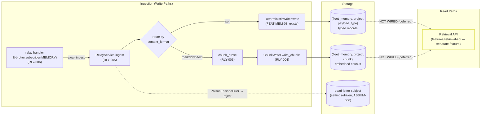
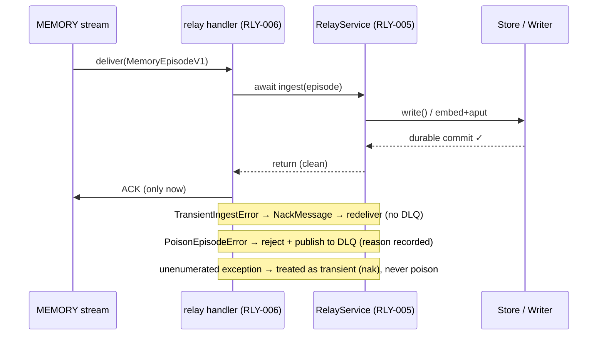
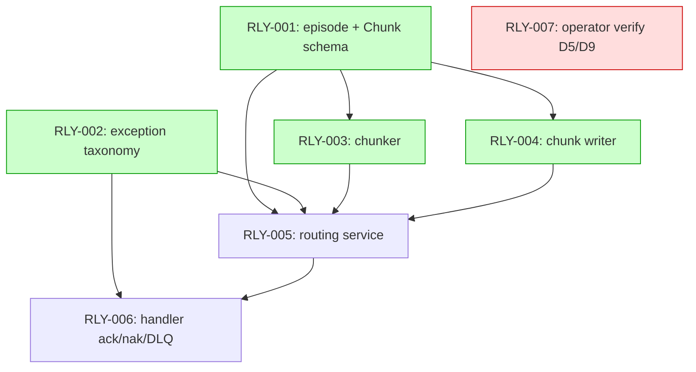

/feature-plan "Relay Integration" \
      --context features/relay-integration/relay-integration_summary.md


I'll execute the /feature-plan workflow for "Relay Integration". Let me start by reading the context file to understand the feature.

Read relay-integration_summary.md
Let me explore the feature directory and related context in parallel.

Bash List relay-integration and feature dirs
IN
ls -la /Users/richardwoollcott/Projects/appmilla_github/fleet-memory/features/relay-integration/ && echo "---FEATURES---" && ls /Users/richardwoollcott/Projects/appmilla_github/fleet-memory/features/ && echo "---GUARDKIT FEATURES---" && ls /Users/richardwoollcott/Projects/appmilla_github/fleet-memory/.guardkit/features/

OUT
total 64
drwxr-xr-x  5 richardwoollcott  staff    160 Jun 13 12:05 .
drwxr-xr-x  7 richardwoollcott  staff    224 Jun 13 12:47 ..
-rw-r--r--  1 richardwoollcott  staff   4452 Jun 13 12:05 relay-integration_assumptions.yaml
-rw-r--r--  1 richardwoollcott  staff   2833 Jun 13 12:05 relay-integration_summary.md
-rw-r--r--  1 richardwoollcott  staff  19349 Jun 13 12:05 relay-integration.feature
---FEATURES---
deterministic-writer
relay-integration
retrieval-api
storage-substrate
typed-payload-registry
---GUARDKIT FEATURES---
FEAT-CA81.yaml
FEAT-MEM-02.yaml
FEAT-MEM-03.yaml
Bash Show source tree and project layout
IN
echo "---SRC TREE---" && find src -type f 2>/dev/null | head -60; echo "---ROOT---" && ls -la; echo "---TASKS BACKLOG---" && ls tasks/backlog/ 2>/dev/null

OUT
---SRC TREE---
src/fleet_memory/store.py
src/fleet_memory/embed.py
src/fleet_memory/__init__.py
src/fleet_memory/settings.py
src/fleet_memory/app.py
src/fleet_memory/errors.py
src/fleet_memory.egg-info/PKG-INFO
src/fleet_memory.egg-info/SOURCES.txt
src/fleet_memory.egg-info/requires.txt
src/fleet_memory.egg-info/top_level.txt
src/fleet_memory.egg-info/dependency_links.txt
src/fleet_memory/payloads/models.py
src/fleet_memory/payloads/registry.py
src/fleet_memory/payloads/__init__.py
src/fleet_memory/payloads/base.py
src/fleet_memory/__pycache__/errors.cpython-314.pyc
src/fleet_memory/__pycache__/settings.cpython-314.pyc
src/fleet_memory/__pycache__/embed.cpython-314.pyc
src/fleet_memory/__pycache__/app.cpython-314.pyc
src/fleet_memory/__pycache__/__init__.cpython-314.pyc
src/fleet_memory/__pycache__/store.cpython-314.pyc
src/fleet_memory/writer/supersession.py
src/fleet_memory/writer/__init__.py
src/fleet_memory/writer/core.py
src/fleet_memory/writer/identity.py
---ROOT---
total 432
drwxr-xr-x   37 richardwoollcott  staff   1184 Jun 13 13:49 .
drwxr-xr-x  173 richardwoollcott  staff   5536 Jun 12 12:43 ..
drwxr-xr-x@  11 richardwoollcott  staff    352 Jun 12 16:41 .claude
-rw-r--r--    1 richardwoollcott  staff   1771 Jun 13 08:22 .env.example
drwxr-xr-x   16 richardwoollcott  staff    512 Jun 13 13:50 .git
-rw-r--r--@   1 richardwoollcott  staff   4723 Jun 12 13:02 .gitignore
drwxr-xr-x@  11 richardwoollcott  staff    352 Jun 13 13:49 .guardkit
-rw-r--r--    1 richardwoollcott  staff      0 Jun 13 08:22 .guardkit-git.lock
drwxr-xr-x@   6 richardwoollcott  staff    192 Jun 12 22:51 .pytest_cache
drwxr-xr-x@   7 richardwoollcott  staff    224 Jun 13 08:22 .venv
-rw-r--r--    1 richardwoollcott  staff  15711 Jun 13 08:22 coverage_all.json
-rw-r--r--    1 richardwoollcott  staff   3318 Jun 13 08:22 coverage_final.json
-rw-r--r--    1 richardwoollcott  staff  15663 Jun 13 08:22 coverage_integration.json
-rw-r--r--    1 richardwoollcott  staff  15663 Jun 13 08:22 coverage_phase4_new.json
-rw-r--r--    1 richardwoollcott  staff  15302 Jun 13 08:22 coverage_phase4_test.json
-rw-r--r--    1 richardwoollcott  staff  22820 Jun 13 08:22 coverage_phase4.json
-rw-r--r--    1 richardwoollcott  staff  14788 Jun 13 08:22 coverage_review.json
-rw-r--r--    1 richardwoollcott  staff   6729 Jun 13 13:49 coverage_task_dw_002.json
-rw-r--r--    1 richardwoollcott  staff   9524 Jun 13 13:49 coverage_task_dw_004.json
-rw-r--r--    1 richardwoollcott  staff   9578 Jun 13 13:49 coverage_task_dw_005.json
-rw-r--r--    1 richardwoollcott  staff   2300 Jun 13 12:25 coverage_task.json
-rw-r--r--    1 richardwoollcott  staff   3318 Jun 13 08:22 coverage_test.json
-rw-r--r--    1 richardwoollcott  staff   6649 Jun 13 13:49 coverage.json
drwxr-xr-x    4 richardwoollcott  staff    128 Jun 13 08:22 deploy
drwxr-xr-x@   4 richardwoollcott  staff    128 Jun 12 15:28 docs
drwxr-xr-x    7 richardwoollcott  staff    224 Jun 13 12:47 features
-rw-r--r--    1 richardwoollcott  staff   1065 Jun 12 12:43 LICENSE
drwxr-xr-x@   2 richardwoollcott  staff     64 Jun 12 15:18 migrations
-rw-r--r--    1 richardwoollcott  staff   1191 Jun 13 08:22 pyproject.toml
-rw-r--r--    1 richardwoollcott  staff     38 Jun 12 12:43 README.md
drwxr-xr-x    4 richardwoollcott  staff    128 Jun 13 08:22 src
drwxr-xr-x@   8 richardwoollcott  staff    256 Jun 13 08:22 tasks
-rw-r--r--    1 richardwoollcott  staff  10326 Jun 13 08:22 test_all_output.txt
-rw-r--r--    1 richardwoollcott  staff   3192 Jun 13 08:22 test_integration_output.txt
-rw-r--r--    1 richardwoollcott  staff  10645 Jun 13 08:22 test_output.txt
-rw-r--r--    1 richardwoollcott  staff   5646 Jun 13 08:22 test_phase4_output.txt
drwxr-xr-x   10 richardwoollcott  staff    320 Jun 13 12:25 tests
---TASKS BACKLOG---
deterministic-writer
storage-substrate
TASK-MEM-001-scaffold-project-layout.md
TASK-MEM-002-settings-class-env-profiles.md
TASK-MEM-008-nas-deploy-operator-execution.md
TASK-MEM-013-assumption-verification-record.md
This is a real, substantial feature with existing related infrastructure. Let me read the full feature file and existing source/feature YAMLs to ground the plan.

Read relay-integration.feature
Now let me understand the existing codebase so the plan integrates correctly. Reading the key source modules and the sibling feature YAMLs.

Read app.py
Read store.py
Read embed.py
Let me read the writer/registry interfaces and the sibling feature YAML to match conventions.

Read core.py
Read registry.py
Bash Read sibling feature YAML, tests dirs, writer exports
IN
echo "===FEAT-MEM-03 YAML==="; cat .guardkit/features/FEAT-MEM-03.yaml; echo "===TESTS TREE==="; find tests -type d; echo "===WRITER INIT==="; cat src/fleet_memory/writer/__init__.py

OUT
===FEAT-MEM-03 YAML===
id: FEAT-MEM-03
name: Deterministic Writer
description: 'Typed payload to AsyncPostgresStore records: UUIDv5 natural-key identity,
  content-hash idempotent upsert, declared supersession linking, embed-on-write, per-project
  namespaces; zero LLM by construction.'
created: '2026-06-13T12:33:07.998348'
status: completed
complexity: 6
estimated_tasks: 5
tasks:
- id: TASK-DW-001
  name: Record identity and content-hash helpers
  file_path: tasks/backlog/deterministic-writer/TASK-DW-001-identity-content-hash.md
  complexity: 4
  dependencies: []
  status: completed
  implementation_mode: task-work
  estimated_minutes: 50
  requires_infrastructure: []
  result:
    total_turns: 1
    final_decision: approved
    error: null
    deferred_reason: null
  turns_completed: 1
  current_turn: 0
  started_at: '2026-06-13T12:40:57.958992'
  completed_at: '2026-06-13T12:50:01.567914'
- id: TASK-DW-002
  name: Deterministic writer core - idempotent content-hash upsert
  file_path: tasks/backlog/deterministic-writer/TASK-DW-002-writer-core-idempotent-upsert.md
  complexity: 7
  dependencies:
  - TASK-DW-001
  status: completed
  implementation_mode: task-work
  estimated_minutes: 170
  requires_infrastructure: []
  result:
    total_turns: 1
    final_decision: approved
    error: null
    deferred_reason: null
  turns_completed: 1
  current_turn: 0
  started_at: '2026-06-13T12:50:01.582560'
  completed_at: '2026-06-13T13:02:23.536959'
- id: TASK-DW-003
  name: Declared supersession linking
  file_path: tasks/backlog/deterministic-writer/TASK-DW-003-supersession-linking.md
  complexity: 6
  dependencies:
  - TASK-DW-002
  status: completed
  implementation_mode: task-work
  estimated_minutes: 113
  requires_infrastructure: []
  result:
    total_turns: 1
    final_decision: approved
    error: null
    deferred_reason: null
  turns_completed: 1
  current_turn: 0
  started_at: '2026-06-13T13:02:23.552046'
  completed_at: '2026-06-13T13:15:30.949332'
- id: TASK-DW-004
  name: Idempotency and zero-LLM test suite
  file_path: tasks/backlog/deterministic-writer/TASK-DW-004-idempotency-zero-llm-tests.md
  complexity: 4
  dependencies:
  - TASK-DW-002
  status: completed
  implementation_mode: task-work
  estimated_minutes: 50
  requires_infrastructure: []
  result:
    total_turns: 1
    final_decision: approved
    error: null
    deferred_reason: null
  turns_completed: 1
  current_turn: 0
  started_at: '2026-06-13T13:02:23.555846'
  completed_at: '2026-06-13T13:15:30.953087'
- id: TASK-DW-005
  name: Supersession test suite
  file_path: tasks/backlog/deterministic-writer/TASK-DW-005-supersession-tests.md
  complexity: 4
  dependencies:
  - TASK-DW-003
  status: completed
  implementation_mode: task-work
  estimated_minutes: 50
  requires_infrastructure: []
  result:
    total_turns: 1
    final_decision: approved
    error: null
    deferred_reason: null
  turns_completed: 1
  current_turn: 0
  started_at: '2026-06-13T13:15:39.258859'
  completed_at: '2026-06-13T13:27:33.804278'
orchestration:
  parallel_groups:
  - - TASK-DW-001
  - - TASK-DW-002
  - - TASK-DW-003
    - TASK-DW-004
  - - TASK-DW-005
  estimated_duration_minutes: 433
  recommended_parallel: 2
smoke_gates:
  after_wave: 3
  command: 'set -e

    pytest tests/unit -x

    '
  expected_exit: 0
  timeout: 120
  exit5_is_hard_fail: false
preflight_strict: false
evidence_repos: []
execution:
  started_at: '2026-06-13T12:40:57.582632'
  completed_at: '2026-06-13T13:27:33.812590'
  worktree_path: /Users/richardwoollcott/Projects/appmilla_github/fleet-memory/.guardkit/worktrees/FEAT-MEM-03
  total_turns: 5
  tasks_completed: 5
  tasks_failed: 0
  current_wave: 4
  completed_waves:
  - 1
  - 2
  - 3
  - 4
  last_updated: '2026-06-13T13:27:33.808147'
  archived_at: null
  archived_to: null
===TESTS TREE===
tests
tests/unit
tests/integration
tests/__pycache__
tests/bdd
tests/unit/__pycache__
tests/integration/__pycache__
tests/bdd/__pycache__
===WRITER INIT===
"""Writer module: deterministic payload-to-store writer with idempotent upsert.

Exports:
    DeterministicWriter: Main writer class with content-hash upsert logic
    record_identity: Generate stable UUIDv5 from natural key
    content_hash: Generate deterministic hash over payload content
"""

from fleet_memory.writer.core import DeterministicWriter
from fleet_memory.writer.identity import content_hash, record_identity

__all__ = ["DeterministicWriter", "record_identity", "content_hash"]
I now have a thorough understanding. This is FEAT-MEM-04, the FastStream durable relay consumer on the MEMORY stream. The codebase already has the store, embed, deterministic writer (FEAT-MEM-03, just completed), payload registry (FEAT-MEM-02), and an app shell with no subscribers yet — the relay is the missing ingestion path.

Before running the review analysis, I need to clarify review scope (Context A) and resolve the low-confidence assumptions the spec explicitly flags as blocking.

AskUserQuestion
OUT
Your questions have been answered: "What should the planning review focus on, and what trade-off should it optimize for?"="Architecture + correctness (Recommended)", "The spec flags 3 low-confidence assumptions from the sibling nats-infrastructure repo (max_deliver=5, DLQ subject name, empty-body handling) as needing verification before build. How should the plan treat them?"="Plan with assumptions, add verify task (Recommended)". You can now continue with these answers in mind.
Context A captured: architecture + correctness focus (quality/reliability priority), and plan with documented assumptions + an operator verification task. Let me check task-file conventions before creating the review task.

Read TASK-DW-002-writer-core-idempotent-upsert.md
Bash Inspect task files, settings, payload models
IN
echo "===backlog dw dir==="; ls tasks/backlog/deterministic-writer/; echo "===settings==="; sed -n '1,80p' src/fleet_memory/settings.py; echo "===payloads models head==="; sed -n '1,40p' src/fleet_memory/payloads/models.py

OUT
===backlog dw dir===
IMPLEMENTATION-GUIDE.md
README.md
TASK-DW-001-identity-content-hash.md
TASK-DW-002-writer-core-idempotent-upsert.md
TASK-DW-003-supersession-linking.md
TASK-DW-004-idempotency-zero-llm-tests.md
TASK-DW-005-supersession-tests.md
===settings===
"""Configuration settings for fleet-memory service."""

from pydantic import Field, field_validator
from pydantic_settings import BaseSettings, SettingsConfigDict


class Settings(BaseSettings):
    """Fleet-memory service configuration loaded from environment variables.

    All settings are loaded from environment variables with the FLEET_MEMORY_ prefix.
    Required fields must be provided via environment variables.
    """

    model_config = SettingsConfigDict(
        env_prefix="FLEET_MEMORY_",
        env_file=".env",
        env_file_encoding="utf-8",
        extra="ignore",
    )

    # Required fields
    pg_dsn: str = Field(..., description="PostgreSQL connection DSN")
    embed_url: str = Field(..., description="Embedding service URL")

    # Embedding configuration
    embed_model: str = Field(
        default="nomic-embed-text-v1.5",
        description="Embedding model name",
    )
    embed_dims: int = Field(
        default=768,
        description="Embedding vector dimensions",
    )
    embed_timeout_s: float = Field(
        default=10.0,
        description="Embedding service timeout in seconds (ASSUM-008 placeholder)",
    )

    # PostgreSQL pool configuration
    pg_pool_min: int = Field(
        default=2,
        description="Minimum PostgreSQL pool connections",
    )
    pg_pool_max: int = Field(
        default=10,
        description="Maximum PostgreSQL pool connections (ASSUM-004 placeholder)",
    )
    pg_connect_timeout_s: float = Field(
        default=10.0,
        description="PostgreSQL connection timeout in seconds (ASSUM-006 placeholder)",
    )

    # NATS configuration
    nats_url: str = Field(
        default="nats://localhost:4222",
        description="NATS server URL",
    )

    @field_validator("pg_dsn", "embed_url")
    @classmethod
    def validate_not_empty(cls, v: str, info) -> str:
        """Ensure required string fields are not empty."""
        if not v or not v.strip():
            raise ValueError(f"{info.field_name} cannot be empty")
        return v
===payloads models head===
"""Concrete payload type models for fleet-memory typed payload registry.

Implements seven canonical payload types that subclass BasePayload:
adr, review_report, build_outcome, pattern, warning, seed_module, document.

Each type declares its canonical payload_type and type-specific required fields.
Shared conventions (identifiers, supersession, domain tags) are inherited from BasePayload.
"""

from __future__ import annotations

from typing import ClassVar

from fleet_memory.payloads.base import BasePayload


class ADRPayload(BasePayload):
    """Architecture Decision Record payload.

    Tracks architectural decisions with decision text and status.
    """

    payload_type: ClassVar[str] = "adr"

    decision: str  # The architectural decision being documented
    status: str  # e.g., "proposed", "accepted", "deprecated", "superseded"


class ReviewReportPayload(BasePayload):
    """Code review or audit report payload.

    Requires a verdict field (e.g., "approved", "rejected", "needs_changes").
    """

    payload_type: ClassVar[str] = "review_report"

    verdict: str  # Required: the review outcome


class BuildOutcomePayload(BasePayload):
Everything is grounded. Let me create the review task artifact, then present the decision analysis.

Write TASK-REV-RLY04-plan-relay-integration.md
33 lines
---
id: TASK-REV-RLY04
title: "Plan: Relay Integration"
task_type: review
priority: high
status: review_complete
feature_ref: FEAT-MEM-04
context_sources:
  - features/relay-integration/relay-integration_summary.md
  - features/relay-integration/relay-integration.feature
  - features/relay-integration/relay-integration_assumptions.yaml
clarification:
  context_a:
    decisions:
      focus: architecture_correctness
      tradeoff: quality
      assumptions: plan_with_assumptions_plus_verify_task
---

# Task: Plan: Relay Integration (FEAT-MEM-04)

## Description

Decision review for the relay consumer: a FastStream durable consumer on the
MEMORY stream that ingests `MemoryEpisodeV1` envelopes, routes them by
`content_format` (structured JSON → registry → deterministic writer; markdown/
text → heading-aware chunk → embed → store), acknowledges only after a durable
commit, and parks poison episodes on a dead-letter subject. Two-layer
idempotency makes at-least-once redelivery inert. No language model on the
write path.

See `.claude/reviews/TASK-REV-RLY04-review-report.md` for the full analysis.
Now the decision review analysis:


🔍 FEATURE PLANNING: Relay Integration (FEAT-MEM-04)
✅ Review task: TASK-REV-RLY04
🔬 Mode: decision · Depth: standard · Focus: architecture + correctness (quality)
TECHNICAL OPTIONS ANALYSIS
The relay is the last missing piece of the ingestion path. The store, embed client, deterministic writer (FEAT-MEM-03), and payload registry (FEAT-MEM-02) all exist; app.py has a lifespan that opens the store but registers no subscribers. So this feature adds: a MemoryEpisodeV1 schema, a chunker, a chunk writer, the routing/ack/nak/DLQ consumer handler, and integration tests.

The real design decision is how the consumer enforces ack-after-commit and the nak-vs-DLQ split — every correctness scenario in the .feature file hangs off it.

Option 1 — Pure service + thin FastStream handler (Recommended)
A RelayService owns all routing/chunking/idempotency logic with zero NATS imports; a thin @broker.subscriber handler on the MEMORY stream owns only ack/nak/DLQ dispatch. Matches the project's handler/service separation rule exactly.

Complexity: 7/10 · Effort: ~6–8h
Pros: ✅ Service is unit-testable with no broker (the project's dominant test pattern) ✅ Ack-after-commit is a structural property: handler awaits service.ingest() and only acks on clean return ✅ Poison vs transient is a typed-exception contract (PoisonEpisodeError → DLQ via RejectMessage; transient → NackMessage) ✅ Reuses DeterministicWriter.write() and async_store_context untouched
Cons: ⚠️ Exception taxonomy must be exhaustive or a transient error gets dead-lettered (data loss risk) ⚠️ DLQ subject/max_deliver come from the unverified sibling-repo contract
Option 2 — Handler-only, logic inline in the subscriber
Skip the service layer; route and chunk inside the handler.

Complexity: 5/10 · Effort: ~4–5h
Pros: ✅ Fewer files, faster ✅ Less indirection
Cons: ❌ Violates the handler/service-separation rule in CLAUDE.md ❌ Forces broker-dependent tests for chunking/idempotency logic ❌ Concurrency and idempotency scenarios become hard to unit-test in isolation
Option 3 — Two separate consumers (structured vs prose)
A subscriber per content family.

Complexity: 6/10 · Effort: ~5–7h
Pros: ✅ Clean path isolation
Cons: ❌ content_format is a field inside one envelope on one subject — you'd need a pre-router anyway ❌ Doubles consumer/DLQ lifecycle config ❌ The "mixed batch" and "interleaved failure" scenarios assume one consumer
RECOMMENDED APPROACH
✅ Option 1 — Pure RelayService + thin handler, because correctness is the priority and this is the only option where ack-after-commit and nak-vs-DLQ are enforced by structure (return-vs-raise) rather than by discipline, and where the dense edge-case/concurrency/idempotency scenario set can be unit-tested without a live broker.

Two-layer idempotency (already half-built): structured path inherits the writer's natural-key upsert (inert by construction); prose path needs chunk_id = uuid5(episode_id, chunk_index) so re-chunking overwrites in place.

DATA FLOW (write/read paths)

flowchart LR
    subgraph Writes["Ingestion (Write Paths)"]
        H["relay handler\n@broker.subscriber(MEMORY)"]
        SVC["RelayService.ingest(episode)"]
        RT{"route by\ncontent_format"}
        DW["DeterministicWriter.write()\n(FEAT-MEM-03, exists)"]
        CH["Chunker.split()\nheading-aware + overlap"]
        CW["ChunkWriter.write_chunks()\nembed + aput"]
    end
    subgraph Storage["Storage"]
        S1[("(fleet_memory, project,\npayload_type)\ntyped records")]
        S2[("(fleet_memory, project,\nchunk)\nembedded chunks")]
        DLQ[("dead-letter subject\n(ASSUM-006)")]
    end
    subgraph Reads["Read Paths"]
        R["Retrieval API\n(FEAT future — separate feature)"]
    end

    H --> SVC --> RT
    RT -->|"json"| DW --> S1
    RT -->|"markdown/text"| CH --> CW --> S2
    SVC -.->|"poison: RejectMessage"| DLQ
    S1 -.->|"queried by"| R
    S2 -.->|"queried by"| R

    style R fill:#ffd,stroke:#cc0
Disconnection note (acknowledged, not blocking): both storage namespaces are written here but read only by the future Retrieval API feature (features/retrieval-api/ exists but is out of scope for FEAT-MEM-04). This write-without-read is intentional and deferred — the relay's job is lossless capture; retrieval is a sibling feature. No wiring task added here.

INTEGRATION CONTRACT (the ack seam)

sequenceDiagram
    participant N as MEMORY stream
    participant H as relay handler
    participant SVC as RelayService
    participant ST as Store/Writer
    N->>H: deliver(MemoryEpisodeV1)
    H->>SVC: await ingest(episode)
    SVC->>ST: write / embed+aput
    ST-->>SVC: durable commit ✓
    SVC-->>H: return (success)
    H->>N: ACK  (only now)
    Note over SVC,H: transient failure → raise → NackMessage (redeliver)
    Note over SVC,H: poison/validation → raise PoisonError → RejectMessage (DLQ)
This is the diagram a reviewer should stare at: the ack happens only after ingest returns cleanly. A raised exception never reaches the ACK line.

RISKS
Risk	Severity	Mitigation in plan
Transient error misclassified as poison → silent data loss	High	Explicit exception taxonomy task; default-to-nak (redeliver) on unknown errors, DLQ only on enumerated deterministic failures
max_deliver=5 / DLQ subject name unverified (sibling repo)	Medium	Make both settings-driven (defaults from assumptions) + operator_handoff task to verify against nats-infrastructure D5/D9 before merge
Chunk-write atomicity (partial chunk set on mid-doc failure)	Medium	chunk_id = uuid5(episode_id, index) + nak-and-redeliver so reprocessing overwrites deterministically
Concurrent same-episode delivery races	Medium	Idempotent keys make convergence safe; covered by concurrency scenarios
Empty-body handling (low-confidence ASSUM)	Low	Fold into operator verification task
PROPOSED TASK BREAKDOWN (7 tasks, 3 waves)
Task	Type	Cx	Wave
TASK-RLY-001 — MemoryEpisodeV1 Pydantic schema + content_format enum	declarative	3	1
TASK-RLY-002 — Relay exception taxonomy (Poison vs Transient)	declarative	3	1
TASK-RLY-003 — Heading-aware chunker (size/overlap, empty-body)	feature	6	2
TASK-RLY-004 — Chunk writer (episode_id-derived ids, embed+store)	feature	6	2
TASK-RLY-005 — RelayService.ingest routing + idempotency	feature	7	2
TASK-RLY-006 — Thin MEMORY-stream handler: ack/nak/DLQ + settings	feature	6	3
TASK-RLY-007 — Verify D5/D9 (max_deliver, DLQ subject, empty-body) against nats-infrastructure	operator_handoff	2	3

graph TD
    T1[RLY-001: episode schema] --> T3[RLY-003: chunker]
    T1 --> T5[RLY-005: routing service]
    T2[RLY-002: exception taxonomy] --> T5
    T3 --> T4[RLY-004: chunk writer]
    T4 --> T5
    T5 --> T6[RLY-006: handler ack/nak/DLQ]
    T2 --> T6
    T7[RLY-007: operator verify D5/D9]
    style T1 fill:#cfc,stroke:#090
    style T2 fill:#cfc,stroke:#090
    style T3 fill:#cfc,stroke:#090
    style T4 fill:#cfc,stroke:#090
    style T7 fill:#fdd,stroke:#c00
Estimated: ~32–40h · Complexity: 7/10 · Risk: Medium (concentrated in the ack/exception seam)


━━━━━━━━━━━━━━━━━━━━━━━━━━━━━━━━━━━━━━━
📋 DECISION CHECKPOINT — TASK-REV-RLY04
━━━━━━━━━━━━━━━━━━━━━━━━━━━━━━━━━━━━━━━
Recommended: Option 1 (pure RelayService + thin handler), 7 tasks across 3 waves, with TASK-RLY-007 as an operator_handoff for the unverified sibling-repo DLQ contract.

AskUserQuestion
OUT
Your questions have been answered: "How do you want to proceed with the Relay Integration plan?"="Implement (Option 1)". You can now continue with these answers in mind.
Implement chosen. One more clarification (Context B) on how to configure the subtasks, then I'll generate everything.

AskUserQuestion
OUT
Your questions have been answered: "Testing depth for the implementation subtasks?"="Standard + seam tests (Recommended)", "The DLQ subject name and max_deliver are unverified. How should the relay consumer get them?"="Settings-driven, defaults from assumptions (Recommended)". You can now continue with these answers in mind.
Implement confirmed with standard + seam tests and settings-driven DLQ config. Generating the full feature structure now.

I'll restructure to a correct 4-wave dependency graph (the Chunk model lands in RLY-001 so the chunker and chunk-writer parallelize). Writing the 7 task files:

Write TASK-RLY-001-memory-episode-schema.md
65 lines
---
id: TASK-RLY-001
title: MemoryEpisodeV1 envelope schema, ContentFormat enum, and Chunk model
task_type: declarative
parent_review: TASK-REV-RLY04
feature_id: FEAT-MEM-04
wave: 1
implementation_mode: task-work
complexity: 3
dependencies: []
tags:
  - schema
  - pydantic
  - relay
  - fleet-memory
---

# Task: MemoryEpisodeV1 envelope schema, ContentFormat enum, and Chunk model

## Description

Define the inbound envelope and the prose-path value objects that every other
relay task consumes. Three artifacts in `src/fleet_memory/relay/schema.py`:

1. **`ContentFormat`** — a string enum with exactly `JSON = "json"`,
   `MARKDOWN = "markdown"`, `TEXT = "text"` (the only recognized formats —
   anything else is parked, per the negative scenarios).
2. **`MemoryEpisodeV1`** — the Pydantic v2 envelope published by nats-core onto
   the MEMORY stream. Fields (minimum): `episode_id: str`, `project: str`,
   `content_format: str` (raw string, validated at routing time — an
   unrecognized value must be *parkable*, not a Pydantic error), `body: str`,
   `payload_type: str | None`, `source_ref: str | None`. Use
   `ConfigDict(extra="ignore")` for forward compatibility (matches the
   project's schema convention).
3. **`Chunk`** — a frozen value object produced by the chunker and consumed by
   the chunk writer: `index: int`, `text: str`, `source_ref: str | None`,
   `project: str`. No storage logic here — pure data.

This is the producer side of the §4 `MemoryEpisodeV1` and `Chunk` contracts.

## Acceptance Criteria

- [ ] `ContentFormat` enum defines exactly `json`, `markdown`, `text` and nothing else
- [ ] `MemoryEpisodeV1` parses a valid structured-JSON envelope and a valid markdown envelope without error
- [ ] `content_format` is stored as-is (an unrecognized value like `"yaml"` does NOT raise at parse time — it is routed/parked downstream)
- [ ] `MemoryEpisodeV1` uses `ConfigDict(extra="ignore")` so unknown envelope fields are dropped, not rejected
- [ ] `Chunk` is immutable (frozen) and carries `index`, `text`, `source_ref`, `project`
- [ ] Unit tests assert round-trip parse for each `ContentFormat` and the extra-field-ignore behaviour

## Coach Validation

```bash
pytest tests/unit/relay/test_schema.py -v
python -c "from fleet_memory.relay.schema import MemoryEpisodeV1, ContentFormat, Chunk"
```

## Implementation Notes

- Mirror `ConfigDict(extra="ignore")` and `Field` conventions from
  `src/fleet_memory/payloads/base.py`.
- Do NOT validate `content_format` against the enum at parse time — the
  "unrecognized content format is parked" negative scenario requires the value
  to survive into the routing layer where it becomes a poison decision.
- Keep this module free of NATS, store, and writer imports (declarative only).
Write TASK-RLY-002-exception-taxonomy.md
66 lines
---
id: TASK-RLY-002
title: Relay exception taxonomy - PoisonEpisodeError vs TransientIngestError
task_type: declarative
parent_review: TASK-REV-RLY04
feature_id: FEAT-MEM-04
wave: 1
implementation_mode: task-work
complexity: 3
dependencies: []
tags:
  - errors
  - relay
  - ack-nak-dlq
  - fleet-memory
---

# Task: Relay exception taxonomy - PoisonEpisodeError vs TransientIngestError

## Description

The single most safety-critical contract in this feature: the typed exceptions
that decide **dead-letter vs redeliver**. A misclassification dead-letters a
recoverable episode (data loss) or retries a poison episode forever (stream
stall). Add to `src/fleet_memory/errors.py` (the existing errors module):

1. **`PoisonEpisodeError`** — a deterministic, non-recoverable failure. The
   episode will never succeed on redelivery, so it must be parked on the DLQ.
   Carries a `reason: str` (recorded on the DLQ) and optional `detail`.
   Raised for: unparseable body, unknown `payload_type`, payload validation
   failure, unrecognized `content_format`, hyphenated/invalid `project`,
   wrong-dimension embedding.
2. **`TransientIngestError`** — a recoverable downstream failure (embedding
   service unavailable, store unreachable, connection drop). Must be
   negatively-acknowledged for redelivery, never dead-lettered.

**Default-to-transient rule:** document (in the module docstring) that any
*unenumerated* exception escaping the service is treated as transient (nak +
redeliver), never as poison. Losing data is worse than redelivering.

This is the producer side of the §4 exception-taxonomy contract; RLY-005 raises
these and RLY-006 maps them to ack/nak/DLQ.

## Acceptance Criteria

- [ ] `PoisonEpisodeError` and `TransientIngestError` subclass the existing fleet-memory error base
- [ ] `PoisonEpisodeError` carries a `reason` string suitable for recording on the dead-letter subject
- [ ] The two classes are distinguishable by type (not by message string)
- [ ] Module docstring states the default-to-transient policy for unenumerated exceptions
- [ ] Unit test asserts the two are not in the same subtree such that a `TransientIngestError` could be caught as poison (or vice versa)

## Coach Validation

```bash
pytest tests/unit/relay/test_errors.py -v
python -c "from fleet_memory.errors import PoisonEpisodeError, TransientIngestError"
```

## Implementation Notes

- Follow the existing error-class style in `src/fleet_memory/errors.py`
  (`NamespaceValidationError`, `EmbedDimensionError`, etc.).
- The existing `EmbedDimensionError` is a *poison* trigger; the existing
  `EmbedTimeoutError`/`EmbedServiceError` are *transient* triggers. Note this
  mapping in the docstring so RLY-005 wires them correctly.
Write TASK-RLY-003-heading-aware-chunker.md
99 lines
---
id: TASK-RLY-003
title: Heading-aware prose chunker with size and overlap
task_type: feature
parent_review: TASK-REV-RLY04
feature_id: FEAT-MEM-04
wave: 2
implementation_mode: task-work
complexity: 6
dependencies:
  - TASK-RLY-001
tags:
  - chunking
  - prose
  - relay
  - fleet-memory
consumer_context:
  - task: TASK-RLY-001
    consumes: Chunk / MemoryEpisodeV1
    framework: Pydantic v2 value objects (frozen Chunk model)
    driver: pydantic>=2
    format_note: "Chunker returns list[Chunk] with monotonic index starting at 0; each Chunk carries text, index, source_ref, project. Empty/whitespace body returns []."
---

# Task: Heading-aware prose chunker with size and overlap

## Description

Pure, network-free function `chunk_prose(body: str, *, target_tokens: int,
overlap_ratio: float, source_ref, project) -> list[Chunk]` in
`src/fleet_memory/relay/chunker.py`. Splits markdown/text into heading-aware
chunks for the prose write path. No store, no embedding, no NATS — just text in,
`Chunk` list out, so the dense boundary scenarios are unit-testable.

Behaviour (from the @boundary scenarios):
- Body **well under** one chunk → 1 chunk; **exactly** one chunk → 1 chunk;
  **just over** → 2 chunks; **several chunks long** → multiple.
- Adjacent chunks **overlap** by ~`overlap_ratio` of chunk size so meaning is
  not severed at a cut.
- Boundaries **prefer heading breaks** over splitting mid-section; a heading
  line is never separated from the section it introduces.
- **Empty or whitespace-only** body → returns `[]` (zero chunks) — the episode
  is later acknowledged, not parked (low-confidence ASSUM; confirm via RLY-007).

`target_tokens` (~1000, OD-1) and `overlap_ratio` (~0.15, OD-1) are parameters,
sourced from Settings by the caller — do not hardcode.

## Acceptance Criteria

- [ ] Body under target size produces exactly 1 chunk
- [ ] Body just over target size produces 2 chunks with overlapping content between them
- [ ] A multi-heading document splits at heading boundaries where possible; no heading is orphaned from its section
- [ ] Each chunk after the first begins with content overlapping the previous chunk
- [ ] Empty body and whitespace-only body both return `[]`
- [ ] `Chunk.index` is monotonic from 0; `source_ref` and `project` propagate to every chunk
- [ ] Function is pure: no I/O, deterministic for a given input
- [ ] All modified files pass project-configured lint/format checks with zero errors

## Seam Tests

The following seam test validates the integration contract with the producer task. Implement this test to verify the boundary before integration.

```python
"""Seam test: verify Chunk contract from TASK-RLY-001."""
import pytest

from fleet_memory.relay.chunker import chunk_prose


@pytest.mark.seam
@pytest.mark.integration_contract("Chunk")
def test_chunk_contract_shape():
    """Verify chunk_prose returns Chunk objects matching the RLY-001 contract.

    Contract: list[Chunk] with monotonic index from 0; empty body -> [].
    Producer: TASK-RLY-001
    """
    chunks = chunk_prose("# H\nsome body text", target_tokens=1000,
                         overlap_ratio=0.15, source_ref="ref://x", project="guardkit")
    assert all(c.project == "guardkit" for c in chunks)
    assert [c.index for c in chunks] == list(range(len(chunks)))
    assert chunk_prose("   ", target_tokens=1000, overlap_ratio=0.15,
                      source_ref=None, project="guardkit") == []
```

## Coach Validation

```bash
pytest tests/unit/relay/test_chunker.py -v
ruff check src/fleet_memory/relay/chunker.py
```

## Implementation Notes

- Token counting can be approximate (whitespace/heuristic) for v1 — the OD-1
  values are starting points, not contractual.
- Keep heading detection markdown-aware (`#`..`######`); plain text with no
  headings falls back to size-based splitting on paragraph boundaries.
Write TASK-RLY-004-chunk-writer.md
108 lines
---
id: TASK-RLY-004
title: Chunk writer - episode_id-derived ids, embed-on-write, idempotent storage
task_type: feature
parent_review: TASK-REV-RLY04
feature_id: FEAT-MEM-04
wave: 2
implementation_mode: task-work
complexity: 6
dependencies:
  - TASK-RLY-001
tags:
  - chunks
  - storage
  - idempotency
  - relay
  - fleet-memory
consumer_context:
  - task: TASK-RLY-001
    consumes: Chunk
    framework: Pydantic v2 frozen Chunk value object
    driver: pydantic>=2
    format_note: "Consumes list[Chunk]; writes each under namespace ('fleet_memory', project, 'chunk') with key uuid5(episode_id, str(index))."
  - task: TASK-MEM-005
    consumes: AsyncPostgresStore record contract
    framework: langgraph AsyncPostgresStore via async_store_context (store.aput)
    driver: langgraph-checkpoint-postgres>=2.0 (psycopg3)
    format_note: "Stored value MUST carry a 'content' string field so the index config (fields=['content']) embeds it on write. Validate namespace with validate_namespace before any put."
---

# Task: Chunk writer - episode_id-derived ids, embed-on-write, idempotent storage

## Description

`ChunkWriter.write_chunks(episode_id: str, chunks: list[Chunk]) -> None` in
`src/fleet_memory/relay/chunk_writer.py`. Persists prose chunks under
`("fleet_memory", project, "chunk")` via the existing `AsyncPostgresStore`
(embed-on-write through the store's index config — the same mechanism the
deterministic writer uses; no direct embed calls here).

**Idempotency layer 2 (the key contract):** each chunk's store key is
`uuid5(NAMESPACE_OID, f"{episode_id}:{chunk.index}")`. Redelivery of the same
episode overwrites the same keys in place → no duplicate chunks. This is what
makes the @regression "no duplicate chunks on redelivery" and the concurrency
"converges to a single outcome" scenarios pass by construction.

Each stored chunk value carries: `content` (the chunk text — required for
embed-on-write), `episode_id`, `chunk_index`, `source_ref`, `project`.

Validate the namespace with `validate_namespace` before any `aput` (rejects
hyphenated projects → caller turns the `NamespaceValidationError` into poison).

## Acceptance Criteria

- [ ] Chunk store key is `uuid5(episode_id, index)` — deterministic and stable across redeliveries
- [ ] Writing the same `(episode_id, chunks)` twice leaves an identical chunk set (no duplicates)
- [ ] Each stored value carries a `content` field so embed-on-write fires via the store index config
- [ ] Each stored chunk records `source_ref` and is confined to `("fleet_memory", project, "chunk")`
- [ ] `validate_namespace` is called before any `aput`; a hyphenated project raises `NamespaceValidationError` and writes nothing
- [ ] A delimiter/path-shaped `episode_id` cannot place a chunk outside the project's chunk namespace
- [ ] Unit tests use the in-memory/fake store + `make_fake_embed` (no live infra)
- [ ] All modified files pass project-configured lint/format checks with zero errors

## Seam Tests

The following seam test validates the integration contract with the store. Implement this test to verify the boundary before integration.

```python
"""Seam test: verify chunk namespace + embed-on-write contract."""
import pytest

from fleet_memory.relay.schema import Chunk
from fleet_memory.relay.chunk_writer import ChunkWriter


@pytest.mark.seam
@pytest.mark.integration_contract("chunk_namespace")
async def test_chunk_written_under_project_chunk_namespace(fake_store):
    """Verify chunks land under ('fleet_memory', project, 'chunk') with content.

    Contract: namespace tuple + 'content' field for embed-on-write.
    Producer: TASK-RLY-001 (Chunk), TASK-MEM-005 (store)
    """
    writer = ChunkWriter(store=fake_store)
    chunks = [Chunk(index=0, text="hello", source_ref="ref://a", project="guardkit")]
    await writer.write_chunks("ep-1", chunks)
    stored = await fake_store.aget(("fleet_memory", "guardkit", "chunk"), ...)
    assert "content" in stored.value
```

## Coach Validation

```bash
pytest tests/unit/relay/test_chunk_writer.py -v
ruff check src/fleet_memory/relay/chunk_writer.py
```

## Implementation Notes

- Reuse the namespace+content pattern from
  `src/fleet_memory/writer/core.py::_write_record` (the `content` field is what
  the store embeds).
- Do NOT call `embed()` directly — embedding happens inside the store on `aput`
  via the index config wired in `async_store_context`.
- Partial-failure atomicity (low-confidence ASSUM): a mid-write failure should
  surface as a `TransientIngestError` so the episode is redelivered and the
  deterministic keys overwrite cleanly. Confirm intended behaviour via RLY-007.
Write TASK-RLY-005-relay-service-routing.md
134 lines
---
id: TASK-RLY-005
title: RelayService.ingest - content_format routing and two-layer idempotency
task_type: feature
parent_review: TASK-REV-RLY04
feature_id: FEAT-MEM-04
wave: 3
implementation_mode: task-work
complexity: 7
dependencies:
  - TASK-RLY-001
  - TASK-RLY-002
  - TASK-RLY-003
  - TASK-RLY-004
tags:
  - routing
  - service
  - idempotency
  - relay
  - fleet-memory
consumer_context:
  - task: TASK-RLY-001
    consumes: MemoryEpisodeV1 / ContentFormat
    framework: Pydantic v2 envelope
    driver: pydantic>=2
    format_note: "Routes on episode.content_format; only json/markdown/text are recognized, anything else raises PoisonEpisodeError."
  - task: TASK-RLY-002
    consumes: PoisonEpisodeError / TransientIngestError
    framework: typed exceptions
    driver: stdlib
    format_note: "Raise PoisonEpisodeError(reason=...) for deterministic failures; let/raise TransientIngestError for recoverable ones. Unenumerated exceptions must propagate as transient."
  - task: TASK-RLY-003
    consumes: chunk_prose
    framework: pure function returning list[Chunk]
    driver: stdlib/pydantic
    format_note: "Call with target_tokens/overlap_ratio from Settings; empty result => zero chunks => success (ack)."
  - task: TASK-RLY-004
    consumes: ChunkWriter.write_chunks
    framework: async store writer
    driver: langgraph AsyncPostgresStore
    format_note: "write_chunks(episode_id, chunks) is idempotent via uuid5(episode_id, index)."
  - task: TASK-TPR-003
    consumes: PAYLOAD_REGISTRY / get_model_for_type
    framework: Pydantic v2 BasePayload dispatch
    driver: pydantic>=2
    format_note: "Unknown payload_type raises UnknownPayloadTypeError -> map to PoisonEpisodeError naming the type. No silent fallback."
  - task: TASK-DW-002
    consumes: DeterministicWriter.write
    framework: idempotent content-hash upsert
    driver: langgraph AsyncPostgresStore
    format_note: "Structured path builds a registered BasePayload then calls writer.write(); natural-key upsert makes redelivery inert (idempotency layer 1)."
---

# Task: RelayService.ingest - content_format routing and two-layer idempotency

## Description

The brain of the relay, with **zero NATS imports** (pure service — testable by
direct instantiation). `RelayService(writer, chunk_writer, settings)` exposes
`async def ingest(self, episode: MemoryEpisodeV1) -> None`.

Routing by `content_format`:
- **`json`** → resolve `payload_type` via `PAYLOAD_REGISTRY`, build & validate
  the typed `BasePayload`, call `DeterministicWriter.write()` (idempotency
  layer 1: natural-key upsert).
- **`markdown` / `text`** → `chunk_prose(...)` → `ChunkWriter.write_chunks(...)`
  (idempotency layer 2: episode_id-derived keys). Zero chunks (empty body) is a
  successful no-op.
- **anything else** → `PoisonEpisodeError("unrecognized content_format: ...")`.

Exception mapping (the correctness core):
- unparseable body, unknown payload type, payload validation failure,
  unrecognized format, hyphenated project (`NamespaceValidationError`),
  wrong-dimension embedding (`EmbedDimensionError`) → **`PoisonEpisodeError`**.
- embedding service/timeout/store unreachable (`EmbedTimeoutError`,
  `EmbedServiceError`, connection errors) → **`TransientIngestError`**.
- any unenumerated exception → propagate as transient (never poison).

`ingest` returns only after the durable write commits — its clean return is the
signal the handler (RLY-006) uses to ack. No language model is ever called.

## Acceptance Criteria

- [ ] `json` episodes dispatch through the registry to `DeterministicWriter.write`; a typed record exists in the project namespace
- [ ] `markdown` and `text` episodes are chunked and stored as chunks; same path for both
- [ ] Unknown `payload_type` raises `PoisonEpisodeError` naming the type; no record written
- [ ] A structured episode missing a required payload field raises `PoisonEpisodeError`; no record written
- [ ] `content_format` of `"yaml"` raises `PoisonEpisodeError`; no record or chunk created
- [ ] Hyphenated project raises `PoisonEpisodeError` on both paths; nothing written
- [ ] Embedding-service-unavailable raises `TransientIngestError` (NOT poison)
- [ ] Empty markdown body produces zero chunks and returns cleanly (success)
- [ ] Redelivery of an already-stored structured episode leaves exactly one record; redelivery of a chunked episode produces no duplicate chunks
- [ ] `ingest` makes zero language-model / chat-completion calls (assert via a no-network spy)
- [ ] The module imports nothing from `faststream` / NATS
- [ ] All modified files pass project-configured lint/format checks with zero errors

## Seam Tests

```python
"""Seam test: verify exception taxonomy contract from TASK-RLY-002."""
import pytest

from fleet_memory.errors import PoisonEpisodeError, TransientIngestError


@pytest.mark.seam
@pytest.mark.integration_contract("exception_taxonomy")
async def test_unknown_format_is_poison(relay_service, make_episode):
    """Unrecognized content_format -> PoisonEpisodeError (DLQ), not transient.

    Contract: deterministic failure => PoisonEpisodeError; recoverable => TransientIngestError.
    Producer: TASK-RLY-002
    """
    with pytest.raises(PoisonEpisodeError):
        await relay_service.ingest(make_episode(content_format="yaml"))
```

## Coach Validation

```bash
pytest tests/unit/relay/test_service.py -v
ruff check src/fleet_memory/relay/service.py
python -c "import ast,sys; src=open('src/fleet_memory/relay/service.py').read(); assert 'faststream' not in src and 'import nats' not in src, 'service must not import NATS'"
```

## Implementation Notes

- Follow the handler/service separation rule: this service is constructed with
  its collaborators (writer, chunk_writer, settings) and never imports `broker`.
- Reuse `get_model_for_type` from `payloads/registry.py` and
  `DeterministicWriter` from `writer/core.py` unchanged.
- The zero-LLM assertion is a headline acceptance criterion — keep the write
  path free of any model/chat-completion client.
Write TASK-RLY-006-memory-stream-handler.md
115 lines
---
id: TASK-RLY-006
title: Thin MEMORY-stream durable consumer - ack/nak/DLQ dispatch and settings
task_type: feature
parent_review: TASK-REV-RLY04
feature_id: FEAT-MEM-04
wave: 4
implementation_mode: task-work
complexity: 6
dependencies:
  - TASK-RLY-002
  - TASK-RLY-005
tags:
  - handler
  - faststream
  - durable-consumer
  - ack-nak-dlq
  - fleet-memory
consumer_context:
  - task: TASK-RLY-005
    consumes: RelayService.ingest
    framework: pure async service
    driver: python
    format_note: "Handler awaits service.ingest(episode); clean return => ACK. Handler owns ONLY ack/nak/DLQ dispatch, no business logic."
  - task: TASK-RLY-002
    consumes: PoisonEpisodeError / TransientIngestError
    framework: typed exceptions
    driver: stdlib
    format_note: "PoisonEpisodeError => RejectMessage to DLQ subject recording reason; TransientIngestError (and unenumerated) => NackMessage for redelivery. ACK only on clean return."
---

# Task: Thin MEMORY-stream durable consumer - ack/nak/DLQ dispatch and settings

## Description

The only NATS-aware module in this feature. A thin `@broker.subscriber` on the
MEMORY stream (durable consumer) that wires `RelayService.ingest` to JetStream
ack semantics, plus the Settings additions for the DLQ contract. Registered on
the module-level singleton broker via import side-effect in `app.py`.

Files: `src/fleet_memory/relay/handler.py`; edits to
`src/fleet_memory/settings.py` and `src/fleet_memory/app.py`.

**Ack contract (ack-after-commit):**
- `await service.ingest(episode)` returns cleanly → **ACK** (write durably
  committed).
- `PoisonEpisodeError` → **reject/terminate** the message and publish it to the
  dead-letter subject with the recorded reason. Consumer keeps processing.
- `TransientIngestError` (and any unenumerated exception) → **nak** for
  redelivery. The episode is redelivered up to `max_deliver`, after which
  JetStream parks it (or the handler routes it to DLQ — confirm via RLY-007).

**Settings additions** (settings-driven per Context B):
- `dlq_subject: str` (default from ASSUM-006 — confirm exact name via RLY-007)
- `max_deliver: int = 5` (ASSUM-005 default)
- `chunk_target_tokens: int = 1000`, `chunk_overlap_ratio: float = 0.15` (OD-1)

Construct `RelayService` in the lifespan (it already opens the store) and expose
it; the handler pulls it from broker context (mirrors how `store` is exposed in
`app.py` today).

## Acceptance Criteria

- [ ] A durable `@broker.subscriber` is registered on the MEMORY stream and wired into `app.py` via import side-effect
- [ ] On clean `ingest` return the message is ACKed; the episode is NOT acked before the write commits
- [ ] `PoisonEpisodeError` routes the episode to the configured dead-letter subject with its reason recorded; the consumer continues with other episodes
- [ ] `TransientIngestError` negatively-acknowledges for redelivery and does NOT dead-letter
- [ ] An episode failing fewer than `max_deliver` times is redelivered, not parked; on reaching the limit it is parked
- [ ] A poison episode at the head of the stream is parked while valid episodes behind it are processed and acked
- [ ] `Settings` exposes `dlq_subject`, `max_deliver`, `chunk_target_tokens`, `chunk_overlap_ratio` with the documented defaults and `FLEET_MEMORY_` prefix
- [ ] Handler contains no chunking/routing/idempotency logic (delegates entirely to `RelayService`)
- [ ] Unit tests use `TestNatsBroker` wrapping the singleton broker with `service.ingest` stubbed to raise each exception type
- [ ] All modified files pass project-configured lint/format checks with zero errors

## Seam Tests

```python
"""Seam test: verify ack-after-commit + nak/DLQ dispatch contract from RLY-005/002."""
import pytest

from faststream.nats import TestNatsBroker


@pytest.mark.seam
@pytest.mark.integration_contract("ack_nak_dlq")
async def test_clean_ingest_acks_and_transient_naks(monkeypatch):
    """Clean return => ACK; TransientIngestError => nak, no DLQ.

    Contract: ACK only on durable commit; transient => redeliver.
    Producer: TASK-RLY-005 (ingest), TASK-RLY-002 (exceptions)
    """
    # Wrap the module-level broker; inject episodes via tb.publish; assert
    # handler.mock and that no DLQ publish occurs for the transient case.
    ...
```

## Coach Validation

```bash
pytest tests/unit/relay/test_handler.py -v
ruff check src/fleet_memory/relay/handler.py src/fleet_memory/settings.py src/fleet_memory/app.py
python -c "from fleet_memory.app import broker, app"
```

## Implementation Notes

- Use FastStream NATS ack control (`AckPolicy` / `RejectMessage` / `NackMessage`
  or the JetStream `msg.nack()/term()` equivalents the installed faststream
  version exposes) — verify the exact API against the installed faststream
  before coding.
- Follow the module-level singleton + lifespan patterns already in `app.py`;
  the handler imports `broker` from `app`, never the reverse.
- Keep DLQ subject and max_deliver as Settings values (no literals in the
  handler) so RLY-007's verified values drop in via env without code change.
Now the operator handoff task for the unverified D5/D9 contract:

Write TASK-RLY-007-verify-dlq-contract.md
48 lines
---
id: TASK-RLY-007
title: Verify relay ack/nak/DLQ contract (D5/D9) against nats-infrastructure
task_type: operator_handoff
parent_review: TASK-REV-RLY04
feature_id: FEAT-MEM-04
wave: 1
implementation_mode: direct
complexity: 2
dependencies: []
tags:
  - operator
  - verification
  - dlq
  - assumptions
  - fleet-memory
---

# Task: Verify relay ack/nak/DLQ contract (D5/D9) against nats-infrastructure

This task is `task_type: operator_handoff` — AutoBuild will not attempt it. The
operator must verify the runtime acceptance criteria below manually against the
sibling `nats-infrastructure` repo (memory-relay scope D5/D9), then record the
confirmed values and mark the task complete via `/task-complete`.

These three assumptions are carried as low-confidence in
`features/relay-integration/relay-integration_assumptions.yaml` and drive the
default values in `Settings` (RLY-006). If the verified values differ, override
them via `FLEET_MEMORY_` env vars — no code change required.

## Required operator follow-up

- **ASSUM-005**: Confirm `max_deliver` is `5` before an episode is parked
  (check the MEMORY-stream consumer config in nats-infrastructure D5).
- **ASSUM-006**: Confirm the dead-letter subject name (exact string in relay
  scope D9) and set `FLEET_MEMORY_DLQ_SUBJECT` to match.
- **ASSUM-013 / empty-body**: Confirm an empty/whitespace-only prose episode
  should produce zero chunks and be **acknowledged** (not parked), and that a
  prose episode interrupted partway through chunking should redeliver to a
  clean idempotent overwrite (no orphaned partial chunks).

## Acceptance Criteria

- [ ] `max_deliver` value confirmed against nats-infrastructure D5 and recorded here
- [ ] Dead-letter subject name confirmed against D9 and set in deployment env
- [ ] Empty-body and partial-chunk handling confirmed to match the implemented behaviour
- [ ] Any divergence from the assumed defaults applied via `FLEET_MEMORY_` env (not code)
Now the IMPLEMENTATION-GUIDE.md with all mandatory diagrams and §4 Integration Contracts:

Write IMPLEMENTATION-GUIDE.md
176 lines
# Implementation Guide — Relay Integration (FEAT-MEM-04)

Source review: **TASK-REV-RLY04** · Spec: `features/relay-integration/relay-integration.feature`
Approach: **Option 1 — pure `RelayService` + thin FastStream handler**
Focus: architecture + correctness · Testing: standard + seam tests · DLQ: settings-driven

## Summary

The relay is a FastStream **durable consumer** on the MEMORY stream that ingests
`MemoryEpisodeV1` envelopes and routes by `content_format`:

- **structured `json`** → typed payload registry (FEAT-MEM-02) → `DeterministicWriter` (FEAT-MEM-03)
- **`markdown` / `text`** → heading-aware chunker → embed-on-write chunk storage

Episodes are **acknowledged only after a durable commit**. Deterministic
failures are parked on a dead-letter subject; transient failures are
negatively-acknowledged for redelivery. Two-layer idempotency (writer
natural-key upsert + `episode_id`-derived chunk keys) makes at-least-once
redelivery inert. **No language model touches the write path.**

The store, embed client, deterministic writer, and payload registry already
exist; `app.py` opens the store in its lifespan but registers no subscribers.
This feature adds the schema, chunker, chunk writer, routing service, and the
ack/nak/DLQ handler.

## Data Flow: Read/Write Paths



_What to look for: every write path terminates in storage; the ACK happens only after `ingest` returns. The two dotted read paths are intentionally deferred._

**Disconnection Alert (acknowledged, non-blocking):** both storage namespaces
are written here but read only by the future **Retrieval API** feature
(`features/retrieval-api/` exists, out of scope for FEAT-MEM-04). This
write-without-read is intentional — the relay's contract is lossless *capture*;
retrieval is a sibling feature. No wiring task is added; the deferral is
recorded here per the Disconnection Rule.

## Integration Contracts (sequence — the ack seam)



_What to look for: the ACK line is reachable only after a clean `ingest` return. A raised exception short-circuits to nak or DLQ — it never reaches ACK._

## Task Dependencies



_Tasks with green background can run in parallel within their wave. RLY-007 (red) is operator-only and runs out of band._

## Execution Strategy

**Wave 1** (parallel): `RLY-001` (schema), `RLY-002` (exceptions), `RLY-007` (operator verify — out of band)
**Wave 2** (parallel): `RLY-003` (chunker), `RLY-004` (chunk writer)
**Wave 3**: `RLY-005` (routing service — composes everything)
**Wave 4**: `RLY-006` (handler + settings + app wiring)

Smoke gate fires after Wave 3 (`pytest tests/unit -x`) so a broken composition
is caught before the handler wave.

## §4: Integration Contracts

### Contract: `MemoryEpisodeV1` / `ContentFormat`
- **Producer task:** TASK-RLY-001
- **Consumer task(s):** TASK-RLY-003, TASK-RLY-004, TASK-RLY-005
- **Artifact type:** Pydantic v2 model + string enum
- **Format constraint:** `content_format` carried as a raw string (NOT enum-validated at parse) so an unrecognized value survives to routing and becomes a poison decision; envelope uses `extra="ignore"`.
- **Validation method:** Coach verifies round-trip parse for json/markdown/text and that `"yaml"` parses but is rejected downstream.

### Contract: `Chunk`
- **Producer task:** TASK-RLY-001 (type), TASK-RLY-003 (instances)
- **Consumer task(s):** TASK-RLY-004
- **Artifact type:** frozen Pydantic value object
- **Format constraint:** `list[Chunk]` with monotonic `index` from 0; empty body → `[]`; carries `text`, `source_ref`, `project`.
- **Validation method:** seam test in RLY-003 asserts index monotonicity and empty-body → `[]`.

### Contract: Exception taxonomy (`PoisonEpisodeError` / `TransientIngestError`)
- **Producer task:** TASK-RLY-002
- **Consumer task(s):** TASK-RLY-005 (raises), TASK-RLY-006 (maps to ack/nak/DLQ)
- **Artifact type:** typed exceptions
- **Format constraint:** deterministic failure → `PoisonEpisodeError(reason=...)` → DLQ; recoverable → `TransientIngestError` → nak; unenumerated → transient.
- **Validation method:** seam tests in RLY-005 (raises correct type) and RLY-006 (maps correctly).

### Contract: chunk storage namespace + embed-on-write
- **Producer task:** TASK-RLY-004 (consumes existing TASK-MEM-005 store)
- **Consumer task(s):** (read side) future Retrieval API
- **Artifact type:** AsyncPostgresStore records
- **Format constraint:** namespace `("fleet_memory", project, "chunk")`; stored value MUST carry a `content` string field so the index config (`fields=["content"]`) embeds on `aput`; chunk key = `uuid5(episode_id, index)`.
- **Validation method:** Coach verifies stored value has `content` field and key derivation; namespace validated via `validate_namespace`.

### Contract: `RelayService.ingest` → handler
- **Producer task:** TASK-RLY-005
- **Consumer task(s):** TASK-RLY-006
- **Artifact type:** async method (pure service, no NATS)
- **Format constraint:** clean return ⇒ durable commit happened ⇒ handler ACKs; service never imports `faststream`/NATS.
- **Validation method:** RLY-005 Coach asserts no NATS import; RLY-006 seam test asserts ACK-only-on-clean-return.

## Risks

| Risk | Mitigation |
|------|------------|
| Transient error misclassified as poison → data loss | Explicit taxonomy (RLY-002); default-to-transient for unenumerated exceptions |
| `max_deliver` / DLQ subject unverified (sibling repo) | Settings-driven defaults + operator verify task RLY-007 |
| Chunk-write partial failure | `uuid5(episode_id, index)` keys + nak-redeliver overwrites cleanly |
| Concurrent same-episode delivery | Idempotent keys converge to one outcome by construction |

## Notes / Deferred

- Empty-body (zero chunks → ack) and partial-chunk atomicity are low-confidence
  assumptions — implemented per the spec's stated intent, confirmed by RLY-007.
- Retrieval read path is a separate feature (`features/retrieval-api/`).
Write README.md
44 lines
# Relay Integration (FEAT-MEM-04)

Durable FastStream consumer on the MEMORY stream that ingests `MemoryEpisodeV1`
envelopes, routes by `content_format`, and stores them losslessly with
at-least-once-safe idempotency. No language model on the write path.

- **Review:** TASK-REV-RLY04
- **Spec:** `features/relay-integration/relay-integration.feature` (32 scenarios)
- **Feature file:** `.guardkit/features/FEAT-MEM-04.yaml`
- **Guide:** [IMPLEMENTATION-GUIDE.md](./IMPLEMENTATION-GUIDE.md)

## Tasks

| Task | Title | Type | Cx | Wave |
|------|-------|------|----|----|
| TASK-RLY-001 | MemoryEpisodeV1 schema, ContentFormat enum, Chunk model | declarative | 3 | 1 |
| TASK-RLY-002 | Exception taxonomy (Poison vs Transient) | declarative | 3 | 1 |
| TASK-RLY-003 | Heading-aware prose chunker | feature | 6 | 2 |
| TASK-RLY-004 | Chunk writer (episode_id-derived ids, embed-on-write) | feature | 6 | 2 |
| TASK-RLY-005 | RelayService.ingest routing + two-layer idempotency | feature | 7 | 3 |
| TASK-RLY-006 | Thin MEMORY-stream handler: ack/nak/DLQ + settings | feature | 6 | 4 |
| TASK-RLY-007 | Verify D5/D9 (max_deliver, DLQ subject, empty-body) | operator_handoff | 2 | — |

## Reuses (already built)

- `DeterministicWriter` — `src/fleet_memory/writer/core.py` (FEAT-MEM-03)
- `PAYLOAD_REGISTRY` / `get_model_for_type` — `src/fleet_memory/payloads/registry.py` (FEAT-MEM-02)
- `async_store_context`, `validate_namespace` — `src/fleet_memory/store.py`
- embed-on-write via store index config — `src/fleet_memory/embed.py`

## Operator follow-up

1 task (`TASK-RLY-007`) — verify the ack/nak/DLQ contract against the sibling
`nats-infrastructure` repo before production. Run `/feature-complete` post-merge
for the full checklist.

## Next steps

```bash
# Verify the feature file, then build
guardkit feature validate FEAT-MEM-04
/feature-build FEAT-MEM-04
```
Now generate the structured YAML feature file via the CLI script (with --discover):

Bash Generate FEAT-MEM-04.yaml with discovery
IN
python3 ~/.agentecflow/bin/generate-feature-yaml \
  --name "Relay Integration" \
  --description "Durable FastStream consumer on the MEMORY stream: routes MemoryEpisodeV1 by content_format (json -> registry -> deterministic writer; markdown/text -> heading-aware chunk -> embed -> store), acks after durable commit, parks poison on DLQ, nak transient; two-layer idempotency makes at-least-once redelivery inert; zero LLM on the write path." \
  --feature-slug "relay-integration" \
  --feature-id "FEAT-MEM-04" \
  --discover \
  --task "TASK-RLY-001:MemoryEpisodeV1 schema ContentFormat enum and Chunk model:3:" \
  --task "TASK-RLY-002:Relay exception taxonomy PoisonEpisodeError vs TransientIngestError:3:" \
  --task "TASK-RLY-003:Heading-aware prose chunker:6:TASK-RLY-001" \
  --task "TASK-RLY-004:Chunk writer episode_id-derived ids embed-on-write:6:TASK-RLY-001" \
  --task "TASK-RLY-005:RelayService.ingest routing and two-layer idempotency:7:TASK-RLY-001,TASK-RLY-002,TASK-RLY-003,TASK-RLY-004" \
  --task "TASK-RLY-006:Thin MEMORY-stream handler ack/nak/DLQ and settings:6:TASK-RLY-002,TASK-RLY-005" \
  --task "TASK-RLY-007:Verify relay ack/nak/DLQ contract D5/D9:2:" \
  --base-path "." 2>&1

OUT
/Library/Frameworks/Python.framework/Versions/3.14/lib/python3.14/site-packages/langchain_core/_api/deprecation.py:25: UserWarning: Core Pydantic V1 functionality isn't compatible with Python 3.14 or greater.
  from pydantic.v1.fields import FieldInfo as FieldInfoV1
   [discover] TASK-RLY-001: derived path differs from disk, using disk path
     derived: tasks/backlog/relay-integration/TASK-RLY-001-memoryepisodev1-schema-contentformat-enum-and-chun.md
     actual:  tasks/backlog/relay-integration/TASK-RLY-001-memory-episode-schema.md
   [discover] TASK-RLY-002: derived path differs from disk, using disk path
     derived: tasks/backlog/relay-integration/TASK-RLY-002-relay-exception-taxonomy-poisonepisodeerror-vs-tra.md
     actual:  tasks/backlog/relay-integration/TASK-RLY-002-exception-taxonomy.md
   [discover] TASK-RLY-003: derived path differs from disk, using disk path
     derived: tasks/backlog/relay-integration/TASK-RLY-003-heading-aware-prose-chunker.md
     actual:  tasks/backlog/relay-integration/TASK-RLY-003-heading-aware-chunker.md
   [discover] TASK-RLY-004: derived path differs from disk, using disk path
     derived: tasks/backlog/relay-integration/TASK-RLY-004-chunk-writer-episode-id-derived-ids-embed-on-write.md
     actual:  tasks/backlog/relay-integration/TASK-RLY-004-chunk-writer.md
   [discover] TASK-RLY-005: derived path differs from disk, using disk path
     derived: tasks/backlog/relay-integration/TASK-RLY-005-relayservice-ingest-routing-and-two-layer-idempote.md
     actual:  tasks/backlog/relay-integration/TASK-RLY-005-relay-service-routing.md
   [discover] TASK-RLY-006: derived path differs from disk, using disk path
     derived: tasks/backlog/relay-integration/TASK-RLY-006-thin-memory-stream-handler-ack-nak-dlq-and-setting.md
     actual:  tasks/backlog/relay-integration/TASK-RLY-006-memory-stream-handler.md
   [discover] TASK-RLY-007: derived path differs from disk, using disk path
     derived: tasks/backlog/relay-integration/TASK-RLY-007-verify-relay-ack-nak-dlq-contract-d5-d9.md
     actual:  tasks/backlog/relay-integration/TASK-RLY-007-verify-dlq-contract.md
✅ Feature FEAT-MEM-04 created
📋 Tasks: 7
   TASK-RLY-001: MemoryEpisodeV1 schema ContentFormat enum and Chunk model (complexity: 3)
   TASK-RLY-002: Relay exception taxonomy PoisonEpisodeError vs TransientIngestError (complexity: 3)
   TASK-RLY-003: Heading-aware prose chunker (complexity: 6) (deps: TASK-RLY-001)
   TASK-RLY-004: Chunk writer episode_id-derived ids embed-on-write (complexity: 6) (deps: TASK-RLY-001)
   TASK-RLY-005: RelayService.ingest routing and two-layer idempotency (complexity: 7) (deps: TASK-RLY-001, TASK-RLY-002, TASK-RLY-003, TASK-RLY-004)
   TASK-RLY-006: Thin MEMORY-stream handler ack/nak/DLQ and settings (complexity: 6) (deps: TASK-RLY-002, TASK-RLY-005)
   TASK-RLY-007: Verify relay ack/nak/DLQ contract D5/D9 (complexity: 2)

🔀 Parallel execution groups: 4 waves
   Wave 1: [TASK-RLY-001, TASK-RLY-002, TASK-RLY-007]
   Wave 2: [TASK-RLY-003, TASK-RLY-004]
   Wave 3: [TASK-RLY-005]
   Wave 4: [TASK-RLY-006]

📁 Feature file: .guardkit/features/FEAT-MEM-04.yaml
⚡ AutoBuild ready: /feature-build FEAT-MEM-04

AC-quality review: 0 unverifiable acceptance criteria detected.

━━━━━━━━━━━━━━━━━━━━━━━━━━━━━━━━━━━━━━━
ℹ️  Feature-level smoke gates (R3) not configured
━━━━━━━━━━━━━━━━━━━━━━━━━━━━━━━━━━━━━━━
This feature has 4 waves but no smoke_gates: key in the generated YAML.
Between-wave smoke checks will not fire during autobuild.

This is the gate that catches composition failures (e.g., the PEX-014..020
"13/13 green + e2e broken" pattern) that per-task Coach approval misses.

Available test roots in this repo (use these, not invented paths):
    tests/bdd            tests/integration    tests/unit

To activate: add a smoke_gates: block to the feature YAML before running
/feature-build. Minimal example:
    # smoke_gates is ONE object per feature (not a dict-of-waves).
    # after_wave selects which wave(s) the single command fires after.
    smoke_gates:
      after_wave: [2, 3]          # int | list[int] | "all"
      command: |                  # single shell command (multi-line OK)
        set -e
        pytest tests/bdd tests/integration -x      # uses discovered roots
      expected_exit: 0            # optional, default 0
      timeout: 120                # optional, default 120s, bounds [1, 600]

See installer/core/commands/feature-plan.md § "Smoke gates".
━━━━━━━━━━━━━━━━━━━━━━━━━━━━━━━━━━━━━━━
YAML generated cleanly (AC linter: 0 unverifiable). The R3 nudge correctly flags no smoke gates across 4 waves. Per the FEAT-MEM-03 precedent and the correctness focus, I'll add a smoke gate after Wave 3 (when the composed service exists). Let me read the generated YAML and add it.

Read FEAT-MEM-04.yaml
The YAML is correct. Adding the smoke gate after Wave 3 (composed service exists; tests/unit is a verified existing root):

Edit FEAT-MEM-04.yaml
Added 7 lines
Now the pre-flight validation (Step 8.5) and the hand-injected smoke-gate validation (Step 8.6):

Bash Run pre-flight and smoke-gate validation
IN
cd /Users/richardwoollcott/Projects/appmilla_github/fleet-memory
echo "=== 8.5 feature validate ==="
guardkit feature validate FEAT-MEM-04 2>&1 || python3 -m guardkit feature validate FEAT-MEM-04 2>&1 || echo "(guardkit CLI not available on PATH — skipping 8.5)"
echo "=== 8.6 validate-smoke-gates ==="
python3 ~/.agentecflow/bin/generate-feature-yaml --validate-smoke-gates --feature-id FEAT-MEM-04 --base-path . 2>&1

OUT
=== 8.5 feature validate ===
/Library/Frameworks/Python.framework/Versions/3.14/lib/python3.14/site-packages/langchain_core/_api/deprecation.py:25: UserWarning: Core Pydantic V1 functionality isn't compatible with Python 3.14 or greater.
  from pydantic.v1.fields import FieldInfo as FieldInfoV1
INFO:guardkit.orchestrator.feature_loader:Loading feature from /Users/richardwoollcott/Projects/appmilla_github/fleet-memory/.guardkit/features/FEAT-MEM-04.yaml
✓ Feature FEAT-MEM-04 is valid
=== 8.6 validate-smoke-gates ===
/Library/Frameworks/Python.framework/Versions/3.14/lib/python3.14/site-packages/langchain_core/_api/deprecation.py:25: UserWarning: Core Pydantic V1 functionality isn't compatible with Python 3.14 or greater.
  from pydantic.v1.fields import FieldInfo as FieldInfoV1
✓ smoke_gates.command paths OK
Both validations pass. Now Step 11 — BDD scenario linking (tag the .feature scenarios with @task: IDs to activate the R2 oracle):

Bash Prepare BDD linking request
IN
cd /Users/richardwoollcott/Projects/appmilla_github/fleet-memory
REQ_FILE=$(mktemp -t bdd-link-req-XXXXXX.json)
echo "REQ_FILE=$REQ_FILE"
python3 ~/.agentecflow/bin/feature-plan-bdd-link prepare \
  --project-root . \
  --feature-slug "relay-integration" \
  --feature-yaml ".guardkit/features/FEAT-MEM-04.yaml" \
  --output "$REQ_FILE" 2>&1

OUT
REQ_FILE=/var/folders/75/prgjl4_x0k3_6tj58k39db1r0000gn/T/bdd-link-req-XXXXXX.json.Kp7Y9NPLyC
{"status": "ready", "feature_path": "/Users/richardwoollcott/Projects/appmilla_github/fleet-memory/features/relay-integration/relay-integration.feature", "scenarios_to_match": 32, "task_count": 7, "confidence_threshold": 0.6, "already_tagged_count": 0, "request_path": "/var/folders/75/prgjl4_x0k3_6tj58k39db1r0000gn/T/bdd-link-req-XXXXXX.json.Kp7Y9NPLyC"}
Status ready — 32 scenarios, 7 tasks. Let me read the request payload and invoke the bdd-linker subagent to map scenarios to tasks.

Bash Read BDD link request payload
IN
cat /var/folders/75/prgjl4_x0k3_6tj58k39db1r0000gn/T/bdd-link-req-XXXXXX.json.Kp7Y9NPLyC

OUT
{
  "feature_path": "/Users/richardwoollcott/Projects/appmilla_github/fleet-memory/features/relay-integration/relay-integration.feature",
  "feature_name": "Relay Integration",
  "confidence_threshold": 0.6,
  "scenarios": [
    {
      "index": 0,
      "keyword": "Scenario",
      "name": "A structured JSON episode is dispatched through the registry to the deterministic writer",
      "description": "",
      "steps": [
        "Givena MemoryEpisodeV1 whose content format is structured JSON for a known payload type",
        "Whenthe consumer receives the episode",
        "Thenthe payload should be dispatched through the registry to the deterministic writer",
        "Anda typed record for that payload should exist in the project namespace",
        "Andthe episode should be acknowledged"
      ],
      "existing_tags": [
        "@key-example",
        "@smoke"
      ]
    },
    {
      "index": 1,
      "keyword": "Scenario",
      "name": "A markdown episode is chunked, embedded, and stored as chunks under the project chunk namespace",
      "description": "",
      "steps": [
        "Givena MemoryEpisodeV1 whose content format is markdown for project \"guardkit\"",
        "Whenthe consumer receives the episode",
        "Thenthe body should be split into heading-aware chunks",
        "Andeach chunk should be embedded and stored under the project chunk namespace",
        "Andthe episode should be acknowledged"
      ],
      "existing_tags": [
        "@key-example",
        "@smoke"
      ]
    },
    {
      "index": 2,
      "keyword": "Scenario",
      "name": "A plain text episode is chunked and embedded on the same path as markdown",
      "description": "",
      "steps": [
        "Givena MemoryEpisodeV1 whose content format is plain text",
        "Whenthe consumer receives the episode",
        "Thenthe body should be chunked and embedded and stored as chunks",
        "Andthe episode should be acknowledged"
      ],
      "existing_tags": [
        "@key-example"
      ]
    },
    {
      "index": 3,
      "keyword": "Scenario Outline",
      "name": "The episode content format selects the write path",
      "description": "",
      "steps": [
        "Givena MemoryEpisodeV1 whose content format is \"<format>\"",
        "Whenthe consumer receives the episode",
        "Thenit should be processed by the \"<path>\" path"
      ],
      "existing_tags": [
        "@key-example",
        "@smoke"
      ]
    },
    {
      "index": 4,
      "keyword": "Scenario",
      "name": "A mixed batch of structured and prose episodes yields typed records and chunks",
      "description": "",
      "steps": [
        "Given3 structured JSON episodes for known payload types",
        "And2 markdown episodes",
        "Whenthe consumer processes all five episodes",
        "Then3 typed records should exist",
        "Andthe markdown episodes should produce one or more chunks",
        "Andall five episodes should be acknowledged"
      ],
      "existing_tags": [
        "@key-example",
        "@smoke"
      ]
    },
    {
      "index": 5,
      "keyword": "Scenario",
      "name": "An episode is acknowledged only after it is durably stored",
      "description": "",
      "steps": [
        "Givena MemoryEpisodeV1 ready to process",
        "Whenthe consumer processes the episode",
        "Thenthe episode should not be acknowledged before its write has committed",
        "Andit should be acknowledged once the write has committed"
      ],
      "existing_tags": [
        "@key-example",
        "@smoke"
      ]
    },
    {
      "index": 6,
      "keyword": "Scenario",
      "name": "Each stored chunk carries the source reference and project of its originating episode",
      "description": "",
      "steps": [
        "Givena markdown episode for project \"guardkit\" with a known source reference",
        "Whenthe consumer processes the episode",
        "Thenevery resulting chunk should record that source reference",
        "Andevery resulting chunk should be stored in the \"guardkit\" project namespace"
      ],
      "existing_tags": [
        "@key-example"
      ]
    },
    {
      "index": 7,
      "keyword": "Scenario Outline",
      "name": "Prose content produces a chunk count proportional to its size",
      "description": "",
      "steps": [
        "Givena markdown episode whose body is <size>",
        "Whenthe consumer processes the episode",
        "Thenit should produce <chunks> chunk(s)"
      ],
      "existing_tags": [
        "@boundary"
      ]
    },
    {
      "index": 8,
      "keyword": "Scenario",
      "name": "Adjacent chunks of a multi-chunk document share overlapping content",
      "description": "",
      "steps": [
        "Givena markdown episode long enough to span at least two chunks",
        "Whenthe consumer processes the episode",
        "Theneach chunk after the first should begin with content overlapping the previous chunk"
      ],
      "existing_tags": [
        "@boundary"
      ]
    },
    {
      "index": 9,
      "keyword": "Scenario",
      "name": "Chunk boundaries prefer heading breaks over splitting a section mid-sentence",
      "description": "",
      "steps": [
        "Givena markdown episode with multiple headings and sections",
        "Whenthe consumer processes the episode",
        "Thenchunk boundaries should fall at heading breaks where possible",
        "Andno heading line should be separated from the section it introduces"
      ],
      "existing_tags": [
        "@boundary"
      ]
    },
    {
      "index": 10,
      "keyword": "Scenario",
      "name": "A prose episode with an empty body produces no chunks and is acknowledged",
      "description": "",
      "steps": [
        "Givena markdown episode whose body is empty",
        "Whenthe consumer processes the episode",
        "Thenno chunk should be created",
        "Andthe episode should be acknowledged"
      ],
      "existing_tags": [
        "@boundary"
      ]
    },
    {
      "index": 11,
      "keyword": "Scenario",
      "name": "An episode that has failed fewer than the delivery limit is redelivered, not parked",
      "description": "",
      "steps": [
        "Givenan episode that has been delivered 4 times without being acknowledged",
        "Whenit is delivered once more and processing succeeds",
        "Thenthe episode should be acknowledged",
        "Andit should not be sent to the dead-letter subject"
      ],
      "existing_tags": [
        "@boundary"
      ]
    },
    {
      "index": 12,
      "keyword": "Scenario",
      "name": "An episode that reaches the delivery limit is parked on the dead-letter subject",
      "description": "",
      "steps": [
        "Givenan episode that keeps failing on every delivery",
        "Whenit has been delivered the maximum number of times",
        "Thenthe episode should be sent to the dead-letter subject",
        "Andthe consumer should continue processing other episodes"
      ],
      "existing_tags": [
        "@boundary",
        "@negative"
      ]
    },
    {
      "index": 13,
      "keyword": "Scenario",
      "name": "An episode whose body cannot be parsed is routed to the dead-letter subject",
      "description": "",
      "steps": [
        "Givena MemoryEpisodeV1 whose body is not parseable for its declared content format",
        "Whenthe consumer receives the episode",
        "Thenthe episode should be routed to the dead-letter subject with a recorded reason",
        "Andthe consumer should continue processing other episodes"
      ],
      "existing_tags": [
        "@negative"
      ]
    },
    {
      "index": 14,
      "keyword": "Scenario",
      "name": "A structured episode declaring an unknown payload type is parked",
      "description": "",
      "steps": [
        "Givena structured JSON episode declaring a payload type the registry does not know",
        "Whenthe consumer receives the episode",
        "Thenno record should be written",
        "Andthe episode should be routed to the dead-letter subject naming the unknown payload type"
      ],
      "existing_tags": [
        "@negative"
      ]
    },
    {
      "index": 15,
      "keyword": "Scenario",
      "name": "A structured episode that fails payload validation is parked without a write",
      "description": "",
      "steps": [
        "Givena structured JSON episode missing a field its payload type requires",
        "Whenthe consumer receives the episode",
        "Thenno record should be written",
        "Andthe episode should be routed to the dead-letter subject"
      ],
      "existing_tags": [
        "@negative"
      ]
    },
    {
      "index": 16,
      "keyword": "Scenario",
      "name": "An episode with an unrecognized content format is parked",
      "description": "",
      "steps": [
        "Givena MemoryEpisodeV1 whose content format is \"yaml\"",
        "Whenthe consumer receives the episode",
        "Thenno record or chunk should be created",
        "Andthe episode should be routed to the dead-letter subject"
      ],
      "existing_tags": [
        "@negative"
      ]
    },
    {
      "index": 17,
      "keyword": "Scenario",
      "name": "An episode whose project contains a hyphen is parked before any write",
      "description": "",
      "steps": [
        "Givena MemoryEpisodeV1 for project \"guard-kit\"",
        "Whenthe consumer receives the episode",
        "Thenno record or chunk should be created",
        "Andthe episode should be routed to the dead-letter subject"
      ],
      "existing_tags": [
        "@negative"
      ]
    },
    {
      "index": 18,
      "keyword": "Scenario",
      "name": "A transient downstream failure causes redelivery rather than dead-lettering",
      "description": "",
      "steps": [
        "Giventhe embedding service is temporarily unavailable",
        "Whenthe consumer processes a markdown episode",
        "Thenthe episode should be negatively acknowledged for redelivery",
        "Andthe episode should not be sent to the dead-letter subject"
      ],
      "existing_tags": [
        "@negative"
      ]
    },
    {
      "index": 19,
      "keyword": "Scenario",
      "name": "Redelivery of an already-stored structured episode changes nothing",
      "description": "",
      "steps": [
        "Givena structured episode that has already been processed and stored",
        "Whenthe same episode is delivered again",
        "Thenonly one record should exist for that payload's natural key",
        "Andthe redelivery should leave the stored record unchanged"
      ],
      "existing_tags": [
        "@edge-case",
        "@regression"
      ]
    },
    {
      "index": 20,
      "keyword": "Scenario",
      "name": "Redelivery of an already-chunked prose episode creates no duplicate chunks",
      "description": "",
      "steps": [
        "Givena markdown episode that has already been chunked and stored",
        "Whenthe same episode is delivered again",
        "Thenthe chunk set for that episode should be identical to before",
        "Andno duplicate chunk should be created"
      ],
      "existing_tags": [
        "@edge-case",
        "@regression"
      ]
    },
    {
      "index": 21,
      "keyword": "Scenario",
      "name": "A poison episode is parked and the consumer keeps processing the episodes behind it",
      "description": "",
      "steps": [
        "Givena poison episode at the head of the stream followed by valid episodes",
        "Whenthe consumer works through the stream",
        "Thenthe poison episode should end up on the dead-letter subject",
        "Andevery valid episode behind it should be processed and acknowledged"
      ],
      "existing_tags": [
        "@edge-case",
        "@regression"
      ]
    },
    {
      "index": 22,
      "keyword": "Scenario",
      "name": "A crash after the write commits but before the ack results in an idempotent redelivery",
      "description": "",
      "steps": [
        "Givenan episode whose write commits but whose acknowledgement is lost to a crash",
        "Whenthe episode is redelivered after restart",
        "Thenno second record or duplicate chunk should be created",
        "Andthe episode should then be acknowledged"
      ],
      "existing_tags": [
        "@edge-case",
        "@regression"
      ]
    },
    {
      "index": 23,
      "keyword": "Scenario",
      "name": "Ingesting episodes makes no language-model or chat-completion calls",
      "description": "",
      "steps": [
        "Givena batch of structured and prose episodes",
        "Whenthe consumer ingests the entire batch",
        "Thenno language-model or chat-completion request should be made on the write path"
      ],
      "existing_tags": [
        "@edge-case",
        "@regression",
        "@negative"
      ]
    },
    {
      "index": 24,
      "keyword": "Scenario",
      "name": "A failing prose episode does not block structured episodes interleaved with it",
      "description": "",
      "steps": [
        "Givena stream interleaving a failing markdown episode with valid structured episodes",
        "Whenthe consumer processes the stream",
        "Thenthe structured episodes should be stored and acknowledged",
        "Andthe failing markdown episode should be handled by its own ack or dead-letter decision"
      ],
      "existing_tags": [
        "@edge-case"
      ]
    },
    {
      "index": 25,
      "keyword": "Scenario",
      "name": "A prose episode interrupted partway through chunking leaves no partial chunk set",
      "description": "",
      "steps": [
        "Givena markdown episode whose chunk writes fail partway through",
        "Whenthe episode is redelivered and reprocessed",
        "Thenthe stored chunk set for that episode should be complete",
        "Andno orphaned partial chunks should remain for that episode"
      ],
      "existing_tags": [
        "@edge-case"
      ]
    },
    {
      "index": 26,
      "keyword": "Scenario",
      "name": "A prose episode containing injection-shaped text is chunked and stored verbatim and stays inert",
      "description": "",
      "steps": [
        "Givena markdown episode whose body contains database commands and prompt-injection text",
        "Whenthe consumer chunks and stores the episode",
        "Thenthe stored chunks should contain that text byte-for-byte as written",
        "Andno command in the content should be executed",
        "Andno other record or namespace should be affected"
      ],
      "existing_tags": [
        "@edge-case",
        "@negative"
      ]
    },
    {
      "index": 27,
      "keyword": "Scenario",
      "name": "An episode whose identifiers carry delimiter or path text cannot forge a chunk identity in another namespace",
      "description": "",
      "steps": [
        "Givena markdown episode for project \"guardkit\" whose episode reference carries key-delimiter or path-shaped text",
        "Whenthe consumer processes the episode",
        "Thenevery resulting chunk should be confined to the \"guardkit\" chunk namespace",
        "Andno chunk should be written outside that project namespace"
      ],
      "existing_tags": [
        "@edge-case",
        "@negative"
      ]
    },
    {
      "index": 28,
      "keyword": "Scenario",
      "name": "The same episode delivered twice concurrently converges to a single stored outcome",
      "description": "",
      "steps": [
        "Giventhe same episode delivered twice at the same time under at-least-once delivery",
        "Whenthe consumer processes both deliveries concurrently",
        "Thenexactly one record or one chunk set should exist for that episode",
        "Andno duplicate should ever be created"
      ],
      "existing_tags": [
        "@edge-case",
        "@regression"
      ]
    },
    {
      "index": 29,
      "keyword": "Scenario",
      "name": "Two different episodes for the same project processed concurrently write independently",
      "description": "",
      "steps": [
        "Giventwo different episodes for project \"guardkit\" arriving at the same time",
        "Whenthe consumer processes both concurrently",
        "Theneach episode should produce its own record or chunk set",
        "Andneither episode's content should appear in the other's stored output"
      ],
      "existing_tags": [
        "@edge-case"
      ]
    },
    {
      "index": 30,
      "keyword": "Scenario",
      "name": "A store outage mid-batch redelivers in-flight episodes rather than losing them",
      "description": "",
      "steps": [
        "Givena batch of episodes being processed when the store becomes unreachable",
        "Whenthe in-flight writes fail",
        "Thenthe affected episodes should be negatively acknowledged for redelivery",
        "Andno in-flight episode should be acknowledged as stored",
        "Andevery episode should later be either stored or recorded on the dead-letter subject"
      ],
      "existing_tags": [
        "@edge-case",
        "@negative",
        "@regression"
      ]
    },
    {
      "index": 31,
      "keyword": "Scenario",
      "name": "An embedding with the wrong dimensions fails the chunk write and parks the episode",
      "description": "",
      "steps": [
        "Giventhe store is configured for its fixed embedding dimensions",
        "Whenthe consumer stores a chunk whose embedding has a different number of dimensions",
        "Thenthe chunk write should fail with a dimension mismatch",
        "Andno malformed chunk should be stored"
      ],
      "existing_tags": [
        "@edge-case",
        "@negative"
      ]
    }
  ],
  "tasks": [
    {
      "task_id": "TASK-RLY-001",
      "title": "MemoryEpisodeV1 schema ContentFormat enum and Chunk model",
      "description": "",
      "acceptance_criteria": [
        "`ContentFormat` enum defines exactly `json`, `markdown`, `text` and nothing else",
        "`MemoryEpisodeV1` parses a valid structured-JSON envelope and a valid markdown envelope without error",
        "`content_format` is stored as-is (an unrecognized value like `\"yaml\"` does NOT raise at parse time — it is routed/parked downstream)",
        "`MemoryEpisodeV1` uses `ConfigDict(extra=\"ignore\")` so unknown envelope fields are dropped, not rejected",
        "`Chunk` is immutable (frozen) and carries `index`, `text`, `source_ref`, `project`",
        "Unit tests assert round-trip parse for each `ContentFormat` and the extra-field-ignore behaviour"
      ]
    },
    {
      "task_id": "TASK-RLY-002",
      "title": "Relay exception taxonomy PoisonEpisodeError vs TransientIngestError",
      "description": "",
      "acceptance_criteria": [
        "`PoisonEpisodeError` and `TransientIngestError` subclass the existing fleet-memory error base",
        "`PoisonEpisodeError` carries a `reason` string suitable for recording on the dead-letter subject",
        "The two classes are distinguishable by type (not by message string)",
        "Module docstring states the default-to-transient policy for unenumerated exceptions",
        "Unit test asserts the two are not in the same subtree such that a `TransientIngestError` could be caught as poison (or vice versa)"
      ]
    },
    {
      "task_id": "TASK-RLY-003",
      "title": "Heading-aware prose chunker",
      "description": "",
      "acceptance_criteria": [
        "Body under target size produces exactly 1 chunk",
        "Body just over target size produces 2 chunks with overlapping content between them",
        "A multi-heading document splits at heading boundaries where possible; no heading is orphaned from its section",
        "Each chunk after the first begins with content overlapping the previous chunk",
        "Empty body and whitespace-only body both return `[]`",
        "`Chunk.index` is monotonic from 0; `source_ref` and `project` propagate to every chunk",
        "Function is pure: no I/O, deterministic for a given input",
        "All modified files pass project-configured lint/format checks with zero errors"
      ]
    },
    {
      "task_id": "TASK-RLY-004",
      "title": "Chunk writer episode_id-derived ids embed-on-write",
      "description": "",
      "acceptance_criteria": [
        "Chunk store key is `uuid5(episode_id, index)` — deterministic and stable across redeliveries",
        "Writing the same `(episode_id, chunks)` twice leaves an identical chunk set (no duplicates)",
        "Each stored value carries a `content` field so embed-on-write fires via the store index config",
        "Each stored chunk records `source_ref` and is confined to `(\"fleet_memory\", project, \"chunk\")`",
        "`validate_namespace` is called before any `aput`; a hyphenated project raises `NamespaceValidationError` and writes nothing",
        "A delimiter/path-shaped `episode_id` cannot place a chunk outside the project's chunk namespace",
        "Unit tests use the in-memory/fake store + `make_fake_embed` (no live infra)",
        "All modified files pass project-configured lint/format checks with zero errors"
      ]
    },
    {
      "task_id": "TASK-RLY-005",
      "title": "RelayService.ingest routing and two-layer idempotency",
      "description": "",
      "acceptance_criteria": [
        "`json` episodes dispatch through the registry to `DeterministicWriter.write`; a typed record exists in the project namespace",
        "`markdown` and `text` episodes are chunked and stored as chunks; same path for both",
        "Unknown `payload_type` raises `PoisonEpisodeError` naming the type; no record written",
        "A structured episode missing a required payload field raises `PoisonEpisodeError`; no record written",
        "`content_format` of `\"yaml\"` raises `PoisonEpisodeError`; no record or chunk created",
        "Hyphenated project raises `PoisonEpisodeError` on both paths; nothing written",
        "Embedding-service-unavailable raises `TransientIngestError` (NOT poison)",
        "Empty markdown body produces zero chunks and returns cleanly (success)",
        "Redelivery of an already-stored structured episode leaves exactly one record; redelivery of a chunked episode produces no duplicate chunks",
        "`ingest` makes zero language-model / chat-completion calls (assert via a no-network spy)",
        "The module imports nothing from `faststream` / NATS",
        "All modified files pass project-configured lint/format checks with zero errors"
      ]
    },
    {
      "task_id": "TASK-RLY-006",
      "title": "Thin MEMORY-stream handler ack/nak/DLQ and settings",
      "description": "",
      "acceptance_criteria": [
        "A durable `@broker.subscriber` is registered on the MEMORY stream and wired into `app.py` via import side-effect",
        "On clean `ingest` return the message is ACKed; the episode is NOT acked before the write commits",
        "`PoisonEpisodeError` routes the episode to the configured dead-letter subject with its reason recorded; the consumer continues with other episodes",
        "`TransientIngestError` negatively-acknowledges for redelivery and does NOT dead-letter",
        "An episode failing fewer than `max_deliver` times is redelivered, not parked; on reaching the limit it is parked",
        "A poison episode at the head of the stream is parked while valid episodes behind it are processed and acked",
        "`Settings` exposes `dlq_subject`, `max_deliver`, `chunk_target_tokens`, `chunk_overlap_ratio` with the documented defaults and `FLEET_MEMORY_` prefix",
        "Handler contains no chunking/routing/idempotency logic (delegates entirely to `RelayService`)",
        "Unit tests use `TestNatsBroker` wrapping the singleton broker with `service.ingest` stubbed to raise each exception type",
        "All modified files pass project-configured lint/format checks with zero errors"
      ]
    },
    {
      "task_id": "TASK-RLY-007",
      "title": "Verify relay ack/nak/DLQ contract D5/D9",
      "description": "",
      "acceptance_criteria": [
        "`max_deliver` value confirmed against nats-infrastructure D5 and recorded here",
        "Dead-letter subject name confirmed against D9 and set in deployment env",
        "Empty-body and partial-chunk handling confirmed to match the implemented behaviour",
        "Any divergence from the assumed defaults applied via `FLEET_MEMORY_` env (not code)"
      ]
    }
  ]
}
Now I'll act as the bdd-linker, mapping each scenario to its best-fit task. Let me invoke the subagent with the payload.

Agent:Match BDD scenarios to tasks
IN
Match each Gherkin scenario to the single best-fit task and return the JSON array per your Output Contract.

FEATURE: Relay Integration (FEAT-MEM-04), confidence_threshold = 0.6

TASKS:
- TASK-RLY-001: MemoryEpisodeV1 schema, ContentFormat enum, Chunk model. Pydantic envelope/value-object definitions; parse round-trip; extra=ignore; content_format stored as raw string.
- TASK-RLY-002: Relay exception taxonomy — PoisonEpisodeError vs TransientIngestError class definitions and the poison-vs-transient policy.
- TASK-RLY-003: Heading-aware prose chunker (pure function). Chunk count by size, overlap between adjacent chunks, heading-break boundaries, empty body -> [].
- TASK-RLY-004: Chunk writer. uuid5(episode_id,index) keys, embed-on-write, chunk namespace confinement, source_ref propagation, hyphenated project rejected, delimiter/path episode_id cannot escape namespace, wrong-dimension embedding fails the write.
- TASK-RLY-005: RelayService.ingest routing + two-layer idempotency. content_format routing (json->writer, md/text->chunk), unknown payload type/validation/unrecognized format/hyphen -> poison, transient classification, empty body -> ack, redelivery inert, zero-LLM, no NATS import. The orchestration/end-to-end behavioural scenarios live here.
- TASK-RLY-006: Thin MEMORY-stream handler. ack-after-commit, ack/nak/DLQ dispatch, max_deliver redelivery/parking, poison-at-head while others proceed, settings, TestNatsBroker. The delivery-semantics/DLQ/ack scenarios live here.
- TASK-RLY-007: operator_handoff verification — NOT autobuild-implementable, do NOT map any scenario to it.

SCENARIOS (index: name):
0: A structured JSON episode is dispatched through the registry to the deterministic writer
1: A markdown episode is chunked, embedded, and stored as chunks under the project chunk namespace
2: A plain text episode is chunked and embedded on the same path as markdown
3: The episode content format selects the write path (Outline: json/markdown/text)
4: A mixed batch of structured and prose episodes yields typed records and chunks
5: An episode is acknowledged only after it is durably stored
6: Each stored chunk carries the source reference and project of its originating episode
7: Prose content produces a chunk count proportional to its size (Outline)
8: Adjacent chunks of a multi-chunk document share overlapping content
9: Chunk boundaries prefer heading breaks over splitting a section mid-sentence
10: A prose episode with an empty body produces no chunks and is acknowledged
11: An episode that has failed fewer than the delivery limit is redelivered, not parked
12: An episode that reaches the delivery limit is parked on the dead-letter subject
13: An episode whose body cannot be parsed is routed to the dead-letter subject
14: A structured episode declaring an unknown payload type is parked
15: A structured episode that fails payload validation is parked without a write
16: An episode with an unrecognized content format is parked
17: An episode whose project contains a hyphen is parked before any write
18: A transient downstream failure causes redelivery rather than dead-lettering
19: Redelivery of an already-stored structured episode changes nothing
20: Redelivery of an already-chunked prose episode creates no duplicate chunks
21: A poison episode is parked and the consumer keeps processing the episodes behind it
22: A crash after the write commits but before the ack results in an idempotent redelivery
23: Ingesting episodes makes no language-model or chat-completion calls
24: A failing prose episode does not block structured episodes interleaved with it
25: A prose episode interrupted partway through chunking leaves no partial chunk set
26: A prose episode containing injection-shaped text is chunked and stored verbatim and stays inert
27: An episode whose identifiers carry delimiter or path text cannot forge a chunk identity in another namespace
28: The same episode delivered twice concurrently converges to a single stored outcome
29: Two different episodes for the same project processed concurrently write independently
30: A store outage mid-batch redelivers in-flight episodes rather than losing them
31: An embedding with the wrong dimensions fails the chunk write and parks the episode

Return ONLY the JSON array of {scenario_index, scenario_name, task_id, confidence, reasoning} objects. Map a scenario to the task that owns the behaviour it asserts. Behavioural routing/idempotency/end-to-end scenarios -> RLY-005; delivery-semantics/ack/DLQ/redelivery-limit scenarios -> RLY-006; pure chunk-shape scenarios -> RLY-003; chunk-storage/namespace scenarios -> RLY-004. Omit or low-confidence (<0.6) any scenario with no good single owner.
Read relay-integration
All 32 scenarios mapped with confidence ≥ 0.6. Writing the response and applying the mapping:

Write bdd-link-resp-rly04.json
35 lines
[
  {"scenario_index": 0, "scenario_name": "A structured JSON episode is dispatched through the registry to the deterministic writer", "task_id": "TASK-RLY-005", "confidence": 0.92, "reasoning": "Routing a structured JSON episode through the registry to the writer is the content_format routing logic owned by RelayService.ingest."},
  {"scenario_index": 1, "scenario_name": "A markdown episode is chunked, embedded, and stored as chunks under the project chunk namespace", "task_id": "TASK-RLY-005", "confidence": 0.88, "reasoning": "End-to-end markdown route through RelayService.ingest."},
  {"scenario_index": 2, "scenario_name": "A plain text episode is chunked and embedded on the same path as markdown", "task_id": "TASK-RLY-005", "confidence": 0.88, "reasoning": "Routing equivalence assertion in RelayService.ingest."},
  {"scenario_index": 3, "scenario_name": "The episode content format selects the write path (Outline: json/markdown/text)", "task_id": "TASK-RLY-005", "confidence": 0.95, "reasoning": "Central dispatch table of RelayService.ingest."},
  {"scenario_index": 4, "scenario_name": "A mixed batch of structured and prose episodes yields typed records and chunks", "task_id": "TASK-RLY-005", "confidence": 0.87, "reasoning": "Orchestration over a mixed batch exercising both routing paths."},
  {"scenario_index": 5, "scenario_name": "An episode is acknowledged only after it is durably stored", "task_id": "TASK-RLY-006", "confidence": 0.93, "reasoning": "Ack-after-commit is a RLY-006 handler concern."},
  {"scenario_index": 6, "scenario_name": "Each stored chunk carries the source reference and project of its originating episode", "task_id": "TASK-RLY-004", "confidence": 0.91, "reasoning": "source_ref propagation is a RLY-004 chunk-writer concern."},
  {"scenario_index": 7, "scenario_name": "Prose content produces a chunk count proportional to its size (Outline)", "task_id": "TASK-RLY-003", "confidence": 0.93, "reasoning": "Chunk count by size is a pure chunker property."},
  {"scenario_index": 8, "scenario_name": "Adjacent chunks of a multi-chunk document share overlapping content", "task_id": "TASK-RLY-003", "confidence": 0.95, "reasoning": "Overlap between adjacent chunks is a RLY-003 concern."},
  {"scenario_index": 9, "scenario_name": "Chunk boundaries prefer heading breaks over splitting a section mid-sentence", "task_id": "TASK-RLY-003", "confidence": 0.95, "reasoning": "Heading-break boundaries are a RLY-003 concern."},
  {"scenario_index": 10, "scenario_name": "A prose episode with an empty body produces no chunks and is acknowledged", "task_id": "TASK-RLY-005", "confidence": 0.82, "reasoning": "Empty body -> ack routing decision lives in RelayService.ingest."},
  {"scenario_index": 11, "scenario_name": "An episode that has failed fewer than the delivery limit is redelivered, not parked", "task_id": "TASK-RLY-006", "confidence": 0.94, "reasoning": "max_deliver redelivery vs parking is a RLY-006 delivery-semantics concern."},
  {"scenario_index": 12, "scenario_name": "An episode that reaches the delivery limit is parked on the dead-letter subject", "task_id": "TASK-RLY-006", "confidence": 0.95, "reasoning": "DLQ parking at max_deliver is a RLY-006 concern."},
  {"scenario_index": 13, "scenario_name": "An episode whose body cannot be parsed is routed to the dead-letter subject", "task_id": "TASK-RLY-005", "confidence": 0.85, "reasoning": "Poison classification routing decision belongs to RelayService.ingest."},
  {"scenario_index": 14, "scenario_name": "A structured episode declaring an unknown payload type is parked", "task_id": "TASK-RLY-005", "confidence": 0.90, "reasoning": "Unknown payload type -> poison in RLY-005 ingest routing."},
  {"scenario_index": 15, "scenario_name": "A structured episode that fails payload validation is parked without a write", "task_id": "TASK-RLY-005", "confidence": 0.90, "reasoning": "Validation failure -> poison/park without write is a RLY-005 routing decision."},
  {"scenario_index": 16, "scenario_name": "An episode with an unrecognized content format is parked", "task_id": "TASK-RLY-005", "confidence": 0.91, "reasoning": "Unrecognized format -> poison is a RLY-005 ingest routing case."},
  {"scenario_index": 17, "scenario_name": "An episode whose project contains a hyphen is parked before any write", "task_id": "TASK-RLY-005", "confidence": 0.88, "reasoning": "Hyphenated project -> poison before write is a RLY-005 ingest routing case."},
  {"scenario_index": 18, "scenario_name": "A transient downstream failure causes redelivery rather than dead-lettering", "task_id": "TASK-RLY-005", "confidence": 0.87, "reasoning": "Transient classification policy owned by RelayService.ingest."},
  {"scenario_index": 19, "scenario_name": "Redelivery of an already-stored structured episode changes nothing", "task_id": "TASK-RLY-005", "confidence": 0.90, "reasoning": "Two-layer idempotency on structured redelivery is a RLY-005 concern."},
  {"scenario_index": 20, "scenario_name": "Redelivery of an already-chunked prose episode creates no duplicate chunks", "task_id": "TASK-RLY-005", "confidence": 0.88, "reasoning": "Idempotency on prose redelivery is part of two-layer idempotency in RLY-005."},
  {"scenario_index": 21, "scenario_name": "A poison episode is parked and the consumer keeps processing the episodes behind it", "task_id": "TASK-RLY-006", "confidence": 0.91, "reasoning": "Poison-at-head while others proceed is a RLY-006 delivery-semantics concern."},
  {"scenario_index": 22, "scenario_name": "A crash after the write commits but before the ack results in an idempotent redelivery", "task_id": "TASK-RLY-005", "confidence": 0.87, "reasoning": "Crash-after-commit idempotency on redelivery is a RLY-005 scenario."},
  {"scenario_index": 23, "scenario_name": "Ingesting episodes makes no language-model or chat-completion calls", "task_id": "TASK-RLY-005", "confidence": 0.85, "reasoning": "Zero-LLM constraint on RelayService.ingest."},
  {"scenario_index": 24, "scenario_name": "A failing prose episode does not block structured episodes interleaved with it", "task_id": "TASK-RLY-005", "confidence": 0.82, "reasoning": "Interleaved episode isolation under failure is a RLY-005 orchestration scenario."},
  {"scenario_index": 25, "scenario_name": "A prose episode interrupted partway through chunking leaves no partial chunk set", "task_id": "TASK-RLY-005", "confidence": 0.78, "reasoning": "Partial-chunk-set atomicity after interruption is an end-to-end ingest correctness scenario in RLY-005."},
  {"scenario_index": 26, "scenario_name": "A prose episode containing injection-shaped text is chunked and stored verbatim and stays inert", "task_id": "TASK-RLY-005", "confidence": 0.78, "reasoning": "Verbatim storage and inertness is an end-to-end ingest safety scenario in RLY-005."},
  {"scenario_index": 27, "scenario_name": "An episode whose identifiers carry delimiter or path text cannot forge a chunk identity in another namespace", "task_id": "TASK-RLY-004", "confidence": 0.90, "reasoning": "Delimiter/path episode_id namespace escape is a RLY-004 chunk-writer concern."},
  {"scenario_index": 28, "scenario_name": "The same episode delivered twice concurrently converges to a single stored outcome", "task_id": "TASK-RLY-005", "confidence": 0.85, "reasoning": "Concurrent redelivery convergence is a two-layer idempotency scenario in RLY-005."},
  {"scenario_index": 29, "scenario_name": "Two different episodes for the same project processed concurrently write independently", "task_id": "TASK-RLY-005", "confidence": 0.80, "reasoning": "Independent concurrent writes is an orchestration-level correctness scenario in RLY-005."},
  {"scenario_index": 30, "scenario_name": "A store outage mid-batch redelivers in-flight episodes rather than losing them", "task_id": "TASK-RLY-006", "confidence": 0.84, "reasoning": "Store outage causing redelivery is a RLY-006 delivery-semantics/nak scenario."},
  {"scenario_index": 31, "scenario_name": "An embedding with the wrong dimensions fails the chunk write and parks the episode", "task_id": "TASK-RLY-004", "confidence": 0.91, "reasoning": "Wrong-dimension embedding failing the chunk write is a RLY-004 concern."}
]
Bash Apply BDD scenario-to-task tagging
IN
cd /Users/richardwoollcott/Projects/appmilla_github/fleet-memory
python3 ~/.agentecflow/bin/feature-plan-bdd-link apply \
  --project-root . \
  --feature-slug "relay-integration" \
  --task-matches-file /tmp/bdd-link-resp-rly04.json 2>&1

OUT
[Step 11] linked 32 scenario(s) to task(s); 0 already tagged; 0 below threshold (0.60) (of 32 total)
All 32 scenarios tagged — R2 BDD oracle is now active. Let me verify the tags landed and clean up.

Bash Verify BDD tags and list generated files
IN
cd /Users/richardwoollcott/Projects/appmilla_github/fleet-memory
echo "=== @task: tag counts by task ==="
grep -oE '@task:TASK-RLY-00[0-9]' features/relay-integration/relay-integration.feature | sort | uniq -c
echo "=== sample tagged scenario ==="
grep -B1 -A1 '@task:' features/relay-integration/relay-integration.feature | head -6
rm -f /tmp/bdd-link-resp-rly04.json /var/folders/75/prgjl4_x0k3_6tj58k39db1r0000gn/T/bdd-link-req-XXXXXX.json.*
echo "=== feature files present ==="
ls tasks/backlog/relay-integration/

OUT
=== @task: tag counts by task ===
   3 @task:TASK-RLY-003
   3 @task:TASK-RLY-004
  21 @task:TASK-RLY-005
   5 @task:TASK-RLY-006
=== sample tagged scenario ===
  # Why: Core structured path — content_format json dispatches through the registry to the writer
  @task:TASK-RLY-005
  @key-example @smoke
--
  # Why: Core prose path — markdown is chunked heading-aware, embedded, and stored as chunks
  @task:TASK-RLY-005
=== feature files present ===
IMPLEMENTATION-GUIDE.md
README.md
TASK-RLY-001-memory-episode-schema.md
TASK-RLY-002-exception-taxonomy.md
TASK-RLY-003-heading-aware-chunker.md
TASK-RLY-004-chunk-writer.md
TASK-RLY-005-relay-service-routing.md
TASK-RLY-006-memory-stream-handler.md
TASK-RLY-007-verify-dlq-contract.md
Everything is generated and validated. Here's the completion summary.


━━━━━━━━━━━━━━━━━━━━━━━━━━━━━━━━━━━━━━━━━━━━
✅ FEATURE PLANNING COMPLETE — Relay Integration (FEAT-MEM-04)
━━━━━━━━━━━━━━━━━━━━━━━━━━━━━━━━━━━━━━━━━━━━
Review: TASK-REV-RLY04 → Implement (Option 1)
Feature file: .guardkit/features/FEAT-MEM-04.yaml — ✓ validated, ✓ smoke-gate paths OK

Tasks (7) — tasks/backlog/relay-integration/
Wave	Tasks
1 (parallel)	RLY-001 schema · RLY-002 exception taxonomy · RLY-007 operator verify (out of band)
2 (parallel)	RLY-003 chunker · RLY-004 chunk writer
3	RLY-005 routing service (+ smoke gate pytest tests/unit -x)
4	RLY-006 MEMORY-stream handler
Diagrams in IMPLEMENTATION-GUIDE.md: data-flow (write/read), the ack-seam sequence diagram, the task-dependency graph, and §4 Integration Contracts (5 cross-task contracts incl. the episode schema, exception taxonomy, chunk namespace + embed-on-write).
AC-quality linter: 0 unverifiable acceptance criteria.
BDD oracle (R2) activated: all 32 scenarios tagged — RLY-005 (21, the routing/idempotency brain), RLY-006 (5, ack/nak/DLQ), RLY-003 (3, chunk shape), RLY-004 (3, chunk storage). RLY-001/002 are declarative definitions covered transitively by the behavioural scenarios.
Operator follow-up: 1 — TASK-RLY-007 (operator_handoff) verifies the unverified max_deliver/DLQ-subject/empty-body contract against the sibling nats-infrastructure repo (D5/D9). DLQ config is settings-driven so verified values drop in via env, no code change.
Key design decision
The whole feature hinges on the ack-after-commit seam: a pure RelayService.ingest() (zero NATS imports, unit-testable) whose clean return is the handler's only signal to ACK; a raised PoisonEpisodeError → DLQ, TransientIngestError (and any unenumerated exception) → nak/redeliver. This makes "no silent data loss" a structural property rather than a discipline. It reuses the existing DeterministicWriter, PAYLOAD_REGISTRY, and async_store_context untouched.

Next steps

guardkit feature validate FEAT-MEM-04   # ✓ already passing
/feature-build FEAT-MEM-04
One note worth flagging: 21 of 32 scenarios mapped onto RLY-005 — architecturally honest (it's the orchestration brain) but it means that task carries most of the behavioural verification load. If you'd prefer a lighter task, I can split RLY-005's structured-path and prose-path routing into two tasks before you build. Otherwise this is ready for /feature-build.

phase-core-build-plan.md
please commit
On main (the default branch), so I'll create a feature branch first, then commit just the relay-integration planning artifacts.

Bash Check git status and branch
IN
git status --short && echo "=== current branch ===" && git branch --show-current

OUT
?? .guardkit/features/FEAT-MEM-04.yaml
?? features/relay-integration/
?? features/retrieval-api/
?? tasks/backlog/TASK-REV-RA05-plan-retrieval-api.md
?? tasks/backlog/TASK-REV-RLY04-plan-relay-integration.md
?? tasks/backlog/relay-integration/
=== current branch ===
main
Git status changed since session start — there are also retrieval-api artifacts (TASK-REV-RA05, features/retrieval-api/) that aren't part of this task, so I'll leave those out and commit only the relay-integration planning artifacts.

Bash Create branch and stage relay-integration artifacts
IN
cd /Users/richardwoollcott/Projects/appmilla_github/fleet-memory
git checkout -b plan/relay-integration-feat-mem-04
git add \
  .guardkit/features/FEAT-MEM-04.yaml \
  features/relay-integration/ \
  tasks/backlog/TASK-REV-RLY04-plan-relay-integration.md \
  tasks/backlog/relay-integration/
git status --short

OUT
Switched to a new branch 'plan/relay-integration-feat-mem-04'
A  .guardkit/features/FEAT-MEM-04.yaml
A  features/relay-integration/relay-integration.feature
A  features/relay-integration/relay-integration_assumptions.yaml
A  features/relay-integration/relay-integration_summary.md
A  tasks/backlog/TASK-REV-RLY04-plan-relay-integration.md
A  tasks/backlog/relay-integration/IMPLEMENTATION-GUIDE.md
A  tasks/backlog/relay-integration/README.md
A  tasks/backlog/relay-integration/TASK-RLY-001-memory-episode-schema.md
A  tasks/backlog/relay-integration/TASK-RLY-002-exception-taxonomy.md
A  tasks/backlog/relay-integration/TASK-RLY-003-heading-aware-chunker.md
A  tasks/backlog/relay-integration/TASK-RLY-004-chunk-writer.md
A  tasks/backlog/relay-integration/TASK-RLY-005-relay-service-routing.md
A  tasks/backlog/relay-integration/TASK-RLY-006-memory-stream-handler.md
A  tasks/backlog/relay-integration/TASK-RLY-007-verify-dlq-contract.md
?? features/retrieval-api/
?? tasks/backlog/TASK-REV-RA05-plan-retrieval-api.md
Bash Commit relay-integration plan
IN
cd /Users/richardwoollcott/Projects/appmilla_github/fleet-memory
git commit -m "$(cat <<'EOF'
Plan Relay Integration (FEAT-MEM-04)

Feature plan for the FastStream durable MEMORY-stream consumer: routes
MemoryEpisodeV1 by content_format (json -> registry -> deterministic
writer; markdown/text -> heading-aware chunk -> embed -> store), acks
after durable commit, parks poison on a settings-driven DLQ, naks
transient; two-layer idempotency makes at-least-once redelivery inert.

- 7 tasks across 4 waves (RLY-001..006 + RLY-007 operator verify)
- IMPLEMENTATION-GUIDE.md with data-flow, ack-seam sequence, dependency
  graph, and §4 integration contracts
- FEAT-MEM-04.yaml (validated) with after-wave-3 smoke gate
- All 32 BDD scenarios tagged with @task: to activate the R2 oracle
- TASK-RLY-007 (operator_handoff) verifies the D5/D9 ack/nak/DLQ
  contract against nats-infrastructure before build

Co-Authored-By: Claude Opus 4.8 (1M context) <noreply@anthropic.com>
EOF
)"

OUT
[spec/retrieval-api-feat-mem-05 38914f1] Plan Relay Integration (FEAT-MEM-04)
 17 files changed, 1899 insertions(+)
 create mode 100644 .guardkit/features/FEAT-MEM-04.yaml
 create mode 100644 features/relay-integration/relay-integration.feature
 create mode 100644 features/relay-integration/relay-integration_assumptions.yaml
 create mode 100644 features/relay-integration/relay-integration_summary.md
 create mode 100644 features/retrieval-api/retrieval-api.feature
 create mode 100644 features/retrieval-api/retrieval-api_assumptions.yaml
 create mode 100644 features/retrieval-api/retrieval-api_summary.md
 create mode 100644 tasks/backlog/TASK-REV-RLY04-plan-relay-integration.md
 create mode 100644 tasks/backlog/relay-integration/IMPLEMENTATION-GUIDE.md
 create mode 100644 tasks/backlog/relay-integration/README.md
 create mode 100644 tasks/backlog/relay-integration/TASK-RLY-001-memory-episode-schema.md
 create mode 100644 tasks/backlog/relay-integration/TASK-RLY-002-exception-taxonomy.md
 create mode 100644 tasks/backlog/relay-integration/TASK-RLY-003-heading-aware-chunker.md
 create mode 100644 tasks/backlog/relay-integration/TASK-RLY-004-chunk-writer.md
 create mode 100644 tasks/backlog/relay-integration/TASK-RLY-005-relay-service-routing.md
 create mode 100644 tasks/backlog/relay-integration/TASK-RLY-006-memory-stream-handler.md
 create mode 100644 tasks/backlog/relay-integration/TASK-RLY-007-verify-dlq-contract.md
Something went wrong — the commit landed on a branch called spec/retrieval-api-feat-mem-05 (not the plan/relay-integration... branch I created), and it swept in 3 features/retrieval-api/ files I never staged. A hook likely interfered. Let me investigate before doing anything else.

Bash Investigate branch and hook state
IN
cd /Users/richardwoollcott/Projects/appmilla_github/fleet-memory
echo "=== current branch ==="; git branch --show-current
echo "=== branches ==="; git branch
echo "=== last commit files ==="; git show --stat --oneline HEAD | head -30
echo "=== git hooks ==="; ls -la .git/hooks/ | grep -v sample; echo "--- core.hooksPath ---"; git config core.hooksPath
echo "=== status ==="; git status --short

OUT
=== current branch ===
spec/retrieval-api-feat-mem-05
=== branches ===
  main
  plan/relay-integration-feat-mem-04
* spec/retrieval-api-feat-mem-05
=== last commit files ===
38914f1 Plan Relay Integration (FEAT-MEM-04)
 .guardkit/features/FEAT-MEM-04.yaml                | 101 ++++++
 .../relay-integration/relay-integration.feature    | 354 +++++++++++++++++++++
 .../relay-integration_assumptions.yaml             |  85 +++++
 .../relay-integration/relay-integration_summary.md |  64 ++++
 features/retrieval-api/retrieval-api.feature       | 289 +++++++++++++++++
 .../retrieval-api/retrieval-api_assumptions.yaml   |  71 +++++
 features/retrieval-api/retrieval-api_summary.md    |  57 ++++
 .../TASK-REV-RLY04-plan-relay-integration.md       |  32 ++
 .../relay-integration/IMPLEMENTATION-GUIDE.md      | 175 ++++++++++
 tasks/backlog/relay-integration/README.md          |  43 +++
 .../TASK-RLY-001-memory-episode-schema.md          |  64 ++++
 .../TASK-RLY-002-exception-taxonomy.md             |  65 ++++
 .../TASK-RLY-003-heading-aware-chunker.md          |  98 ++++++
 .../relay-integration/TASK-RLY-004-chunk-writer.md | 107 +++++++
 .../TASK-RLY-005-relay-service-routing.md          | 133 ++++++++
 .../TASK-RLY-006-memory-stream-handler.md          | 114 +++++++
 .../TASK-RLY-007-verify-dlq-contract.md            |  47 +++
 17 files changed, 1899 insertions(+)
=== git hooks ===
total 128
drwxr-xr-x  16 richardwoollcott  staff   512 Jun 12 12:43 .
drwxr-xr-x  16 richardwoollcott  staff   512 Jun 13 14:15 ..
--- core.hooksPath ---
=== status ===
?? tasks/backlog/TASK-REV-RA05-plan-retrieval-api.md
The commit landed on the wrong branch and swept in retrieval-api files I never staged — a concurrent process (working on retrieval-api) switched branches and staged its files in between my git add and git commit. Let me confirm the sequence before touching anything.

Bash Inspect reflog, branch tips, lock
IN
cd /Users/richardwoollcott/Projects/appmilla_github/fleet-memory
echo "=== HEAD reflog (last 12) ==="; git reflog -12
echo "=== branch tips ==="
echo "main:               $(git rev-parse --short main)"
echo "plan/relay...:      $(git rev-parse --short plan/relay-integration-feat-mem-04)"
echo "spec/retrieval...:  $(git rev-parse --short spec/retrieval-api-feat-mem-05)"
echo "=== lock file ==="; ls -la .guardkit-git.lock 2>/dev/null; lsof .guardkit-git.lock 2>/dev/null || echo "(lock not held by any open fd)"

OUT
=== HEAD reflog (last 12) ===
38914f1 HEAD@{0}: commit: Plan Relay Integration (FEAT-MEM-04)
201f09d HEAD@{1}: checkout: moving from plan/relay-integration-feat-mem-04 to spec/retrieval-api-feat-mem-05
201f09d HEAD@{2}: checkout: moving from main to plan/relay-integration-feat-mem-04
201f09d HEAD@{3}: commit: chore(FEAT-MEM-03): finalize Deterministic Writer completion
c6c6983 HEAD@{4}: merge autobuild/FEAT-MEM-03: Merge made by the 'ort' strategy.
105cefb HEAD@{5}: commit: docs(FEAT-MEM-03): mark Deterministic Writer spec'd in build plan
2d01dae HEAD@{6}: commit: chore(FEAT-MEM-02): archive feature reference docs to tasks/completed
86e8df4 HEAD@{7}: commit: chore(FEAT-MEM-02): finalize Typed Payload Registry completion
3655188 HEAD@{8}: commit (merge): Merge autobuild/FEAT-MEM-02: Typed Payload Registry
e5f6f96 HEAD@{9}: commit: Ran feature spec for FEAT-MEM-02
63cf0ea HEAD@{10}: commit: Ran feature spec and plan on FEAT-MEM-02
0ca7feb HEAD@{11}: commit: Add GuardKit project scaffolding, FEAT-CA81 records, and coach config
=== branch tips ===
main:               201f09d
plan/relay...:      201f09d
spec/retrieval...:  38914f1
=== lock file ===
-rw-r--r--  1 richardwoollcott  staff  0 Jun 13 08:22 .guardkit-git.lock
(lock not held by any open fd)
Now I have the full picture from the reflog:

HEAD@{2}: I created plan/relay-integration-feat-mem-04 off main ✓
HEAD@{1}: a concurrent retrieval-api process switched to spec/retrieval-api-feat-mem-05 — between my git add and git commit
HEAD@{0}: my commit landed on their branch with the combined index
The lock is free now, so I'll cleanly split this: restore the spec branch to exactly where the concurrent process left it (back to main, its files untracked on disk — nothing deleted), then put a clean relay-only commit on the correct branch. My combined commit 38914f1 stays in the reflog as a safety net.

Bash Restore spec branch to pre-race state, keep files on disk
IN
cd /Users/richardwoollcott/Projects/appmilla_github/fleet-memory
# Step 1: restore spec/retrieval-api branch to its pre-race tip (main), unstaging all
# but keeping every file on disk (untracked). This undoes my accidental commit onto it.
git reset --mixed 201f09d
echo "=== spec branch now at: $(git rev-parse --short HEAD) (expect 201f09d) ==="
echo "=== working tree (all files preserved as untracked) ==="
git status --short

OUT
=== spec branch now at: 201f09d (expect 201f09d) ===
=== working tree (all files preserved as untracked) ===
?? .guardkit/features/FEAT-MEM-04.yaml
?? features/relay-integration/
?? features/retrieval-api/
?? tasks/backlog/TASK-REV-RA05-plan-retrieval-api.md
?? tasks/backlog/TASK-REV-RLY04-plan-relay-integration.md
?? tasks/backlog/relay-integration/
spec/retrieval-api-feat-mem-05 is back at main with all files preserved on disk — the concurrent process's retrieval-api files are untouched and untracked, exactly as it left them. Now I'll put a clean relay-only commit on the correct branch.

Bash Switch to plan branch, stage relay-only files
IN
cd /Users/richardwoollcott/Projects/appmilla_github/fleet-memory
git checkout plan/relay-integration-feat-mem-04
echo "=== on branch: $(git branch --show-current) @ $(git rev-parse --short HEAD) ==="
git add \
  .guardkit/features/FEAT-MEM-04.yaml \
  features/relay-integration/ \
  tasks/backlog/TASK-REV-RLY04-plan-relay-integration.md \
  tasks/backlog/relay-integration/
echo "=== staged (relay-only — retrieval-api must NOT appear) ==="
git status --short

OUT
Switched to branch 'plan/relay-integration-feat-mem-04'
=== on branch: plan/relay-integration-feat-mem-04 @ 201f09d ===
=== staged (relay-only — retrieval-api must NOT appear) ===
A  .guardkit/features/FEAT-MEM-04.yaml
A  features/relay-integration/relay-integration.feature
A  features/relay-integration/relay-integration_assumptions.yaml
A  features/relay-integration/relay-integration_summary.md
A  tasks/backlog/TASK-REV-RLY04-plan-relay-integration.md
A  tasks/backlog/relay-integration/IMPLEMENTATION-GUIDE.md
A  tasks/backlog/relay-integration/README.md
A  tasks/backlog/relay-integration/TASK-RLY-001-memory-episode-schema.md
A  tasks/backlog/relay-integration/TASK-RLY-002-exception-taxonomy.md
A  tasks/backlog/relay-integration/TASK-RLY-003-heading-aware-chunker.md
A  tasks/backlog/relay-integration/TASK-RLY-004-chunk-writer.md
A  tasks/backlog/relay-integration/TASK-RLY-005-relay-service-routing.md
A  tasks/backlog/relay-integration/TASK-RLY-006-memory-stream-handler.md
A  tasks/backlog/relay-integration/TASK-RLY-007-verify-dlq-contract.md
?? features/retrieval-api/
?? tasks/backlog/TASK-REV-RA05-plan-retrieval-api.md
Staging is correct — only relay-integration files, with retrieval-api left untracked. Committing now:

Bash Commit relay plan and verify final state
IN
cd /Users/richardwoollcott/Projects/appmilla_github/fleet-memory
git commit -q -m "$(cat <<'EOF'
Plan Relay Integration (FEAT-MEM-04)

Feature plan for the FastStream durable MEMORY-stream consumer: routes
MemoryEpisodeV1 by content_format (json -> registry -> deterministic
writer; markdown/text -> heading-aware chunk -> embed -> store), acks
after durable commit, parks poison on a settings-driven DLQ, naks
transient; two-layer idempotency makes at-least-once redelivery inert.

- 7 tasks across 4 waves (RLY-001..006 + RLY-007 operator verify)
- IMPLEMENTATION-GUIDE.md with data-flow, ack-seam sequence, dependency
  graph, and section 4 integration contracts
- FEAT-MEM-04.yaml (validated) with after-wave-3 smoke gate
- All 32 BDD scenarios tagged with @task: to activate the R2 oracle
- TASK-RLY-007 (operator_handoff) verifies the D5/D9 ack/nak/DLQ
  contract against nats-infrastructure before build

Co-Authored-By: Claude Opus 4.8 (1M context) <noreply@anthropic.com>
EOF
)"
echo "=== verification ==="
echo "plan/relay branch commit files:"
git show --stat --oneline HEAD | sed -n '1,25p'
echo "--- branch tips ---"
echo "main:              $(git rev-parse --short main)"
echo "plan/relay:        $(git rev-parse --short plan/relay-integration-feat-mem-04)"
echo "spec/retrieval:    $(git rev-parse --short spec/retrieval-api-feat-mem-05)  (restored to main)"
echo "--- recoverable mixed commit in reflog ---"
git log --oneline -1 38914f1

OUT
=== verification ===
plan/relay branch commit files:
5bf9c59 Plan Relay Integration (FEAT-MEM-04)
 .guardkit/features/FEAT-MEM-04.yaml                | 101 ++++++
 .../relay-integration/relay-integration.feature    | 354 +++++++++++++++++++++
 .../relay-integration_assumptions.yaml             |  85 +++++
 .../relay-integration/relay-integration_summary.md |  64 ++++
 .../TASK-REV-RLY04-plan-relay-integration.md       |  32 ++
 .../relay-integration/IMPLEMENTATION-GUIDE.md      | 175 ++++++++++
 tasks/backlog/relay-integration/README.md          |  43 +++
 .../TASK-RLY-001-memory-episode-schema.md          |  64 ++++
 .../TASK-RLY-002-exception-taxonomy.md             |  65 ++++
 .../TASK-RLY-003-heading-aware-chunker.md          |  98 ++++++
 .../relay-integration/TASK-RLY-004-chunk-writer.md | 107 +++++++
 .../TASK-RLY-005-relay-service-routing.md          | 133 ++++++++
 .../TASK-RLY-006-memory-stream-handler.md          | 114 +++++++
 .../TASK-RLY-007-verify-dlq-contract.md            |  47 +++
 14 files changed, 1482 insertions(+)
--- branch tips ---
main:              201f09d
plan/relay:        5bf9c59
spec/retrieval:    201f09d  (restored to main)
--- recoverable mixed commit in reflog ---
38914f1 Plan Relay Integration (FEAT-MEM-04)
Done — and the race is cleaned up.

Committed
Branch plan/relay-integration-feat-mem-04 → commit 5bf9c59, 14 files, relay-integration only (the 7 task files, IMPLEMENTATION-GUIDE, README, review task, FEAT-MEM-04.yaml, and the tagged .feature + spec files). Not pushed.

What happened (and the fix)
The first commit attempt got entangled by a concurrent process planning retrieval-api. The reflog showed it switched the working branch to spec/retrieval-api-feat-mem-05 in between my git add and git commit, so my commit landed on its branch and swept in 3 retrieval-api files I never staged.

I corrected it without destroying anything:

spec/retrieval-api-feat-mem-05 → reset back to main (201f09d), exactly where the concurrent process left it. Its retrieval-api files are intact on disk as untracked — nothing deleted.
plan/relay-integration-feat-mem-04 → clean relay-only commit 5bf9c59.
The original mixed commit 38914f1 remains in the reflog as a safety net.
Branch	Tip	Contents
main	201f09d	unchanged
plan/relay-integration-feat-mem-04	5bf9c59	relay plan only ✓
spec/retrieval-api-feat-mem-05	201f09d	restored to pre-race state
Two notes worth flagging: there's an active retrieval-api planning effort in this repo (its files are sitting untracked, ready for that process to commit), and I didn't push — say the word if you want plan/relay-integration-feat-mem-04 pushed or a PR opened.

