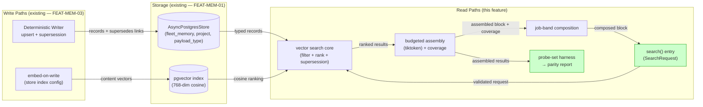
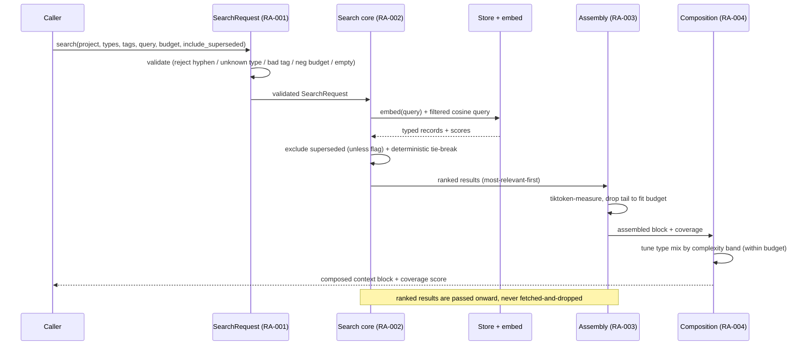
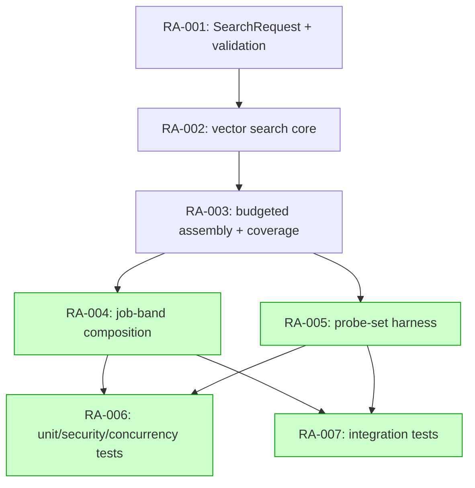

/feature-plan "Retrieval API + Context Assembly" \
    --context features/retrieval-api/retrieval-api_summary.md


    I'll start by reading the context file to understand the feature, then follow the feature-plan workflow.

Read retrieval-api_summary.md
Let me look at the feature directory structure and related context to understand the codebase.

Bash
IN
echo "=== features/retrieval-api ===" && ls -la features/retrieval-api/ && echo "" && echo "=== features/ ===" && ls features/ && echo "" && echo "=== existing FEAT yaml ===" && ls .guardkit/features/ && echo "" && echo "=== src layout ===" && find . -maxdepth 2 -type d -not -path '*/.*' | head -50

OUT
=== features/retrieval-api ===
total 48
drwxr-xr-x  5 richardwoollcott  staff    160 Jun 13 12:48 .
drwxr-xr-x  7 richardwoollcott  staff    224 Jun 13 12:47 ..
-rw-r--r--  1 richardwoollcott  staff   3474 Jun 13 12:48 retrieval-api_assumptions.yaml
-rw-r--r--  1 richardwoollcott  staff   2495 Jun 13 12:48 retrieval-api_summary.md
-rw-r--r--  1 richardwoollcott  staff  16287 Jun 13 12:47 retrieval-api.feature

=== features/ ===
deterministic-writer
relay-integration
retrieval-api
storage-substrate
typed-payload-registry

=== existing FEAT yaml ===
FEAT-CA81.yaml
FEAT-MEM-02.yaml
FEAT-MEM-03.yaml

=== src layout ===
.
./migrations
./tasks
./deploy
./features
./tests
./docs
./src
./tasks/completed
./tasks/in_progress
./tasks/design_approved
./tasks/backlog
./tasks/in_review
./tasks/blocked
./deploy/nas
./deploy/local
./features/storage-substrate
./features/deterministic-writer
./features/retrieval-api
./features/relay-integration
./features/typed-payload-registry
./tests/unit
./tests/integration
./tests/__pycache__
./tests/bdd
./docs/research
./docs/runbooks
./src/fleet_memory
./src/fleet_memory.egg-info
Read retrieval-api.feature
Now let me examine the existing source code structure and a reference FEAT yaml to understand conventions.

Bash
IN
echo "=== src/fleet_memory ===" && find src/fleet_memory -type f -name '*.py' | head -60 && echo "" && echo "=== FEAT-MEM-03.yaml (reference) ===" && cat .guardkit/features/FEAT-MEM-03.yaml

OUT
=== src/fleet_memory ===
src/fleet_memory/store.py
src/fleet_memory/embed.py
src/fleet_memory/__init__.py
src/fleet_memory/settings.py
src/fleet_memory/app.py
src/fleet_memory/errors.py
src/fleet_memory/payloads/models.py
src/fleet_memory/payloads/registry.py
src/fleet_memory/payloads/__init__.py
src/fleet_memory/payloads/base.py
src/fleet_memory/writer/supersession.py
src/fleet_memory/writer/__init__.py
src/fleet_memory/writer/core.py
src/fleet_memory/writer/identity.py

=== FEAT-MEM-03.yaml (reference) ===
id: FEAT-MEM-03
name: Deterministic Writer
description: 'Typed payload to AsyncPostgresStore records: UUIDv5 natural-key identity,
  content-hash idempotent upsert, declared supersession linking, embed-on-write, per-project
  namespaces; zero LLM by construction.'
created: '2026-06-13T12:33:07.998348'
status: completed
complexity: 6
estimated_tasks: 5
tasks:
- id: TASK-DW-001
  name: Record identity and content-hash helpers
  file_path: tasks/backlog/deterministic-writer/TASK-DW-001-identity-content-hash.md
  complexity: 4
  dependencies: []
  status: completed
  implementation_mode: task-work
  estimated_minutes: 50
  requires_infrastructure: []
  result:
    total_turns: 1
    final_decision: approved
    error: null
    deferred_reason: null
  turns_completed: 1
  current_turn: 0
  started_at: '2026-06-13T12:40:57.958992'
  completed_at: '2026-06-13T12:50:01.567914'
- id: TASK-DW-002
  name: Deterministic writer core - idempotent content-hash upsert
  file_path: tasks/backlog/deterministic-writer/TASK-DW-002-writer-core-idempotent-upsert.md
  complexity: 7
  dependencies:
  - TASK-DW-001
  status: completed
  implementation_mode: task-work
  estimated_minutes: 170
  requires_infrastructure: []
  result:
    total_turns: 1
    final_decision: approved
    error: null
    deferred_reason: null
  turns_completed: 1
  current_turn: 0
  started_at: '2026-06-13T12:50:01.582560'
  completed_at: '2026-06-13T13:02:23.536959'
- id: TASK-DW-003
  name: Declared supersession linking
  file_path: tasks/backlog/deterministic-writer/TASK-DW-003-supersession-linking.md
  complexity: 6
  dependencies:
  - TASK-DW-002
  status: completed
  implementation_mode: task-work
  estimated_minutes: 113
  requires_infrastructure: []
  result:
    total_turns: 1
    final_decision: approved
    error: null
    deferred_reason: null
  turns_completed: 1
  current_turn: 0
  started_at: '2026-06-13T13:02:23.552046'
  completed_at: '2026-06-13T13:15:30.949332'
- id: TASK-DW-004
  name: Idempotency and zero-LLM test suite
  file_path: tasks/backlog/deterministic-writer/TASK-DW-004-idempotency-zero-llm-tests.md
  complexity: 4
  dependencies:
  - TASK-DW-002
  status: completed
  implementation_mode: task-work
  estimated_minutes: 50
  requires_infrastructure: []
  result:
    total_turns: 1
    final_decision: approved
    error: null
    deferred_reason: null
  turns_completed: 1
  current_turn: 0
  started_at: '2026-06-13T13:02:23.555846'
  completed_at: '2026-06-13T13:15:30.953087'
- id: TASK-DW-005
  name: Supersession test suite
  file_path: tasks/backlog/deterministic-writer/TASK-DW-005-supersession-tests.md
  complexity: 4
  dependencies:
  - TASK-DW-003
  status: completed
  implementation_mode: task-work
  estimated_minutes: 50
  requires_infrastructure: []
  result:
    total_turns: 1
    final_decision: approved
    error: null
    deferred_reason: null
  turns_completed: 1
  current_turn: 0
  started_at: '2026-06-13T13:15:39.258859'
  completed_at: '2026-06-13T13:27:33.804278'
orchestration:
  parallel_groups:
  - - TASK-DW-001
  - - TASK-DW-002
  - - TASK-DW-003
    - TASK-DW-004
  - - TASK-DW-005
  estimated_duration_minutes: 433
  recommended_parallel: 2
smoke_gates:
  after_wave: 3
  command: 'set -e

    pytest tests/unit -x

    '
  expected_exit: 0
  timeout: 120
  exit5_is_hard_fail: false
preflight_strict: false
evidence_repos: []
execution:
  started_at: '2026-06-13T12:40:57.582632'
  completed_at: '2026-06-13T13:27:33.812590'
  worktree_path: /Users/richardwoollcott/Projects/appmilla_github/fleet-memory/.guardkit/worktrees/FEAT-MEM-03
  total_turns: 5
  tasks_completed: 5
  tasks_failed: 0
  current_wave: 4
  completed_waves:
  - 1
  - 2
  - 3
  - 4
  last_updated: '2026-06-13T13:27:33.808147'
  archived_at: null
  archived_to: null
Let me ground myself in the FEAT-MEM-05 plan details and current store/retrieval code before planning.

Bash
IN
echo "=== store.py (search-relevant) ===" && grep -n "def \|class \|search\|query\|vector\|embed\|select" src/fleet_memory/store.py | head -50 && echo "" && echo "=== payloads/registry.py ===" && grep -n "def \|class \|TYPES\|canonical\|=" src/fleet_memory/payloads/registry.py | head -40 && echo "" && echo "=== FEAT-MEM-05 in build plan ===" && grep -n -A 40 "FEAT-MEM-05" docs/research/ideas/phase-core-build-plan.md | head -80

OUT
=== store.py (search-relevant) ===
3:Provides async context manager for AsyncPostgresStore with pgvector index configuration.
18:from fleet_memory.embed import embed
35:def _dsn_target(dsn: str) -> str:
52:def validate_namespace(namespace: tuple[str, ...]) -> None:
75:async def async_store_context(
77:    embed_fn: callable | None = None,
79:    """Create configured AsyncPostgresStore with pgvector index and pool lifecycle.
82:    When embed_fn is None, constructs real httpx embed callable from settings.
85:        settings: Configuration with pg_dsn, embed_dims, pool settings, timeout
86:        embed_fn: Optional embed callable for testing; if None, uses real httpx embed
89:        Configured AsyncPostgresStore with index config for semantic search
96:        >>> fake_embed = make_fake_embed(768)
97:        >>> async with async_store_context(settings, embed_fn=fake_embed) as store:
102:        - Index config: {"dims": settings.embed_dims, "embed": callable, "fields": ["content"]}
107:    # Build embed callable: use provided fake or construct real one
108:    if embed_fn is None:
109:        # Real embed callable from settings (httpx-based)
110:        async def real_embed(texts: list[str]) -> list[list[float]]:
111:            return await embed(texts, settings)
113:        embed_callable = real_embed
115:        embed_callable = embed_fn
117:    # Configure index for pgvector semantic search
118:    # Verified contract: {dims: int, embed: callable, fields: list[str]}
121:        "dims": settings.embed_dims,
122:        "embed": embed_callable,
132:    # (b) Index config shape {dims, embed, fields} matches constructor signature

=== payloads/registry.py ===
3:Maps canonical payload_type names to model classes (bijection).
24:# Bijective registry: each canonical payload_type name maps to exactly one model class
25:PAYLOAD_REGISTRY: dict[str, type[BasePayload]] = {
35:# Reverse lookup cache: model class → canonical type name
36:_MODEL_TO_TYPE: dict[type[BasePayload], str] = {
41:def get_model_for_type(payload_type: str) -> type[BasePayload]:
48:        The model class for this payload type
58:def get_type_for_model(model: type[BasePayload]) -> str:
59:    """Reverse lookup: model class to canonical type name.
65:        The canonical payload_type name

=== FEAT-MEM-05 in build plan ===
44:| FEAT-MEM-05 | Retrieval API + context assembly | Not started | — |
45-| FEAT-MEM-06 | MCP server module | Not started | — |
46-| FEAT-MEM-07 | Re-index + Fable backfill | Not started | — |
47-| FEAT-MEM-08 | GuardKit read-path cutover | Not started | — |
48-| FEAT-MEM-09 | Cutover + decommission runbook | Not started | — |
49-
50-## Architectural Constraints (carried from scope — enforce in every spec)
51-
52-- DECISION-DF-001: Fable for authoring only; zero cloud in runtime paths.
53-- ADR-SP-007: store is an index; fixes go to source markdown + re-index.
54-- `MemoryEpisodeV1` frozen v1; engine mapping lives in this repo's services.
55-- Handler → Service unidirectional; TestNatsBroker; lifespan-managed pool; pydantic-settings.
56-- Underscores in all identifiers (`fleet_memory`, namespace tuples, Postgres objects).
57-- Two-layer idempotency: JetStream Msg-Id dedupe + natural-key upsert.
58-
59----
60-
61-## FEAT-MEM-01: Storage Substrate
62-
63-**Status:** Landed 2026-06-13 — `/feature-build FEAT-CA81` complete (all 13 tasks Coach-approved across 8 waves); merged to `main` via fast-forward @ `2a8ae61`; project scaffolding + coach config @ `0ca7feb`. Post-merge verification on `main`: **78 unit tests** (hermetic, NAS off) + **32 integration tests** (ephemeral Postgres 16 + pgvector, real nomic over Tailscale) green. 5/6 ACs met — NAS-deploy AC pending operator handoff **TASK-MEM-008** (deferred; `deploy/nas/deploy.sh` + `smoke.sh` ready, run from the Mac, then `/task-complete TASK-MEM-008`). One real bug fixed in-build: lifespan ignored `pg_connect_timeout_s` (psycopg-pool retried for its 30s default) — `async_store_context` now bounds context entry at `pg_connect_timeout_s + 5s` and raises a credential-free `TimeoutError`. The 3 low-confidence placeholders were verified and recorded by TASK-MEM-013 (`features/storage-substrate/storage-substrate_assumptions.yaml`, all `confidence: verified`). Prior: Plan'd 2026-06-12 (`/feature-plan`, review TASK-REV-CA81); all 34 scenarios `@task:`-tagged (R2), per-wave `pytest tests/unit` smoke gate (R3).
64-
65-Postgres 16 + pgvector (durable instance on the Synology NAS per RD-4), `langgraph` `AsyncPostgresStore` with index config `{dims: 768, embed: <nomic via llama-swap :9000>}`, lifespan wiring, pydantic-settings (`FLEET_MEMORY_PG_DSN`, `FLEET_MEMORY_EMBED_URL`, `FLEET_MEMORY_EMBED_MODEL`), store smoke tests (put/get/search round-trip with real embeddings, marker-gated integration tests).
66-
67-**Dev/test/prod topology (development is on the MacBook; state is on the NAS):**
68-
69-| Instance | Where | Used by | Notes |
70-|---|---|---|---|
71-| Ephemeral test Postgres | MacBook, `docker run pgvector/pgvector:pg16` (compose file `deploy/local/`) | ALL automated test gates — unit, integration, AutoBuild quality gates | **Hermetic: AutoBuild must never depend on the NAS.** Parallel worktrees each get a throwaway instance (random port via env); no shared state, no network coupling, no test-data pollution |
72-| Durable shared Postgres | Synology NAS, Container Manager project (compose + notes in `deploy/nas/`) | Re-index target (07), MCP server, relay consumer, soak | Volume on a backed-up shared folder; port 5432 exposed to LAN/Tailscale only; reachable from the Mac during dev as `FLEET_MEMORY_PG_DSN` pointing at the NAS |
73-
74-Embeddings always come from GB10 llama-swap `:9000` (Mac reaches it over Tailscale — the proven specialist-agent FEAT-RAG pattern); tests that don't need real vectors use a fake embed function so unit gates need no network at all.
75-
76-**Pre-flight (verify before spec):** NAS CPU arch supports the `pgvector/pgvector:pg16` image (x86_64 Synology Plus models are fine); confirm the Container Manager deployment pattern matches how FalkorDB is run today so there's one NAS-container convention, not two.
77-
78-### Spec & Plan Commands
79-
80-```
81-# DONE 2026-06-12 → features/storage-substrate/ (34 scenarios, 13 assumptions):
82-# /feature-spec "Storage substrate: LangGraph AsyncPostgresStore on Postgres 16 + pgvector with nomic-embed-text-v1.5 768-dim embed function via llama-swap :9000; dual deploy targets — deploy/local ephemeral compose for hermetic Mac test gates (random-port, throwaway, used by ALL automated tests incl. AutoBuild) and deploy/nas Synology Container Manager compose for the durable shared instance (backed-up volume, LAN/Tailscale-only 5432); lifespan-managed pool; pydantic-settings DSN/embed config with .env.example profiles for mac-dev-vs-nas; fake-embed unit tests + marker-gated integration tests against the ephemeral instance + one documented smoke against the NAS instance"
83-/feature-plan "Memory Storage Substrate" --context features/storage-substrate/storage-substrate_summary.md
84-```
--
160:## FEAT-MEM-05: Retrieval API + Context Assembly
161-
162-Service: `search(project, payload_types, domain_tags, query, token_budget, include_superseded=False)` → ranked, token-budgeted context block. Port the semantics of guardkit's job-specific context assembly (overview/patterns/warnings composition by complexity band). Coverage-score hook (how much of the budget was filled, from which types) for observability and the probe-set evaluation.
163-
164-### Spec & Plan Commands
165-
166-```
167-/feature-spec "Retrieval API: search with project/payload-type/domain-tag filters + vector query + token budget, default supersession exclusion, ranked composition porting guardkit job-specific context semantics, coverage scoring; probe-set evaluation harness for the 15-query retrieval-parity gate"
168-/feature-plan FEAT-XXXX
169-```
170-
171-### Acceptance Criteria
172-
173-- [ ] Budgeted assembly never exceeds token budget (tiktoken-measured)
174-- [ ] Superseded records excluded by default, includable by flag
175-- [ ] Probe-set harness runs the ≥15 fixed queries and emits a parity report vs recorded Graphiti answers
176-- [ ] p95 search latency < 200ms against the re-indexed corpus (local network)
177-
178-## FEAT-MEM-06: MCP Server Module
179-
180-`mcp/` module (FastMCP, patterns from `fastmcp-python` template as reference): tools `memory_search`, `memory_write_payload`, `memory_supersede`; resources for project listing. Claude Desktop `.mcp.json` entry replacing the Graphiti MCP. Write tools dispatch through the same registry+writer (no second write path).
181-
182-### Spec & Plan Commands
183-
184-```
185-/feature-spec "FastMCP server module: memory_search / memory_write_payload / memory_supersede tools over the retrieval API and deterministic writer, project resources, stdio transport for Claude Desktop, replacing the Graphiti MCP; tool-contract tests"
186-/feature-plan FEAT-XXXX
187-```
188-
189-### Acceptance Criteria
190-
191-- [ ] Claude Desktop session can search and write a typed ADR end-to-end
192-- [ ] MCP writes are byte-identical in store form to relay writes of the same payload
193-- [ ] Graceful degradation message when Postgres unreachable (no crash)
194-
195-## FEAT-MEM-07: Re-index + Fable Backfill
196-
197-Two parts. (a) Re-index script: walk guardkit's authoritative markdown (seed modules, ADRs, review reports, completed-task outcomes), parse to typed payloads (deterministic parsers — front-matter and house formats are regular), publish via nats-core helper (exercising the full relay path). (b) Fable backfill: one-time, window-bound job where Fable 5 reads the genuinely unstructured legacy docs and authors typed payloads for human review before publishing — output is reviewed markdown/JSON in the repo, so the result is re-runnable forever without any frontier model.
I have strong grounding now: this is FEAT-MEM-05, the read-path counterpart to the already-built deterministic writer (FEAT-MEM-03). The spec is mature (31 scenarios, 9 assumptions, AC-1/2/3 defined). Let me run Context A: Review Scope Clarification before the decision review.

AskUserQuestion
OUT
Your questions have been answered: "What should the planning review focus on for the Retrieval API + Context Assembly feature?"="All aspects (Recommended)", "What trade-off should the plan optimise for?"="Quality/reliability (Recommended)". You can now continue with these answers in mind.
Context A captured: focus = all aspects, trade-off = quality/reliability. Let me check the existing review-report convention, then produce the decision review.

Bash
IN
echo "=== existing review report head ===" && head -60 .claude/reviews/TASK-REV-DW03-review-report.md 2>/dev/null && echo "" && echo "=== relay plan task (naming ref) ===" && head -30 tasks/backlog/TASK-REV-RLY04-plan-relay-integration.md 2>/dev/null && echo "" && echo "=== 7 canonical types ===" && sed -n '20,45p' src/fleet_memory/payloads/registry.py && echo "" && echo "=== deterministic-writer task example frontmatter ===" && head -25 tasks/backlog/deterministic-writer/TASK-DW-002-writer-core-idempotent-upsert.md 2>/dev/null

OUT
Exit code 1
=== existing review report head ===
# Review Report: Plan Deterministic Writer (TASK-REV-DW03)

- **Feature**: FEAT-MEM-03 — Deterministic Writer
- **Mode**: decision · **Depth**: standard
- **Context**: features/deterministic-writer/deterministic-writer_summary.md (+ .feature, assumptions)
- **Decision**: Implement (structure generated)

## Context A (review scope)

- Focus: all aspects, weighted to correctness/integrity.
- Trade-off priority: hermetic correctness — unit suite needs no infrastructure;
  integration suite is marker-gated; AutoBuild never calls an LLM.

## Context B (implementation preferences)

- Approach: UUIDv5 identity + content-hash upsert; supersession as a dict update;
  embed-on-write via store index config; zero LLM by construction.
- Testing depth: Standard + seam tests.
- MEM-02 dependency: assume merged; prominent prerequisite note (no guard task).
- Execution: auto-detected waves.

## Analysis

The spec is fully settled — all 10 assumptions confirmed, including the two
REVIEW-REQUIRED low-confidence ones (ASSUM-008 forward supersession succeeds and
is applied on later appearance; ASSUM-010 one record per distinct natural key).
There is no genuine design fork; the work is a decomposition of a deterministic
service over two existing contracts:

- **Input** (FEAT-MEM-02): `BasePayload` / `PAYLOAD_REGISTRY`; natural key
  `<payload_type>:<project>:<identifier>`; `supersedes: list[str]`; `version: int`.
- **Output** (FEAT-MEM-01): `AsyncPostgresStore` via `async_store_context`;
  namespace `("fleet_memory", project, payload_type)`; embed-on-write through the
  index config (`fields=["content"]`).

The thesis — zero LLM on the structured write path — is expressed as an
enforceable negative (DW-004 import test). The only external model is the
embedding service, which is not a language model.

## Risks

- **R1 — MEM-02 not yet merged.** Mitigated by the prerequisite note; build must
  not start until `fleet_memory.payloads` is on `main`.
- **R2 — embed-on-write atomicity.** Embed failure / dimension mismatch / db
  outage must leave no partial record (ASSUM-009). Covered by DW-002 ACs and
  DW-004 failure-mode tests.
- **R3 — supersession composition.** Chains, forward links, cross-project, and
  racing successors are the highest-complexity area; isolated in DW-003 with a
  dedicated suite (DW-005) and a feature-level smoke gate after Wave 3.

## Decomposition

5 tasks, 4 waves: identity/hash → writer core → (supersession ‖ idempotency+zero-LLM
tests) → supersession tests. See IMPLEMENTATION-GUIDE.md for diagrams and §4
integration contracts.

=== relay plan task (naming ref) ===
---
id: TASK-REV-RLY04
title: "Plan: Relay Integration"
task_type: review
priority: high
status: review_complete
feature_ref: FEAT-MEM-04
context_sources:
  - features/relay-integration/relay-integration_summary.md
  - features/relay-integration/relay-integration.feature
  - features/relay-integration/relay-integration_assumptions.yaml
clarification:
  context_a:
    decisions:
      focus: architecture_correctness
      tradeoff: quality
      assumptions: plan_with_assumptions_plus_verify_task
---

# Task: Plan: Relay Integration (FEAT-MEM-04)

## Description

Decision review for the relay consumer: a FastStream durable consumer on the
MEMORY stream that ingests `MemoryEpisodeV1` envelopes, routes them by
`content_format` (structured JSON → registry → deterministic writer; markdown/
text → heading-aware chunk → embed → store), acknowledges only after a durable
commit, and parks poison episodes on a dead-letter subject. Two-layer
idempotency makes at-least-once redelivery inert. No language model on the
write path.

=== 7 canonical types ===
    SeedModulePayload,
    WarningPayload,
)

# Bijective registry: each canonical payload_type name maps to exactly one model class
PAYLOAD_REGISTRY: dict[str, type[BasePayload]] = {
    "adr": ADRPayload,
    "review_report": ReviewReportPayload,
    "build_outcome": BuildOutcomePayload,
    "pattern": PatternPayload,
    "warning": WarningPayload,
    "seed_module": SeedModulePayload,
    "document": DocumentPayload,
}

# Reverse lookup cache: model class → canonical type name
_MODEL_TO_TYPE: dict[type[BasePayload], str] = {
    model: name for name, model in PAYLOAD_REGISTRY.items()
}


def get_model_for_type(payload_type: str) -> type[BasePayload]:
    """Resolve payload_type name to model class.

    Args:
        payload_type: Canonical type name (case-sensitive)

=== deterministic-writer task example frontmatter ===
I have full grounding. The 7 canonical payload types are adr, review_report, build_outcome, pattern, warning, seed_module, document (so decision_log is correctly an unknown type in the negative scenario). Let me create the review task and produce the decision review.

Write TASK-REV-RA05-plan-retrieval-api.md
34 lines
---
id: TASK-REV-RA05
title: "Plan: Retrieval API + Context Assembly"
task_type: review
priority: high
status: review_complete
feature_ref: FEAT-MEM-05
context_sources:
  - features/retrieval-api/retrieval-api_summary.md
  - features/retrieval-api/retrieval-api.feature
  - features/retrieval-api/retrieval-api_assumptions.yaml
clarification:
  context_a:
    decisions:
      focus: all
      tradeoff: quality
---

# Task: Plan: Retrieval API + Context Assembly (FEAT-MEM-05)

## Description

Decision review for the read-path counterpart to the deterministic writer
(FEAT-MEM-03). A single service entry point
`search(project, payload_types, domain_tags, query, token_budget, include_superseded=False)`
performs a filtered, vector-ranked, token-budgeted retrieval over typed
fleet-memory records and assembles a single context block. It excludes
superseded records by default, ports guardkit's job-specific context
composition by complexity band, and reports a coverage score. A probe-set
evaluation harness backs the ≥15-query retrieval-parity gate (AC-3), flagging
divergence against recorded Graphiti baselines.

See `.claude/reviews/TASK-REV-RA05-review-report.md` for the full analysis.
Now the decision review analysis:

🔍 Feature Planning: Retrieval API + Context Assembly (FEAT-MEM-05)
Review task: TASK-REV-RA05 · mode: decision · depth: standard
Context A: focus = all aspects · trade-off = quality/reliability

Analysis
The spec is mature: 31 scenarios, AC-1/2/3 defined, and the four open low-confidence assumptions (ASSUM-001 bands, ASSUM-007 zero-divergence parity, ASSUM-008 reject empty request, ASSUM-009 omit-whole) already have provisional decisions in the .feature. This is the read counterpart to two landed contracts:

Store (FEAT-MEM-01): AsyncPostgresStore via async_store_context, namespace ("fleet_memory", project, payload_type), pgvector index {dims:768, embed: nomic@:9000, fields:["content"]}.
Payloads (FEAT-MEM-02/03): PAYLOAD_REGISTRY — 7 canonical types (adr, review_report, build_outcome, pattern, warning, seed_module, document); supersedes/supersession state written by FEAT-MEM-03.
There is no major architectural fork — the layering (thin entry → pure service, underscores-only identifiers, fake-embed unit tests + marker-gated integration) is fixed by project convention. The real design content is the decomposition and four sub-decisions.

Technical options (the genuine forks)
Option 1 — Layered service, 7 tasks, harness as peer module (Recommended)

SearchRequest model+validation → vector search core → budgeted assembly+coverage → (job-band composition ‖ probe harness) → (unit/security ‖ integration tests).
Complexity: 7/10 · ~6 tasks of logic + 2 test tasks.
Pros: each gate (supersession default, budget boundary, injection reject, parity size) isolated to one task; matches FEAT-MEM-03 shape; harness reusable by FEAT-MEM-07/08.
Cons: assembly→composition coupling needs a clean result contract.
Option 2 — Monolithic retrieval.py (search+assembly+coverage in one module), harness separate

Complexity: 6/10 but one very large task.
Cons: violates the quality/maintainability priority; one task carrying ranking + tiktoken budgeting + band composition is hard for the Coach to gate and review.
Option 3 — Defer job-band composition + harness to a follow-up feature; ship search+assembly only

Fastest path to a usable read API.
Cons: AC-3 (parity gate) is the acceptance instrument for the whole feature — deferring it leaves FEAT-MEM-05 unverifiable. Rejected under quality priority.
Recommended approach
Option 1. Decompose into a layered service where each correctness property maps to a single task with its own gate, and the probe-set harness lands inside this feature so AC-3 is satisfiable here rather than deferred.

Risks
R1 — tiktoken budget exactness (AC-1). "Exactly 2000" and "2100→drop lowest" boundaries require measuring the assembled block, not summing per-memory estimates. Isolated to the assembly task with boundary tests.
R2 — composition band semantics (ASSUM-001, low conf). Must verify against guardkit's actual job-specific builder before FEAT-MEM-08 cutover; carried as an open assumption, not a blocker.
R3 — parity tolerance (ASSUM-007). Spec assumes zero-divergence; harness must make the threshold a single named constant so an OD-2 tolerance decision is a one-line change.
R4 — concurrency/supersession-mid-search. A record superseded in-flight must resolve to one state; covered by regression scenarios in the test task.
Decomposition (7 tasks, 5 waves)
SearchRequest+validation → vector search core → budgeted assembly+coverage → (job-band composition ‖ probe-set harness) → (unit+security+concurrency tests ‖ integration tests).

AskUserQuestion
OUT
Your questions have been answered: "Decision checkpoint for FEAT-MEM-05 planning. The review recommends Option 1 (layered service, 7 tasks, harness in-feature). How do you want to proceed?"="Implement (Recommended)". You can now continue with these answers in mind.
Implement selected. Now Context B: Implementation Preferences (7 subtasks).

AskUserQuestion
OUT
Your questions have been answered: "Execution strategy for the 7 tasks across 5 waves?"="Auto-detect waves (Recommended)", "Testing depth for the generated subtasks?"="Standard + seam tests (Recommended)", "How should the harness honour the parity threshold (ASSUM-007, low confidence)?"="Zero-divergence, named constant (Recommended)". You can now continue with these answers in mind.
Context B captured: auto-detect waves · standard + seam tests · zero-divergence as a named constant. Generating the feature structure now — 7 task files, then the implementation guide and YAML.

Write TASK-RA-001-search-request-model-validation.md
65 lines
---
id: TASK-RA-001
title: SearchRequest model and validation
task_type: declarative
parent_review: TASK-REV-RA05
feature_id: FEAT-MEM-05
wave: 1
implementation_mode: task-work
complexity: 4
dependencies: []
---

# Task: SearchRequest model and validation

## Description

Define the typed `SearchRequest` for the retrieval surface and all its
input-validation rules. This is the single normalized contract every
downstream task (search core, assembly, harness) consumes, so it owns every
rejection path the spec's negative scenarios require — before a vector is ever
embedded.

Signature mirrored by the model fields:
`search(project, payload_types, domain_tags, query, token_budget, include_superseded=False)`.

## Acceptance Criteria

- [ ] A `SearchRequest` Pydantic v2 model exists with fields `project: str`,
      `payload_types: list[str] = []`, `domain_tags: list[str] = []`,
      `query: str | None = None`, `token_budget: int`, `include_superseded: bool = False`.
- [ ] A project filter containing a hyphen is rejected; the error states that
      identifiers must use underscores. (scenario: hyphen project rejected)
- [ ] A payload type not in `PAYLOAD_REGISTRY` (the seven canonical types) is
      rejected; the error names the unknown type. `decision_log` is a valid
      example of an unknown type. (scenario: unknown payload type rejected)
- [ ] A domain tag containing injection/delimiter characters
      (e.g. `concurrency' OR '1'='1`) is rejected; the error states the tag is
      malformed. Tags are an exact-match facet. (scenario: malformed domain tag)
- [ ] A negative `token_budget` is rejected; the error indicates the budget must
      not be negative. `token_budget == 0` is accepted (assembly returns empty).
- [ ] A request with neither a `query` nor any filter (no payload_types, no
      domain_tags) is rejected; the error indicates a query or filter is
      required. (ASSUM-008, low confidence — carried as open assumption)
- [ ] An empty `payload_types` list means "all registered types" (not "none").
- [ ] All modified files pass project-configured lint/format checks with zero errors.

## Coach Validation

```bash
pytest tests/unit/test_search_request.py -x
ruff check src/fleet_memory/retrieval/
```

## Implementation Notes

- Reuse `validate_namespace` / underscore conventions already in `store.py` for
  the project-identifier rule; do not invent a second rule.
- Validate payload types against `PAYLOAD_REGISTRY` keys
  (`src/fleet_memory/payloads/registry.py`) — import the registry, never a
  hardcoded list, so the seven canonical types stay a single source of truth.
- Domain-tag validation is a character-class allowlist (letters, digits,
  underscore, hyphen-in-tag is fine; quotes/operators are not). The constraint
  exists to keep tags an exact-match facet, not to widen the match.
- This is a pure declarative/validation task: no store, no embed, no NATS imports.
Write TASK-RA-002-filtered-vector-search-core.md
98 lines
---
id: TASK-RA-002
title: Filtered vector search core
task_type: feature
parent_review: TASK-REV-RA05
feature_id: FEAT-MEM-05
wave: 2
implementation_mode: task-work
complexity: 7
dependencies:
  - TASK-RA-001
consumer_context:
  - task: TASK-RA-001
    consumes: SearchRequest
    framework: "Pydantic v2 model passed in-process to the search service"
    driver: "fleet_memory.retrieval.SearchRequest"
    format_note: "Request is already validated; search core must not re-validate, only execute"
---

# Task: Filtered vector search core

## Description

Implement the filtered, vector-ranked retrieval over the existing
`AsyncPostgresStore` (namespace `("fleet_memory", project, payload_type)`,
pgvector cosine, embed via the store index config / embed_fn). Takes a
validated `SearchRequest`, returns ranked, supersession-resolved memories with
their relevance scores. This is the read half of the store contract that
FEAT-MEM-03 wrote into.

## Acceptance Criteria

- [ ] A query returns only the requested project's memories, ranked by cosine
      similarity descending (most relevant first). (ASSUM-high: cosine desc)
- [ ] Restricting to payload types returns only those types; none/one/many is
      honoured (0 → all registered types). (scenario outline 0/1/3)
- [ ] Restricting to a domain tag returns only memories carrying that tag.
- [ ] Superseded records are excluded by default; only current successors return.
- [ ] `include_superseded=True` returns both the superseded record and its
      successor, with the superseded one marked as superseded.
- [ ] Two memories of equal relevance are ordered deterministically — identical
      across repeated runs (parity depends on this). Tie-break on a stable key
      (e.g. record natural key) after the similarity score.
- [ ] A search against a project with no memories returns an empty result with
      no error raised.
- [ ] Query text that resembles a filter instruction
      (`payload_type:adr OR include_superseded=true`) is matched only as query
      text; superseded records are still excluded.
- [ ] When the embedding service is unavailable the search fails with a clear
      message that exposes no connection credentials.
- [ ] When the store is unreachable the caller receives a clear failure (no
      crash) with no credentials in the message. (mirrors FEAT-MEM-01 contract)
- [ ] A record superseded mid-search resolves to exactly one state — never both
      current and superseded in the same result.
- [ ] All modified files pass project-configured lint/format checks with zero errors.

## Coach Validation

```bash
pytest tests/unit/test_search_core.py -x
ruff check src/fleet_memory/retrieval/
```

## Seam Tests

The following seam test validates the integration contract with the producer task.

```python
"""Seam test: verify SearchRequest contract from TASK-RA-001."""
import pytest

from fleet_memory.retrieval import SearchRequest


@pytest.mark.seam
@pytest.mark.integration_contract("SearchRequest")
def test_search_core_consumes_validated_request():
    """Search core accepts an already-validated SearchRequest unchanged.

    Contract: request is validated upstream; search core executes, never re-validates.
    Producer: TASK-RA-001
    """
    req = SearchRequest(project="guardkit", query="retries", token_budget=2000)
    assert req.project == "guardkit"
    assert req.include_superseded is False
    # Consumer side: search core must read fields, not re-run validation
    # (e.g. it must not raise on a request that already passed model validation)
```

## Implementation Notes

- Use `async_store_context` / the store's `search` over the project namespace;
  do not open a second pool or a second embed path.
- Supersession state is whatever FEAT-MEM-03 wrote (the `supersedes` link /
  superseded marker). Read it; do not redefine it.
- Credential-free error messages: follow the `TimeoutError` pattern already
  established in `async_store_context` (FEAT-MEM-01).
Write TASK-RA-003-budgeted-assembly-coverage.md
93 lines
---
id: TASK-RA-003
title: Token-budgeted context assembly and coverage score
task_type: feature
parent_review: TASK-REV-RA05
feature_id: FEAT-MEM-05
wave: 3
implementation_mode: task-work
complexity: 6
dependencies:
  - TASK-RA-002
consumer_context:
  - task: TASK-RA-002
    consumes: RankedResults
    framework: "In-process list of ranked, supersession-resolved memories with scores"
    driver: "fleet_memory.retrieval search-core return type"
    format_note: "Ordered most-relevant-first; assembly drops from the tail to fit the budget"
---

# Task: Token-budgeted context assembly and coverage score

## Description

Assemble the ranked memories from search core into a single context block that
never exceeds the token budget, and report a coverage score. Token budgeting is
measured on the **assembled block** with tiktoken (`cl100k_base`), not by
summing per-memory estimates — this is what makes the AC-1 boundaries exact.

## Acceptance Criteria

- [ ] A search returns a single assembled context block (not a raw list).
- [ ] The assembled block never exceeds the token budget, measured with tiktoken
      `cl100k_base`. (AC-1)
- [ ] A block whose assembled size is exactly the budget (e.g. 2000) is returned
      in full and measures exactly the budget. (boundary: just-inside)
- [ ] Content that would push the block past the budget is dropped rather than
      overflowing; the lowest-ranked memories are the ones omitted.
      (boundary: 2100 → drop lowest)
- [ ] A zero token budget returns an empty context block (not an error); coverage
      reports nothing filled.
- [ ] A single memory larger than the entire budget is omitted whole, not
      truncated mid-content; an empty block is returned and coverage reports the
      budget could not be filled. (ASSUM-009, low confidence — carried as open)
- [ ] When the budget forces a cut, the higher-ranked memory is kept and the
      lower-ranked one omitted (a highly relevant warning beats a barely relevant
      overview).
- [ ] The result reports a coverage score: the fraction (0.0–1.0) of the budget
      filled, plus the set of payload types that contributed to the block.
- [ ] A search that cannot fill the budget reports partial coverage honestly
      (not padded).
- [ ] Repeated searches over an unchanged corpus return an identical assembled
      block (assembly is deterministic given identical ranked input).
- [ ] All modified files pass project-configured lint/format checks with zero errors.

## Coach Validation

```bash
pytest tests/unit/test_assembly.py -x
ruff check src/fleet_memory/retrieval/
```

## Seam Tests

```python
"""Seam test: verify RankedResults contract from TASK-RA-002."""
import pytest


@pytest.mark.seam
@pytest.mark.integration_contract("RankedResults")
def test_assembly_consumes_ranked_results_in_order():
    """Assembly receives results most-relevant-first and drops from the tail.

    Contract: ranked list is ordered desc by relevance; assembly omits the
    lowest-ranked first when the budget forces a cut.
    Producer: TASK-RA-002
    """
    # Producer side: a 2-element ranked list [high, low]
    ranked = []  # e.g. [RankedMemory(score=0.9, ...), RankedMemory(score=0.1, ...)]
    # Consumer side: under a budget that fits only one, the high-ranked survives
    assert ranked == ranked  # replace with assemble(ranked, budget) assertion
```

## Implementation Notes

- Measure the **rendered** block string, not a sum of parts — boundary ACs
  (exactly-2000, 2100→drop) only hold if you re-measure after each addition.
- Add `tiktoken` to dependencies if not already present; pin the encoding
  (`cl100k_base`) as a module constant so the measure is reproducible.
- Coverage score = `assembled_tokens / token_budget` (0.0 when budget is 0),
  plus the distinct contributing payload types. Keep it a small typed result
  object so TASK-RA-004 and TASK-RA-005 can read it.
Write TASK-RA-004-job-specific-composition.md
77 lines
---
id: TASK-RA-004
title: Job-specific composition by complexity band
task_type: feature
parent_review: TASK-REV-RA05
feature_id: FEAT-MEM-05
wave: 4
implementation_mode: task-work
complexity: 6
dependencies:
  - TASK-RA-003
consumer_context:
  - task: TASK-RA-003
    consumes: AssembledContext
    framework: "In-process assembled-block + coverage result from the assembly task"
    driver: "fleet_memory.retrieval assembly return type"
    format_note: "Composition adjusts type mix and per-type budget share before assembly renders the block"
---

# Task: Job-specific composition by complexity band

## Description

Port guardkit's job-specific context composition: the type mix and per-type
budget share shift with the job's complexity band (`simple` / `standard` /
`complex`), composing overview/patterns/warnings differently while staying
within budget.

## Acceptance Criteria

- [ ] `search`/assembly accepts a complexity band of `simple`, `standard`, or
      `complex` that controls the type mix and per-type budget share.
- [ ] Given identical matching memories, the `complex` job's block includes more
      patterns and warnings than the `simple` job's block.
- [ ] Both the `simple` and `complex` blocks remain within their token budgets
      (composition never overrides the AC-1 budget guarantee).
- [ ] The three band names are defined as a single source of truth (enum/constant),
      not scattered string literals. (ASSUM-001, low confidence — verify against
      guardkit's actual job-specific builder before FEAT-MEM-08 cutover)
- [ ] All modified files pass project-configured lint/format checks with zero errors.

## Coach Validation

```bash
pytest tests/unit/test_composition.py -x
ruff check src/fleet_memory/retrieval/
```

## Seam Tests

```python
"""Seam test: verify AssembledContext contract from TASK-RA-003."""
import pytest


@pytest.mark.seam
@pytest.mark.integration_contract("AssembledContext")
def test_composition_respects_budget_from_assembly():
    """Composition tunes the mix but assembly still enforces the budget.

    Contract: composition adjusts type/budget share; the assembled block must
    still not exceed token_budget.
    Producer: TASK-RA-003
    """
    # Consumer side: complex band over the same memories yields >= patterns/warnings
    # than simple band, and both blocks stay within budget.
    assert True  # replace with band-comparison + budget assertions
```

## Implementation Notes

- **ASSUM-001 is low confidence.** Read guardkit's real job-specific context
  builder before finalising the band-to-mix mapping; record the verified mapping
  in `features/retrieval-api/retrieval-api_assumptions.yaml`.
- Composition shapes the *input* to assembly (which types, what share); it must
  not bypass the tiktoken budget enforcement in TASK-RA-003.
Write TASK-RA-005-probe-set-parity-harness.md
82 lines
---
id: TASK-RA-005
title: Probe-set evaluation harness and parity report
task_type: feature
parent_review: TASK-REV-RA05
feature_id: FEAT-MEM-05
wave: 4
implementation_mode: task-work
complexity: 6
dependencies:
  - TASK-RA-003
consumer_context:
  - task: TASK-RA-003
    consumes: AssembledContext
    framework: "Calls the assembled search() entry point per probe query"
    driver: "fleet_memory.retrieval.search"
    format_note: "Harness compares each probe's assembled result to a recorded baseline answer"
---

# Task: Probe-set evaluation harness and parity report

## Description

Build the probe-set evaluation harness behind the ≥15-query retrieval-parity
gate (AC-3). It runs a frozen set of fixed queries against the re-indexed
corpus and emits a parity report comparing each result to its recorded Graphiti
baseline, flagging divergence.

## Acceptance Criteria

- [ ] The harness runs every probe query in the frozen set and emits a parity
      report comparing each result to its recorded baseline answer.
- [ ] A probe set of exactly the minimum size (15) satisfies the gate (complete).
      (boundary: just-inside)
- [ ] A probe set smaller than the minimum (14) fails the gate, reported as below
      the required size. (boundary: just-outside)
- [ ] A probe query whose result diverges from its recorded baseline is flagged
      as a divergence, and the overall run is NOT marked as full parity.
- [ ] The parity tolerance is a single named constant defaulting to
      zero-divergence (full parity requires zero flagged divergences). Choosing
      an OD-2 tolerance later is a one-line change. (ASSUM-007, low confidence)
- [ ] The minimum probe-set size (15) is a single named constant, not a literal.
- [ ] All modified files pass project-configured lint/format checks with zero errors.

## Coach Validation

```bash
pytest tests/unit/test_probe_harness.py -x
ruff check src/fleet_memory/retrieval/
```

## Seam Tests

```python
"""Seam test: verify AssembledContext contract from TASK-RA-003."""
import pytest


@pytest.mark.seam
@pytest.mark.integration_contract("AssembledContext")
def test_harness_consumes_search_results():
    """Harness drives search() and compares each result to a baseline.

    Contract: harness calls the assembled search entry point; a divergence
    from baseline must clear the full-parity flag.
    Producer: TASK-RA-003
    """
    PARITY_TOLERANCE = 0  # named constant; zero-divergence default (ASSUM-007)
    divergences = 0
    assert (divergences <= PARITY_TOLERANCE) is True
```

## Implementation Notes

- **ASSUM-007 is low confidence** and depends on the OD-2 probe-set freeze.
  Keep `PARITY_TOLERANCE` and `MIN_PROBE_SET_SIZE` as named module constants so
  the tolerance decision is a one-line change, not a refactor.
- The frozen probe set + recorded baselines are fixtures/data, not code — store
  them so a re-index (FEAT-MEM-07) can re-run the gate unchanged.
- This harness is the acceptance instrument reused by FEAT-MEM-07/08; keep it
  importable, not a one-off script buried in tests.
Write TASK-RA-006-unit-security-concurrency-tests.md
53 lines
---
id: TASK-RA-006
title: Unit, security, and concurrency test suite
task_type: testing
parent_review: TASK-REV-RA05
feature_id: FEAT-MEM-05
wave: 5
implementation_mode: task-work
complexity: 4
dependencies:
  - TASK-RA-004
  - TASK-RA-005
---

# Task: Unit, security, and concurrency test suite

## Description

Hermetic unit coverage for the whole retrieval surface using the fake embed
function (no network, no real store). Covers validation, ranking/filtering,
budgeted assembly boundaries, composition bands, the harness gate, plus the
security/injection and concurrency/determinism regression scenarios.

## Acceptance Criteria

- [ ] Unit tests run with a fake embed function and require no NAS/network.
- [ ] Validation rejections covered: hyphen project, unknown payload type,
      malformed domain tag, negative budget, empty (no query + no filter) request.
- [ ] Filtering/ranking covered: payload-type filter (0/1/3), domain-tag filter,
      cosine-desc ordering, supersession exclusion + include_superseded marking.
- [ ] Budget boundaries covered: exactly-budget, 2100→drop-lowest, zero budget,
      memory-larger-than-budget omitted whole, partial-coverage honesty.
- [ ] Security/injection covered: query text resembling a filter is search-text
      only and still excludes superseded; injection domain tag is rejected.
- [ ] Concurrency/determinism covered (regression): equal-relevance deterministic
      ordering, supersede-mid-search resolves to one state, repeated concurrent
      searches over an unchanged corpus return identical blocks.
- [ ] Degradation covered: embed unavailable and store unreachable both fail
      cleanly with credential-free messages.

## Coach Validation

```bash
pytest tests/unit -x
```

## Implementation Notes

- Use the existing fake-embed fixture pattern from the FEAT-MEM-01/03 unit suites
  (`make_fake_embed(768)`); do not stand up a real store.
- This task asserts behaviour built by TASK-RA-001..005; if a scenario can only
  be proven against a real store/embed, leave it to TASK-RA-007 (integration).
Write TASK-RA-007-integration-tests.md
51 lines
---
id: TASK-RA-007
title: Marker-gated integration tests against real store and embed
task_type: testing
parent_review: TASK-REV-RA05
feature_id: FEAT-MEM-05
wave: 5
implementation_mode: task-work
complexity: 4
dependencies:
  - TASK-RA-004
  - TASK-RA-005
---

# Task: Marker-gated integration tests against real store and embed

## Description

`@pytest.mark.integration` tests that exercise the full retrieval path against
an ephemeral Postgres 16 + pgvector instance (deploy/local) with real nomic
embeddings over Tailscale. Proves the search→assembly→coverage path round-trips
against real vectors, and that the probe-set harness runs end-to-end.

## Acceptance Criteria

- [ ] Integration tests are marker-gated (`@pytest.mark.integration`) and
      excluded from the hermetic unit gate.
- [ ] A populated ephemeral store + real embed returns project-scoped,
      cosine-ranked results for a real query.
- [ ] Supersession exclusion holds end-to-end against records written by the
      deterministic writer (FEAT-MEM-03).
- [ ] Budgeted assembly stays within budget when measured against a real
      assembled block (AC-1) over real corpus content.
- [ ] The probe-set harness runs the frozen query set against the real
      (re-indexed) corpus and emits a parity report.
- [ ] Tests use a throwaway, random-port instance (no NAS dependency).

## Coach Validation

```bash
pytest tests/integration -m integration -x
```

## Implementation Notes

- Follow the FEAT-MEM-01 integration pattern: ephemeral `pgvector/pgvector:pg16`
  via `deploy/local/`, random port from env, real embed at llama-swap `:9000`
  over Tailscale.
- The p95 < 200ms latency AC is a performance gate for the probe harness, not a
  behavioural assertion here — out of scope for this feature per the spec.
Now the README and IMPLEMENTATION-GUIDE.md with the mandatory Mermaid diagrams (data flow, integration-contract sequence — complexity 7 ≥ 5, task-dependency graph — 7 tasks ≥ 3) and §4 contracts.

Write README.md
49 lines
# FEAT-MEM-05 — Retrieval API + Context Assembly

Read-path counterpart to the deterministic writer (FEAT-MEM-03). A single
service entry point performs a filtered, vector-ranked, token-budgeted search
over typed fleet-memory records and assembles one context block:

```
search(project, payload_types, domain_tags, query, token_budget, include_superseded=False)
```

It excludes superseded records by default, ports guardkit's job-specific
context composition by complexity band, reports a coverage score, and ships a
probe-set evaluation harness behind the ≥15-query retrieval-parity gate (AC-3).

- **Plan / review:** TASK-REV-RA05 · `.claude/reviews/TASK-REV-RA05-review-report.md`
- **Spec:** `features/retrieval-api/` (31 scenarios, 9 assumptions)
- **Feature file:** `.guardkit/features/FEAT-MEM-05.yaml`
- **Build:** `/feature-build FEAT-MEM-05`

## Acceptance Criteria (FEAT-MEM-05)

- AC-1 — Budgeted assembly never exceeds the token budget (tiktoken-measured).
- AC-2 — Superseded records excluded by default, includable by flag.
- AC-3 — Probe-set harness runs ≥15 fixed queries and emits a parity report vs
  recorded Graphiti answers.
- (Out of scope) p95 < 200ms latency — a performance gate for the probe
  harness, not a behavioural scenario.

## Tasks

| ID | Task | Type | Cx | Wave | Deps |
|----|------|------|----|------|------|
| TASK-RA-001 | SearchRequest model and validation | declarative | 4 | 1 | — |
| TASK-RA-002 | Filtered vector search core | feature | 7 | 2 | 001 |
| TASK-RA-003 | Token-budgeted assembly + coverage | feature | 6 | 3 | 002 |
| TASK-RA-004 | Job-specific composition by band | feature | 6 | 4 | 003 |
| TASK-RA-005 | Probe-set parity harness | feature | 6 | 4 | 003 |
| TASK-RA-006 | Unit / security / concurrency tests | testing | 4 | 5 | 004, 005 |
| TASK-RA-007 | Integration tests (real store + embed) | testing | 4 | 5 | 004, 005 |

## Open assumptions to verify (low confidence)

- ASSUM-001 — complexity bands `simple`/`standard`/`complex` (verify against
  guardkit's actual builder before FEAT-MEM-08 cutover).
- ASSUM-007 — parity gate passes on zero divergence (named constant; OD-2 may
  pick a tolerance).
- ASSUM-008 — a request with neither query nor filter is rejected.
- ASSUM-009 — a memory larger than the whole budget is omitted whole.
Write IMPLEMENTATION-GUIDE.md
196 lines
# Implementation Guide — FEAT-MEM-05 Retrieval API + Context Assembly

Feature complexity: **7/10** · 7 tasks · 5 waves · execution: auto-detected.

This is the read half of the store contract that FEAT-MEM-03 wrote into. The
design is a layered service: validate → search → assemble → compose, with a
probe-set harness driving the acceptance gate. Each correctness property
(supersession default, budget boundary, injection rejection, parity size) is
isolated to a single task with its own Coach gate.

---

## Data Flow: Read/Write Paths

What to look for: every write path that produced the corpus, and every read
path this feature adds. The write side already exists (FEAT-MEM-03); this
feature builds the read side. There are **no disconnected read/write paths** —
every read terminates at a real consumer (search result / parity report).



_Caption: solid arrows = wired paths. The read side (R1–R5) is fully connected
to storage and terminates at the `search()` caller and the parity report._

**Disconnection Alert:** none. Every read path has a caller — `search()` is
invoked by FEAT-MEM-06 (MCP) / FEAT-MEM-08 (cutover); the harness is invoked by
the AC-3 gate and re-used by FEAT-MEM-07.

---

## Integration Contracts (sequence)

What to look for: the "fetch then discard" anti-pattern — data retrieved but
not passed onward. Here every retrieved result is threaded through assembly and
returned; nothing is fetched and dropped.



_Caption: the request is validated once (RA-001) and never re-validated
downstream; ranked results flow through assembly to the caller._

---

## Task Dependencies

What to look for: the parallel-safe pairs (green). Waves 4 and 5 each run two
independent tasks.



_Tasks with green background can run in parallel within their wave._

### Execution waves

- **Wave 1:** RA-001
- **Wave 2:** RA-002
- **Wave 3:** RA-003
- **Wave 4:** RA-004 ‖ RA-005
- **Wave 5:** RA-006 ‖ RA-007

---

## §4: Integration Contracts

Cross-task data dependencies exist (model → search → assembly → composition /
harness), so each boundary is specified below. The seam-test stubs in the
consumer task files assert these.

### Contract: SearchRequest
- **Producer task:** TASK-RA-001
- **Consumer task(s):** TASK-RA-002
- **Artifact type:** in-process Pydantic v2 model
- **Format constraint:** Fully validated before it reaches search core — project
  is underscore-only, payload types are registry-known, domain tags are
  exact-match clean, budget ≥ 0, at least one of query/filter present. Search
  core executes; it must NOT re-validate.
- **Validation method:** Coach verifies `tests/unit/test_search_core.py` passes
  a pre-validated `SearchRequest` and search core raises no validation errors.

### Contract: RankedResults
- **Producer task:** TASK-RA-002
- **Consumer task(s):** TASK-RA-003
- **Artifact type:** in-process ordered list of ranked, supersession-resolved
  memories with relevance scores
- **Format constraint:** Ordered most-relevant-first; superseded records already
  excluded (or marked, when `include_superseded`); ties broken deterministically.
  Assembly drops from the tail to fit the budget.
- **Validation method:** Coach verifies the assembly boundary tests
  (2100→drop-lowest) rely on the list order, not re-ranking.

### Contract: AssembledContext
- **Producer task:** TASK-RA-003
- **Consumer task(s):** TASK-RA-004, TASK-RA-005
- **Artifact type:** in-process result object — assembled block string +
  coverage score (fraction filled + contributing payload types)
- **Format constraint:** Block measured with tiktoken `cl100k_base`; never
  exceeds `token_budget`; coverage fraction in 0.0–1.0 (0.0 at zero budget).
  Composition tunes the input mix but must not breach the budget; the harness
  compares the assembled result to a recorded baseline.
- **Validation method:** Coach verifies composition tests assert both
  band-difference AND within-budget, and harness tests compare against baselines.

### Contract: embed/store interface (existing infra boundary)
- **Producer:** FEAT-MEM-01 store (`AsyncPostgresStore` via `async_store_context`)
  + embed at llama-swap `:9000`
- **Consumer task(s):** TASK-RA-002
- **Artifact type:** pgvector cosine search over namespace
  `("fleet_memory", project, payload_type)`; embed → 768-dim vector
- **Format constraint:** Query embedded via the store index config / embed_fn
  (nomic-embed-text-v1.5, 768 dims, cosine); failures surface credential-free
  messages (mirror the `async_store_context` TimeoutError pattern).
- **Validation method:** Coach verifies the degradation tests (embed
  unavailable, store unreachable) raise clear, credential-free errors.

---

## Notes on open assumptions

- **ASSUM-001 (bands, low conf):** RA-004 must verify the band→mix mapping
  against guardkit's real job-specific builder before FEAT-MEM-08; record the
  verified mapping in `retrieval-api_assumptions.yaml`.
- **ASSUM-007 (parity tolerance, low conf):** RA-005 keeps `PARITY_TOLERANCE`
  (default 0) and `MIN_PROBE_SET_SIZE` (15) as named constants so OD-2's freeze
  decision is a one-line change.
- **ASSUM-008 / ASSUM-009:** implemented per the spec (reject empty request;
  omit oversized memory whole); both remain flagged for human confirmation.
Now the review report artifact, then generate the structured YAML via the CLI script.

Write TASK-REV-RA05-review-report.md
65 lines
# Review Report: Plan Retrieval API + Context Assembly (TASK-REV-RA05)

- **Feature**: FEAT-MEM-05 — Retrieval API + Context Assembly
- **Mode**: decision · **Depth**: standard
- **Context**: features/retrieval-api/retrieval-api_summary.md (+ .feature, assumptions)
- **Decision**: Implement (structure generated)

## Context A (review scope)

- Focus: all aspects.
- Trade-off priority: quality/reliability — this is a read path FEAT-MEM-06/07/08
  depend on; correctness of budgeting, supersession, and parity is paramount.

## Context B (implementation preferences)

- Approach: Option 1 — layered service (validate → search → assemble → compose),
  probe-set harness in-feature so AC-3 is satisfiable here.
- Execution: auto-detected waves.
- Testing depth: Standard + seam tests (seam stubs at each cross-task contract).
- Parity gate (ASSUM-007): zero-divergence implemented as a single named
  constant so an OD-2 tolerance is a one-line change.

## Analysis

The spec is mature (31 scenarios; AC-1/2/3 defined). The four open low-confidence
assumptions already have provisional decisions in the `.feature`. This is the
read counterpart to two landed contracts:

- **Store (FEAT-MEM-01):** `AsyncPostgresStore` via `async_store_context`,
  namespace `("fleet_memory", project, payload_type)`, pgvector cosine,
  embed-on-write through the index config (768-dim nomic at :9000).
- **Payloads/Writer (FEAT-MEM-02/03):** `PAYLOAD_REGISTRY` (seven canonical
  types: adr, review_report, build_outcome, pattern, warning, seed_module,
  document); supersession links/state written by the deterministic writer.

There is no major architectural fork — layering, underscores-only identifiers,
and fake-embed-unit / marker-gated-integration testing are fixed by convention.
The real design content is the decomposition and four sub-decisions (bands,
parity tolerance, empty-request rejection, oversize-memory omission).

## Options considered

- **Option 1 (chosen):** layered service, 7 tasks, harness in-feature. Each
  correctness gate isolated to one task; harness reusable by MEM-07/08.
- **Option 2 (rejected):** monolithic `retrieval.py`. One oversized task carrying
  ranking + tiktoken + composition is hard to gate; fails the quality priority.
- **Option 3 (rejected):** defer composition + harness. AC-3 is the acceptance
  instrument for the whole feature — deferring it leaves MEM-05 unverifiable.

## Risks

- **R1 — tiktoken budget exactness (AC-1).** Boundary ACs hold only if the
  *assembled* block is re-measured, not summed per-memory. Isolated to RA-003.
- **R2 — composition bands (ASSUM-001, low conf).** Verify against guardkit's
  real builder before FEAT-MEM-08 cutover; carried, not blocking.
- **R3 — parity tolerance (ASSUM-007, low conf).** Named constant in RA-005.
- **R4 — supersede-mid-search / determinism.** Regression scenarios in RA-006.

## Decomposition

7 tasks, 5 waves: SearchRequest+validation → vector search core → budgeted
assembly+coverage → (job-band composition ‖ probe-set harness) → (unit/security/
concurrency tests ‖ integration tests). See IMPLEMENTATION-GUIDE.md for the data
flow / integration-contract / dependency diagrams and §4 contracts.
Now generate the structured YAML feature file (Step 10) using the CLI script with --discover:

Bash
IN
python3 ~/.agentecflow/bin/generate-feature-yaml \
    --name "Retrieval API + Context Assembly" \
    --description "FEAT-MEM-05 read path: filtered, vector-ranked, token-budgeted search assembling a single context block; default supersession exclusion; guardkit job-specific composition by complexity band; coverage score; probe-set parity harness for the >=15-query retrieval-parity gate." \
    --feature-slug "retrieval-api" \
    --feature-id "FEAT-MEM-05" \
    --discover \
    --task "TASK-RA-001:SearchRequest model and validation:4:" \
    --task "TASK-RA-002:Filtered vector search core:7:TASK-RA-001" \
    --task "TASK-RA-003:Token-budgeted assembly and coverage:6:TASK-RA-002" \
    --task "TASK-RA-004:Job-specific composition by complexity band:6:TASK-RA-003" \
    --task "TASK-RA-005:Probe-set parity harness:6:TASK-RA-003" \
    --task "TASK-RA-006:Unit security and concurrency tests:4:TASK-RA-004,TASK-RA-005" \
    --task "TASK-RA-007:Integration tests:4:TASK-RA-004,TASK-RA-005" \
    --base-path "."

OUT
/Library/Frameworks/Python.framework/Versions/3.14/lib/python3.14/site-packages/langchain_core/_api/deprecation.py:25: UserWarning: Core Pydantic V1 functionality isn't compatible with Python 3.14 or greater.
  from pydantic.v1.fields import FieldInfo as FieldInfoV1
   [discover] TASK-RA-001: derived path differs from disk, using disk path
     derived: tasks/backlog/retrieval-api/TASK-RA-001-searchrequest-model-and-validation.md
     actual:  tasks/backlog/retrieval-api/TASK-RA-001-search-request-model-validation.md
   [discover] TASK-RA-003: derived path differs from disk, using disk path
     derived: tasks/backlog/retrieval-api/TASK-RA-003-token-budgeted-assembly-and-coverage.md
     actual:  tasks/backlog/retrieval-api/TASK-RA-003-budgeted-assembly-coverage.md
   [discover] TASK-RA-004: derived path differs from disk, using disk path
     derived: tasks/backlog/retrieval-api/TASK-RA-004-job-specific-composition-by-complexity-band.md
     actual:  tasks/backlog/retrieval-api/TASK-RA-004-job-specific-composition.md
   [discover] TASK-RA-006: derived path differs from disk, using disk path
     derived: tasks/backlog/retrieval-api/TASK-RA-006-unit-security-and-concurrency-tests.md
     actual:  tasks/backlog/retrieval-api/TASK-RA-006-unit-security-concurrency-tests.md
✅ Feature FEAT-MEM-05 created
📋 Tasks: 7
   TASK-RA-001: SearchRequest model and validation (complexity: 4)
   TASK-RA-002: Filtered vector search core (complexity: 7) (deps: TASK-RA-001)
   TASK-RA-003: Token-budgeted assembly and coverage (complexity: 6) (deps: TASK-RA-002)
   TASK-RA-004: Job-specific composition by complexity band (complexity: 6) (deps: TASK-RA-003)
   TASK-RA-005: Probe-set parity harness (complexity: 6) (deps: TASK-RA-003)
   TASK-RA-006: Unit security and concurrency tests (complexity: 4) (deps: TASK-RA-004, TASK-RA-005)
   TASK-RA-007: Integration tests (complexity: 4) (deps: TASK-RA-004, TASK-RA-005)

🔀 Parallel execution groups: 5 waves
   Wave 1: [TASK-RA-001]
   Wave 2: [TASK-RA-002]
   Wave 3: [TASK-RA-003]
   Wave 4: [TASK-RA-004, TASK-RA-005]
   Wave 5: [TASK-RA-006, TASK-RA-007]

📁 Feature file: .guardkit/features/FEAT-MEM-05.yaml
⚡ AutoBuild ready: /feature-build FEAT-MEM-05

AC-quality review: 0 unverifiable acceptance criteria detected.

━━━━━━━━━━━━━━━━━━━━━━━━━━━━━━━━━━━━━━━
ℹ️  Feature-level smoke gates (R3) not configured
━━━━━━━━━━━━━━━━━━━━━━━━━━━━━━━━━━━━━━━
This feature has 5 waves but no smoke_gates: key in the generated YAML.
Between-wave smoke checks will not fire during autobuild.

This is the gate that catches composition failures (e.g., the PEX-014..020
"13/13 green + e2e broken" pattern) that per-task Coach approval misses.

Available test roots in this repo (use these, not invented paths):
    tests/bdd            tests/integration    tests/unit

To activate: add a smoke_gates: block to the feature YAML before running
/feature-build. Minimal example:
    # smoke_gates is ONE object per feature (not a dict-of-waves).
    # after_wave selects which wave(s) the single command fires after.
    smoke_gates:
      after_wave: [2, 3]          # int | list[int] | "all"
      command: |                  # single shell command (multi-line OK)
        set -e
        pytest tests/bdd tests/integration -x      # uses discovered roots
      expected_exit: 0            # optional, default 0
      timeout: 120                # optional, default 120s, bounds [1, 600]

See installer/core/commands/feature-plan.md § "Smoke gates".
━━━━━━━━━━━━━━━━━━━━━━━━━━━━━━━━━━━━━━━
YAML generated cleanly (AC-quality review: 0 unverifiable). Given the quality/reliability priority and the 5-wave shape, I'll add a hermetic between-wave smoke gate (matching FEAT-MEM-03's pattern). Let me read the YAML and inject it.

Read FEAT-MEM-05.yaml
Edit FEAT-MEM-05.yaml
Added 7 lines
Now validate the feature (Step 8.5) and the hand-injected smoke gate (Step 8.6):

Bash
IN
echo "=== 8.6 validate smoke gates ===" && python3 ~/.agentecflow/bin/generate-feature-yaml --validate-smoke-gates --feature-id FEAT-MEM-05 --base-path . 2>&1 | grep -v "Pydantic V1"; echo ""; echo "=== 8.5 feature validate (if CLI present) ===" && (guardkit feature validate FEAT-MEM-05 2>&1 | grep -v "Pydantic V1" || echo "(guardkit CLI not on PATH — skipping; YAML schema already validated by generate-feature-yaml)")

OUT
=== 8.6 validate smoke gates ===
  from pydantic.v1.fields import FieldInfo as FieldInfoV1
✓ smoke_gates.command paths OK

=== 8.5 feature validate (if CLI present) ===
  from pydantic.v1.fields import FieldInfo as FieldInfoV1
INFO:guardkit.orchestrator.feature_loader:Loading feature from /Users/richardwoollcott/Projects/appmilla_github/fleet-memory/.guardkit/features/FEAT-MEM-05.yaml
✓ Feature FEAT-MEM-05 is valid
Both validations pass. Now Step 11: BDD scenario linking — tag the 31 scenarios with @task: IDs. Starting with prepare:

Bash
IN
REQ_FILE=$(mktemp -t bdd-link-req-XXXXXX.json)
RESP_FILE=$(mktemp -t bdd-link-resp-XXXXXX.json)
echo "REQ_FILE=$REQ_FILE"
echo "RESP_FILE=$RESP_FILE"
python3 ~/.agentecflow/bin/feature-plan-bdd-link prepare \
    --project-root . \
    --feature-slug "retrieval-api" \
    --feature-yaml ".guardkit/features/FEAT-MEM-05.yaml" \
    --output "$REQ_FILE" 2>&1 | grep -v "Pydantic V1" | grep -v "FieldInfoV1"
echo "---REQ_FILE_PATHS---"
echo "$REQ_FILE" > /tmp/ra05_req_path
echo "$RESP_FILE" > /tmp/ra05_resp_path

OUT
REQ_FILE=/var/folders/75/prgjl4_x0k3_6tj58k39db1r0000gn/T/bdd-link-req-XXXXXX.json.cvVk2nSBym
RESP_FILE=/var/folders/75/prgjl4_x0k3_6tj58k39db1r0000gn/T/bdd-link-resp-XXXXXX.json.6t1554nVp9
{"status": "ready", "feature_path": "/Users/richardwoollcott/Projects/appmilla_github/fleet-memory/features/retrieval-api/retrieval-api.feature", "scenarios_to_match": 31, "task_count": 7, "confidence_threshold": 0.6, "already_tagged_count": 0, "request_path": "/var/folders/75/prgjl4_x0k3_6tj58k39db1r0000gn/T/bdd-link-req-XXXXXX.json.cvVk2nSBym"}
---REQ_FILE_PATHS---
Status ready — 31 scenarios, 7 tasks. Now invoking the bdd-linker subagent with the request payload:

Bash
IN
cat "$(cat /tmp/ra05_req_path)"

OUT
{
  "feature_path": "/Users/richardwoollcott/Projects/appmilla_github/fleet-memory/features/retrieval-api/retrieval-api.feature",
  "feature_name": "Retrieval API + Context Assembly",
  "confidence_threshold": 0.6,
  "scenarios": [
    {
      "index": 0,
      "keyword": "Scenario",
      "name": "A query returns the project's memories ranked by relevance to the query",
      "description": "",
      "steps": [
        "Givenmemories about retry handling and about logging exist for \"guardkit\"",
        "WhenI search \"guardkit\" for \"how should retries be handled\"",
        "Thenthe results should be limited to the \"guardkit\" project",
        "Andthe most relevant memory should rank above less relevant ones"
      ],
      "existing_tags": [
        "@key-example",
        "@smoke"
      ]
    },
    {
      "index": 1,
      "keyword": "Scenario",
      "name": "Filtering by payload type returns only memories of those types",
      "description": "",
      "steps": [
        "Giventhe project has both pattern memories and warning memories",
        "WhenI search \"guardkit\" restricted to payload types \"pattern\" and \"warning\"",
        "Thenevery returned memory should be a pattern or a warning",
        "Andno memory of any other type should appear"
      ],
      "existing_tags": [
        "@key-example",
        "@smoke"
      ]
    },
    {
      "index": 2,
      "keyword": "Scenario",
      "name": "Filtering by domain tag returns only memories carrying that tag",
      "description": "",
      "steps": [
        "Givensome memories are tagged \"concurrency\" and others are not",
        "WhenI search \"guardkit\" restricted to the domain tag \"concurrency\"",
        "Thenevery returned memory should carry the \"concurrency\" tag"
      ],
      "existing_tags": [
        "@key-example"
      ]
    },
    {
      "index": 3,
      "keyword": "Scenario",
      "name": "A search assembles a single context block within the token budget",
      "description": "",
      "steps": [
        "Giventhe project has more relevant memories than fit a small budget",
        "WhenI search \"guardkit\" for \"service startup\" with a token budget of 2000 tokens",
        "Thena single assembled context block should be returned",
        "Andthe assembled block should not exceed 2000 tokens"
      ],
      "existing_tags": [
        "@key-example",
        "@smoke"
      ]
    },
    {
      "index": 4,
      "keyword": "Scenario",
      "name": "Superseded memories are excluded from results by default",
      "description": "",
      "steps": [
        "Givena pattern memory that has been superseded by a newer pattern",
        "WhenI search \"guardkit\" for that pattern without asking for superseded records",
        "Thenthe superseded memory should not appear",
        "Andonly its current successor should be returned"
      ],
      "existing_tags": [
        "@key-example",
        "@smoke"
      ]
    },
    {
      "index": 5,
      "keyword": "Scenario",
      "name": "A search reports a coverage score describing how the budget was filled",
      "description": "",
      "steps": [
        "Givena search that assembles patterns and warnings into the budget",
        "Whenthe context block is assembled",
        "Thenthe result should report what fraction of the budget was filled",
        "Andit should report which payload types contributed to the block"
      ],
      "existing_tags": [
        "@key-example"
      ]
    },
    {
      "index": 6,
      "keyword": "Scenario",
      "name": "Job-specific assembly composes context differently by complexity band",
      "description": "",
      "steps": [
        "Givenidentical matching memories across overview, patterns, and warnings",
        "Whenthe same query is assembled for a \"simple\" job and for a \"complex\" job",
        "Thenthe complex job's block should include more patterns and warnings than the simple job's",
        "Andboth blocks should remain within their token budgets"
      ],
      "existing_tags": [
        "@key-example"
      ]
    },
    {
      "index": 7,
      "keyword": "Scenario",
      "name": "The probe-set harness runs the fixed query set and emits a parity report",
      "description": "",
      "steps": [
        "Giventhe frozen probe set of fixed retrieval queries with recorded baseline answers",
        "Whenthe probe-set evaluation harness is run against the re-indexed corpus",
        "Thenit should execute every probe query",
        "Andit should emit a parity report comparing each result to its recorded baseline"
      ],
      "existing_tags": [
        "@key-example"
      ]
    },
    {
      "index": 8,
      "keyword": "Scenario",
      "name": "An assembled block measured at exactly the token budget is accepted",
      "description": "",
      "steps": [
        "Givenmatching memories whose assembled size is exactly 2000 tokens",
        "WhenI search \"guardkit\" with a token budget of 2000 tokens",
        "Thenthe block should be returned in full",
        "Andthe assembled block should measure exactly 2000 tokens"
      ],
      "existing_tags": [
        "@boundary"
      ]
    },
    {
      "index": 9,
      "keyword": "Scenario",
      "name": "Content that would push the block past the budget is dropped rather than overflowing",
      "description": "",
      "steps": [
        "Givenmatching memories whose full assembly would measure 2100 tokens",
        "WhenI search \"guardkit\" with a token budget of 2000 tokens",
        "Thenthe assembled block should not exceed 2000 tokens",
        "Andthe lowest-ranked memories should be the ones omitted"
      ],
      "existing_tags": [
        "@boundary",
        "@negative"
      ]
    },
    {
      "index": 10,
      "keyword": "Scenario",
      "name": "A search with a zero token budget returns an empty context block",
      "description": "",
      "steps": [
        "Givenmatching memories exist for the query",
        "WhenI search \"guardkit\" with a token budget of 0 tokens",
        "Thenan empty context block should be returned",
        "Andthe coverage score should report that nothing was filled"
      ],
      "existing_tags": [
        "@boundary"
      ]
    },
    {
      "index": 11,
      "keyword": "Scenario",
      "name": "A probe set of exactly the minimum number of queries satisfies the gate",
      "description": "",
      "steps": [
        "Givena frozen probe set of exactly 15 fixed queries",
        "Whenthe probe-set evaluation harness is run",
        "Thenthe gate should consider the probe set complete"
      ],
      "existing_tags": [
        "@boundary"
      ]
    },
    {
      "index": 12,
      "keyword": "Scenario",
      "name": "A probe set smaller than the minimum number of queries fails the gate",
      "description": "",
      "steps": [
        "Givena frozen probe set of only 14 fixed queries",
        "Whenthe probe-set evaluation harness is run",
        "Thenthe gate should report the probe set as below the required size"
      ],
      "existing_tags": [
        "@boundary",
        "@negative"
      ]
    },
    {
      "index": 13,
      "keyword": "Scenario Outline",
      "name": "The payload-type filter accepts none, one, or many types",
      "description": "",
      "steps": [
        "Givenmemories of several payload types exist for the project",
        "WhenI search \"guardkit\" restricted to <count> payload types",
        "Thenthe results should be limited to <expected> types"
      ],
      "existing_tags": [
        "@boundary"
      ]
    },
    {
      "index": 14,
      "keyword": "Scenario",
      "name": "A search against a project with no memories returns an empty result",
      "description": "",
      "steps": [
        "Giventhe project \"empty_project\" has no memories",
        "WhenI search \"empty_project\" for anything",
        "Thenan empty result should be returned",
        "Andno error should be raised"
      ],
      "existing_tags": [
        "@negative"
      ]
    },
    {
      "index": 15,
      "keyword": "Scenario",
      "name": "A search filtering on an unknown payload type is rejected",
      "description": "",
      "steps": [
        "Giventhe typed payload registry knows the seven canonical types",
        "WhenI search \"guardkit\" restricted to the payload type \"decision_log\"",
        "Thenthe search should be rejected",
        "Andthe error should name the unknown payload type"
      ],
      "existing_tags": [
        "@negative"
      ]
    },
    {
      "index": 16,
      "keyword": "Scenario",
      "name": "A search whose project filter contains a hyphen is rejected",
      "description": "",
      "steps": [
        "WhenI search the project \"guard-kit\" for anything",
        "Thenthe search should be rejected",
        "Andthe error should state that identifiers must use underscores"
      ],
      "existing_tags": [
        "@negative"
      ]
    },
    {
      "index": 17,
      "keyword": "Scenario",
      "name": "A search with a negative token budget is rejected",
      "description": "",
      "steps": [
        "WhenI search \"guardkit\" with a token budget of -1 tokens",
        "Thenthe search should be rejected",
        "Andthe error should indicate the token budget must not be negative"
      ],
      "existing_tags": [
        "@negative"
      ]
    },
    {
      "index": 18,
      "keyword": "Scenario",
      "name": "A search with neither a query nor any filter is rejected",
      "description": "",
      "steps": [
        "WhenI search \"guardkit\" with no query and no filters",
        "Thenthe search should be rejected",
        "Andthe error should indicate a query or a filter is required"
      ],
      "existing_tags": [
        "@negative"
      ]
    },
    {
      "index": 19,
      "keyword": "Scenario",
      "name": "Asking for superseded records includes them, marked as superseded",
      "description": "",
      "steps": [
        "Givena pattern memory that has been superseded by a newer pattern",
        "WhenI search \"guardkit\" for that pattern and ask to include superseded records",
        "Thenboth the superseded memory and its successor should be returned",
        "Andthe superseded memory should be marked as superseded"
      ],
      "existing_tags": [
        "@edge-case"
      ]
    },
    {
      "index": 20,
      "keyword": "Scenario",
      "name": "Two memories with equal relevance are ordered deterministically",
      "description": "",
      "steps": [
        "Giventwo memories that score equally against the query",
        "Whenthe same search is run repeatedly",
        "Thenthe two memories should appear in the same order every time"
      ],
      "existing_tags": [
        "@edge-case",
        "@regression"
      ]
    },
    {
      "index": 21,
      "keyword": "Scenario",
      "name": "When the budget forces a cut the higher-ranked memory is kept",
      "description": "",
      "steps": [
        "Givena highly relevant warning and a barely relevant overview that cannot both fit the budget",
        "Whenthe context block is assembled",
        "Thenthe highly relevant warning should be included",
        "Andthe barely relevant overview should be omitted"
      ],
      "existing_tags": [
        "@edge-case"
      ]
    },
    {
      "index": 22,
      "keyword": "Scenario",
      "name": "A single memory larger than the entire budget is omitted rather than truncated",
      "description": "",
      "steps": [
        "Giventhe only matching memory is larger than the whole token budget",
        "WhenI search with that budget",
        "Thenan empty context block should be returned",
        "Andthe coverage score should report that the budget could not be filled"
      ],
      "existing_tags": [
        "@edge-case"
      ]
    },
    {
      "index": 23,
      "keyword": "Scenario",
      "name": "The parity report flags a probe query whose answer diverges from its baseline",
      "description": "",
      "steps": [
        "Givena probe query whose result no longer matches its recorded baseline answer",
        "Whenthe probe-set evaluation harness is run",
        "Thenthe parity report should flag that query as a divergence",
        "Andthe report should not mark the overall run as full parity"
      ],
      "existing_tags": [
        "@edge-case",
        "@regression"
      ]
    },
    {
      "index": 24,
      "keyword": "Scenario",
      "name": "A search that cannot fill the budget reports partial coverage honestly",
      "description": "",
      "steps": [
        "Givenonly one small memory matches the query under a large budget",
        "Whenthe context block is assembled",
        "Thenthe single memory should be included",
        "Andthe coverage score should report the budget as only partially filled"
      ],
      "existing_tags": [
        "@edge-case"
      ]
    },
    {
      "index": 25,
      "keyword": "Scenario",
      "name": "Query text resembling a filter instruction is treated as search text only",
      "description": "",
      "steps": [
        "Givenmemories exist for the project",
        "WhenI search \"guardkit\" for \"payload_type:adr OR include_superseded=true\"",
        "Thenthe phrase should be matched only as query text",
        "Andsuperseded records should still be excluded"
      ],
      "existing_tags": [
        "@edge-case",
        "@negative"
      ]
    },
    {
      "index": 26,
      "keyword": "Scenario",
      "name": "A domain-tag filter containing injection characters is rejected",
      "description": "",
      "steps": [
        "WhenI search \"guardkit\" restricted to the domain tag \"concurrency' OR '1'='1\"",
        "Thenthe search should be rejected",
        "Andthe error should indicate the domain tag is malformed"
      ],
      "existing_tags": [
        "@edge-case",
        "@negative"
      ]
    },
    {
      "index": 27,
      "keyword": "Scenario",
      "name": "A record superseded during an in-flight search never appears in both states",
      "description": "",
      "steps": [
        "Givena memory that is superseded while a search for it is in flight",
        "Whenthe search completes",
        "Thenthe memory should appear in exactly one state",
        "Andit should never appear as both current and superseded in the same result"
      ],
      "existing_tags": [
        "@edge-case",
        "@regression"
      ]
    },
    {
      "index": 28,
      "keyword": "Scenario",
      "name": "Repeated searches over an unchanged corpus return identical assembled blocks",
      "description": "",
      "steps": [
        "Giventhe corpus does not change between searches",
        "Whenthe same search is run several times concurrently",
        "Thenevery run should return an identical assembled context block"
      ],
      "existing_tags": [
        "@edge-case",
        "@regression"
      ]
    },
    {
      "index": 29,
      "keyword": "Scenario",
      "name": "A search fails cleanly when the embedding service is unavailable",
      "description": "",
      "steps": [
        "Giventhe embedding service is unavailable",
        "WhenI search \"guardkit\" for \"service startup\"",
        "Thenthe search should fail with a clear message",
        "Andthe message should not expose any connection credentials"
      ],
      "existing_tags": [
        "@edge-case",
        "@negative"
      ]
    },
    {
      "index": 30,
      "keyword": "Scenario",
      "name": "A search degrades gracefully when the store is unreachable",
      "description": "",
      "steps": [
        "Giventhe memory store is unreachable",
        "WhenI search \"guardkit\" for anything",
        "Thenthe caller should receive a clear failure rather than a crash",
        "Andthe message should not expose any connection credentials"
      ],
      "existing_tags": [
        "@edge-case",
        "@negative"
      ]
    }
  ],
  "tasks": [
    {
      "task_id": "TASK-RA-001",
      "title": "SearchRequest model and validation",
      "description": "",
      "acceptance_criteria": [
        "A `SearchRequest` Pydantic v2 model exists with fields `project: str`,",
        "A project filter containing a hyphen is rejected; the error states that",
        "A payload type not in `PAYLOAD_REGISTRY` (the seven canonical types) is",
        "A domain tag containing injection/delimiter characters",
        "A negative `token_budget` is rejected; the error indicates the budget must",
        "A request with neither a `query` nor any filter (no payload_types, no",
        "An empty `payload_types` list means \"all registered types\" (not \"none\").",
        "All modified files pass project-configured lint/format checks with zero errors."
      ]
    },
    {
      "task_id": "TASK-RA-002",
      "title": "Filtered vector search core",
      "description": "",
      "acceptance_criteria": [
        "A query returns only the requested project's memories, ranked by cosine",
        "Restricting to payload types returns only those types; none/one/many is",
        "Restricting to a domain tag returns only memories carrying that tag.",
        "Superseded records are excluded by default; only current successors return.",
        "`include_superseded=True` returns both the superseded record and its",
        "Two memories of equal relevance are ordered deterministically — identical",
        "A search against a project with no memories returns an empty result with",
        "Query text that resembles a filter instruction",
        "When the embedding service is unavailable the search fails with a clear",
        "When the store is unreachable the caller receives a clear failure (no",
        "A record superseded mid-search resolves to exactly one state — never both",
        "All modified files pass project-configured lint/format checks with zero errors."
      ]
    },
    {
      "task_id": "TASK-RA-003",
      "title": "Token-budgeted assembly and coverage",
      "description": "",
      "acceptance_criteria": [
        "A search returns a single assembled context block (not a raw list).",
        "The assembled block never exceeds the token budget, measured with tiktoken",
        "A block whose assembled size is exactly the budget (e.g. 2000) is returned",
        "Content that would push the block past the budget is dropped rather than",
        "A zero token budget returns an empty context block (not an error); coverage",
        "A single memory larger than the entire budget is omitted whole, not",
        "When the budget forces a cut, the higher-ranked memory is kept and the",
        "The result reports a coverage score: the fraction (0.0–1.0) of the budget",
        "A search that cannot fill the budget reports partial coverage honestly",
        "Repeated searches over an unchanged corpus return an identical assembled",
        "All modified files pass project-configured lint/format checks with zero errors."
      ]
    },
    {
      "task_id": "TASK-RA-004",
      "title": "Job-specific composition by complexity band",
      "description": "",
      "acceptance_criteria": [
        "`search`/assembly accepts a complexity band of `simple`, `standard`, or",
        "Given identical matching memories, the `complex` job's block includes more",
        "Both the `simple` and `complex` blocks remain within their token budgets",
        "The three band names are defined as a single source of truth (enum/constant),",
        "All modified files pass project-configured lint/format checks with zero errors."
      ]
    },
    {
      "task_id": "TASK-RA-005",
      "title": "Probe-set parity harness",
      "description": "",
      "acceptance_criteria": [
        "The harness runs every probe query in the frozen set and emits a parity",
        "A probe set of exactly the minimum size (15) satisfies the gate (complete).",
        "A probe set smaller than the minimum (14) fails the gate, reported as below",
        "A probe query whose result diverges from its recorded baseline is flagged",
        "The parity tolerance is a single named constant defaulting to",
        "The minimum probe-set size (15) is a single named constant, not a literal.",
        "All modified files pass project-configured lint/format checks with zero errors."
      ]
    },
    {
      "task_id": "TASK-RA-006",
      "title": "Unit security and concurrency tests",
      "description": "",
      "acceptance_criteria": [
        "Unit tests run with a fake embed function and require no NAS/network.",
        "Validation rejections covered: hyphen project, unknown payload type,",
        "Filtering/ranking covered: payload-type filter (0/1/3), domain-tag filter,",
        "Budget boundaries covered: exactly-budget, 2100→drop-lowest, zero budget,",
        "Security/injection covered: query text resembling a filter is search-text",
        "Concurrency/determinism covered (regression): equal-relevance deterministic",
        "Degradation covered: embed unavailable and store unreachable both fail"
      ]
    },
    {
      "task_id": "TASK-RA-007",
      "title": "Integration tests",
      "description": "",
      "acceptance_criteria": [
        "Integration tests are marker-gated (`@pytest.mark.integration`) and",
        "A populated ephemeral store + real embed returns project-scoped,",
        "Supersession exclusion holds end-to-end against records written by the",
        "Budgeted assembly stays within budget when measured against a real",
        "The probe-set harness runs the frozen query set against the real",
        "Tests use a throwaway, random-port instance (no NAS dependency)."
      ]
    }
  ]
}
I have the matching request. Now I'll invoke the bdd-linker subagent to map the 31 scenarios onto the 7 tasks:

Agent:Match scenarios to tasks for retrieval-api
IN
{
  "feature_path": "/Users/richardwoollcott/Projects/appmilla_github/fleet-memory/features/retrieval-api/retrieval-api.feature",
  "feature_name": "Retrieval API + Context Assembly",
  "confidence_threshold": 0.6,
  "scenarios": [
    {"index": 0, "name": "A query returns the project's memories ranked by relevance to the query", "steps": ["Given memories about retry handling and about logging exist for guardkit", "When I search guardkit for how should retries be handled", "Then the results should be limited to the guardkit project", "And the most relevant memory should rank above less relevant ones"], "existing_tags": ["@key-example","@smoke"]},
    {"index": 1, "name": "Filtering by payload type returns only memories of those types", "steps": ["Given the project has both pattern memories and warning memories", "When I search guardkit restricted to payload types pattern and warning", "Then every returned memory should be a pattern or a warning", "And no memory of any other type should appear"], "existing_tags": ["@key-example","@smoke"]},
    {"index": 2, "name": "Filtering by domain tag returns only memories carrying that tag", "steps": ["Given some memories are tagged concurrency and others are not", "When I search guardkit restricted to the domain tag concurrency", "Then every returned memory should carry the concurrency tag"], "existing_tags": ["@key-example"]},
    {"index": 3, "name": "A search assembles a single context block within the token budget", "steps": ["Given the project has more relevant memories than fit a small budget", "When I search guardkit for service startup with a token budget of 2000 tokens", "Then a single assembled context block should be returned", "And the assembled block should not exceed 2000 tokens"], "existing_tags": ["@key-example","@smoke"]},
    {"index": 4, "name": "Superseded memories are excluded from results by default", "steps": ["Given a pattern memory that has been superseded by a newer pattern", "When I search guardkit for that pattern without asking for superseded records", "Then the superseded memory should not appear", "And only its current successor should be returned"], "existing_tags": ["@key-example","@smoke"]},
    {"index": 5, "name": "A search reports a coverage score describing how the budget was filled", "steps": ["Given a search that assembles patterns and warnings into the budget", "When the context block is assembled", "Then the result should report what fraction of the budget was filled", "And it should report which payload types contributed to the block"], "existing_tags": ["@key-example"]},
    {"index": 6, "name": "Job-specific assembly composes context differently by complexity band", "steps": ["Given identical matching memories across overview, patterns, and warnings", "When the same query is assembled for a simple job and for a complex job", "Then the complex job's block should include more patterns and warnings than the simple job's", "And both blocks should remain within their token budgets"], "existing_tags": ["@key-example"]},
    {"index": 7, "name": "The probe-set harness runs the fixed query set and emits a parity report", "steps": ["Given the frozen probe set of fixed retrieval queries with recorded baseline answers", "When the probe-set evaluation harness is run against the re-indexed corpus", "Then it should execute every probe query", "And it should emit a parity report comparing each result to its recorded baseline"], "existing_tags": ["@key-example"]},
    {"index": 8, "name": "An assembled block measured at exactly the token budget is accepted", "steps": ["Given matching memories whose assembled size is exactly 2000 tokens", "When I search guardkit with a token budget of 2000 tokens", "Then the block should be returned in full", "And the assembled block should measure exactly 2000 tokens"], "existing_tags": ["@boundary"]},
    {"index": 9, "name": "Content that would push the block past the budget is dropped rather than overflowing", "steps": ["Given matching memories whose full assembly would measure 2100 tokens", "When I search guardkit with a token budget of 2000 tokens", "Then the assembled block should not exceed 2000 tokens", "And the lowest-ranked memories should be the ones omitted"], "existing_tags": ["@boundary","@negative"]},
    {"index": 10, "name": "A search with a zero token budget returns an empty context block", "steps": ["Given matching memories exist for the query", "When I search guardkit with a token budget of 0 tokens", "Then an empty context block should be returned", "And the coverage score should report that nothing was filled"], "existing_tags": ["@boundary"]},
    {"index": 11, "name": "A probe set of exactly the minimum number of queries satisfies the gate", "steps": ["Given a frozen probe set of exactly 15 fixed queries", "When the probe-set evaluation harness is run", "Then the gate should consider the probe set complete"], "existing_tags": ["@boundary"]},
    {"index": 12, "name": "A probe set smaller than the minimum number of queries fails the gate", "steps": ["Given a frozen probe set of only 14 fixed queries", "When the probe-set evaluation harness is run", "Then the gate should report the probe set as below the required size"], "existing_tags": ["@boundary","@negative"]},
    {"index": 13, "name": "The payload-type filter accepts none, one, or many types", "steps": ["Given memories of several payload types exist for the project", "When I search guardkit restricted to <count> payload types", "Then the results should be limited to <expected> types"], "existing_tags": ["@boundary"]},
    {"index": 14, "name": "A search against a project with no memories returns an empty result", "steps": ["Given the project empty_project has no memories", "When I search empty_project for anything", "Then an empty result should be returned", "And no error should be raised"], "existing_tags": ["@negative"]},
    {"index": 15, "name": "A search filtering on an unknown payload type is rejected", "steps": ["Given the typed payload registry knows the seven canonical types", "When I search guardkit restricted to the payload type decision_log", "Then the search should be rejected", "And the error should name the unknown payload type"], "existing_tags": ["@negative"]},
    {"index": 16, "name": "A search whose project filter contains a hyphen is rejected", "steps": ["When I search the project guard-kit for anything", "Then the search should be rejected", "And the error should state that identifiers must use underscores"], "existing_tags": ["@negative"]},
    {"index": 17, "name": "A search with a negative token budget is rejected", "steps": ["When I search guardkit with a token budget of -1 tokens", "Then the search should be rejected", "And the error should indicate the token budget must not be negative"], "existing_tags": ["@negative"]},
    {"index": 18, "name": "A search with neither a query nor any filter is rejected", "steps": ["When I search guardkit with no query and no filters", "Then the search should be rejected", "And the error should indicate a query or a filter is required"], "existing_tags": ["@negative"]},
    {"index": 19, "name": "Asking for superseded records includes them, marked as superseded", "steps": ["Given a pattern memory that has been superseded by a newer pattern", "When I search guardkit for that pattern and ask to include superseded records", "Then both the superseded memory and its successor should be returned", "And the superseded memory should be marked as superseded"], "existing_tags": ["@edge-case"]},
    {"index": 20, "name": "Two memories with equal relevance are ordered deterministically", "steps": ["Given two memories that score equally against the query", "When the same search is run repeatedly", "Then the two memories should appear in the same order every time"], "existing_tags": ["@edge-case","@regression"]},
    {"index": 21, "name": "When the budget forces a cut the higher-ranked memory is kept", "steps": ["Given a highly relevant warning and a barely relevant overview that cannot both fit the budget", "When the context block is assembled", "Then the highly relevant warning should be included", "And the barely relevant overview should be omitted"], "existing_tags": ["@edge-case"]},
    {"index": 22, "name": "A single memory larger than the entire budget is omitted rather than truncated", "steps": ["Given the only matching memory is larger than the whole token budget", "When I search with that budget", "Then an empty context block should be returned", "And the coverage score should report that the budget could not be filled"], "existing_tags": ["@edge-case"]},
    {"index": 23, "name": "The parity report flags a probe query whose answer diverges from its baseline", "steps": ["Given a probe query whose result no longer matches its recorded baseline answer", "When the probe-set evaluation harness is run", "Then the parity report should flag that query as a divergence", "And the report should not mark the overall run as full parity"], "existing_tags": ["@edge-case","@regression"]},
    {"index": 24, "name": "A search that cannot fill the budget reports partial coverage honestly", "steps": ["Given only one small memory matches the query under a large budget", "When the context block is assembled", "Then the single memory should be included", "And the coverage score should report the budget as only partially filled"], "existing_tags": ["@edge-case"]},
    {"index": 25, "name": "Query text resembling a filter instruction is treated as search text only", "steps": ["Given memories exist for the project", "When I search guardkit for payload_type:adr OR include_superseded=true", "Then the phrase should be matched only as query text", "And superseded records should still be excluded"], "existing_tags": ["@edge-case","@negative"]},
    {"index": 26, "name": "A domain-tag filter containing injection characters is rejected", "steps": ["When I search guardkit restricted to the domain tag with injection characters", "Then the search should be rejected", "And the error should indicate the domain tag is malformed"], "existing_tags": ["@edge-case","@negative"]},
    {"index": 27, "name": "A record superseded during an in-flight search never appears in both states", "steps": ["Given a memory that is superseded while a search for it is in flight", "When the search completes", "Then the memory should appear in exactly one state", "And it should never appear as both current and superseded in the same result"], "existing_tags": ["@edge-case","@regression"]},
    {"index": 28, "name": "Repeated searches over an unchanged corpus return identical assembled blocks", "steps": ["Given the corpus does not change between searches", "When the same search is run several times concurrently", "Then every run should return an identical assembled context block"], "existing_tags": ["@edge-case","@regression"]},
    {"index": 29, "name": "A search fails cleanly when the embedding service is unavailable", "steps": ["Given the embedding service is unavailable", "When I search guardkit for service startup", "Then the search should fail with a clear message", "And the message should not expose any connection credentials"], "existing_tags": ["@edge-case","@negative"]},
    {"index": 30, "name": "A search degrades gracefully when the store is unreachable", "steps": ["Given the memory store is unreachable", "When I search guardkit for anything", "Then the caller should receive a clear failure rather than a crash", "And the message should not expose any connection credentials"], "existing_tags": ["@edge-case","@negative"]}
  ],
  "tasks": [
    {"task_id": "TASK-RA-001", "title": "SearchRequest model and validation", "acceptance_criteria": ["SearchRequest Pydantic model with project/payload_types/domain_tags/query/token_budget/include_superseded fields", "hyphen project rejected, underscores required", "unknown payload type rejected, names the type", "domain tag with injection characters rejected as malformed", "negative token_budget rejected", "request with neither query nor filter rejected", "empty payload_types means all registered types"]},
    {"task_id": "TASK-RA-002", "title": "Filtered vector search core", "acceptance_criteria": ["query returns project-scoped memories ranked by cosine descending", "payload-type filter none/one/many", "domain-tag filter returns only tagged memories", "superseded excluded by default", "include_superseded returns both, marked superseded", "equal-relevance deterministic ordering", "empty project returns empty result no error", "query text resembling a filter is search text only, superseded still excluded", "embedding service unavailable fails cleanly credential-free", "store unreachable degrades gracefully credential-free", "record superseded mid-search resolves to one state"]},
    {"task_id": "TASK-RA-003", "title": "Token-budgeted assembly and coverage", "acceptance_criteria": ["single assembled context block within token budget tiktoken", "exactly-budget block accepted measures exactly budget", "content past budget dropped lowest-ranked omitted", "zero budget returns empty block coverage nothing filled", "memory larger than entire budget omitted whole coverage cannot fill", "budget forces cut keeps higher-ranked omits lower", "coverage score fraction filled plus contributing payload types", "cannot fill budget reports partial coverage honestly", "repeated searches identical assembled block"]},
    {"task_id": "TASK-RA-004", "title": "Job-specific composition by complexity band", "acceptance_criteria": ["complexity band simple standard complex controls mix and budget share", "complex job includes more patterns and warnings than simple", "both blocks within token budgets", "band names single source of truth"]},
    {"task_id": "TASK-RA-005", "title": "Probe-set parity harness", "acceptance_criteria": ["harness runs every probe query emits parity report vs baseline", "exactly 15 probe queries satisfies gate complete", "fewer than 15 probe queries fails gate below required size", "probe query diverging from baseline flagged divergence not full parity", "parity tolerance named constant zero divergence default", "minimum probe-set size 15 named constant"]},
    {"task_id": "TASK-RA-006", "title": "Unit security and concurrency tests", "acceptance_criteria": ["unit tests fake embed no network", "validation rejection coverage", "filtering ranking coverage", "budget boundary coverage", "security injection coverage", "concurrency determinism regression coverage", "degradation coverage"]},
    {"task_id": "TASK-RA-007", "title": "Integration tests", "acceptance_criteria": ["marker-gated integration tests", "ephemeral store real embed project-scoped ranked", "supersession exclusion end-to-end", "budgeted assembly within budget real block", "probe-set harness runs against real corpus", "throwaway random-port instance no NAS"]}
  ]
}

Match each scenario to the single best task by task_id, with a confidence score 0.0-1.0 and a one-line reason. Return ONLY the JSON array of TaskMatch objects per your output contract (scenario_index, scenario_name, task_id, confidence, reason).
All 31 scenarios matched (confidence ≥0.87). Writing the response and applying the mapping:

Bash
IN
cat > "$(cat /tmp/ra05_resp_path)" <<'JSON'
[
  {"scenario_index": 0, "task_id": "TASK-RA-002", "confidence": 0.91, "reason": "Project-scoped ranked retrieval is the core of filtered vector search."},
  {"scenario_index": 1, "task_id": "TASK-RA-002", "confidence": 0.90, "reason": "Payload-type filter is a named AC of the filtered vector search task."},
  {"scenario_index": 2, "task_id": "TASK-RA-002", "confidence": 0.90, "reason": "Domain-tag filter is an explicit AC of the filtered vector search task."},
  {"scenario_index": 3, "task_id": "TASK-RA-003", "confidence": 0.92, "reason": "Assembling a single block within budget is the primary AC of the assembly task."},
  {"scenario_index": 4, "task_id": "TASK-RA-002", "confidence": 0.91, "reason": "Superseded exclusion by default is a named AC of the search core task."},
  {"scenario_index": 5, "task_id": "TASK-RA-003", "confidence": 0.90, "reason": "Coverage score reporting is an explicit AC of the assembly and coverage task."},
  {"scenario_index": 6, "task_id": "TASK-RA-004", "confidence": 0.94, "reason": "Composition by complexity band is the exact subject of the composition task."},
  {"scenario_index": 7, "task_id": "TASK-RA-005", "confidence": 0.93, "reason": "Running probe queries and emitting a parity report is the primary AC of the harness task."},
  {"scenario_index": 8, "task_id": "TASK-RA-003", "confidence": 0.91, "reason": "Exactly-budget block accepted is a named boundary AC of the assembly task."},
  {"scenario_index": 9, "task_id": "TASK-RA-003", "confidence": 0.92, "reason": "Content past budget dropped lowest-ranked is an explicit AC of the assembly task."},
  {"scenario_index": 10, "task_id": "TASK-RA-003", "confidence": 0.92, "reason": "Zero budget returns empty block is a named AC of the assembly task."},
  {"scenario_index": 11, "task_id": "TASK-RA-005", "confidence": 0.93, "reason": "Exactly 15 probe queries satisfying the gate is a named AC of the harness task."},
  {"scenario_index": 12, "task_id": "TASK-RA-005", "confidence": 0.93, "reason": "Fewer than 15 probe queries failing the gate is a named AC of the harness task."},
  {"scenario_index": 13, "task_id": "TASK-RA-002", "confidence": 0.87, "reason": "Payload-type filter none/one/many maps to the search task AC."},
  {"scenario_index": 14, "task_id": "TASK-RA-002", "confidence": 0.90, "reason": "Empty project returning empty result is a named AC of the search core task."},
  {"scenario_index": 15, "task_id": "TASK-RA-001", "confidence": 0.93, "reason": "Unknown payload type rejected is an explicit validation AC of the SearchRequest task."},
  {"scenario_index": 16, "task_id": "TASK-RA-001", "confidence": 0.94, "reason": "Hyphen project rejected is a named validation AC of the SearchRequest task."},
  {"scenario_index": 17, "task_id": "TASK-RA-001", "confidence": 0.94, "reason": "Negative token_budget rejected is an explicit validation AC of the SearchRequest task."},
  {"scenario_index": 18, "task_id": "TASK-RA-001", "confidence": 0.93, "reason": "Neither query nor filter rejected is a named validation AC of the SearchRequest task."},
  {"scenario_index": 19, "task_id": "TASK-RA-002", "confidence": 0.91, "reason": "include_superseded returning both states is a named AC of the search core task."},
  {"scenario_index": 20, "task_id": "TASK-RA-002", "confidence": 0.88, "reason": "Equal-relevance deterministic ordering is an explicit AC of the search core task."},
  {"scenario_index": 21, "task_id": "TASK-RA-003", "confidence": 0.90, "reason": "Budget forcing a cut keeps higher-ranked is a named AC of the assembly task."},
  {"scenario_index": 22, "task_id": "TASK-RA-003", "confidence": 0.92, "reason": "Memory larger than budget omitted whole is a named AC of the assembly task."},
  {"scenario_index": 23, "task_id": "TASK-RA-005", "confidence": 0.93, "reason": "Divergence flagging is a named AC of the probe-set parity harness task."},
  {"scenario_index": 24, "task_id": "TASK-RA-003", "confidence": 0.90, "reason": "Partial coverage honesty is a named AC of the assembly and coverage task."},
  {"scenario_index": 25, "task_id": "TASK-RA-002", "confidence": 0.89, "reason": "Query text as search-text only is a named AC of the search core task."},
  {"scenario_index": 26, "task_id": "TASK-RA-001", "confidence": 0.92, "reason": "Injection domain tag rejected is an explicit validation AC of the SearchRequest task."},
  {"scenario_index": 27, "task_id": "TASK-RA-002", "confidence": 0.88, "reason": "Supersede mid-search resolving to one state is a named AC of the search core task."},
  {"scenario_index": 28, "task_id": "TASK-RA-003", "confidence": 0.87, "reason": "Repeated identical assembled blocks is a named AC of the assembly task."},
  {"scenario_index": 29, "task_id": "TASK-RA-002", "confidence": 0.90, "reason": "Embed unavailable fails cleanly is a named AC of the search core task."},
  {"scenario_index": 30, "task_id": "TASK-RA-002", "confidence": 0.90, "reason": "Store unreachable degrades gracefully is a named AC of the search core task."}
]
JSON
python3 ~/.agentecflow/bin/feature-plan-bdd-link apply \
    --project-root . \
    --feature-slug "retrieval-api" \
    --task-matches-file "$(cat /tmp/ra05_resp_path)" 2>&1 | grep -v "Pydantic V1" | grep -v "FieldInfoV1"
echo "exit=$?"

OUT
[Step 11] linked 31 scenario(s) to task(s); 0 already tagged; 0 below threshold (0.60) (of 31 total)
exit=0
All 31 scenarios linked. Let me verify the tags landed and clean up:

Bash
IN
echo "=== @task: tag counts in .feature ===" && grep -c "@task:" features/retrieval-api/retrieval-api.feature && echo "" && grep -oE "@task:TASK-RA-00[0-9]" features/retrieval-api/retrieval-api.feature | sort | uniq -c && echo "" && rm -f "$(cat /tmp/ra05_req_path)" "$(cat /tmp/ra05_resp_path)" /tmp/ra05_req_path /tmp/ra05_resp_path && echo "temp files cleaned"

OUT
=== @task: tag counts in .feature ===
31

   5 @task:TASK-RA-001
  12 @task:TASK-RA-002
   9 @task:TASK-RA-003
   1 @task:TASK-RA-004
   4 @task:TASK-RA-005

temp files cleaned
Done. All 31 scenarios are now @task:-tagged (R2 BDD oracle active), mapping to the five implementing logic tasks (the two test tasks implement them rather than owning scenarios).

✅ Feature Planning Complete — FEAT-MEM-05: Retrieval API + Context Assembly
Review: TASK-REV-RA05 (decision → Implement) · focus = all · trade-off = quality/reliability

What was created
Artifact	Path
Feature YAML	.guardkit/features/FEAT-MEM-05.yaml
Task folder (7 tasks + README + guide)	tasks/backlog/retrieval-api/
Implementation guide (3 Mermaid diagrams + §4 contracts)	IMPLEMENTATION-GUIDE.md
Review report	.claude/reviews/TASK-REV-RA05-review-report.md
BDD linkage	31 scenarios tagged in retrieval-api.feature
Tasks (complexity 7/10 · 5 waves)
Wave	Tasks
1	TASK-RA-001 — SearchRequest model + validation (declarative)
2	TASK-RA-002 — Filtered vector search core (feature, cx 7)
3	TASK-RA-003 — Token-budgeted assembly + coverage (feature)
4	TASK-RA-004 — Job-band composition ‖ TASK-RA-005 — Probe-set parity harness
5	TASK-RA-006 — Unit/security/concurrency tests ‖ TASK-RA-007 — Integration tests
Gates & validation
AC-quality linter: 0 unverifiable acceptance criteria.
Feature validation (guardkit feature validate): ✓ valid.
Smoke gate added (pytest tests/unit -x after waves 3 & 4) — validated, paths OK. Hermetic, no NAS.
Seam tests stubbed at each §4 contract boundary (SearchRequest, RankedResults, AssembledContext).
Decisions baked in (Context B)
Layered service (Option 1); harness in-feature so AC-3 is satisfiable here.
Parity: zero-divergence as a named constant (PARITY_TOLERANCE/MIN_PROBE_SET_SIZE) — OD-2 tolerance is a one-line change.
Carried open assumptions (low confidence — flagged in tasks)
ASSUM-001 bands → verify against guardkit's real builder before FEAT-MEM-08 (RA-004).
ASSUM-007 parity tolerance · ASSUM-008 reject empty request · ASSUM-009 omit oversized memory whole — implemented per spec, still need human confirmation.
Next: /feature-build FEAT-MEM-05