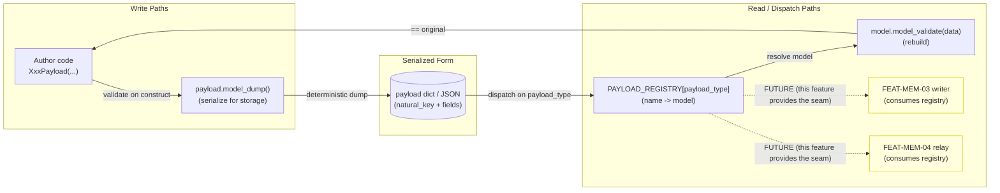
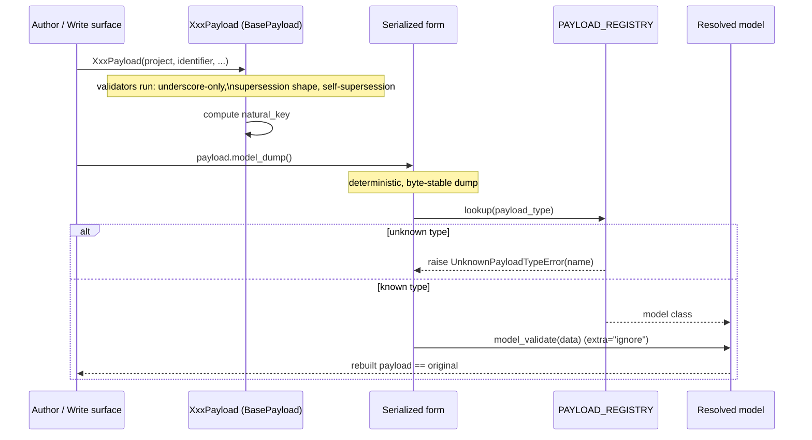
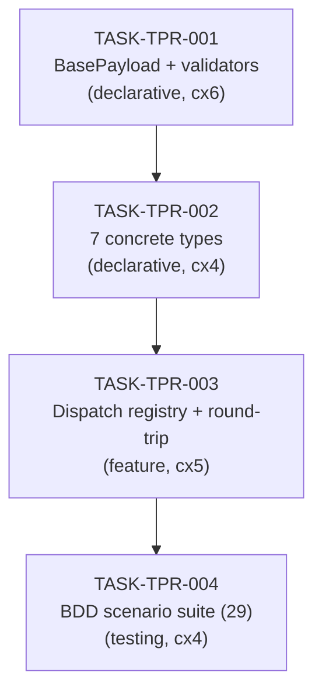

/feature-plan "Typed Payload Registry" \
      --context features/typed-payload-registry/typed-payload-registry_summary.md


I'll follow the /feature-plan workflow. Let me start by reading the context file to understand the feature.

Read typed-payload-registry_summary.md
Let me look at the full feature spec directory for more detail.

Bash List feature spec directory contents
IN
ls -la /Users/richardwoollcott/Projects/appmilla_github/fleet-memory/features/typed-payload-registry/

OUT
total 48
drwxr-xr-x  5 richardwoollcott  staff    160 Jun 13 09:38 .
drwxr-xr-x  4 richardwoollcott  staff    128 Jun 13 09:37 ..
-rw-r--r--  1 richardwoollcott  staff   4054 Jun 13 09:38 typed-payload-registry_assumptions.yaml
-rw-r--r--  1 richardwoollcott  staff   2171 Jun 13 09:38 typed-payload-registry_summary.md
-rw-r--r--  1 richardwoollcott  staff  14781 Jun 13 09:37 typed-payload-registry.feature
Read typed-payload-registry.feature
Let me check the assumptions file and existing project structure to inform planning.

Read typed-payload-registry_assumptions.yaml
Let me understand the existing codebase structure.

Bash Survey Python files and project layout
IN
find . -type f -name "*.py" -not -path "*/node_modules/*" -not -path "*/.venv/*" -not -path "*/venv/*" | grep -v __pycache__ | head -50 && echo "---DIRS---" && ls -la && echo "---SRC---" && find . -maxdepth 2 -type d -not -path "*/.git/*" -not -path "*/__pycache__/*" | grep -iE "src|fleet|memory|payload|schema" | head -20

OUT
./tests/conftest.py
./tests/__init__.py
./tests/test_assumptions_verification.py
./src/fleet_memory/store.py
./src/fleet_memory/embed.py
./src/fleet_memory/__init__.py
./src/fleet_memory/settings.py
./src/fleet_memory/app.py
./src/fleet_memory/errors.py
./tests/unit/test_fake_embed_fixture.py
./tests/unit/test_store_validation.py
./tests/unit/__init__.py
./tests/unit/test_app_lifespan.py
./tests/unit/test_credential_hygiene.py
./tests/unit/test_embed.py
./tests/unit/test_scaffold.py
./tests/unit/test_settings.py
./tests/integration/conftest.py
./tests/integration/test_ephemeral_fixture.py
./tests/integration/__init__.py
./tests/integration/test_pool_lifecycle.py
./tests/integration/test_store_semantics.py
./tests/integration/ollama_wrapper.py
./tests/integration/test_concurrent_writes.py
./tests/integration/test_injection_safety.py
./tests/integration/test_embed_failures.py
./tests/integration/test_search_boundaries.py
./tests/integration/test_metadata_filter.py
./.claude/hooks/capture_slash_command.py
---DIRS---
total 376
drwxr-xr-x   33 richardwoollcott  staff   1056 Jun 13 08:22 .
drwxr-xr-x  173 richardwoollcott  staff   5536 Jun 12 12:43 ..
drwxr-xr-x@  11 richardwoollcott  staff    352 Jun 12 16:41 .claude
-rw-r--r--    1 richardwoollcott  staff   1771 Jun 13 08:22 .env.example
drwxr-xr-x   16 richardwoollcott  staff    512 Jun 13 08:52 .git
-rw-r--r--@   1 richardwoollcott  staff   4723 Jun 12 13:02 .gitignore
drwxr-xr-x@  10 richardwoollcott  staff    320 Jun 13 08:22 .guardkit
-rw-r--r--    1 richardwoollcott  staff      0 Jun 13 08:22 .guardkit-git.lock
drwxr-xr-x@   6 richardwoollcott  staff    192 Jun 12 22:51 .pytest_cache
drwxr-xr-x@   7 richardwoollcott  staff    224 Jun 13 08:22 .venv
-rw-r--r--    1 richardwoollcott  staff  15711 Jun 13 08:22 coverage_all.json
-rw-r--r--    1 richardwoollcott  staff   3318 Jun 13 08:22 coverage_final.json
-rw-r--r--    1 richardwoollcott  staff  15663 Jun 13 08:22 coverage_integration.json
-rw-r--r--    1 richardwoollcott  staff  15663 Jun 13 08:22 coverage_phase4_new.json
-rw-r--r--    1 richardwoollcott  staff  15302 Jun 13 08:22 coverage_phase4_test.json
-rw-r--r--    1 richardwoollcott  staff  22820 Jun 13 08:22 coverage_phase4.json
-rw-r--r--    1 richardwoollcott  staff  14788 Jun 13 08:22 coverage_review.json
-rw-r--r--    1 richardwoollcott  staff   3318 Jun 13 08:22 coverage_test.json
-rw-r--r--    1 richardwoollcott  staff  15290 Jun 13 08:22 coverage.json
drwxr-xr-x    4 richardwoollcott  staff    128 Jun 13 08:22 deploy
drwxr-xr-x@   4 richardwoollcott  staff    128 Jun 12 15:28 docs
drwxr-xr-x    4 richardwoollcott  staff    128 Jun 13 09:37 features
-rw-r--r--    1 richardwoollcott  staff   1065 Jun 12 12:43 LICENSE
drwxr-xr-x@   2 richardwoollcott  staff     64 Jun 12 15:18 migrations
-rw-r--r--    1 richardwoollcott  staff   1191 Jun 13 08:22 pyproject.toml
-rw-r--r--    1 richardwoollcott  staff     38 Jun 12 12:43 README.md
drwxr-xr-x    4 richardwoollcott  staff    128 Jun 13 08:22 src
drwxr-xr-x@   8 richardwoollcott  staff    256 Jun 13 08:22 tasks
-rw-r--r--    1 richardwoollcott  staff  10326 Jun 13 08:22 test_all_output.txt
-rw-r--r--    1 richardwoollcott  staff   3192 Jun 13 08:22 test_integration_output.txt
-rw-r--r--    1 richardwoollcott  staff  10645 Jun 13 08:22 test_output.txt
-rw-r--r--    1 richardwoollcott  staff   5646 Jun 13 08:22 test_phase4_output.txt
drwxr-xr-x    8 richardwoollcott  staff    256 Jun 13 08:22 tests
---SRC---
./src
./features/typed-payload-registry
./src/fleet_memory
./src/fleet_memory.egg-info
Let me look at existing source conventions and the build plan to inform the plan.

Bash Read source conventions and pyproject
IN
wc -l src/fleet_memory/*.py && echo "---errors---" && cat src/fleet_memory/errors.py && echo "---pyproject---" && cat pyproject.toml

OUT
       3 src/fleet_memory/__init__.py
      76 src/fleet_memory/app.py
     195 src/fleet_memory/embed.py
      89 src/fleet_memory/errors.py
      65 src/fleet_memory/settings.py
     167 src/fleet_memory/store.py
     595 total
---errors---
"""Exceptions for fleet-memory embedding operations."""


class EmbedDimensionError(ValueError):
    """Raised when embedding dimensions don't match expected dimensions.

    Error message includes both actual and expected dimensions.
    Never includes database credentials.
    """

    def __init__(self, actual: int, expected: int) -> None:
        """Initialize with actual and expected dimensions.

        Args:
            actual: The actual dimension count received
            expected: The expected dimension count from settings
        """
        super().__init__(
            f"Embedding dimension mismatch: got {actual} dimensions, expected {expected}"
        )
        self.actual = actual
        self.expected = expected


class EmbedTimeoutError(TimeoutError):
    """Raised when embedding service request times out.

    May include the embedding service URL but never database credentials.
    """

    def __init__(self, url: str, timeout_s: float) -> None:
        """Initialize with service URL and timeout value.

        Args:
            url: The embedding service URL (safe to log)
            timeout_s: The timeout threshold in seconds
        """
        super().__init__(f"Embedding service request timed out after {timeout_s}s: {url}")
        self.url = url
        self.timeout_s = timeout_s


class EmbedServiceError(RuntimeError):
    """Raised when embedding service returns an error.

    Covers HTTP errors, malformed JSON, and other service failures.
    May include the embedding service URL but never database credentials.
    """

    def __init__(
        self, message: str, url: str | None = None, status_code: int | None = None
    ) -> None:
        """Initialize with error details.

        Args:
            message: Human-readable error description
            url: Optional embedding service URL (safe to log)
            status_code: Optional HTTP status code
        """
        msg = f"Embedding service error: {message}"
        if status_code is not None:
            msg += f" (HTTP {status_code})"
        if url is not None:
            msg += f" - {url}"
        super().__init__(msg)
        self.url = url
        self.status_code = status_code


class NamespaceValidationError(ValueError):
    """Raised when namespace tuple contains invalid identifiers.

    Namespace identifiers must match ^[a-z0-9_]+$ (underscores only, no hyphens).
    Never includes database credentials.
    """

    def __init__(self, namespace: tuple[str, ...], invalid_parts: list[str]) -> None:
        """Initialize with namespace and invalid parts.

        Args:
            namespace: The full namespace tuple that failed validation
            invalid_parts: List of invalid identifier strings
        """
        super().__init__(
            f"Invalid namespace identifiers {invalid_parts}: must use underscores only "
            f"(match ^[a-z0-9_]+$), got namespace {namespace}"
        )
        self.namespace = namespace
        self.invalid_parts = invalid_parts
---pyproject---
[project]
name = "fleet_memory"
version = "0.1.0"
description = "LangGraph checkpoint and memory store for distributed agent coordination"
requires-python = ">=3.12"
dependencies = [
    "faststream[nats]",
    "pydantic>=2",
    "pydantic-settings>=2",
    "langgraph-checkpoint-postgres>=2.0",
    "httpx",
    "psycopg[binary]",
    "psycopg-pool",
]

[project.optional-dependencies]
dev = [
    "pytest",
    "pytest-asyncio",
    "pytest-timeout",
    "pytest-bdd>=8.1,<9",
    "ruff",
    "pyyaml",
]

[build-system]
requires = ["setuptools>=61.0"]
build-backend = "setuptools.build_meta"

[tool.setuptools.packages.find]
where = ["src"]

[tool.pytest.ini_options]
testpaths = ["tests"]
addopts = "-m 'not integration'"
markers = [
    "integration: marks tests as integration tests (deselected by default)",
    "seam: cross-module contract tests",
    "integration_contract: tests that verify integration contracts",
]
asyncio_mode = "auto"

[tool.ruff]
line-length = 100
target-version = "py312"

[tool.ruff.lint]
select = [
    "E",   # pycodestyle errors
    "W",   # pycodestyle warnings
    "F",   # pyflakes
    "I",   # isort
    "N",   # pep8-naming
    "UP",  # pyupgrade
]
I have a clear picture: a well-specified Pydantic v2 schema-layer feature (7 payload types + dispatch registry) for the fleet_memory package, with all 11 assumptions confirmed. Existing conventions: ^[a-z0-9_]+$ identifier validation, Pydantic v2, custom errors in errors.py.

Per the workflow, let me collect review-scope clarification (Context A) before analysis.

AskUserQuestion
OUT
Your questions have been answered: "What should the planning review focus on for the Typed Payload Registry?"="All aspects", "What trade-off should the task breakdown optimize for?"="Balanced". You can now continue with these answers in mind.
Context A recorded: Focus = All aspects, Trade-off = Balanced. Now Step 2.5 — Graphiti pre-planning context. Graphiti MCP tools aren't in the immediate/deferred tool list, so I'll check the CLI fallback config.

Bash Check Graphiti config and task dirs
IN
cat .guardkit/graphiti.yaml 2>/dev/null | head -20 || echo "NO graphiti.yaml"; echo "---tasks dir---"; ls .guardkit/features/ 2>/dev/null; ls tasks/

OUT
project_id: fleet_memory
enabled: true
graph_store: falkordb
falkordb_host: whitestocks
falkordb_port: 6379
timeout: 30.0
max_concurrent_episodes: 3
chunk_extraction_concurrency: 4
llm_provider: vllm
llm_base_url: http://promaxgb10-41b1:9000/v1
llm_model: qwen-graphiti
llm_max_tokens: 4096
embedding_provider: vllm
embedding_base_url: http://promaxgb10-41b1:9000/v1
embedding_model: nomic-embed
group_ids:
- product_knowledge
- command_workflows
- architecture_decisions
---tasks dir---
FEAT-CA81.yaml
backlog
blocked
completed
design_approved
in_progress
in_review
Graphiti is enabled (CLI path, FalkorDB at whitestocks). Let me query for pre-planning context, with graceful degradation.

Bash Query Graphiti pre-planning context
IN
timeout 35 /Users/richardwoollcott/.agentecflow/bin/graphiti-check --status --task-context --quiet --description "Typed Payload Registry: seven Pydantic payload types with natural key, supersession, domain tags, source_ref, and a payload_type dispatch registry" --phase plan 2>&1 | head -40 || echo "GRAPHITI_UNAVAILABLE (continuing without)"

OUT
{"available": true, "error": null, "context": null, "categories": 0, "tokens_used": 0, "tokens_budget": 0}
Graphiti: available, no relevant prior context found — continuing without.

Recording the workflow so far:

Now let me create the review task via /task-create, per the workflow.

task-create skill
The review-task detection applies (task_type:review). Within /feature-plan orchestration, I create the review task then continue to /task-review. Let me generate an ID and create the task file.

Bash Check existing tasks and generate review task ID
IN
ls tasks/backlog/ tasks/in_progress/ tasks/in_review/ 2>/dev/null; echo "---"; python3 -c "import hashlib,time; print('TASK-REV-'+hashlib.sha256('Plan: Typed Payload Registry'.encode()).hexdigest()[:4].upper())"

OUT
tasks/backlog/:
storage-substrate
TASK-MEM-001-scaffold-project-layout.md
TASK-MEM-002-settings-class-env-profiles.md
TASK-MEM-008-nas-deploy-operator-execution.md
TASK-MEM-013-assumption-verification-record.md

tasks/in_progress/:

tasks/in_review/:
---
TASK-REV-C42F
Write TASK-REV-C42F-plan-typed-payload-registry.md
50 lines
---
id: TASK-REV-C42F
title: "Plan: Typed Payload Registry"
status: backlog
created: 2026-06-13T00:00:00Z
updated: 2026-06-13T00:00:00Z
priority: high
task_type: review
tags: [planning, schema, pydantic, fleet-memory]
complexity: 0
clarification:
  context_a:
    decisions:
      focus: all
      tradeoff: balanced
test_results:
  status: pending
  coverage: null
  last_run: null
---

# Task: Plan: Typed Payload Registry

## Description

Decision-mode planning review for FEAT-MEM-02 (Typed Payload Registry): the
schema layer that makes fleet-memory writes deterministic. Seven Pydantic v2
payload types (ADR, ReviewReport, BuildOutcome, Pattern, Warning, SeedModule,
generic Document) sharing natural-key, declared-supersession, domain-tag, and
source-reference conventions, plus a `payload_type` → model dispatch registry
that both the deterministic writer (FEAT-MEM-03) and the relay consumer
(FEAT-MEM-04) route through.

Context file: features/typed-payload-registry/typed-payload-registry_summary.md
BDD spec: features/typed-payload-registry/typed-payload-registry.feature (29 scenarios)
Assumptions: features/typed-payload-registry/typed-payload-registry_assumptions.yaml (11, all confirmed)

## Acceptance Criteria

- [ ] Shared base conventions (natural key, supersession, domain_tags, source_ref, version) designed once and reused across all 7 types
- [ ] Natural-key format `<payload_type>:<project>:<identifier>` with underscore-only segment validation
- [ ] `payload_type` → model dispatch registry with bijective name↔model mapping
- [ ] Forward-compatible deserialization (extra fields ignored)
- [ ] Deterministic, byte-identical serialization across write surfaces
- [ ] All 29 BDD scenarios covered

## Review Findings

(Populated by /task-review — see decision analysis below.)
Review task created: TASK-REV-C42F. Now executing the decision-mode review analysis (Step 3), focus = all aspects, trade-off = balanced.

🔍 Feature Planning: Typed Payload Registry (FEAT-MEM-02)
[Graphiti] Feature context: no relevant prior items found (continuing without).

TECHNICAL OPTIONS ANALYSIS
The spec is a Pydantic v2 schema layer: 7 payload types sharing four conventions (natural key, declared supersession, domain tags, source ref) + a payload_type→model dispatch registry. All 11 assumptions are confirmed; 29 BDD scenarios already authored. Existing repo conventions to match: ^[a-z0-9_]+$ validation, custom error classes in errors.py, Pydantic v2.

Option 1: Shared BasePayload + 7 subclasses + registration-time registry (Recommended)

Complexity: Medium (6/10) · Effort: ~5–7h
One BasePayload(BaseModel) owns the shared fields (project, identifier, domain_tags, source_ref, version, supersedes), the computed natural_key, and the shared validators (underscore-only segments, supersession-shape, self-supersession). Seven subclasses add type-specific fields and a canonical payload_type. A PAYLOAD_REGISTRY: dict[str, type[BasePayload]] built via a registration decorator enforces the name↔model bijection; ConfigDict(extra="ignore") gives forward compatibility.
✅ DRY — all four conventions defined once, inherited by every type · ✅ Per-type required-field validation preserved (e.g. ReviewReport.verdict) · ✅ Bijection enforced at registration · ✅ Mirrors existing NamespaceValidationError style · ✅ Easy to add an 8th type later.
⚠️ Base must handle computed-field serialization carefully for round-trip equality.
Option 2: Mixin composition (NaturalKeyMixin, SupersessionMixin, …)

Complexity: Medium-High (7/10) · Effort: ~7–9h
✅ Granular reuse. ⚠️ All 7 types share all conventions, so granularity buys nothing here (YAGNI); Pydantic v2 + multiple inheritance is fiddlier to get right. More moving parts for no current benefit.
Option 3: Single generic model + data: dict discriminator (no subclasses)

Complexity: Low (3/10) · Effort: ~2–3h
⚠️ Rejected — loses per-type required-field validation, defeating the "typed" purpose. The spec explicitly requires "a typed payload missing a required field is rejected."
RECOMMENDED APPROACH
✅ Option 1 — shared BasePayload + 7 subclasses + registration-time registry.

Rationale: balanced trade-off — DRY and extensible without mixin overhead, preserves typed validation, aligns with existing repo conventions. This is a foundational layer two downstream features (writer FEAT-MEM-03, relay FEAT-MEM-04) route through, so the base contract carries the design risk and warrants its own task.

Proposed breakdown (4 tasks, layered):

Task	Title	Type	Cx	Deps
TASK-TPR-001	Payload base conventions & validators	declarative	6	—
TASK-TPR-002	Seven concrete payload types	declarative	4	001
TASK-TPR-003	Payload dispatch registry + round-trip	feature	5	002
TASK-TPR-004	BDD scenario suite (29 scenarios)	testing	4	003
Estimated effort: ~5–7h · Aggregate complexity: 6/10 · Risk: Low. Execution is a sequential chain (each layer depends on the previous) — no genuine parallelism, which I'll reflect honestly in the waves.

📋 DECISION CHECKPOINT
Review complete for Plan: Typed Payload Registry. Found 3 approaches; recommending Option 1.

[A]ccept — save findings to the review task for later reference
[R]evise — re-run with different focus (e.g. deeper determinism/serialization analysis, or splitting the 7 types into parallel tasks)
[I]mplement — create the feature structure (4 task files + IMPLEMENTATION-GUIDE.md with mandatory diagrams + FEAT YAML for AutoBuild)
[C]ancel — discard this plan
Your choice [A/R/I/C]?

phase-core-build-plan.md
I
You chose [I]mplement. Collecting implementation preferences (Context B) before generating the structure.

AskUserQuestion
OUT
Your questions have been answered: "Which approach should the generated tasks follow?"="Option 1 (Recommended)", "How should testing depth be set for the implementation tasks?"="BDD-driven". You can now continue with these answers in mind.
Context B recorded: Approach = Option 1, Testing = BDD-driven. Generating the feature structure now. Let me first check the YAML generator's options (to align the feature ID) and set up a todo list.

Update Todos

Create feature folder + 4 task markdown files with provenance/task_type frontmatter

Generate IMPLEMENTATION-GUIDE.md with mandatory Mermaid diagrams + §4 contracts

Generate README.md for the feature folder

Generate structured FEAT YAML via generate-feature-yaml --discover

Pre-flight validate feature + run BDD scenario linking (Step 11)
Bash Check generate-feature-yaml options
IN
python3 ~/.agentecflow/bin/generate-feature-yaml --help 2>&1 | head -40 || echo "NO_SCRIPT"

OUT
/Library/Frameworks/Python.framework/Versions/3.14/lib/python3.14/site-packages/langchain_core/_api/deprecation.py:25: UserWarning: Core Pydantic V1 functionality isn't compatible with Python 3.14 or greater.
  from pydantic.v1.fields import FieldInfo as FieldInfoV1
usage: generate-feature-yaml [-h] [--name NAME] [--description DESCRIPTION]
                             [--task TASKS] [--tasks-json TASKS_JSON]
                             [--base-path BASE_PATH] [--feature-id FEATURE_ID]
                             [--output OUTPUT] [--json] [--quiet]
                             [--feature-slug FEATURE_SLUG]
                             [--task-base-path TASK_BASE_PATH] [--strict]
                             [--lenient] [--discover]
                             [--auto-serialise-overlap]
                             [--validate-smoke-gates]

Generate structured YAML feature files for AutoBuild

options:
  -h, --help            show this help message and exit
  --name, -n NAME       Feature name (required for generation; ignored by
                        --validate-smoke-gates)
  --description, -d DESCRIPTION
                        Feature description
  --task, -t TASKS      Task in format ID:NAME:COMPLEXITY:DEPS (can be
                        repeated)
  --tasks-json TASKS_JSON
                        JSON file or string containing tasks array
  --base-path, -p BASE_PATH
                        Base path for project (default: current directory)
  --feature-id FEATURE_ID
                        Override auto-generated feature ID
  --output, -o OUTPUT   Override output path (default:
                        .guardkit/features/FEAT-XXX.yaml)
  --json                Output JSON format instead of YAML
  --quiet, -q           Suppress progress output
  --feature-slug FEATURE_SLUG
                        Feature slug for deriving task file paths (e.g.,
                        'dark-mode', 'oauth2')
  --task-base-path TASK_BASE_PATH
                        Base path for task files (default: tasks/backlog)
  --strict              Make path validation errors fatal (default: True). Use
                        --lenient to override.
  --lenient             Make path validation errors non-fatal (overrides
--feature-id override is supported, so I'll use FEAT-MEM-02 consistently. Writing the 4 task files now.

Write TASK-TPR-001-payload-base-conventions.md
81 lines
---
id: TASK-TPR-001
title: Payload base conventions and validators
task_type: declarative
parent_review: TASK-REV-C42F
feature_id: FEAT-MEM-02
wave: 1
implementation_mode: task-work
complexity: 6
dependencies: []
tags: [pydantic, schema, fleet-memory]
---

# Task: Payload base conventions and validators

## Description

Define the shared `BasePayload` Pydantic v2 model that every typed payload
inherits. This is the contract that makes fleet-memory writes deterministic:
the natural key, declared supersession, domain tags, source reference, and
version stamp are all defined **once** here and reused by all seven concrete
types (TASK-TPR-002) and the dispatch registry (TASK-TPR-003).

**Approach (from review):** Option 1 — single shared base class.

**Target module:** `src/fleet_memory/payloads/base.py`
(new subpackage `src/fleet_memory/payloads/`, add `__init__.py`).
Reuse the existing underscore-only convention and error style from
[errors.py](../../../src/fleet_memory/errors.py) (`NamespaceValidationError`,
`^[a-z0-9_]+$`).

## Shared fields (ASSUM-001/005/006/007)

- `project: str` and `identifier: str` — segments of the natural key; both
  validated underscore-only (no hyphens, no colons).
- `domain_tags: list[str] = []` — optional lowercase_underscore tokens
  (ASSUM-005), default empty.
- `source_ref: str` — required free-form provenance reference (ASSUM-007).
- `version: int = 1` — monotonic integer starting at 1 (ASSUM-006).
- `supersedes: list[str] = []` — declared natural-key-shaped references.
- computed `natural_key` → `"<payload_type>:<project>:<identifier>"`.
- abstract/overridable `payload_type` classvar (set by each subclass).
- `ConfigDict(extra="ignore")` for forward compatibility (ASSUM-009).

## Acceptance Criteria

- [ ] `natural_key` is `<payload_type>:<project>:<identifier>` — exactly three
      colon-separated segments (ASSUM-001).
- [ ] `project` / `identifier` reject hyphens and colons; error states
      "identifiers must use underscores" (ASSUM-002; covers injection text
      like `ADR:SP:007`).
- [ ] An empty `identifier` is rejected with an error indicating the
      identifier is required.
- [ ] `supersedes` accepts only three-segment natural-key-shaped references;
      malformed references (wrong segment count, free text) are rejected with
      an error indicating the reference is not a valid natural key (ASSUM-003).
- [ ] A payload superseding its **own** natural key is rejected with an error
      that a payload cannot supersede itself (ASSUM-011).
- [ ] A cross-project supersession reference is **accepted** (ASSUM-011).
- [ ] Duplicate supersession references are collapsed to one, order-stable.
- [ ] `domain_tags` defaults to empty and is accepted when absent (ASSUM-005).
- [ ] `version` defaults to 1.
- [ ] Unknown extra fields are ignored on construction (`extra="ignore"`).
- [ ] All modified files pass project-configured lint/format checks with zero
      errors.

## Coach Validation

```bash
pytest tests/ -v -k payload
ruff check src/fleet_memory/payloads/
```

## BDD scenarios covered (acceptance source)

From `features/typed-payload-registry/typed-payload-registry.feature`:
natural-key segment scenarios, empty-identifier, hyphen-in-project,
hyphen-in-identifier, injection-text, supersession-shape (Outline),
self-supersession, cross-project supersession, duplicate-collapse,
no-domain-tags, supersession count Outline (0/1/5).
Write TASK-TPR-002-seven-payload-types.md
66 lines
---
id: TASK-TPR-002
title: Seven concrete payload types
task_type: declarative
parent_review: TASK-REV-C42F
feature_id: FEAT-MEM-02
wave: 2
implementation_mode: task-work
complexity: 4
dependencies: [TASK-TPR-001]
tags: [pydantic, schema, fleet-memory]
consumer_context:
  - task: TASK-TPR-001
    consumes: BasePayload
    framework: "Pydantic v2 (BaseModel subclassing)"
    driver: "pydantic>=2"
    format_note: "Each type subclasses BasePayload and sets a canonical underscore `payload_type` classvar; shared validators are inherited, not re-declared"
---

# Task: Seven concrete payload types

## Description

Implement the seven concrete payload models, each subclassing `BasePayload`
(TASK-TPR-001) and declaring its canonical `payload_type`. Type-specific
required fields live here; the shared conventions are inherited.

**Target module:** `src/fleet_memory/payloads/models.py`

The seven registered types are exactly (ASSUM-004):
`adr`, `review_report`, `build_outcome`, `pattern`, `warning`, `seed_module`,
`document`.

- **Document** is the generic catch-all: it must be accepted without requiring
  any type-specific fields.
- **ReviewReport** must require a `verdict` field (drives the
  "missing required field is rejected" scenario).
- The remaining types carry sensible type-specific fields per their domain;
  keep them minimal — this feature is the schema layer, not the writer.

## Acceptance Criteria

- [ ] Each type's `payload_type` is its canonical underscore name (ASSUM-004).
- [ ] An ADR for project `guardkit` / id `ADR_SP_007` yields natural key
      `adr:guardkit:ADR_SP_007`.
- [ ] A generic Document yields `document:<project>:<identifier>` and is
      accepted with no type-specific fields.
- [ ] A ReviewReport built with no `verdict` is rejected; the error names the
      missing field.
- [ ] Every type inherits the underscore-only / supersession / domain-tag /
      source-ref conventions from `BasePayload` (no re-declaration).
- [ ] All modified files pass project-configured lint/format checks with zero
      errors.

## Coach Validation

```bash
pytest tests/ -v -k payload
ruff check src/fleet_memory/payloads/
```

## BDD scenarios covered

ADR natural key, generic-document acceptance, per-type required field
(review report verdict), domain-tags-and-source-ref carry.
Write TASK-TPR-003-dispatch-registry.md
105 lines
---
id: TASK-TPR-003
title: Payload dispatch registry and round-trip
task_type: feature
parent_review: TASK-REV-C42F
feature_id: FEAT-MEM-02
wave: 3
implementation_mode: task-work
complexity: 5
dependencies: [TASK-TPR-002]
tags: [registry, dispatch, serialization, fleet-memory]
consumer_context:
  - task: TASK-TPR-002
    consumes: payload model classes
    framework: "Pydantic v2 (model_validate / model_dump)"
    driver: "pydantic>=2"
    format_note: "Registry maps each canonical payload_type name to exactly one model class (bijection); round-trip rebuilds via registry[name].model_validate(serialized)"
---

# Task: Payload dispatch registry and round-trip

## Description

Build the single `payload_type` → model dispatch registry that both the
deterministic writer (FEAT-MEM-03) and relay consumer (FEAT-MEM-04) route
through. Provide name→model lookup, model→name reverse lookup, and the
serialize→dispatch→rebuild round trip.

**Target module:** `src/fleet_memory/payloads/registry.py`
Add an `UnknownPayloadTypeError` to
[errors.py](../../../src/fleet_memory/errors.py) (names the offending type;
no silent fallback — ASSUM-010).

## Acceptance Criteria

- [ ] `review_report` resolves to the ReviewReport model; all seven declared
      types are registered and dispatchable (ASSUM-004).
- [ ] The registry is a bijection: every name maps to exactly one model and no
      two names map to the same model.
- [ ] A payload reports the type name it dispatches under, and that name
      resolves back to its model.
- [ ] Looking up an unknown type (e.g. `decision_log`) is rejected with an
      error naming the unknown type — no fallback to Document (ASSUM-010).
- [ ] Lookup is case-sensitive: `ADR` is rejected as unknown (ASSUM-010).
- [ ] A payload serialized then rebuilt by dispatching on its `payload_type`
      equals the original, with an unchanged natural key.
- [ ] The natural key is identical across repeated serialization round trips
      (determinism).
- [ ] The same payload serialized by either write surface produces
      byte-for-byte identical serialized form.
- [ ] Re-authoring the same natural key with new content advances `version`
      deterministically; the natural key is unchanged.
- [ ] Unknown extra fields in serialized input are ignored on rebuild
      (ASSUM-009).
- [ ] Two payloads with identical type/project/identifier produce the same
      natural key.
- [ ] All modified files pass project-configured lint/format checks with zero
      errors.

## Coach Validation

```bash
pytest tests/ -v -k "payload or registry"
ruff check src/fleet_memory/payloads/
```

## Seam Tests

The following seam test validates the registry round-trip contract — the
cross-surface boundary both write paths depend on. Implement it to verify the
boundary before integration.

```python
"""Seam test: verify payload round-trip contract via the dispatch registry."""
import pytest


@pytest.mark.seam
@pytest.mark.integration_contract("payload_round_trip")
def test_payload_round_trip_is_deterministic():
    """A payload survives serialize -> dispatch -> rebuild unchanged.

    Contract: registry[payload_type].model_validate(model_dump(payload))
              equals the original; natural_key is byte-stable across repeats.
    Producer: TASK-TPR-002 (model classes) + TASK-TPR-001 (BasePayload)
    """
    from fleet_memory.payloads.models import AdrPayload
    from fleet_memory.payloads.registry import PAYLOAD_REGISTRY

    original = AdrPayload(project="guardkit", identifier="ADR_SP_007", source_ref="x")
    serialized = original.model_dump()
    model = PAYLOAD_REGISTRY[original.payload_type]
    rebuilt = model.model_validate(serialized)

    assert rebuilt == original
    assert rebuilt.natural_key == original.natural_key == "adr:guardkit:ADR_SP_007"
```

## BDD scenarios covered

registry resolves name→model, every-type-dispatchable Outline, round-trip
equality, unknown-type rejection, case-sensitivity, bijection, model→name,
determinism (regression), byte-identical (regression), version advance,
extra-field ignore, shared-natural-key dedup.
Write TASK-TPR-004-bdd-scenario-suite.md
57 lines
---
id: TASK-TPR-004
title: BDD scenario suite for typed payload registry
task_type: testing
parent_review: TASK-REV-C42F
feature_id: FEAT-MEM-02
wave: 4
implementation_mode: task-work
complexity: 4
dependencies: [TASK-TPR-003]
tags: [testing, bdd, pytest-bdd, fleet-memory]
---

# Task: BDD scenario suite for typed payload registry

## Description

Wire the 29 authored Gherkin scenarios as the executable acceptance suite
using `pytest-bdd` (already a dev dependency, `pytest-bdd>=8.1,<9`). This is
the BDD-driven testing approach chosen at planning time: the
`.feature` file is the source of truth, step definitions bind it to the
`fleet_memory.payloads` implementation.

**Feature file:**
`features/typed-payload-registry/typed-payload-registry.feature`
**Step definitions:** `tests/bdd/test_typed_payload_registry.py`
(create `tests/bdd/__init__.py`).

## Acceptance Criteria

- [ ] All 29 scenarios in the feature file have step definitions and pass.
- [ ] Both `Scenario Outline` blocks (every-type-dispatchable, supersession
      count, wrong-segment-count) are parametrised and pass for every example
      row.
- [ ] Scenarios tagged `@regression` (determinism, byte-identical,
      bijection) pass.
- [ ] Negative scenarios assert on the error condition AND the error message
      content (e.g. "underscores", "not a valid natural key", names the
      missing/unknown field).
- [ ] The suite runs under the default pytest selection (it is not marked
      `integration` — no broker or infrastructure required).

## Coach Validation

```bash
pytest tests/bdd/ -v
pytest tests/ -v
```

## Notes

- No live infrastructure: every scenario acts on a payload or the registry
  in-process. Pure unit-level BDD.
- Step definitions should import from the public surface
  (`fleet_memory.payloads`), not reach into private modules, so the suite
  doubles as a contract test for the package's exports.
Now the IMPLEMENTATION-GUIDE.md with the mandatory diagrams.

Update Todos

Create feature folder + 4 task markdown files with provenance/task_type frontmatter

Generate IMPLEMENTATION-GUIDE.md with mandatory Mermaid diagrams + §4 contracts

Generate README.md for the feature folder

Generate structured FEAT YAML via generate-feature-yaml --discover

Pre-flight validate feature + run BDD scenario linking (Step 11)
Write IMPLEMENTATION-GUIDE.md
175 lines
# Implementation Guide: Typed Payload Registry (FEAT-MEM-02)

**Approach:** Option 1 — shared `BasePayload` + 7 subclasses + registration-time
dispatch registry.
**Testing:** BDD-driven (29 Gherkin scenarios via `pytest-bdd`).
**Aggregate complexity:** 6/10 · **Risk:** Low · **Estimated effort:** ~5–7h.

This schema layer is the deterministic-write contract that two downstream
features route through: the deterministic writer (FEAT-MEM-03) and the relay
consumer (FEAT-MEM-04). Both call into the dispatch registry — get the registry
contract right and dedup becomes a key lookup, supersession becomes a declared
fact.

## Target module layout

```
src/fleet_memory/payloads/
├── __init__.py      # public exports: BasePayload, the 7 types, PAYLOAD_REGISTRY, lookup
├── base.py          # TASK-TPR-001  BasePayload + shared validators + natural_key
├── models.py        # TASK-TPR-002  AdrPayload, ReviewReportPayload, ... DocumentPayload
└── registry.py      # TASK-TPR-003  PAYLOAD_REGISTRY, get_model, round-trip
src/fleet_memory/errors.py   # + UnknownPayloadTypeError (matches NamespaceValidationError style)
tests/bdd/
├── __init__.py
└── test_typed_payload_registry.py   # TASK-TPR-004  step defs for the .feature file
```

---

## §1. Data Flow: Read/Write Paths

What to look for: every write path (payload construction, serialization) must
reach storage, and every read path (dispatch, rebuild) must have a caller.
Both write surfaces converge on the **same** registry — that convergence is the
whole point of the feature.



**Disconnection note (acknowledged, not a defect):** R3 (writer) and R4 (relay)
are dotted because they are *downstream features* (FEAT-MEM-03 / -04), out of
scope here per the spec. FEAT-MEM-02's deliverable is precisely the registry
seam they will consume. The in-feature read path (R1 → R2 → equals original) is
fully wired and exercised by the round-trip scenarios — **no in-scope write
path is left without a read.**

---

## §2. Integration Contracts (sequence) — complexity ≥ 5

What to look for: the serialized form retrieved from storage must be passed
onward to the model for rebuild — never fetched then discarded. The round-trip
must close back to an object equal to the original.



---

## §3. Task Dependencies

What to look for: this is an honest sequential chain — each layer depends on
the previous, so there is no parallel wave. No task in a wave depends on
another task in the same wave.



_No green nodes: every task gates the next, so all four run sequentially._

### Execution strategy

| Wave | Task | Mode | Conductor |
|------|------|------|-----------|
| 1 | TASK-TPR-001 | task-work | n/a (single task) |
| 2 | TASK-TPR-002 | task-work | n/a (single task) |
| 3 | TASK-TPR-003 | task-work | n/a (single task) |
| 4 | TASK-TPR-004 | task-work | n/a (single task) |

Parallelism was considered (e.g. splitting the 7 types across workers) and
rejected: the types are mechanical once `BasePayload` exists, and the
coordination cost outweighs the gain at this size. The base task carries the
design risk and is deliberately isolated for thorough review.

---

## §4. Integration Contracts (cross-task)

All dependencies here are **intra-package Python class contracts**, not
infrastructure-service + framework artifacts (there is no DB/URL/env-var seam
in this feature). They are documented for completeness; the registry round-trip
is the one contract worth a seam test (see TASK-TPR-003 § Seam Tests).

### Contract: `BasePayload`
- **Producer task:** TASK-TPR-001
- **Consumer task(s):** TASK-TPR-002
- **Artifact type:** Python base class (Pydantic v2 `BaseModel`)
- **Format constraint:** Subclasses set a canonical underscore `payload_type`
  classvar and inherit (do not re-declare) the shared validators, `natural_key`,
  `supersedes`, `domain_tags`, `source_ref`, `version`, and
  `ConfigDict(extra="ignore")`.
- **Validation method:** Coach verifies each concrete type imports/subclasses
  `BasePayload` and adds no duplicate validator for the shared conventions.

### Contract: payload model classes
- **Producer task:** TASK-TPR-002
- **Consumer task(s):** TASK-TPR-003
- **Artifact type:** Python model classes (the seven types)
- **Format constraint:** Each class exposes a unique canonical `payload_type`
  so the registry can build a bijective name↔model map.
- **Validation method:** Coach verifies the registry registers exactly seven
  types and that name→model and model→name are both 1:1.

### Contract: `PAYLOAD_REGISTRY` round-trip
- **Producer task:** TASK-TPR-003
- **Consumer task(s):** TASK-TPR-004 (and, downstream, FEAT-MEM-03 / -04)
- **Artifact type:** dict[str, type[BasePayload]] + round-trip helper
- **Format constraint:** `registry[payload_type].model_validate(model_dump(p))`
  must equal `p` and preserve `natural_key`; unknown type raises
  `UnknownPayloadTypeError` (no Document fallback).
- **Validation method:** round-trip + bijection BDD scenarios
  (`@regression`) plus the seam test in TASK-TPR-003.
Write README.md
50 lines
# Feature: Typed Payload Registry (FEAT-MEM-02)

The schema layer that makes fleet-memory writes deterministic. Seven Pydantic v2
payload types — ADR, ReviewReport, BuildOutcome, Pattern, Warning, SeedModule,
and a generic Document — share a natural-key, declared-supersession, domain-tag,
and source-reference convention, plus a `payload_type` → model dispatch registry
that the deterministic writer (FEAT-MEM-03) and relay consumer (FEAT-MEM-04)
both route through.

## Why

- **Dedup is a key lookup** — identical type/project/identifier → one natural key.
- **Supersession is a declared fact**, not an inferred LLM judgement (RD-6).
- **Writes are deterministic** — same payload in → byte-identical store form out.

## Planning provenance

- **Review:** TASK-REV-C42F (decision mode; focus=all, trade-off=balanced)
- **Approach:** Option 1 — shared `BasePayload` + 7 subclasses + registry
- **Spec:** `features/typed-payload-registry/typed-payload-registry.feature` (29 scenarios)
- **Assumptions:** `features/typed-payload-registry/typed-payload-registry_assumptions.yaml` (11, all confirmed)

## Tasks

| ID | Title | Type | Cx | Wave | Deps |
|----|-------|------|----|------|------|
| TASK-TPR-001 | Payload base conventions and validators | declarative | 6 | 1 | — |
| TASK-TPR-002 | Seven concrete payload types | declarative | 4 | 2 | TASK-TPR-001 |
| TASK-TPR-003 | Payload dispatch registry and round-trip | feature | 5 | 3 | TASK-TPR-002 |
| TASK-TPR-004 | BDD scenario suite (29 scenarios) | testing | 4 | 4 | TASK-TPR-003 |

Execution is a sequential chain — see `IMPLEMENTATION-GUIDE.md` for the data
flow, integration-contract, and dependency diagrams.

## Next steps

```bash
# Review the guide and diagrams
open tasks/backlog/typed-payload-registry/IMPLEMENTATION-GUIDE.md

# Implement sequentially
/task-work TASK-TPR-001
/task-work TASK-TPR-002
/task-work TASK-TPR-003
/task-work TASK-TPR-004

# Or autonomously via AutoBuild
/feature-build FEAT-MEM-02
```
Now generate the structured FEAT YAML with --discover and --feature-id FEAT-MEM-02.

Update Todos

Create feature folder + 4 task markdown files with provenance/task_type frontmatter

Generate IMPLEMENTATION-GUIDE.md with mandatory Mermaid diagrams + §4 contracts

Generate README.md for the feature folder

Generate structured FEAT YAML via generate-feature-yaml --discover

Pre-flight validate feature + run BDD scenario linking (Step 11)
Bash Generate structured feature YAML
IN
python3 ~/.agentecflow/bin/generate-feature-yaml \
    --name "Typed Payload Registry" \
    --description "Seven Pydantic v2 payload types sharing natural-key, supersession, domain-tag and source-ref conventions, plus a payload_type to model dispatch registry for deterministic fleet-memory writes." \
    --feature-id "FEAT-MEM-02" \
    --feature-slug "typed-payload-registry" \
    --discover \
    --task "TASK-TPR-001:Payload base conventions and validators:6:" \
    --task "TASK-TPR-002:Seven concrete payload types:4:TASK-TPR-001" \
    --task "TASK-TPR-003:Payload dispatch registry and round-trip:5:TASK-TPR-002" \
    --task "TASK-TPR-004:BDD scenario suite for typed payload registry:4:TASK-TPR-003" \
    --base-path "." 2>&1 | grep -v "UserWarning\|pydantic.v1"

OUT
   [discover] TASK-TPR-001: derived path differs from disk, using disk path
     derived: tasks/backlog/typed-payload-registry/TASK-TPR-001-payload-base-conventions-and-validators.md
     actual:  tasks/backlog/typed-payload-registry/TASK-TPR-001-payload-base-conventions.md
   [discover] TASK-TPR-002: derived path differs from disk, using disk path
     derived: tasks/backlog/typed-payload-registry/TASK-TPR-002-seven-concrete-payload-types.md
     actual:  tasks/backlog/typed-payload-registry/TASK-TPR-002-seven-payload-types.md
   [discover] TASK-TPR-003: derived path differs from disk, using disk path
     derived: tasks/backlog/typed-payload-registry/TASK-TPR-003-payload-dispatch-registry-and-round-trip.md
     actual:  tasks/backlog/typed-payload-registry/TASK-TPR-003-dispatch-registry.md
   [discover] TASK-TPR-004: derived path differs from disk, using disk path
     derived: tasks/backlog/typed-payload-registry/TASK-TPR-004-bdd-scenario-suite-for-typed-payload-registry.md
     actual:  tasks/backlog/typed-payload-registry/TASK-TPR-004-bdd-scenario-suite.md
✅ Feature FEAT-MEM-02 created
📋 Tasks: 4
   TASK-TPR-001: Payload base conventions and validators (complexity: 6)
   TASK-TPR-002: Seven concrete payload types (complexity: 4) (deps: TASK-TPR-001)
   TASK-TPR-003: Payload dispatch registry and round-trip (complexity: 5) (deps: TASK-TPR-002)
   TASK-TPR-004: BDD scenario suite for typed payload registry (complexity: 4) (deps: TASK-TPR-003)

🔀 Parallel execution groups: 4 waves
   Wave 1: [TASK-TPR-001]
   Wave 2: [TASK-TPR-002]
   Wave 3: [TASK-TPR-003]
   Wave 4: [TASK-TPR-004]

📁 Feature file: .guardkit/features/FEAT-MEM-02.yaml
⚡ AutoBuild ready: /feature-build FEAT-MEM-02

AC-quality review: 0 unverifiable acceptance criteria detected.

━━━━━━━━━━━━━━━━━━━━━━━━━━━━━━━━━━━━━━━
ℹ️  Feature-level smoke gates (R3) not configured
━━━━━━━━━━━━━━━━━━━━━━━━━━━━━━━━━━━━━━━
This feature has 4 waves but no smoke_gates: key in the generated YAML.
Between-wave smoke checks will not fire during autobuild.

This is the gate that catches composition failures (e.g., the PEX-014..020
"13/13 green + e2e broken" pattern) that per-task Coach approval misses.

Available test roots in this repo (use these, not invented paths):
    tests/integration    tests/unit

To activate: add a smoke_gates: block to the feature YAML before running
/feature-build. Minimal example:
    # smoke_gates is ONE object per feature (not a dict-of-waves).
    # after_wave selects which wave(s) the single command fires after.
    smoke_gates:
      after_wave: [2, 3]          # int | list[int] | "all"
      command: |                  # single shell command (multi-line OK)
        set -e
        pytest tests/integration tests/unit -x      # uses discovered roots
      expected_exit: 0            # optional, default 0
      timeout: 120                # optional, default 120s, bounds [1, 600]

See installer/core/commands/feature-plan.md § "Smoke gates".
━━━━━━━━━━━━━━━━━━━━━━━━━━━━━━━━━━━━━━━
YAML created as FEAT-MEM-02.yaml. AC-quality review: 0 unverifiable criteria. The R3 smoke-gates nudge fired (I'll address it in the summary). Now pre-flight validation, then BDD scenario linking (Step 11).

Bash Pre-flight validate the feature YAML
IN
(guardkit feature validate FEAT-MEM-02 2>&1 | grep -v "UserWarning\|pydantic.v1" | head -30 || echo "guardkit CLI not available")

OUT
INFO:guardkit.orchestrator.feature_loader:Loading feature from /Users/richardwoollcott/Projects/appmilla_github/fleet-memory/.guardkit/features/FEAT-MEM-02.yaml
✓ Feature FEAT-MEM-02 is valid
Feature validates. Now Step 11 — BDD scenario linking (prepare phase).

Bash Prepare BDD scenario-to-task matching request
IN
REQ_FILE=$(mktemp -t bdd-link-req-XXXXXX.json)
RESP_FILE=$(mktemp -t bdd-link-resp-XXXXXX.json)
echo "REQ_FILE=$REQ_FILE"
echo "RESP_FILE=$RESP_FILE"
python3 ~/.agentecflow/bin/feature-plan-bdd-link prepare \
    --project-root . \
    --feature-slug "typed-payload-registry" \
    --feature-yaml ".guardkit/features/FEAT-MEM-02.yaml" \
    --output "$REQ_FILE" 2>&1 | grep -v "UserWarning\|pydantic.v1"

OUT
REQ_FILE=/var/folders/75/prgjl4_x0k3_6tj58k39db1r0000gn/T/bdd-link-req-XXXXXX.json.XrZqaqgDi7
RESP_FILE=/var/folders/75/prgjl4_x0k3_6tj58k39db1r0000gn/T/bdd-link-resp-XXXXXX.json.Cf2PxNVotJ
{"status": "ready", "feature_path": "/Users/richardwoollcott/Projects/appmilla_github/fleet-memory/features/typed-payload-registry/typed-payload-registry.feature", "scenarios_to_match": 29, "task_count": 4, "confidence_threshold": 0.6, "already_tagged_count": 0, "request_path": "/var/folders/75/prgjl4_x0k3_6tj58k39db1r0000gn/T/bdd-link-req-XXXXXX.json.XrZqaqgDi7"}
Status ready: 29 scenarios, 4 tasks. Now invoking the bdd-linker subagent with the request payload (Step 11.2).

Bash Read the BDD link request payload
IN
cat /var/folders/75/prgjl4_x0k3_6tj58k39db1r0000gn/T/bdd-link-req-XXXXXX.json.XrZqaqgDi7

OUT
{
  "feature_path": "/Users/richardwoollcott/Projects/appmilla_github/fleet-memory/features/typed-payload-registry/typed-payload-registry.feature",
  "feature_name": "Typed Payload Registry",
  "confidence_threshold": 0.6,
  "scenarios": [
    {
      "index": 0,
      "keyword": "Scenario",
      "name": "A typed payload exposes a natural key built from its type, project, and identifier",
      "description": "",
      "steps": [
        "Givenan ADR payload for project \"guardkit\" with identifier \"ADR_SP_007\"",
        "Thenits natural key should be \"adr:guardkit:ADR_SP_007\""
      ],
      "existing_tags": [
        "@key-example",
        "@smoke"
      ]
    },
    {
      "index": 1,
      "keyword": "Scenario",
      "name": "The registry resolves a payload type name to its model",
      "description": "",
      "steps": [
        "Giventhe typed payload registry",
        "Whena payload type name \"review_report\" is looked up",
        "Thenthe registry should return the review report model"
      ],
      "existing_tags": [
        "@key-example",
        "@smoke"
      ]
    },
    {
      "index": 2,
      "keyword": "Scenario Outline",
      "name": "Every declared payload type is registered and dispatchable",
      "description": "",
      "steps": [
        "Giventhe typed payload registry",
        "Whenthe payload type name \"<type>\" is looked up",
        "Thena model should be returned for that type"
      ],
      "existing_tags": [
        "@key-example"
      ]
    },
    {
      "index": 3,
      "keyword": "Scenario",
      "name": "A payload declares the keys it supersedes",
      "description": "",
      "steps": [
        "Givena pattern payload that declares it supersedes \"pattern:guardkit:retry_with_jitter\"",
        "Thenits declared supersessions should contain \"pattern:guardkit:retry_with_jitter\"",
        "Andits supersession references should all be natural-key shaped"
      ],
      "existing_tags": [
        "@key-example",
        "@smoke"
      ]
    },
    {
      "index": 4,
      "keyword": "Scenario",
      "name": "A payload carries its domain tags and source reference",
      "description": "",
      "steps": [
        "Givena warning payload tagged with \"concurrency\" and \"postgres\" sourced from a known document",
        "Thenits domain tags should include \"concurrency\" and \"postgres\"",
        "Andits source reference should identify where it came from"
      ],
      "existing_tags": [
        "@key-example"
      ]
    },
    {
      "index": 5,
      "keyword": "Scenario",
      "name": "The generic document payload accepts content that fits no specific type",
      "description": "",
      "steps": [
        "Givena generic document payload for project \"guardkit\" with identifier \"onboarding_notes\"",
        "Thenits natural key should be \"document:guardkit:onboarding_notes\"",
        "Andit should be accepted without requiring any type-specific fields"
      ],
      "existing_tags": [
        "@key-example"
      ]
    },
    {
      "index": 6,
      "keyword": "Scenario",
      "name": "A payload survives a round trip through its serialized form and back",
      "description": "",
      "steps": [
        "Givenan ADR payload for project \"guardkit\" with identifier \"ADR_SP_007\"",
        "Whenit is serialized and then rebuilt by dispatching on its payload type",
        "Thenthe rebuilt payload should equal the original",
        "Andits natural key should be unchanged"
      ],
      "existing_tags": [
        "@key-example",
        "@smoke"
      ]
    },
    {
      "index": 7,
      "keyword": "Scenario",
      "name": "A natural key with exactly its three required segments is well formed",
      "description": "",
      "steps": [
        "Givenan ADR payload for project \"guardkit\" with identifier \"ADR_SP_007\"",
        "Thenits natural key should have exactly three segments separated by colons"
      ],
      "existing_tags": [
        "@boundary"
      ]
    },
    {
      "index": 8,
      "keyword": "Scenario",
      "name": "A payload with an empty identifier is rejected",
      "description": "",
      "steps": [
        "Givenan attempt to build an ADR payload for project \"guardkit\" with an empty identifier",
        "Thenthe payload should be rejected",
        "Andthe error should indicate the identifier is required"
      ],
      "existing_tags": [
        "@boundary",
        "@negative"
      ]
    },
    {
      "index": 9,
      "keyword": "Scenario Outline",
      "name": "A payload may declare any number of supersessions",
      "description": "",
      "steps": [
        "Givena pattern payload declaring <count> supersession references",
        "Thenthe payload should be accepted",
        "Andits declared supersessions should number exactly <count>"
      ],
      "existing_tags": [
        "@boundary"
      ]
    },
    {
      "index": 10,
      "keyword": "Scenario",
      "name": "A payload with no domain tags is valid",
      "description": "",
      "steps": [
        "Givena warning payload with no domain tags",
        "Thenthe payload should be accepted",
        "Andits domain tags should be empty"
      ],
      "existing_tags": [
        "@boundary"
      ]
    },
    {
      "index": 11,
      "keyword": "Scenario Outline",
      "name": "A supersession reference with the wrong number of segments is rejected",
      "description": "",
      "steps": [
        "Givena pattern payload declaring a supersession of \"<reference>\"",
        "Thenthe payload should be rejected",
        "Andthe error should indicate the supersession reference is not a valid natural key"
      ],
      "existing_tags": [
        "@boundary",
        "@negative"
      ]
    },
    {
      "index": 12,
      "keyword": "Scenario",
      "name": "A payload whose project contains a hyphen is rejected",
      "description": "",
      "steps": [
        "Givenan attempt to build an ADR payload for project \"guard-kit\" with identifier \"ADR_SP_007\"",
        "Thenthe payload should be rejected",
        "Andthe error should state that identifiers must use underscores"
      ],
      "existing_tags": [
        "@negative"
      ]
    },
    {
      "index": 13,
      "keyword": "Scenario",
      "name": "A payload whose identifier contains a hyphen is rejected",
      "description": "",
      "steps": [
        "Givenan attempt to build an ADR payload for project \"guardkit\" with identifier \"ADR-SP-007\"",
        "Thenthe payload should be rejected",
        "Andthe error should state that identifiers must use underscores"
      ],
      "existing_tags": [
        "@negative"
      ]
    },
    {
      "index": 14,
      "keyword": "Scenario",
      "name": "Looking up an unknown payload type is rejected",
      "description": "",
      "steps": [
        "Giventhe typed payload registry",
        "Whenthe payload type name \"decision_log\" is looked up",
        "Thenthe lookup should be rejected",
        "Andthe error should name the unknown payload type"
      ],
      "existing_tags": [
        "@negative"
      ]
    },
    {
      "index": 15,
      "keyword": "Scenario",
      "name": "A supersession reference that is not natural-key shaped is rejected",
      "description": "",
      "steps": [
        "Givena pattern payload declaring a supersession of \"the old retry pattern\"",
        "Thenthe payload should be rejected",
        "Andthe error should indicate the supersession reference is not a valid natural key"
      ],
      "existing_tags": [
        "@negative"
      ]
    },
    {
      "index": 16,
      "keyword": "Scenario",
      "name": "A typed payload missing a required field is rejected",
      "description": "",
      "steps": [
        "Givenan attempt to build a review report payload with no verdict",
        "Thenthe payload should be rejected",
        "Andthe error should name the missing field"
      ],
      "existing_tags": [
        "@negative"
      ]
    },
    {
      "index": 17,
      "keyword": "Scenario",
      "name": "A natural key is stable across repeated serialization round trips",
      "description": "",
      "steps": [
        "Givenany typed payload",
        "Whenit is serialized and rebuilt repeatedly",
        "Thenits natural key should be identical on every round trip"
      ],
      "existing_tags": [
        "@edge-case",
        "@regression"
      ]
    },
    {
      "index": 18,
      "keyword": "Scenario",
      "name": "Unknown extra fields on an incoming payload are ignored",
      "description": "",
      "steps": [
        "Givenserialized payload data that includes a field the model does not define",
        "Whenit is rebuilt by dispatching on its payload type",
        "Thenthe payload should be accepted",
        "Andthe unknown field should be ignored"
      ],
      "existing_tags": [
        "@edge-case"
      ]
    },
    {
      "index": 19,
      "keyword": "Scenario",
      "name": "A payload that supersedes its own natural key is rejected",
      "description": "",
      "steps": [
        "Givenan ADR payload for project \"guardkit\" with identifier \"ADR_SP_007\"",
        "Andit declares that it supersedes \"adr:guardkit:ADR_SP_007\"",
        "Thenthe payload should be rejected",
        "Andthe error should indicate a payload cannot supersede itself"
      ],
      "existing_tags": [
        "@edge-case",
        "@negative"
      ]
    },
    {
      "index": 20,
      "keyword": "Scenario",
      "name": "Duplicate supersession references are collapsed to one",
      "description": "",
      "steps": [
        "Givena pattern payload declaring the same supersession reference twice",
        "Thenthe payload should be accepted",
        "Andthat reference should appear only once in its declared supersessions"
      ],
      "existing_tags": [
        "@edge-case"
      ]
    },
    {
      "index": 21,
      "keyword": "Scenario",
      "name": "A payload reports the registered type name it dispatches under",
      "description": "",
      "steps": [
        "Givenan ADR payload",
        "Thenits payload type name should be \"adr\"",
        "Andlooking that name up in the registry should return the ADR model"
      ],
      "existing_tags": [
        "@edge-case"
      ]
    },
    {
      "index": 22,
      "keyword": "Scenario",
      "name": "Two payloads with identical type, project, and identifier share one natural key",
      "description": "",
      "steps": [
        "Giventwo ADR payloads both for project \"guardkit\" with identifier \"ADR_SP_007\"",
        "Thenboth should produce the same natural key",
        "Andthe store may treat them as the same record"
      ],
      "existing_tags": [
        "@edge-case"
      ]
    },
    {
      "index": 23,
      "keyword": "Scenario",
      "name": "A natural-key segment containing key-delimiter or injection text is rejected",
      "description": "",
      "steps": [
        "Givenan attempt to build an ADR payload for project \"guardkit\" with identifier \"ADR:SP:007\"",
        "Thenthe payload should be rejected",
        "Andthe error should state that identifiers must use underscores"
      ],
      "existing_tags": [
        "@edge-case",
        "@negative"
      ]
    },
    {
      "index": 24,
      "keyword": "Scenario",
      "name": "A supersession reference pointing at another project is accepted as a deliberate cross-project link",
      "description": "",
      "steps": [
        "Givenan ADR payload for project \"fleet_memory\" declaring it supersedes \"adr:guardkit:ADR_SP_003\"",
        "Thenthe payload should be accepted",
        "Andits declared supersessions should contain \"adr:guardkit:ADR_SP_003\""
      ],
      "existing_tags": [
        "@edge-case"
      ]
    },
    {
      "index": 25,
      "keyword": "Scenario",
      "name": "The same payload serialized by either write surface produces identical serialized form",
      "description": "",
      "steps": [
        "Givenidentical ADR payload content authored through two different write surfaces",
        "Wheneach is serialized for storage",
        "Thenthe two serialized forms should be byte-for-byte identical"
      ],
      "existing_tags": [
        "@edge-case",
        "@regression"
      ]
    },
    {
      "index": 26,
      "keyword": "Scenario",
      "name": "Re-authoring a payload under the same natural key advances its version deterministically",
      "description": "",
      "steps": [
        "Givenan existing ADR payload at version 1 under a natural key",
        "Whenthe same natural key is re-authored with new content",
        "Thenthe new payload should carry a higher version than the previous one",
        "Andits natural key should be unchanged"
      ],
      "existing_tags": [
        "@edge-case"
      ]
    },
    {
      "index": 27,
      "keyword": "Scenario",
      "name": "Payload type lookup is case-sensitive",
      "description": "",
      "steps": [
        "Giventhe typed payload registry",
        "Whenthe payload type name \"ADR\" is looked up",
        "Thenthe lookup should be rejected",
        "Andthe error should name the unknown payload type"
      ],
      "existing_tags": [
        "@edge-case",
        "@negative"
      ]
    },
    {
      "index": 28,
      "keyword": "Scenario",
      "name": "The registry maps each type name to exactly one model and each model to exactly one name",
      "description": "",
      "steps": [
        "Giventhe typed payload registry",
        "Thenevery registered type name should map to exactly one model",
        "Andno two type names should map to the same model"
      ],
      "existing_tags": [
        "@edge-case",
        "@regression"
      ]
    }
  ],
  "tasks": [
    {
      "task_id": "TASK-TPR-001",
      "title": "Payload base conventions and validators",
      "description": "",
      "acceptance_criteria": [
        "`natural_key` is `<payload_type>:<project>:<identifier>` — exactly three",
        "`project` / `identifier` reject hyphens and colons; error states",
        "An empty `identifier` is rejected with an error indicating the",
        "`supersedes` accepts only three-segment natural-key-shaped references;",
        "A payload superseding its **own** natural key is rejected with an error",
        "A cross-project supersession reference is **accepted** (ASSUM-011).",
        "Duplicate supersession references are collapsed to one, order-stable.",
        "`domain_tags` defaults to empty and is accepted when absent (ASSUM-005).",
        "`version` defaults to 1.",
        "Unknown extra fields are ignored on construction (`extra=\"ignore\"`).",
        "All modified files pass project-configured lint/format checks with zero"
      ]
    },
    {
      "task_id": "TASK-TPR-002",
      "title": "Seven concrete payload types",
      "description": "",
      "acceptance_criteria": [
        "Each type's `payload_type` is its canonical underscore name (ASSUM-004).",
        "An ADR for project `guardkit` / id `ADR_SP_007` yields natural key",
        "A generic Document yields `document:<project>:<identifier>` and is",
        "A ReviewReport built with no `verdict` is rejected; the error names the",
        "Every type inherits the underscore-only / supersession / domain-tag /",
        "All modified files pass project-configured lint/format checks with zero"
      ]
    },
    {
      "task_id": "TASK-TPR-003",
      "title": "Payload dispatch registry and round-trip",
      "description": "",
      "acceptance_criteria": [
        "`review_report` resolves to the ReviewReport model; all seven declared",
        "The registry is a bijection: every name maps to exactly one model and no",
        "A payload reports the type name it dispatches under, and that name",
        "Looking up an unknown type (e.g. `decision_log`) is rejected with an",
        "Lookup is case-sensitive: `ADR` is rejected as unknown (ASSUM-010).",
        "A payload serialized then rebuilt by dispatching on its `payload_type`",
        "The natural key is identical across repeated serialization round trips",
        "The same payload serialized by either write surface produces",
        "Re-authoring the same natural key with new content advances `version`",
        "Unknown extra fields in serialized input are ignored on rebuild",
        "Two payloads with identical type/project/identifier produce the same",
        "All modified files pass project-configured lint/format checks with zero"
      ]
    },
    {
      "task_id": "TASK-TPR-004",
      "title": "BDD scenario suite for typed payload registry",
      "description": "",
      "acceptance_criteria": [
        "All 29 scenarios in the feature file have step definitions and pass.",
        "Both `Scenario Outline` blocks (every-type-dispatchable, supersession",
        "Scenarios tagged `@regression` (determinism, byte-identical,",
        "Negative scenarios assert on the error condition AND the error message",
        "The suite runs under the default pytest selection (it is not marked"
      ]
    }
  ]
}
Now I'll invoke the bdd-linker subagent with this payload.

Agent:Match scenarios to tasks
IN
{
  "feature_path": "/Users/richardwoollcott/Projects/appmilla_github/fleet-memory/features/typed-payload-registry/typed-payload-registry.feature",
  "feature_name": "Typed Payload Registry",
  "confidence_threshold": 0.6,
  "scenarios": [
    {"index": 0, "keyword": "Scenario", "name": "A typed payload exposes a natural key built from its type, project, and identifier", "steps": ["Given an ADR payload for project guardkit with identifier ADR_SP_007", "Then its natural key should be adr:guardkit:ADR_SP_007"], "existing_tags": ["@key-example", "@smoke"]},
    {"index": 1, "keyword": "Scenario", "name": "The registry resolves a payload type name to its model", "steps": ["Given the typed payload registry", "When a payload type name review_report is looked up", "Then the registry should return the review report model"], "existing_tags": ["@key-example", "@smoke"]},
    {"index": 2, "keyword": "Scenario Outline", "name": "Every declared payload type is registered and dispatchable", "steps": ["Given the typed payload registry", "When the payload type name <type> is looked up", "Then a model should be returned for that type"], "existing_tags": ["@key-example"]},
    {"index": 3, "keyword": "Scenario", "name": "A payload declares the keys it supersedes", "steps": ["Given a pattern payload that declares it supersedes pattern:guardkit:retry_with_jitter", "Then its declared supersessions should contain pattern:guardkit:retry_with_jitter", "And its supersession references should all be natural-key shaped"], "existing_tags": ["@key-example", "@smoke"]},
    {"index": 4, "keyword": "Scenario", "name": "A payload carries its domain tags and source reference", "steps": ["Given a warning payload tagged with concurrency and postgres sourced from a known document", "Then its domain tags should include concurrency and postgres", "And its source reference should identify where it came from"], "existing_tags": ["@key-example"]},
    {"index": 5, "keyword": "Scenario", "name": "The generic document payload accepts content that fits no specific type", "steps": ["Given a generic document payload for project guardkit with identifier onboarding_notes", "Then its natural key should be document:guardkit:onboarding_notes", "And it should be accepted without requiring any type-specific fields"], "existing_tags": ["@key-example"]},
    {"index": 6, "keyword": "Scenario", "name": "A payload survives a round trip through its serialized form and back", "steps": ["Given an ADR payload for project guardkit with identifier ADR_SP_007", "When it is serialized and then rebuilt by dispatching on its payload type", "Then the rebuilt payload should equal the original", "And its natural key should be unchanged"], "existing_tags": ["@key-example", "@smoke"]},
    {"index": 7, "keyword": "Scenario", "name": "A natural key with exactly its three required segments is well formed", "steps": ["Given an ADR payload for project guardkit with identifier ADR_SP_007", "Then its natural key should have exactly three segments separated by colons"], "existing_tags": ["@boundary"]},
    {"index": 8, "keyword": "Scenario", "name": "A payload with an empty identifier is rejected", "steps": ["Given an attempt to build an ADR payload for project guardkit with an empty identifier", "Then the payload should be rejected", "And the error should indicate the identifier is required"], "existing_tags": ["@boundary", "@negative"]},
    {"index": 9, "keyword": "Scenario Outline", "name": "A payload may declare any number of supersessions", "steps": ["Given a pattern payload declaring <count> supersession references", "Then the payload should be accepted", "And its declared supersessions should number exactly <count>"], "existing_tags": ["@boundary"]},
    {"index": 10, "keyword": "Scenario", "name": "A payload with no domain tags is valid", "steps": ["Given a warning payload with no domain tags", "Then the payload should be accepted", "And its domain tags should be empty"], "existing_tags": ["@boundary"]},
    {"index": 11, "keyword": "Scenario Outline", "name": "A supersession reference with the wrong number of segments is rejected", "steps": ["Given a pattern payload declaring a supersession of <reference>", "Then the payload should be rejected", "And the error should indicate the supersession reference is not a valid natural key"], "existing_tags": ["@boundary", "@negative"]},
    {"index": 12, "keyword": "Scenario", "name": "A payload whose project contains a hyphen is rejected", "steps": ["Given an attempt to build an ADR payload for project guard-kit with identifier ADR_SP_007", "Then the payload should be rejected", "And the error should state that identifiers must use underscores"], "existing_tags": ["@negative"]},
    {"index": 13, "keyword": "Scenario", "name": "A payload whose identifier contains a hyphen is rejected", "steps": ["Given an attempt to build an ADR payload for project guardkit with identifier ADR-SP-007", "Then the payload should be rejected", "And the error should state that identifiers must use underscores"], "existing_tags": ["@negative"]},
    {"index": 14, "keyword": "Scenario", "name": "Looking up an unknown payload type is rejected", "steps": ["Given the typed payload registry", "When the payload type name decision_log is looked up", "Then the lookup should be rejected", "And the error should name the unknown payload type"], "existing_tags": ["@negative"]},
    {"index": 15, "keyword": "Scenario", "name": "A supersession reference that is not natural-key shaped is rejected", "steps": ["Given a pattern payload declaring a supersession of the old retry pattern", "Then the payload should be rejected", "And the error should indicate the supersession reference is not a valid natural key"], "existing_tags": ["@negative"]},
    {"index": 16, "keyword": "Scenario", "name": "A typed payload missing a required field is rejected", "steps": ["Given an attempt to build a review report payload with no verdict", "Then the payload should be rejected", "And the error should name the missing field"], "existing_tags": ["@negative"]},
    {"index": 17, "keyword": "Scenario", "name": "A natural key is stable across repeated serialization round trips", "steps": ["Given any typed payload", "When it is serialized and rebuilt repeatedly", "Then its natural key should be identical on every round trip"], "existing_tags": ["@edge-case", "@regression"]},
    {"index": 18, "keyword": "Scenario", "name": "Unknown extra fields on an incoming payload are ignored", "steps": ["Given serialized payload data that includes a field the model does not define", "When it is rebuilt by dispatching on its payload type", "Then the payload should be accepted", "And the unknown field should be ignored"], "existing_tags": ["@edge-case"]},
    {"index": 19, "keyword": "Scenario", "name": "A payload that supersedes its own natural key is rejected", "steps": ["Given an ADR payload for project guardkit with identifier ADR_SP_007", "And it declares that it supersedes adr:guardkit:ADR_SP_007", "Then the payload should be rejected", "And the error should indicate a payload cannot supersede itself"], "existing_tags": ["@edge-case", "@negative"]},
    {"index": 20, "keyword": "Scenario", "name": "Duplicate supersession references are collapsed to one", "steps": ["Given a pattern payload declaring the same supersession reference twice", "Then the payload should be accepted", "And that reference should appear only once in its declared supersessions"], "existing_tags": ["@edge-case"]},
    {"index": 21, "keyword": "Scenario", "name": "A payload reports the registered type name it dispatches under", "steps": ["Given an ADR payload", "Then its payload type name should be adr", "And looking that name up in the registry should return the ADR model"], "existing_tags": ["@edge-case"]},
    {"index": 22, "keyword": "Scenario", "name": "Two payloads with identical type, project, and identifier share one natural key", "steps": ["Given two ADR payloads both for project guardkit with identifier ADR_SP_007", "Then both should produce the same natural key", "And the store may treat them as the same record"], "existing_tags": ["@edge-case"]},
    {"index": 23, "keyword": "Scenario", "name": "A natural-key segment containing key-delimiter or injection text is rejected", "steps": ["Given an attempt to build an ADR payload for project guardkit with identifier ADR:SP:007", "Then the payload should be rejected", "And the error should state that identifiers must use underscores"], "existing_tags": ["@edge-case", "@negative"]},
    {"index": 24, "keyword": "Scenario", "name": "A supersession reference pointing at another project is accepted as a deliberate cross-project link", "steps": ["Given an ADR payload for project fleet_memory declaring it supersedes adr:guardkit:ADR_SP_003", "Then the payload should be accepted", "And its declared supersessions should contain adr:guardkit:ADR_SP_003"], "existing_tags": ["@edge-case"]},
    {"index": 25, "keyword": "Scenario", "name": "The same payload serialized by either write surface produces identical serialized form", "steps": ["Given identical ADR payload content authored through two different write surfaces", "When each is serialized for storage", "Then the two serialized forms should be byte-for-byte identical"], "existing_tags": ["@edge-case", "@regression"]},
    {"index": 26, "keyword": "Scenario", "name": "Re-authoring a payload under the same natural key advances its version deterministically", "steps": ["Given an existing ADR payload at version 1 under a natural key", "When the same natural key is re-authored with new content", "Then the new payload should carry a higher version than the previous one", "And its natural key should be unchanged"], "existing_tags": ["@edge-case"]},
    {"index": 27, "keyword": "Scenario", "name": "Payload type lookup is case-sensitive", "steps": ["Given the typed payload registry", "When the payload type name ADR is looked up", "Then the lookup should be rejected", "And the error should name the unknown payload type"], "existing_tags": ["@edge-case", "@negative"]},
    {"index": 28, "keyword": "Scenario", "name": "The registry maps each type name to exactly one model and each model to exactly one name", "steps": ["Given the typed payload registry", "Then every registered type name should map to exactly one model", "And no two type names should map to the same model"], "existing_tags": ["@edge-case", "@regression"]}
  ],
  "tasks": [
    {"task_id": "TASK-TPR-001", "title": "Payload base conventions and validators", "summary": "BasePayload: natural key, underscore-only segment validation, supersession-shape validation, self-supersession rejection, cross-project acceptance, duplicate collapse, domain_tags default, version default, extra=ignore. Construction-time validation of a single payload."},
    {"task_id": "TASK-TPR-002", "title": "Seven concrete payload types", "summary": "The 7 concrete models (adr, review_report, build_outcome, pattern, warning, seed_module, document), canonical payload_type names, generic Document accepts no-type-specific-fields, ReviewReport requires verdict (missing-required-field rejection), per-type natural key."},
    {"task_id": "TASK-TPR-003", "title": "Payload dispatch registry and round-trip", "summary": "PAYLOAD_REGISTRY name->model lookup, every-type-dispatchable, model->name reverse, unknown-type rejection, case-sensitive lookup, bijection, serialize/dispatch/rebuild round-trip equality, determinism, byte-identical across surfaces, version advancement, extra-field ignore on rebuild, shared-natural-key dedup."},
    {"task_id": "TASK-TPR-004", "title": "BDD scenario suite for typed payload registry", "summary": "pytest-bdd step definitions wiring all 29 scenarios as the executable acceptance suite. This is the test-harness task, not a behavioural owner of any single scenario."}
  ]
}

Match each scenario to the single task most responsible for the behaviour it asserts. Note: TASK-TPR-004 is the test-harness task and should generally NOT be the owner of behavioural scenarios — assign scenarios to the task that implements the behaviour (001 base conventions, 002 concrete types, 003 registry/round-trip). Return the JSON array of TaskMatch objects per your output contract.
Read typed-payload-registry.feature
All 29 scenarios matched above threshold. Writing the response and applying the tags (Step 11.3).

Bash Apply BDD scenario-to-task tags
IN
RESP_FILE="/var/folders/75/prgjl4_x0k3_6tj58k39db1r0000gn/T/bdd-link-resp-XXXXXX.json.Cf2PxNVotJ"
cat > "$RESP_FILE" <<'EOF'
[{"scenario_index":0,"task_id":"TASK-TPR-001","confidence":0.88},{"scenario_index":1,"task_id":"TASK-TPR-003","confidence":0.95},{"scenario_index":2,"task_id":"TASK-TPR-003","confidence":0.93},{"scenario_index":3,"task_id":"TASK-TPR-001","confidence":0.90},{"scenario_index":4,"task_id":"TASK-TPR-001","confidence":0.82},{"scenario_index":5,"task_id":"TASK-TPR-002","confidence":0.88},{"scenario_index":6,"task_id":"TASK-TPR-003","confidence":0.95},{"scenario_index":7,"task_id":"TASK-TPR-001","confidence":0.87},{"scenario_index":8,"task_id":"TASK-TPR-001","confidence":0.92},{"scenario_index":9,"task_id":"TASK-TPR-001","confidence":0.88},{"scenario_index":10,"task_id":"TASK-TPR-001","confidence":0.85},{"scenario_index":11,"task_id":"TASK-TPR-001","confidence":0.90},{"scenario_index":12,"task_id":"TASK-TPR-001","confidence":0.92},{"scenario_index":13,"task_id":"TASK-TPR-001","confidence":0.92},{"scenario_index":14,"task_id":"TASK-TPR-003","confidence":0.93},{"scenario_index":15,"task_id":"TASK-TPR-001","confidence":0.90},{"scenario_index":16,"task_id":"TASK-TPR-002","confidence":0.91},{"scenario_index":17,"task_id":"TASK-TPR-003","confidence":0.88},{"scenario_index":18,"task_id":"TASK-TPR-003","confidence":0.90},{"scenario_index":19,"task_id":"TASK-TPR-001","confidence":0.91},{"scenario_index":20,"task_id":"TASK-TPR-001","confidence":0.90},{"scenario_index":21,"task_id":"TASK-TPR-003","confidence":0.88},{"scenario_index":22,"task_id":"TASK-TPR-001","confidence":0.82},{"scenario_index":23,"task_id":"TASK-TPR-001","confidence":0.91},{"scenario_index":24,"task_id":"TASK-TPR-001","confidence":0.87},{"scenario_index":25,"task_id":"TASK-TPR-003","confidence":0.85},{"scenario_index":26,"task_id":"TASK-TPR-003","confidence":0.82},{"scenario_index":27,"task_id":"TASK-TPR-003","confidence":0.92},{"scenario_index":28,"task_id":"TASK-TPR-003","confidence":0.91}]
EOF
python3 ~/.agentecflow/bin/feature-plan-bdd-link apply \
    --project-root . \
    --feature-slug "typed-payload-registry" \
    --task-matches-file "$RESP_FILE" 2>&1 | grep -v "UserWarning\|pydantic.v1"

OUT
[Step 11] linked 29 scenario(s) to task(s); 0 already tagged; 0 below threshold (0.60) (of 29 total)
All 29 scenarios tagged — R2 BDD oracle is now active. Let me verify the tags landed and clean up temp files.

Bash Verify scenario tags and clean temp files
IN
echo "=== @task tag counts ==="; grep -c "@task:" features/typed-payload-registry/typed-payload-registry.feature; echo "=== distribution ==="; grep -oE "@task:TASK-TPR-00[0-9]" features/typed-payload-registry/typed-payload-registry.feature | sort | uniq -c; rm -f /var/folders/75/prgjl4_x0k3_6tj58k39db1r0000gn/T/bdd-link-req-XXXXXX.json.* /var/folders/75/prgjl4_x0k3_6tj58k39db1r0000gn/T/bdd-link-resp-XXXXXX.json.* 2>/dev/null; echo "cleaned"

OUT
=== @task tag counts ===
29
=== distribution ===
  16 @task:TASK-TPR-001
   2 @task:TASK-TPR-002
  11 @task:TASK-TPR-003
cleaned
Update Todos

Create feature folder + 4 task markdown files with provenance/task_type frontmatter

Generate IMPLEMENTATION-GUIDE.md with mandatory Mermaid diagrams + §4 contracts

Generate README.md for the feature folder

Generate structured FEAT YAML via generate-feature-yaml --discover

Pre-flight validate feature + run BDD scenario linking (Step 11)
Feature planning complete. All 29 scenarios are tagged and the feature validates.

━━━ FEATURE PLANNING COMPLETE: Typed Payload Registry ━━━
Approach: Option 1 — shared BasePayload + 7 subclasses + registration-time dispatch registry
Decisions: Context A → focus=all, trade-off=balanced · Context B → approach=Option 1, testing=BDD-driven

Created: tasks/backlog/typed-payload-registry/

├── README.md
├── IMPLEMENTATION-GUIDE.md   (Data-flow + Integration-contract + Dependency diagrams + §4 contracts)
├── TASK-TPR-001-payload-base-conventions.md   (declarative, cx6, wave 1)
├── TASK-TPR-002-seven-payload-types.md        (declarative, cx4, wave 2)
├── TASK-TPR-003-dispatch-registry.md          (feature,     cx5, wave 3)  + Seam Tests
└── TASK-TPR-004-bdd-scenario-suite.md         (testing,     cx4, wave 4)
Feature YAML: .guardkit/features/FEAT-MEM-02.yaml — ✅ validates
Review task: TASK-REV-C42F (still in backlog; /task-complete TASK-REV-C42F to archive)
AC-quality review: 0 unverifiable acceptance criteria (warn-mode)
Execution: sequential chain (4 waves, one task each)
001 base → 002 types → 003 registry → 004 BDD suite. Parallelism was considered and rejected — each layer depends on the previous; the base task carries the design risk and is isolated for thorough review.

BDD linking (Step 11): R2 oracle activated
All 29 scenarios tagged @task: → 16 to TASK-TPR-001 (validation/key behaviour), 2 to TASK-TPR-002 (concrete-type fields), 11 to TASK-TPR-003 (registry/round-trip). Every scenario cleared the 0.6 confidence threshold, so each task's /task-work will run its own scenarios as a Phase-4 oracle.

Disconnection check
The only dotted read paths in the data-flow diagram are the downstream writer (FEAT-MEM-03) and relay (FEAT-MEM-04) — out of scope here by design; this feature provides the seam they consume. No in-scope write path lacks a read. Acknowledged in the guide, not a defect.

⚠️ One open item for you — R3 smoke gates (optional)
The generator nudged that FEAT-MEM-02 has 4 waves but no smoke_gates: block. For this feature I deliberately left it unset: the waves are single tasks in a strict chain, the final wave is the full BDD suite, and per-task Coach validation already runs pytest -k payload. There's no meaningful mid-chain composition to smoke-test. If you'd still like a between-wave gate (e.g. run tests/unit after wave 3), say so and I'll add a schema-valid block.

Next steps

/task-work TASK-TPR-001          # implement sequentially, or…
/feature-build FEAT-MEM-02       # autonomous AutoBuild
Want me to mark the review task TASK-REV-C42F complete, or leave it in backlog?

yes mark it as complete please
Bash Check completed dir layout and current month
IN
ls tasks/completed/ 2>/dev/null; echo "---"; date +%Y-%m

OUT
2026-06
---
2026-06
Read TASK-REV-C42F-plan-typed-payload-registry.md
Edit TASK-REV-C42F-plan-typed-payload-registry.md
Added 2 lines
Now also record the decision in the Review Findings section and move the file to the archive.

Edit TASK-REV-C42F-plan-typed-payload-registry.md
Added 12 lines
Bash Archive completed review task
IN
git mv tasks/backlog/TASK-REV-C42F-plan-typed-payload-registry.md tasks/completed/2026-06/TASK-REV-C42F-plan-typed-payload-registry.md 2>/dev/null || mv tasks/backlog/TASK-REV-C42F-plan-typed-payload-registry.md tasks/completed/2026-06/TASK-REV-C42F-plan-typed-payload-registry.md
ls tasks/completed/2026-06/ | grep C42F && echo "--- moved ---"

OUT
TASK-REV-C42F-plan-typed-payload-registry.md
--- moved ---
Done. TASK-REV-C42F is marked complete and archived to tasks/completed/2026-06/TASK-REV-C42F-plan-typed-payload-registry.md, with status: completed, a completed/outcome stamp, and the decision rationale recorded in its Review Findings.

The implementation backlog is untouched and ready:

tasks/backlog/typed-payload-registry/ — 4 tasks + guide + README
.guardkit/features/FEAT-MEM-02.yaml — validated
Next: /task-work TASK-TPR-001 to start, or /feature-build FEAT-MEM-02 for autonomous AutoBuild.
