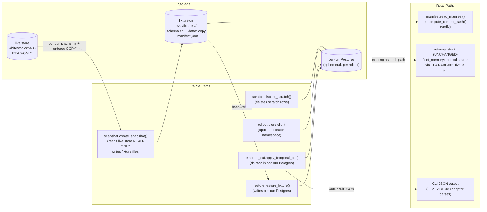
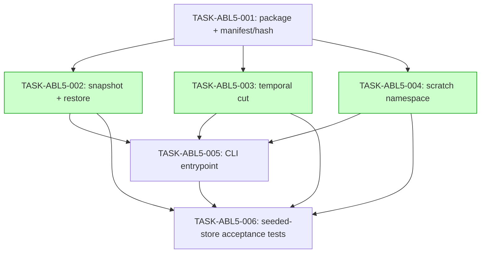

# Implementation Guide: Ablation Fixture Tooling (FEAT-ABL-005)

Source spec: build-plan Step 2 (`docs/research/ideas/phase-ablation-build-plan.md`)
+ scope §4 FEAT-ABL-005 (`docs/research/ideas/phase-ablation-scope.md`).
Feature spec: `features/ablation-fixture-tooling/` (17 scenarios).
Approach: Option 1 from TASK-REV-ABL5 — Python package + thin CLI.

**Hard constraints (every task):**
- New code ONLY in `src/fleet_memory/fixture/` (new) and
  `scripts/fixture_snapshot.py` (new). The store/retrieval stack is the
  ablation's *subject* and stays untouched (scope §7).
- The live store is a read-only snapshot source (P3). Tests never touch it.
- Cut axis is `episode_meta.occurred_at` — never row `created_at`.
- Default unit suite stays green (620 passed / 2 skipped at HEAD).

## Data Flow: Read/Write Paths



*What to look for: every write path has a consumer; the only read of the live
store is the read-only snapshot session. R2 is the existing retrieval stack —
this feature changes nothing on that path; wiring the per-run DSN into it is
FEAT-ABL-001's `fixture:<id>` arm (external to this repo, guardkit-side).*

**Disconnection alert — none blocking:** R2's DSN hand-off (`fixture:<id>` →
per-run DSN env) is deliberately deferred to FEAT-ABL-001/003 (guardkit /
fleet-evals features, per the ablation build plan). This repo's deliverable
ends at the CLI + package API.

## Integration Contracts (sequence)

```mermaid
sequenceDiagram
    participant OP as Operator/Adapter (ABL-003)
    participant CLI as scripts/fixture_snapshot.py
    participant SNAP as fixture.snapshot/.restore
    participant CUT as fixture.temporal_cut
    participant SCR as fixture.scratch
    participant LIVE as live store (RO)
    participant FIX as fixture dir
    participant RUN as per-run Postgres

    OP->>CLI: snapshot --fixture-id v1
    CLI->>SNAP: create_snapshot(source_dsn, "v1")
    SNAP->>LIVE: read-only session (schema + ordered COPY + null count)
    LIVE-->>SNAP: rows
    SNAP->>FIX: schema.sql + data/*.copy + manifest.json (sha256)
    SNAP-->>CLI: FixtureManifest
    CLI-->>OP: {"fixture_id":"v1","content_hash":...}

    OP->>CLI: restore --fixture-id v1 --target-dsn RUN
    CLI->>SNAP: restore_fixture("v1", RUN)
    SNAP->>FIX: read_manifest + recompute hash (mismatch => refuse)
    SNAP->>RUN: apply schema + COPY FROM (fresh target only)
    SNAP-->>CLI: manifest (id + hash logged per rollout)

    OP->>CLI: cut --target-dsn RUN --cut-date 2026-06-25
    CLI->>CUT: apply_temporal_cut(RUN, 2026-06-25)
    CUT->>RUN: DELETE occurred_at >= cut OR occurred_at IS NULL (+vectors)
    CUT-->>CLI: CutResult
    CLI-->>OP: {"excluded_after_cut":N,"excluded_null":N,"remaining":N}

    Note over OP,RUN: rollout runs; writes go to scratch namespace (SCR names it)
    OP->>CLI: discard-scratch --target-dsn RUN --rollout-id run_01
    CLI->>SCR: discard_scratch(RUN, "run_01")
    SCR->>RUN: DELETE fleet_memory.scratch_run_01[.*] (+vectors)
```

*What to look for: every value produced is passed onward — the manifest hash
travels into per-rollout logs; CutResult reaches the adapter as JSON. No
fetch-then-discard.*

## Task Dependencies



*Tasks with green background (wave 2) can run in parallel.*

Waves: 1 → [001]; 2 → [002, 003, 004]; 3 → [005]; 4 → [006].

## §4: Integration Contracts

### Contract: FixtureManifest / manifest.json
- **Producer task:** TASK-ABL5-001 (model + IO), written by TASK-ABL5-002
- **Consumer task(s):** TASK-ABL5-002 (restore verify), TASK-ABL5-005 (verify
  subcommand, logging), TASK-ABL5-006 (null-count assertion); downstream:
  FEAT-ABL-003 adapter logs fixture id + hash per rollout
- **Artifact type:** JSON file in the fixture directory
- **Format constraint:** `content_hash` = SHA-256 hex over payload files
  (sorted rel_path + NUL + bytes framing), `manifest.json` itself excluded;
  `null_occurred_at_count` recorded at snapshot time; `source_target`
  credential-free
- **Validation method:** Coach verifies `compute_content_hash(dir) ==
  read_manifest(dir).content_hash` in tests; tamper test flips one byte

### Contract: fixture archive layout
- **Producer task:** TASK-ABL5-002 (`create_snapshot`)
- **Consumer task(s):** TASK-ABL5-002 (`restore_fixture`), TASK-ABL5-006
  (round-trip byte-identity)
- **Artifact type:** directory (`schema.sql`, `data/<table>.copy`,
  `manifest.json`)
- **Format constraint:** COPY TEXT format, rows ordered by primary key;
  schema dump stripped of volatile version comments — restore then
  re-snapshot MUST be byte-identical
- **Validation method:** TASK-ABL5-006 test 1 (snapshot → restore →
  re-snapshot → file-level byte comparison + hash equality)

### Contract: CutResult JSON
- **Producer task:** TASK-ABL5-003 (`apply_temporal_cut`)
- **Consumer task(s):** TASK-ABL5-005 (`cut` subcommand stdout),
  TASK-ABL5-006 (count assertions); downstream: FEAT-ABL-003 per-rollout JSON
- **Artifact type:** dataclass → single-line JSON on stdout
- **Format constraint:** keys `excluded_after_cut`, `excluded_null`,
  `remaining` (ints); `excluded_null` on fixture v1 must equal 176 (live
  validation, not CI)
- **Validation method:** CLI unit test parses stdout JSON; integration test
  compares `excluded_null` to manifest count

### Contract: scratch project naming
- **Producer task:** TASK-ABL5-004 (`scratch_project` / `scratch_namespace`)
- **Consumer task(s):** TASK-ABL5-005 (`discard-scratch`/`list-scratch`),
  TASK-ABL5-006 (isolation tests); downstream: FEAT-ABL-003 adapter sets the
  rollout's write namespace
- **Artifact type:** namespace tuple / prefix string convention
- **Format constraint:** project segment `scratch_<rollout_id>`,
  `rollout_id ~ ^[a-z0-9_]+$`, tuple passes `validate_namespace`; discard
  matches exact segment only (LIKE `_` escaped)
- **Validation method:** unit tests on naming + SQL pattern; integration
  isolation test (sibling scratch + corpus survive a discard)

## Testing Strategy

- Waves 1–3: pure unit tests (`tests/unit/fixture/`), no Docker — they run
  in the default suite and in the per-wave smoke gate (`pytest tests/unit -q`).
- Wave 4: integration acceptance (`tests/integration/test_fixture_acceptance.py`,
  `-m integration`, ephemeral Docker Postgres via existing `ephemeral_pg`).
- Post-merge feature validation (operator, not autobuild): fixture v1
  snapshot from the live store (read-only), restore→hash→restore
  round-trip, dry-run FEAT-HARV cut, `excluded_null == 176` check.
