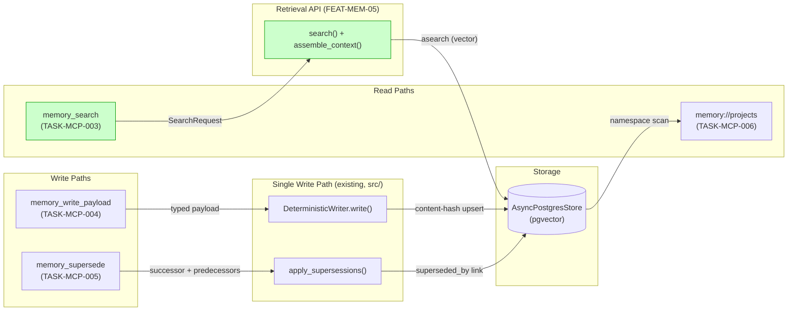
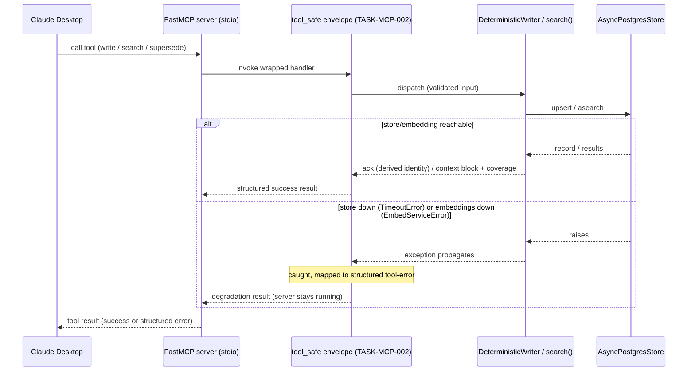
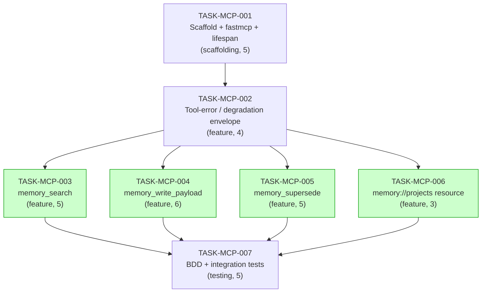

# Implementation Guide: Memory MCP Server (FEAT-MEM-06)

**Approach**: FastMCP server reusing the single deterministic write path (Option 1)
**Execution**: Auto-detect — Wave 3 parallel-safe; **Testing**: Standard + BDD suite
**Aggregate complexity**: ~6/10 · **Risk**: Low (the FEAT-MEM-05 seam is now merged)

The MCP server is a **thin surface** over surfaces that all now exist in `src/`:
the deterministic writer (FEAT-MEM-03), the supersession function (FEAT-MEM-03),
and the retrieval API (FEAT-MEM-05, **merged** in commit `bb92ed2`). The tools
validate at the boundary and dispatch — no second write path, no re-implemented
search.

---

## 1. Data Flow: Read/Write Paths

_What to look for: every write path lands in the one store via the one writer
(parity guaranteed), and every read path is now wired end-to-end —
`memory_search` reads via the FEAT-MEM-05 `search()`, **merged into `src/`**._

### ✅ Disconnection / Dependency Alert — RESOLVED

`memory_search` (TASK-MCP-003) depends on `fleet_memory.retrieval.search`. As of
commit `bb92ed2` this module is **merged into `src/fleet_memory/retrieval/`**, so
the read path is wired end-to-end. The Context-B "code-against-contract" decision
still holds for unit testing (the search callable is injected via `ServerContext`
so unit tests use a fake), but the live integration test now runs unconditionally
under `@pytest.mark.integration` — no `importorskip` gate. No outstanding
disconnections.

---

## 2. Integration Contracts (sequence)

_What to look for: the envelope (TASK-MCP-002) is the only place infrastructure
exceptions become caller-facing results — no tool re-implements degradation, and
no exception escapes to crash the stdio process._

---

## 3. Task Dependencies

_Tasks with green background (Wave 3) can run in parallel._

### Execution waves

| Wave | Tasks | Notes |
|---|---|---|
| 1 | TASK-MCP-001 | Foundation: server skeleton, dependency, lazy lifespan |
| 2 | TASK-MCP-002 | Shared degradation envelope (consumed by all of Wave 3) |
| 3 | TASK-MCP-003, 004, 005, 006 | ⚡ parallel — separate module files; **shared touch-point**: each adds one line to `register_all` in `server.py` (resolved in TASK-MCP-007) |
| 4 | TASK-MCP-007 | BDD suite + e2e; resolves the `register_all` merge |

**Parallel-safety note:** the four Wave-3 tasks each create their own module
(`tools/search.py`, `tools/write.py`, `tools/supersede.py`, `resources.py`) but
all add one registration call to `server.py`'s `register_all`. Under Conductor
this is a 4-line merge; TASK-MCP-007 confirms all four are present and
de-duplicated. If you prefer zero merge, run Wave 3 sequentially.

---

## §4: Integration Contracts

### Contract: ServerContext
- **Producer task:** TASK-MCP-001
- **Consumer task(s):** TASK-MCP-002, TASK-MCP-003, TASK-MCP-004, TASK-MCP-005, TASK-MCP-006
- **Artifact type:** in-process object (dataclass) injected into tool/resource handlers
- **Format constraint:** carries `store: AsyncPostgresStore | None`, `writer: DeterministicWriter | None`, `settings: Settings`; built **lazily** so the server starts when the store is unreachable
- **Validation method:** seam test asserts `ServerContext` exposes `store`, `writer`, `settings`; `create_mcp_server(ServerContext(...))` builds without a store connection

### Contract: ToolErrorEnvelope (tool_safe)
- **Producer task:** TASK-MCP-002
- **Consumer task(s):** TASK-MCP-003, TASK-MCP-004, TASK-MCP-005, TASK-MCP-006
- **Artifact type:** decorator + structured result type
- **Format constraint:** distinguishes infrastructure-degradation results (retryable, "unavailable", from `TimeoutError`/`EmbedServiceError`) from client-error results (validation `ValueError`); never re-raises; messages contain no credentials/DSN/host
- **Validation method:** unit tests inject each exception class and assert the result category + no-crash + no-credential-leak

### Contract: retrieval search() + assemble_context() (cross-feature)
- **Producer task:** FEAT-MEM-05 (`fleet_memory.retrieval`) — **merged in `src/`** (commit bb92ed2)
- **Consumer task(s):** TASK-MCP-003
- **Artifact type:** Python callables + `SearchRequest` model
- **Format constraint:** `search(request: SearchRequest, store) -> list[SearchResult]` then `assemble_context(results, token_budget) -> AssemblyResult(context_block, coverage_score, contributing_types, tokens_used)`; `SearchRequest(project, payload_types=[], domain_tags=[], query=None, token_budget, include_superseded=False)`; **default token_budget = 2000** applied by the tool when omitted (ASSUM-001)
- **Validation method:** seam test guarded by `pytest.importorskip("fleet_memory.retrieval")` asserts `search`, `assemble_context`, `SearchRequest` exist and `include_superseded` defaults to `False`

### Contract: DeterministicWriter.write / apply_supersessions (cross-feature, in src/)
- **Producer task:** FEAT-MEM-03 (`fleet_memory.writer`) — merged in `src/`
- **Consumer task(s):** TASK-MCP-004 (write), TASK-MCP-005 (supersede)
- **Artifact type:** Python coroutine methods/functions
- **Format constraint:** `async DeterministicWriter.write(payload: BasePayload)` is the **only** write path (parity); `async apply_supersessions(store, successor_natural_key, predecessor_natural_keys)` with natural keys `type:project:identifier`
- **Validation method:** seam tests assert the coroutine signatures; integration parity test asserts a tool write is byte-identical in stored form to a relay write

---

## Notes on the confirmed assumptions

All 9 spec assumptions are `confirmed`. The ones that shape implementation:
`memory://projects` URI (ASSUM-004, TASK-MCP-006); empty-predecessor rejection
(ASSUM-005, TASK-MCP-005); default budget 2000 (ASSUM-001, TASK-MCP-003);
write-tool ack carries derived identity (ASSUM-006, TASK-MCP-004);
embeddings-down write fails closed with no partial record (ASSUM-009, TASK-MCP-004).
