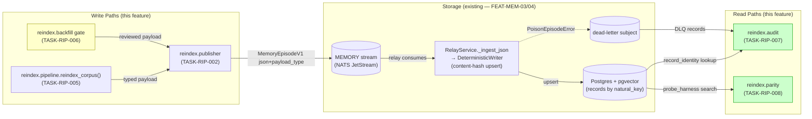
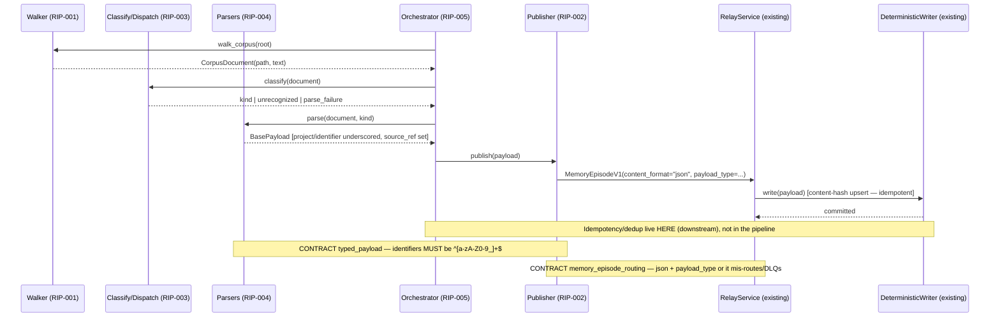
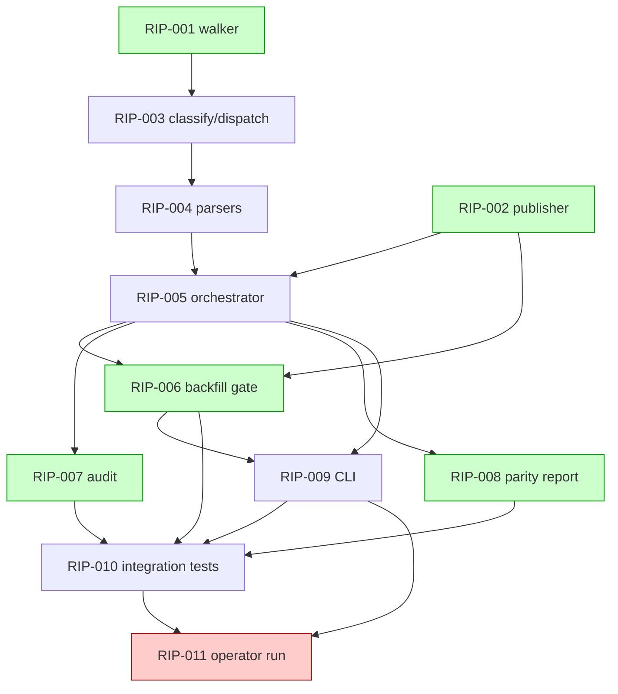

# Implementation Guide: Re-index Pipeline (FEAT-MEM-07)

Deterministic re-index of guardkit's authoritative markdown corpus into typed
payloads, published through the **live relay (FEAT-MEM-04)** into the
**deterministic writer (FEAT-MEM-03)**, plus a reviewed backfill staging gate.

**Governing decisions:** ADR-SP-007 (markdown is authoritative; the store is an
index; fixes route to source + re-index) and DECISION-DF-001 (Fable for offline
authoring only; zero cloud/frontier model on any runtime publish path).

**The load-bearing insight:** idempotency, versioned upsert, and natural-key
dedup are **enforced downstream** by the writer's content-hash upsert. The
pipeline does not implement dedup — its job is path-safe walk, deterministic
parse, faithful publish, honest accounting, and the operator review gate.

---

## Data Flow: Read/Write Paths

_What to look for: every write path (re-index + reviewed backfill) funnels through
the **single publisher** (TASK-RIP-002) onto the MEMORY stream — no second write
path. Both read paths (audit, parity) have callers and are wired._

**Disconnection check:** ✅ No disconnected paths. Both read paths (audit →
TASK-RIP-007, parity → TASK-RIP-008) have explicit callers; both write paths
converge on the same publisher. The single-write-path invariant (TASK-RIP-006
reuses TASK-RIP-002) is the deliberate "no second code path" design from the spec.

---

## Integration Contracts (sequence)

_What to look for: the two `Note over` markers are the two §4 contracts. The
fetch-then-publish chain never "fetches then discards" — every parsed payload is
handed to the publisher; unparseable/unrecognized documents return to the
orchestrator's `RunReport` (accounted, not dropped)._

---

## Task Dependencies

_Green = parallel-safe within its wave. Red (RIP-011) = `operator_handoff`,
AutoBuild skips it._

### Execution waves

| Wave | Tasks | Notes |
|---|---|---|
| 1 | RIP-001, RIP-002 | walker + publisher (independent) — parallel |
| 2 | RIP-003 | classify/dispatch |
| 3 | RIP-004 | typed parsers |
| 4 | RIP-005 | orchestrator + run report |
| 5 | RIP-006, RIP-007, RIP-008 | backfill gate, audit, parity — parallel |
| 6 | RIP-009 | CLI entrypoint |
| 7 | RIP-010 | integration tests (ephemeral Postgres) |
| 8 | RIP-011 | **operator_handoff** — live verification, AutoBuild skips |

---

## §4: Integration Contracts

### Contract: typed_payload
- **Producer task:** TASK-RIP-004 (deterministic parsers)
- **Consumer task(s):** TASK-RIP-005 (orchestrator)
- **Artifact type:** in-process Python object — `BasePayload` subclass
- **Format constraint:** `project` and `identifier` must match `^[a-zA-Z0-9_]+$`
  (`IDENTIFIER_PATTERN` in [payloads/base.py](src/fleet_memory/payloads/base.py)).
  Guardkit IDs carry hyphens/colons (`ADR-SP-007`, `FEAT-MEM-07`) and **must be
  normalized to underscores** (`ADR_SP_007`, `FEAT_MEM_07`) by the parser, or
  `BasePayload.__init__` raises `IdentifierValidationError`. `source_ref` is
  required; `payload_type` must be a key in the registry.
- **Validation method:** Coach verifies a parser unit test asserts normalized
  identifiers (`test_hyphenated_guardkit_id_normalized_to_underscores`) and that a
  bad identifier becomes an unparseable result, not an escaped exception.

### Contract: memory_episode_routing
- **Producer task:** TASK-RIP-002 (episode publisher)
- **Consumer task(s):** TASK-RIP-005 (orchestrator), TASK-RIP-006 (backfill gate)
- **Artifact type:** NATS message — `MemoryEpisodeV1` on the MEMORY stream
- **Format constraint:** `content_format` must be the literal `"json"` **and**
  `payload_type` must be a registered type, so `RelayService.ingest` routes the
  episode to `DeterministicWriter` ([relay/service.py](src/fleet_memory/relay/service.py)
  `_ingest_json`). Any other `content_format` routes to the prose chunker (silent
  wrong-path) or DLQs as an unknown type.
- **Validation method:** Coach verifies the seam test in TASK-RIP-005 /
  TASK-RIP-006 (`@pytest.mark.integration_contract("memory_episode_routing")`)
  asserts `content_format == "json"`, `payload_type` is set, and the body
  round-trips through `get_model_for_type`.

⚠️ These two contracts are the integration-boundary hot spots. The identifier
normalization (Contract `typed_payload`) is the single most likely silent failure:
real guardkit IDs are hyphenated and will be rejected downstream unless the parser
normalizes them.

---

## Notes for the implementer

- **Reuse, don't rebuild:** publisher reuses the broker wiring in
  [app.py](src/fleet_memory/app.py); parity reuses
  [retrieval/probe_harness.py](src/fleet_memory/retrieval/probe_harness.py);
  audit resolves identity via [writer/identity.py](src/fleet_memory/writer/identity.py).
- **Single write path:** TASK-RIP-006 must import TASK-RIP-002's publisher, never
  fork a parallel publish path.
- **Hermetic tests:** unit tests use a fake publisher; integration tests use the
  ephemeral `deploy/local/` Postgres (no NAS dependency). Only TASK-RIP-011 touches
  live infrastructure.
