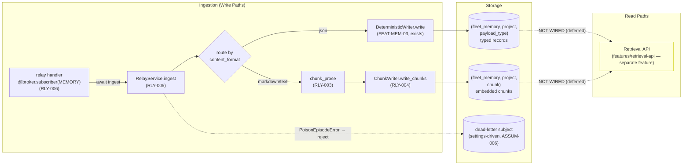
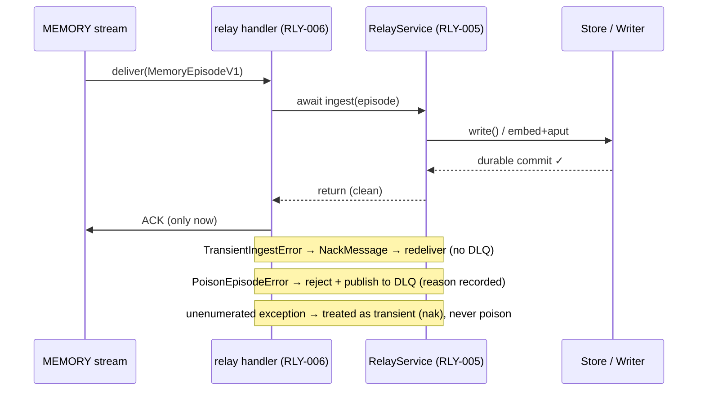
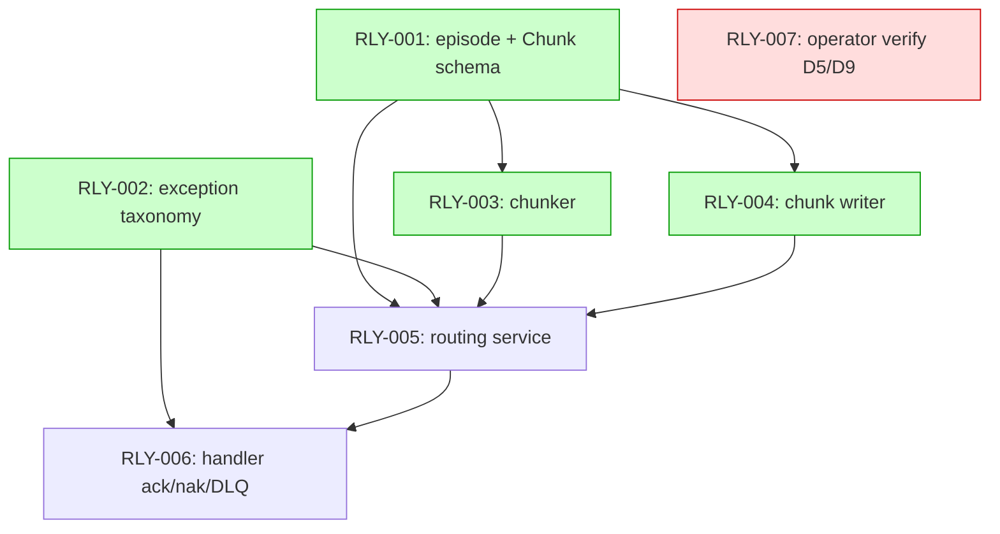

# Implementation Guide — Relay Integration (FEAT-MEM-04)

Source review: **TASK-REV-RLY04** · Spec: `features/relay-integration/relay-integration.feature`
Approach: **Option 1 — pure `RelayService` + thin FastStream handler**
Focus: architecture + correctness · Testing: standard + seam tests · DLQ: settings-driven

## Summary

The relay is a FastStream **durable consumer** on the MEMORY stream that ingests
`MemoryEpisodeV1` envelopes and routes by `content_format`:

- **structured `json`** → typed payload registry (FEAT-MEM-02) → `DeterministicWriter` (FEAT-MEM-03)
- **`markdown` / `text`** → heading-aware chunker → embed-on-write chunk storage

Episodes are **acknowledged only after a durable commit**. Deterministic
failures are parked on a dead-letter subject; transient failures are
negatively-acknowledged for redelivery. Two-layer idempotency (writer
natural-key upsert + `episode_id`-derived chunk keys) makes at-least-once
redelivery inert. **No language model touches the write path.**

The store, embed client, deterministic writer, and payload registry already
exist; `app.py` opens the store in its lifespan but registers no subscribers.
This feature adds the schema, chunker, chunk writer, routing service, and the
ack/nak/DLQ handler.

## Data Flow: Read/Write Paths

_What to look for: every write path terminates in storage; the ACK happens only after `ingest` returns. The two dotted read paths are intentionally deferred._

**Disconnection Alert (acknowledged, non-blocking):** both storage namespaces
are written here but read only by the future **Retrieval API** feature
(`features/retrieval-api/` exists, out of scope for FEAT-MEM-04). This
write-without-read is intentional — the relay's contract is lossless *capture*;
retrieval is a sibling feature. No wiring task is added; the deferral is
recorded here per the Disconnection Rule.

## Integration Contracts (sequence — the ack seam)

_What to look for: the ACK line is reachable only after a clean `ingest` return. A raised exception short-circuits to nak or DLQ — it never reaches ACK._

## Task Dependencies

_Tasks with green background can run in parallel within their wave. RLY-007 (red) is operator-only and runs out of band._

## Execution Strategy

**Wave 1** (parallel): `RLY-001` (schema), `RLY-002` (exceptions), `RLY-007` (operator verify — out of band)
**Wave 2** (parallel): `RLY-003` (chunker), `RLY-004` (chunk writer)
**Wave 3**: `RLY-005` (routing service — composes everything)
**Wave 4**: `RLY-006` (handler + settings + app wiring)

Smoke gate fires after Wave 3 (`pytest tests/unit -x`) so a broken composition
is caught before the handler wave.

## §4: Integration Contracts

### Contract: `MemoryEpisodeV1` / `ContentFormat`
- **Producer task:** TASK-RLY-001
- **Consumer task(s):** TASK-RLY-003, TASK-RLY-004, TASK-RLY-005
- **Artifact type:** Pydantic v2 model + string enum
- **Format constraint:** `content_format` carried as a raw string (NOT enum-validated at parse) so an unrecognized value survives to routing and becomes a poison decision; envelope uses `extra="ignore"`.
- **Validation method:** Coach verifies round-trip parse for json/markdown/text and that `"yaml"` parses but is rejected downstream.

### Contract: `Chunk`
- **Producer task:** TASK-RLY-001 (type), TASK-RLY-003 (instances)
- **Consumer task(s):** TASK-RLY-004
- **Artifact type:** frozen Pydantic value object
- **Format constraint:** `list[Chunk]` with monotonic `index` from 0; empty body → `[]`; carries `text`, `source_ref`, `project`.
- **Validation method:** seam test in RLY-003 asserts index monotonicity and empty-body → `[]`.

### Contract: Exception taxonomy (`PoisonEpisodeError` / `TransientIngestError`)
- **Producer task:** TASK-RLY-002
- **Consumer task(s):** TASK-RLY-005 (raises), TASK-RLY-006 (maps to ack/nak/DLQ)
- **Artifact type:** typed exceptions
- **Format constraint:** deterministic failure → `PoisonEpisodeError(reason=...)` → DLQ; recoverable → `TransientIngestError` → nak; unenumerated → transient.
- **Validation method:** seam tests in RLY-005 (raises correct type) and RLY-006 (maps correctly).

### Contract: chunk storage namespace + embed-on-write
- **Producer task:** TASK-RLY-004 (consumes existing TASK-MEM-005 store)
- **Consumer task(s):** (read side) future Retrieval API
- **Artifact type:** AsyncPostgresStore records
- **Format constraint:** namespace `("fleet_memory", project, "chunk")`; stored value MUST carry a `content` string field so the index config (`fields=["content"]`) embeds on `aput`; chunk key = `uuid5(episode_id, index)`.
- **Validation method:** Coach verifies stored value has `content` field and key derivation; namespace validated via `validate_namespace`.

### Contract: `RelayService.ingest` → handler
- **Producer task:** TASK-RLY-005
- **Consumer task(s):** TASK-RLY-006
- **Artifact type:** async method (pure service, no NATS)
- **Format constraint:** clean return ⇒ durable commit happened ⇒ handler ACKs; service never imports `faststream`/NATS.
- **Validation method:** RLY-005 Coach asserts no NATS import; RLY-006 seam test asserts ACK-only-on-clean-return.

## Risks

| Risk | Mitigation |
|------|------------|
| Transient error misclassified as poison → data loss | Explicit taxonomy (RLY-002); default-to-transient for unenumerated exceptions |
| `max_deliver` / DLQ subject unverified (sibling repo) | Settings-driven defaults + operator verify task RLY-007 |
| Chunk-write partial failure | `uuid5(episode_id, index)` keys + nak-redeliver overwrites cleanly |
| Concurrent same-episode delivery | Idempotent keys converge to one outcome by construction |

## Notes / Deferred

- Empty-body (zero chunks → ack) and partial-chunk atomicity are low-confidence
  assumptions — implemented per the spec's stated intent, confirmed by RLY-007.
- Retrieval read path is a separate feature (`features/retrieval-api/`).
