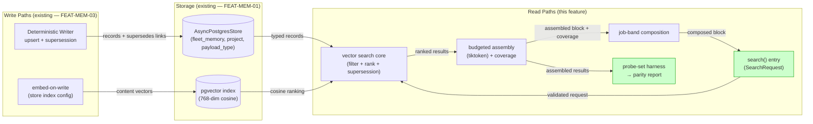
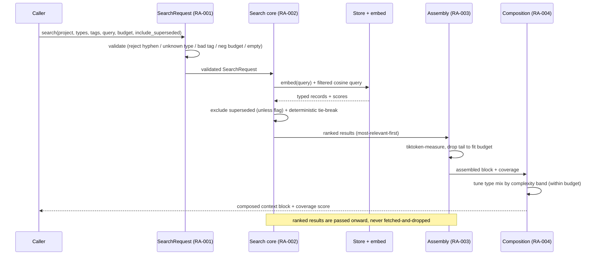
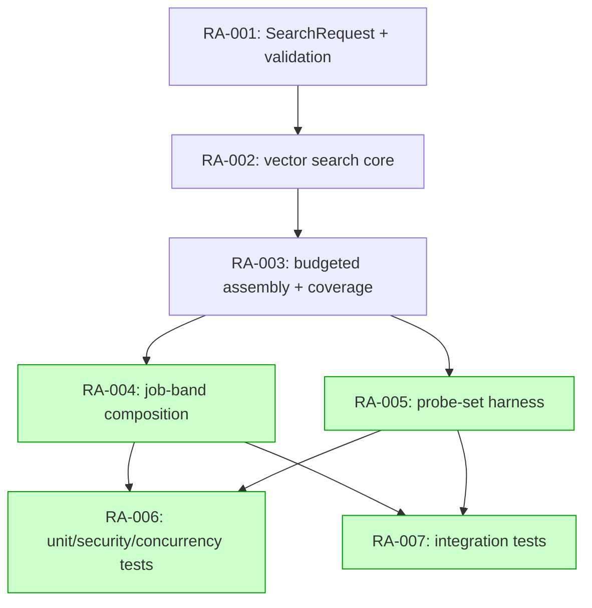

# Implementation Guide — FEAT-MEM-05 Retrieval API + Context Assembly

Feature complexity: **7/10** · 7 tasks · 5 waves · execution: auto-detected.

This is the read half of the store contract that FEAT-MEM-03 wrote into. The
design is a layered service: validate → search → assemble → compose, with a
probe-set harness driving the acceptance gate. Each correctness property
(supersession default, budget boundary, injection rejection, parity size) is
isolated to a single task with its own Coach gate.

---

## Data Flow: Read/Write Paths

What to look for: every write path that produced the corpus, and every read
path this feature adds. The write side already exists (FEAT-MEM-03); this
feature builds the read side. There are **no disconnected read/write paths** —
every read terminates at a real consumer (search result / parity report).

_Caption: solid arrows = wired paths. The read side (R1–R5) is fully connected
to storage and terminates at the `search()` caller and the parity report._

**Disconnection Alert:** none. Every read path has a caller — `search()` is
invoked by FEAT-MEM-06 (MCP) / FEAT-MEM-08 (cutover); the harness is invoked by
the AC-3 gate and re-used by FEAT-MEM-07.

---

## Integration Contracts (sequence)

What to look for: the "fetch then discard" anti-pattern — data retrieved but
not passed onward. Here every retrieved result is threaded through assembly and
returned; nothing is fetched and dropped.

_Caption: the request is validated once (RA-001) and never re-validated
downstream; ranked results flow through assembly to the caller._

---

## Task Dependencies

What to look for: the parallel-safe pairs (green). Waves 4 and 5 each run two
independent tasks.

_Tasks with green background can run in parallel within their wave._

### Execution waves

- **Wave 1:** RA-001
- **Wave 2:** RA-002
- **Wave 3:** RA-003
- **Wave 4:** RA-004 ‖ RA-005
- **Wave 5:** RA-006 ‖ RA-007

---

## §4: Integration Contracts

Cross-task data dependencies exist (model → search → assembly → composition /
harness), so each boundary is specified below. The seam-test stubs in the
consumer task files assert these.

### Contract: SearchRequest
- **Producer task:** TASK-RA-001
- **Consumer task(s):** TASK-RA-002
- **Artifact type:** in-process Pydantic v2 model
- **Format constraint:** Fully validated before it reaches search core — project
  is underscore-only, payload types are registry-known, domain tags are
  exact-match clean, budget ≥ 0, at least one of query/filter present. Search
  core executes; it must NOT re-validate.
- **Validation method:** Coach verifies `tests/unit/test_search_core.py` passes
  a pre-validated `SearchRequest` and search core raises no validation errors.

### Contract: RankedResults
- **Producer task:** TASK-RA-002
- **Consumer task(s):** TASK-RA-003
- **Artifact type:** in-process ordered list of ranked, supersession-resolved
  memories with relevance scores
- **Format constraint:** Ordered most-relevant-first; superseded records already
  excluded (or marked, when `include_superseded`); ties broken deterministically.
  Assembly drops from the tail to fit the budget.
- **Validation method:** Coach verifies the assembly boundary tests
  (2100→drop-lowest) rely on the list order, not re-ranking.

### Contract: AssembledContext
- **Producer task:** TASK-RA-003
- **Consumer task(s):** TASK-RA-004, TASK-RA-005
- **Artifact type:** in-process result object — assembled block string +
  coverage score (fraction filled + contributing payload types)
- **Format constraint:** Block measured with tiktoken `cl100k_base`; never
  exceeds `token_budget`; coverage fraction in 0.0–1.0 (0.0 at zero budget).
  Composition tunes the input mix but must not breach the budget; the harness
  compares the assembled result to a recorded baseline.
- **Validation method:** Coach verifies composition tests assert both
  band-difference AND within-budget, and harness tests compare against baselines.

### Contract: embed/store interface (existing infra boundary)
- **Producer:** FEAT-MEM-01 store (`AsyncPostgresStore` via `async_store_context`)
  + embed at llama-swap `:9000`
- **Consumer task(s):** TASK-RA-002
- **Artifact type:** pgvector cosine search over namespace
  `("fleet_memory", project, payload_type)`; embed → 768-dim vector
- **Format constraint:** Query embedded via the store index config / embed_fn
  (nomic-embed-text-v1.5, 768 dims, cosine); failures surface credential-free
  messages (mirror the `async_store_context` TimeoutError pattern).
- **Validation method:** Coach verifies the degradation tests (embed
  unavailable, store unreachable) raise clear, credential-free errors.

---

## Notes on open assumptions

- **ASSUM-001 (bands, low conf):** RA-004 must verify the band→mix mapping
  against guardkit's real job-specific builder before FEAT-MEM-08; record the
  verified mapping in `retrieval-api_assumptions.yaml`.
- **ASSUM-007 (parity tolerance, low conf):** RA-005 keeps `PARITY_TOLERANCE`
  (default 0) and `MIN_PROBE_SET_SIZE` (15) as named constants so OD-2's freeze
  decision is a one-line change.
- **ASSUM-008 / ASSUM-009:** implemented per the spec (reject empty request;
  omit oversized memory whole); both remain flagged for human confirmation.
