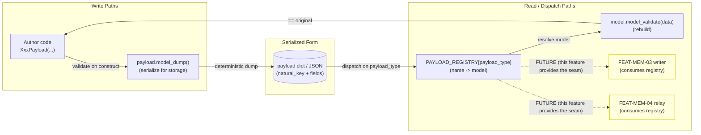
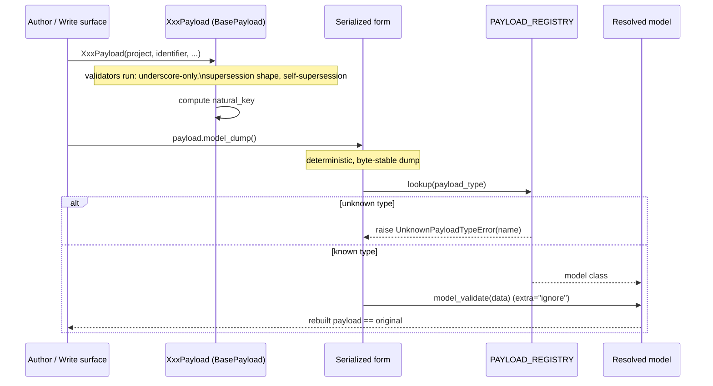
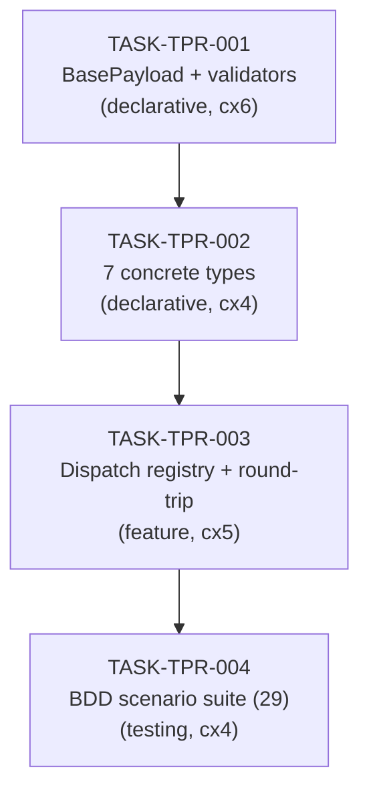

# Implementation Guide: Typed Payload Registry (FEAT-MEM-02)

**Approach:** Option 1 — shared `BasePayload` + 7 subclasses + registration-time
dispatch registry.
**Testing:** BDD-driven (29 Gherkin scenarios via `pytest-bdd`).
**Aggregate complexity:** 6/10 · **Risk:** Low · **Estimated effort:** ~5–7h.

This schema layer is the deterministic-write contract that two downstream
features route through: the deterministic writer (FEAT-MEM-03) and the relay
consumer (FEAT-MEM-04). Both call into the dispatch registry — get the registry
contract right and dedup becomes a key lookup, supersession becomes a declared
fact.

## Target module layout

```
src/fleet_memory/payloads/
├── __init__.py      # public exports: BasePayload, the 7 types, PAYLOAD_REGISTRY, lookup
├── base.py          # TASK-TPR-001  BasePayload + shared validators + natural_key
├── models.py        # TASK-TPR-002  AdrPayload, ReviewReportPayload, ... DocumentPayload
└── registry.py      # TASK-TPR-003  PAYLOAD_REGISTRY, get_model, round-trip
src/fleet_memory/errors.py   # + UnknownPayloadTypeError (matches NamespaceValidationError style)
tests/bdd/
├── __init__.py
└── test_typed_payload_registry.py   # TASK-TPR-004  step defs for the .feature file
```

---

## §1. Data Flow: Read/Write Paths

What to look for: every write path (payload construction, serialization) must
reach storage, and every read path (dispatch, rebuild) must have a caller.
Both write surfaces converge on the **same** registry — that convergence is the
whole point of the feature.



**Disconnection note (acknowledged, not a defect):** R3 (writer) and R4 (relay)
are dotted because they are *downstream features* (FEAT-MEM-03 / -04), out of
scope here per the spec. FEAT-MEM-02's deliverable is precisely the registry
seam they will consume. The in-feature read path (R1 → R2 → equals original) is
fully wired and exercised by the round-trip scenarios — **no in-scope write
path is left without a read.**

---

## §2. Integration Contracts (sequence) — complexity ≥ 5

What to look for: the serialized form retrieved from storage must be passed
onward to the model for rebuild — never fetched then discarded. The round-trip
must close back to an object equal to the original.



---

## §3. Task Dependencies

What to look for: this is an honest sequential chain — each layer depends on
the previous, so there is no parallel wave. No task in a wave depends on
another task in the same wave.



_No green nodes: every task gates the next, so all four run sequentially._

### Execution strategy

| Wave | Task | Mode | Conductor |
|------|------|------|-----------|
| 1 | TASK-TPR-001 | task-work | n/a (single task) |
| 2 | TASK-TPR-002 | task-work | n/a (single task) |
| 3 | TASK-TPR-003 | task-work | n/a (single task) |
| 4 | TASK-TPR-004 | task-work | n/a (single task) |

Parallelism was considered (e.g. splitting the 7 types across workers) and
rejected: the types are mechanical once `BasePayload` exists, and the
coordination cost outweighs the gain at this size. The base task carries the
design risk and is deliberately isolated for thorough review.

---

## §4. Integration Contracts (cross-task)

All dependencies here are **intra-package Python class contracts**, not
infrastructure-service + framework artifacts (there is no DB/URL/env-var seam
in this feature). They are documented for completeness; the registry round-trip
is the one contract worth a seam test (see TASK-TPR-003 § Seam Tests).

### Contract: `BasePayload`
- **Producer task:** TASK-TPR-001
- **Consumer task(s):** TASK-TPR-002
- **Artifact type:** Python base class (Pydantic v2 `BaseModel`)
- **Format constraint:** Subclasses set a canonical underscore `payload_type`
  classvar and inherit (do not re-declare) the shared validators, `natural_key`,
  `supersedes`, `domain_tags`, `source_ref`, `version`, and
  `ConfigDict(extra="ignore")`.
- **Validation method:** Coach verifies each concrete type imports/subclasses
  `BasePayload` and adds no duplicate validator for the shared conventions.

### Contract: payload model classes
- **Producer task:** TASK-TPR-002
- **Consumer task(s):** TASK-TPR-003
- **Artifact type:** Python model classes (the seven types)
- **Format constraint:** Each class exposes a unique canonical `payload_type`
  so the registry can build a bijective name↔model map.
- **Validation method:** Coach verifies the registry registers exactly seven
  types and that name→model and model→name are both 1:1.

### Contract: `PAYLOAD_REGISTRY` round-trip
- **Producer task:** TASK-TPR-003
- **Consumer task(s):** TASK-TPR-004 (and, downstream, FEAT-MEM-03 / -04)
- **Artifact type:** dict[str, type[BasePayload]] + round-trip helper
- **Format constraint:** `registry[payload_type].model_validate(model_dump(p))`
  must equal `p` and preserve `natural_key`; unknown type raises
  `UnknownPayloadTypeError` (no Document fallback).
- **Validation method:** round-trip + bijection BDD scenarios
  (`@regression`) plus the seam test in TASK-TPR-003.
