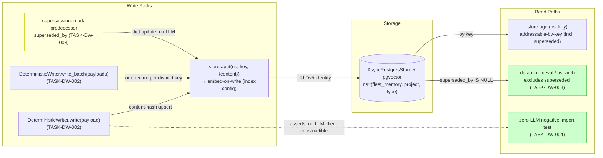
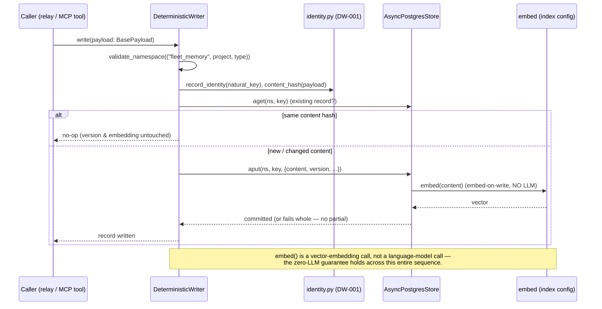
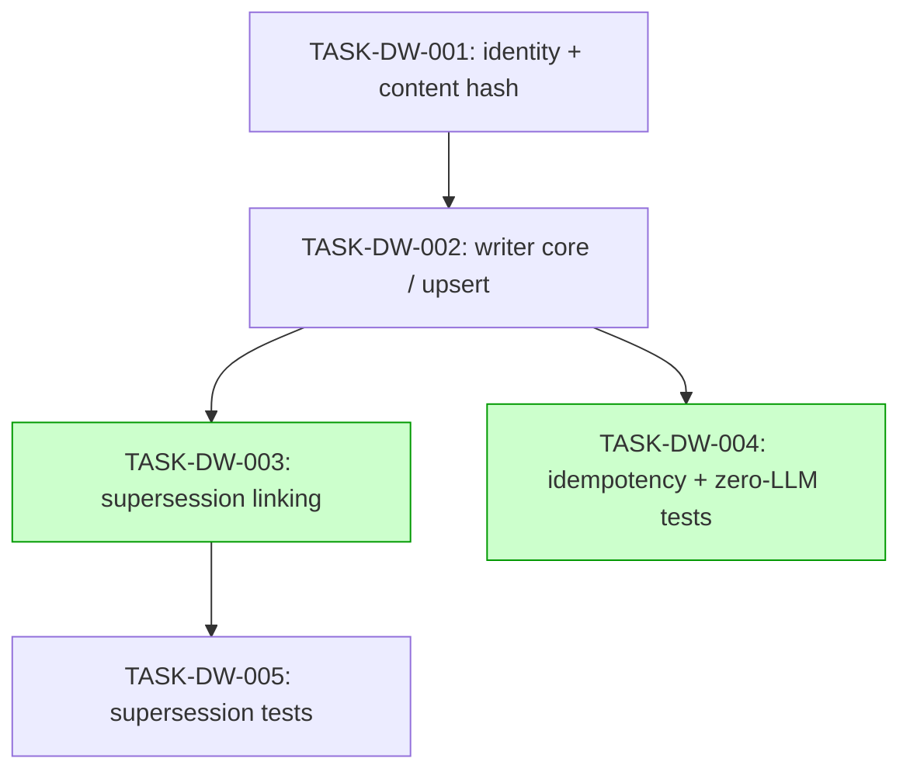

# Implementation Guide: Deterministic Writer (FEAT-MEM-03)

**Parent review**: TASK-REV-DW03 ([report](../../../.claude/reviews/TASK-REV-DW03-review-report.md))
**BDD spec**: features/deterministic-writer/deterministic-writer.feature (29 scenarios)
**Trade-off priority** (Context A): hermetic correctness — unit suite runs with no infrastructure; integration suite is marker-gated against the ephemeral Postgres fixture; AutoBuild never calls an LLM.
**Approach** (Context B confirmed): UUIDv5 identity + content-hash upsert · supersession as a dict update · embed-on-write through the store index config · per-project namespace `("fleet_memory", project, payload_type)` · zero LLM by construction. Standard + seam tests; auto-detected waves.

> **Prerequisite — FEAT-MEM-02 must be merged first.** This feature consumes
> `fleet_memory.payloads` (`BasePayload`, `PAYLOAD_REGISTRY`,
> `IdentifierValidationError`, `SupersessionValidationError`). At plan time
> FEAT-MEM-02 is `in_progress` in a worktree and not yet on `main`. Do **not**
> run `/feature-build FEAT-MEM-03` until those modules are present in
> `src/fleet_memory/payloads/`.

## Data Flow: Read/Write Paths

_Look for: every write path lands in the single pgvector store and is read back
either by key (including superseded records) or via default retrieval (which
excludes superseded). The zero-LLM test is a read-only assertion over the write
path, not a data path._

**Disconnection check**: no orphaned read paths. Every read (`aget` by key,
default retrieval, zero-LLM assertion) has a corresponding writer behaviour that
produces what it reads. The two write paths W1/W2 share the same upsert into W4,
and supersession W3 is an in-transaction extension of the same write. **No
disconnection — nothing deferred.**

## Integration Contracts (sequence)

_Look for: the only external "model" touched is the embedding service via the
store's index config. There is no language-model client anywhere in the
sequence — that is the feature's thesis, enforced by the DW-004 negative test._

## Task Dependencies

_Tasks with green background (DW-003, DW-004) can run in parallel — DW-003 edits
`src/fleet_memory/writer/supersession.py` while DW-004 adds test files; no file
conflict._

## Execution Strategy

- **Wave 1**: TASK-DW-001 (identity + content-hash helpers)
- **Wave 2**: TASK-DW-002 (writer core / idempotent upsert)
- **Wave 3** (parallel): TASK-DW-003 (supersession) ‖ TASK-DW-004 (idempotency + zero-LLM tests)
- **Wave 4**: TASK-DW-005 (supersession tests)

A feature-level smoke gate runs `pytest tests/unit -x` after Wave 3 so a
composition failure between the writer core and its first test suite surfaces
before the supersession tests are written.

## §4: Integration Contracts

### Contract: writer→store record value
- **Producer task:** TASK-DW-002 (DeterministicWriter)
- **Consumer task(s):** TASK-MEM-005 store contract (FEAT-MEM-01), TASK-DW-004, TASK-DW-005
- **Artifact type:** store record value (dict) + namespace tuple
- **Format constraint:** namespace is `("fleet_memory", <project>, <payload_type>)`
  (all segments underscores-only, validated by `validate_namespace`); the stored
  value MUST contain a non-empty `content` string field because the store's index
  config is `fields=["content"]` — that field is what gets embedded on write. A
  value with no `content` field silently skips embedding and breaks semantic search.
- **Validation method:** seam test `test_writer_record_carries_content_and_namespace`
  (`@pytest.mark.integration_contract("writer_store_record")`) asserts the 3-tuple
  shape and a non-empty `content` field; integration test confirms the written
  record is findable by semantic search.

### Contract: record identity (UUIDv5)
- **Producer task:** TASK-DW-001 (`record_identity`)
- **Consumer task(s):** TASK-DW-002, TASK-DW-003
- **Artifact type:** Python function `record_identity(natural_key: str) -> uuid.UUID`
- **Format constraint:** `uuid.uuid5(NAMESPACE, natural_key)` with a single fixed
  module-level `NAMESPACE` constant; the natural key is
  `<payload_type>:<project>:<identifier>` from `BasePayload.natural_key`. Identity
  must be byte-stable across processes (ASSUM-001/002).
- **Validation method:** unit test asserts repeated/cross-process calls yield the
  same UUID and that distinct natural keys diverge.

### Contract: supersession link
- **Producer task:** TASK-DW-003 (supersession)
- **Consumer task(s):** TASK-DW-005, default-retrieval reader (FEAT-MEM-05, downstream)
- **Artifact type:** record field `superseded_by` (+ successor's recorded superseded keys)
- **Format constraint:** a superseded record carries `superseded_by` = successor
  identity and is excluded from default retrieval (`superseded_by IS NULL` filter)
  while remaining addressable by key (ASSUM-007). Forward links to not-yet-written
  keys are recorded and applied on later appearance (ASSUM-008).
- **Validation method:** seam test
  `test_superseded_record_links_successor_and_drops_from_default`
  (`@pytest.mark.integration_contract("supersession_link")`); integration tests in
  TASK-DW-005 confirm exclusion-but-addressable and chain traceability.

### Contract: typed payload input (consumed from FEAT-MEM-02)
- **Producer task:** TASK-TPR-003 (PAYLOAD_REGISTRY) — external, prerequisite feature
- **Consumer task(s):** TASK-DW-002
- **Artifact type:** `BasePayload` subclass + `PAYLOAD_REGISTRY` dispatch
- **Format constraint:** only registered `BasePayload` subclasses are writable;
  `payload.supersedes` is a list of three-segment colon natural keys (validated by
  `SupersessionValidationError`); identifiers are underscores-only
  (`IdentifierValidationError`). Unregistered input is rejected naming the type.
- **Validation method:** DW-004 negative tests (not-a-payload reject,
  delimiter-forge-identity reject).
